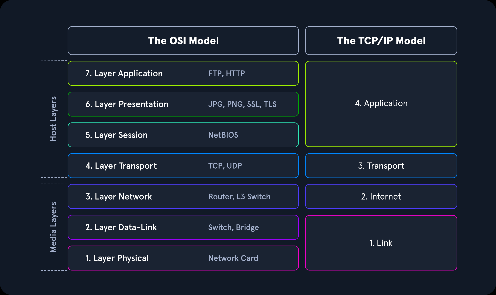
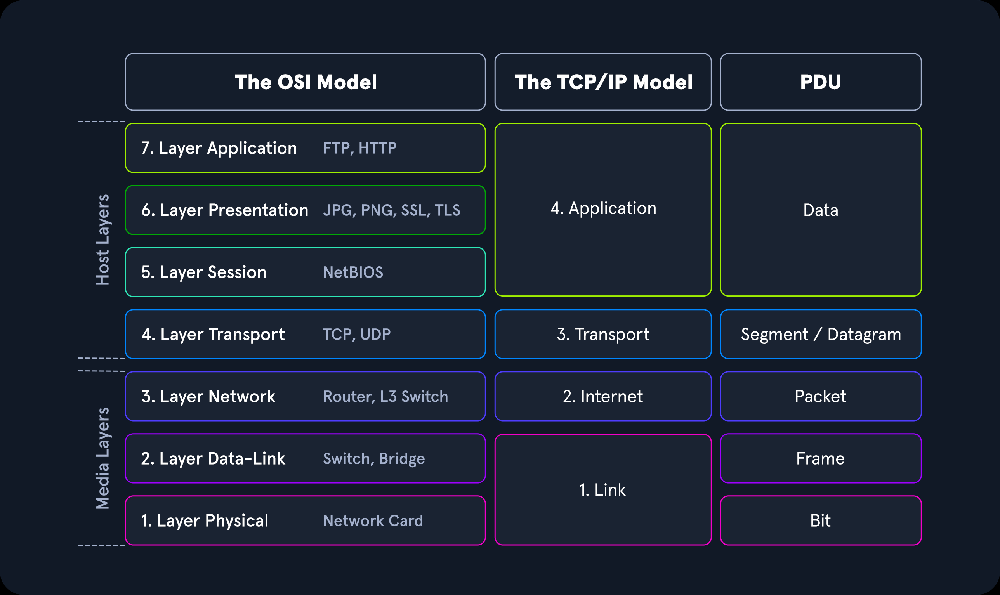
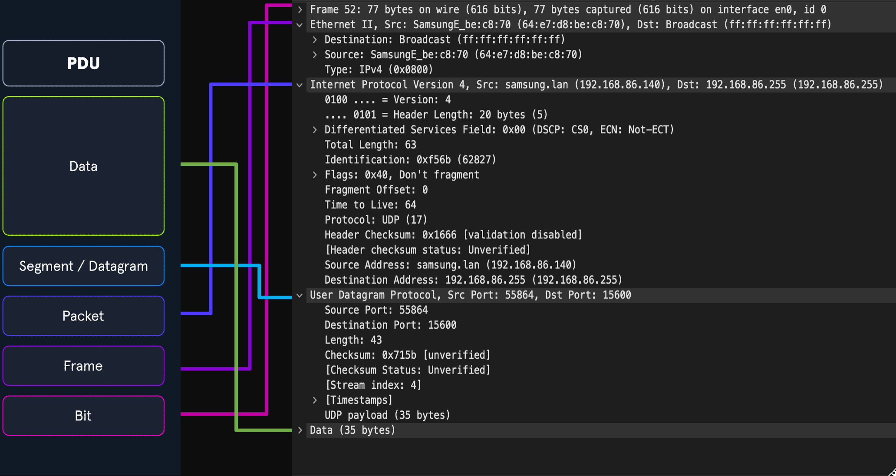
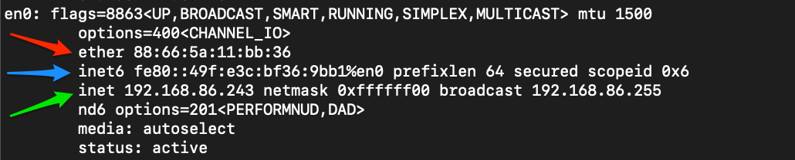
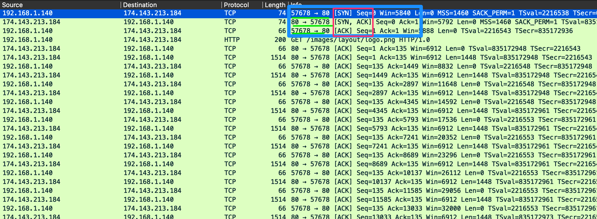
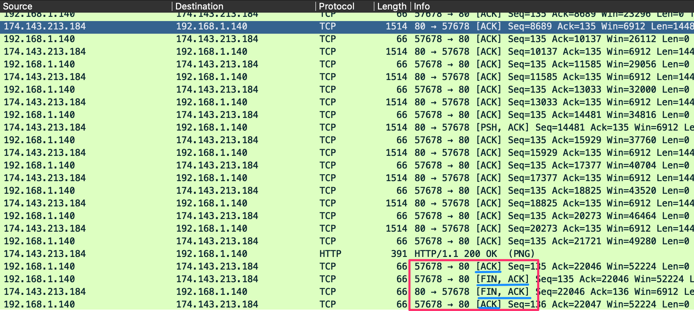
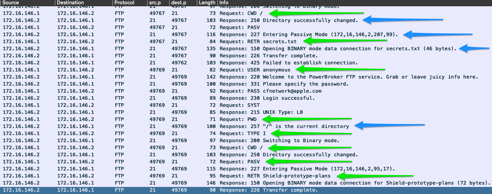
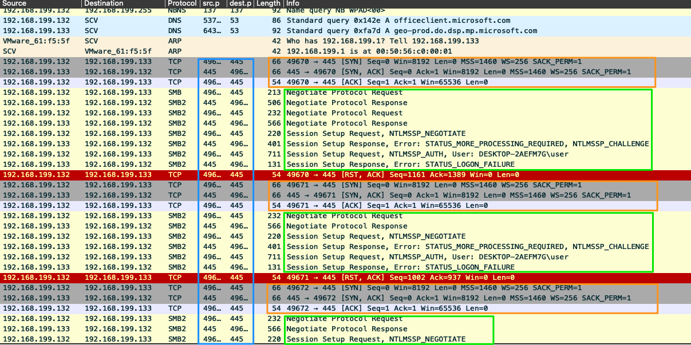
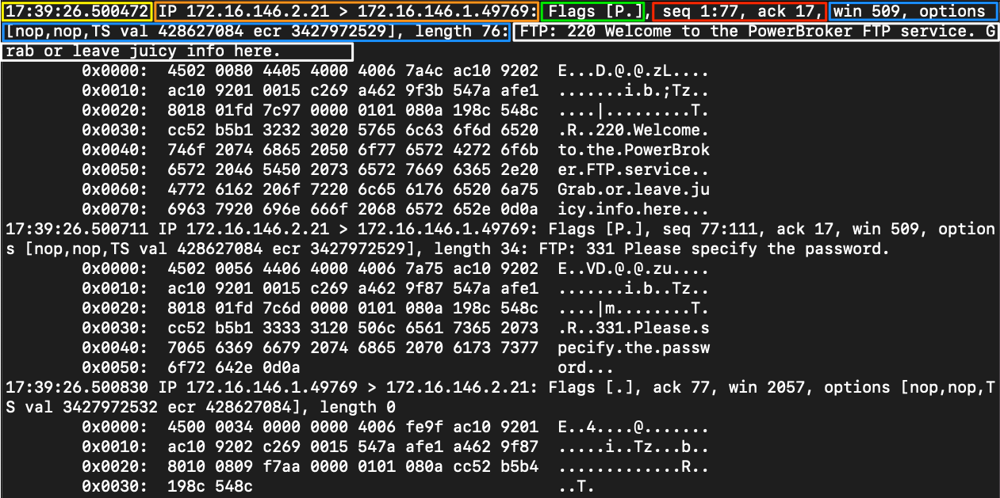
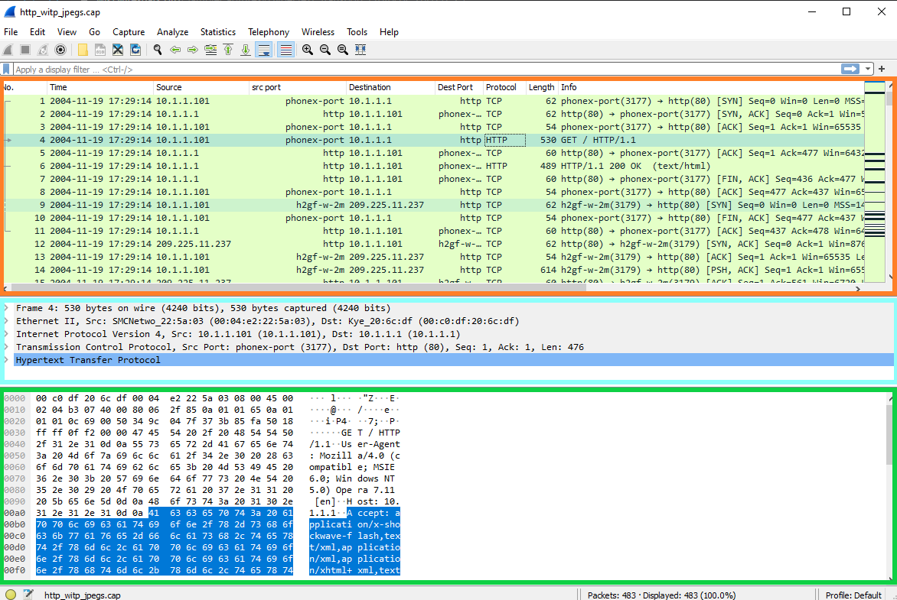

## 网络简介

### OSI/TCP-IP 模型



OSI 模型比 TCP-IP 模型分段更多。这是因为它被分解成小的功能块。
OSI 模型的第一层到第四层专注于控制主机之间的数据传输。这种控制包括从用于传输的物理介质到用于管理会话的协议或传输数据时缺乏协议的所有内容。第五层到第七层处理向最终用户呈现的封装数据的解释、管理和呈现
OSI 模型是一切工作原理背后的理论，而 TCP-IP 模型则更符合网络的实际功能。
TCP-IP 模型更加混合，并且规则灵活。TCP-IP 模型由四层组成，其中 OSI 模型的第五层、第六层和第七层与 TCP-IP 模型的第四层一致。第三层传输层，第二层是网络层，与 OSI 中的网络层一致，第一层是链路层，覆盖 OSI 模型的第二层和第一层。

#### PDU示例
在本模块中，我们将研究许多不同的协议数据单元 ( PDU)，因此需要对其在理论上和网络上的显示方式有一个功能性的理解。
PDU 是由 OSI 模型各层封装的控制信息和数据组成的数据包。下面的分解将显示两个模型中的层如何与 PDU 匹配。

其实就是单位吧，最底下的物理层使用bit为单位，数据链路层使用帧，网络层使用包，传输层使用段/数据报，应用层直接用数据了

#### PDU 数据包细分



### 寻址机制

#### MAC寻址
连接到主机的每个逻辑或物理接口都有一个媒体访问控制 ( MAC) 地址。该地址是以十六进制格式表示的 48 位六个八位字节地址
如下图红色箭头所指

MAC 寻址用于主机之间的第二层（`数据链路`或`链路层`，具体取决于您查看的模型）通信。 这是通过广播域内的主机到主机通信来实现的。 如果第二层流量需要穿过第三层接口，则该 PDU 将发送到第三层出口接口，并路由到正确的网络。 在第二层，这看起来好像 PDU 被寻址到路由器接口，并且路由器在确定下一步将其发送到哪里时将考虑第三层地址。 一旦做出选择，它就会剥离第二层的封装，并用指示路由中下一个物理地址的新信息替换它。

#### IP 寻址

IP 负责路由数据包、数据封装以及数据报到达目标主机时的分段和重组。从本质上讲，IP 是一种无连接协议，无法保证数据能够到达其预期接收者。为了保证数据传输的可靠性和有效性，IP 依赖​​于 TCP 等上层协议。

**IPv4**
IPv4 寻址是将数据包通过网络路由到位于我们附近的主机的核心方法。下图绿色箭头。


**IPv6地址**
IPv6 有更多的地址与更好地支持多播（从一个到多个发送流量），下图蓝色箭头


### TCP/UDP，传输机制
TCP VS UDP
特征|	        TCP协议|	                                UDP协议
| :---          |    :----:                     |          ---:             |
传播|	        面向连接|	                              无连接。迅速忘记。
连接方式|	    TCP 使用三次握手来确保建立连接。|	         UDP 不确保目标正在侦听。
数据传输方式|	 基于流的对话|	                                逐个数据包，源不关心目标是否处于活动状态
数据验证|	    序列号和确认号用于说明数据。|	                UDP 不在乎。
速度|	        TCP 由于其内置功能而具有更多开销且速度较慢。	UDP 速度快但不可靠。

可以看到TCP和UDP提供了两种截然不同的数据传输方式。 TCP 被认为是更可靠的协议，因为它允许将错误检查和数据确认作为正常功能。相比之下，UDP 是一种快速、即用即忘的协议，当我们关心速度而不是质量和验证时，最好使用 UDP。

### TCP三次握手

我们在三向握手中看到的常见标志是同步 ( SYN ) 和确认 ( ACK )
1.发送client一个 SYN 标志设置为 on 的数据包以及 TCP 标头中的其他可协商选项。

    这是一个同步数据包。它只会在来自主机和服务器的第一个数据包中设置，并通过允许两端就开始通信的序列号达成一致来建立会话。
    这对于数据包的跟踪至关重要。除了序列号同步之外，在此阶段还协商许多其他选项，包括窗口大小、最大段大小和选择性确认。
2.将server使用 TCP 数据包进行响应，该数据包包含用于序列号协商的 SYN 标志设置和用于确认主机发送的先前 SYN 数据包的 ACK 标志设置。

3.服务器还将包含对其需要在 TCP 标头的选项字段中设置的 TCP 选项的任何更改。
将client使用 TCP 数据包进行响应，其中设置了同意协商的 ACK 标志。

这个数据包是三次握手的结束，并建立了客户端和服务器之间的连接。


## TCP 会话结束

在上图中，输出末尾可见一组类似于我们的三向握手的数据包。这就是 TCP 关闭连接的方式。我们将在 TCP 中看到的另一个标志是`FIN`。它用于表示数据传输已完成并且发送方正在请求终止连接。客户端确认收到数据，然后发送`FIN`和`ACK`开始会话终止。服务器以 `FIN` 确认进行响应，并发回自己的 `FIN`。最后，客户端确认会话已完成并关闭连接。在会话终止之前，我们应该看到以下数据包模式：

1.FIN, ACK
2.FIN, ACK,
3.ACK

### 文件传输协议
FTP
FTP 通过 TCP 使用端口 20 和 21。端口 20 用于数据传输，而端口 21 用于发出控制 FTP 会话的命令。关于身份验证，FTP 支持用户身份验证，并允许匿名访问（如果配置）。
#### FTP 命令和响应示例

上图蓝色箭头表示命令执行后的结果，绿色代表执行的命令
#### FTP命令
命令 |	描述
:---|:---|
USER|	指定登录的用户。
PASS|	发送尝试登录的用户的密码。
PORT|	当处于活动模式时，这将更改所使用的数据端口。
PASV|	将与服务器的连接从主动模式切换为被动模式。
LIST|	显示当前目录中的文件列表。
CWD |	会将当前工作目录更改为指定的目录。
PWD	|   打印出您当前正在使用的目录。
SIZE|	将返回指定文件的大小。
RETR|	从 FTP 服务器检索文件。
QUIT|	结束会话。

### SMB
在 Windows 企业环境中最广泛使用的协议，它允许通过通用网络架构在主机之间共享资源。SMB 是一种面向连接的协议，需要从主机到资源进行用户身份验证，以确保用户拥有使用该资源或执行操作的正确权限。
与使用 TCP 作为传输机制的任何其他应用程序一样，它将执行标准功能，例如三向握手和确认收到的数据包。

#### 流量示例

我们可以看到它每次建立会话时都会执行TCP握手orange boxes。
查看源端口和目标端口时blue box，正在使用端口 445，通过 TCP 发送 SMB 流量信号。
如果我们查看green boxes信息字段，会告诉我们一些有关 SMB 通信中发生的情况。
在这个例子中，有很多错误，这是一个需要深入研究的例子。用户的一两次身份验证失败相对常见，但大量重复的身份验证失败可能表明潜在的未经授权的个人试图访问用户的帐户或使用其凭据进行移动。这是攻击者的常见策略，获取经过身份验证的用户，窃取他们的凭据，利用它们进行横向移动，或者访问他们通常被拒绝访问的资源。

## Tcpdump

Tcpdump是一个命令行数据包嗅探器，可以直接捕获和解释来自文件或网络接口的数据帧。

### 使用 Tcpdump 捕获流量

切换命令|	结果
|:---|:---|
D   |	将显示任何可用于捕获的接口。
i	|   选择要从中捕获的接口。前任。-i eth0
n	|   不解析主机名。
nn	|   不要解析主机名或众所周知的端口。
e	|   将抓取以太网标头以及上层数据。
X	|   以十六进制和 ASCII 形式显示数据包内容。
XX	|   与 X 相同，但也会指定以太网标头。（就像使用 Xe 一样）
v、vv、vvv	|   增加显示和保存的输出的详细程度。
C	|   抓取特定数量的数据包，然后退出程序。
s	|   定义要抓取的数据包的大小。
S	|   将捕获显示中的相对序列号更改为绝对序列号。（13248765839 而不是 101）
q	|   打印较少的协议信息。
r file.pcap	|   从文件中读取。
w file.pcap |	写入文件

### 示例

#### -D 列出可用接口

```bash
┌──(kali㉿kali)-[~/workspace]
└─$ sudo tcpdump -D                    
1.eth0 [Up, Running, Connected]
2.any (Pseudo-device that captures on all interfaces) [Up, Running]
3.lo [Up, Running, Loopback]
4.bluetooth0 (Bluetooth adapter number 0) [Wireless, Association status unknown]
5.bluetooth-monitor (Bluetooth Linux Monitor) [Wireless]
6.nflog (Linux netfilter log (NFLOG) interface) [none]
7.nfqueue (Linux netfilter queue (NFQUEUE) interface) [none]
8.dbus-system (D-Bus system bus) [none]
9.dbus-session (D-Bus session bus) [none]
```

#### -i 选择要监听的网卡

```bash
┌──(kali㉿kali)-[~/workspace]
└─$ sudo tcpdump -i eth0 
tcpdump: verbose output suppressed, use -v[v]... for full protocol decode
listening on eth0, link-type EN10MB (Ethernet), snapshot length 262144 bytes
03:21:15.342714 IP 10.10.10.15.ssh > 10.10.10.1.61325: Flags [P.], seq 1415487259:1415487455, ack 2057039197, win 249, length 196
03:21:15.390358 ARP, Request who-has 10.10.10.2 tell 10.10.10.15, length 28
03:21:15.390660 ARP, Reply 10.10.10.2 is-at 00:50:56:fc:84:81 (oui Unknown), length 46
03:21:15.390672 IP 10.10.10.15.50794 > 10.10.10.2.domain: 20952+ PTR? 1.10.10.10.in-addr.arpa. (41)
03:21:15.393217 IP 10.10.10.1.61325 > 10.10.10.15.ssh: Flags [.], ack 196, win 1023, length 0
```
#### -nn 禁用名称解析

```bash
┌──(kali㉿kali)-[~/workspace]
└─$ sudo tcpdump -i eth0 -nn
tcpdump: verbose output suppressed, use -v[v]... for full protocol decode
listening on eth0, link-type EN10MB (Ethernet), snapshot length 262144 bytes
03:26:05.649415 IP 10.10.10.15.22 > 10.10.10.1.61325: Flags [P.], seq 1415491559:1415491755, ack 2057043437, win 249, length 196
03:26:05.698049 IP 10.10.10.1.61325 > 10.10.10.15.22: Flags [.], ack 196, win 1023, length 0
03:26:05.726822 IP 10.10.10.15.22 > 10.10.10.1.61325: Flags [P.], seq 196:472, ack 1, win 249, length 276
03:26:05.775267 IP 10.10.10.1.61325 > 10.10.10.15.22: Flags [.], ack 472, win 1022, length 0
03:26:05.830622 IP 10.10.10.15.22 > 10.10.10.1.61325: Flags [P.], seq 472:716, ack 1, win 249, length 244
03:26:05.877590 IP 10.10.10.1.61325 > 10.10.10.15.22: Flags [.], ack 716, win 1021, length 0
03:26:05.934146 IP 10.10.10.15.22 > 10.10.10.1.61325: Flags [P.], seq 716:960, ack 1, win 249, length 244
03:26:05.989020 IP 10.10.10.1.61325 > 10.10.10.15.22: Flags [.], ack 960, win 1023, length 0
```

#### -X 监听包括ASCII和十六进制

```bash
┌──(kali㉿kali)-[~/workspace]
└─$ sudo tcpdump -i eth0 -X
tcpdump: verbose output suppressed, use -v[v]... for full protocol decode
listening on eth0, link-type EN10MB (Ethernet), snapshot length 262144 bytes
03:28:16.059461 IP 10.10.10.15.ssh > 10.10.10.1.61325: Flags [P.], seq 1419067919:1419068115, ack 2057046349, win 249, length 196
        0x0000:  4510 00ec e94e 4000 4006 288a 0a0a 0a0f  E....N@.@.(.....
        0x0010:  0a0a 0a01 0016 ef8d 5495 420f 7a9c 094d  ........T.B.z..M
        0x0020:  5018 00f9 2902 0000 6a82 8b09 de59 29a2  P...)...j....Y).
        0x0030:  6660 94f6 14b8 99a8 0258 e866 0a6e 46d3  f`.......X.f.nF.
        0x0040:  b2e0 f48a d461 c0b5 55ff f7ed 0500 f2b5  .....a..U.......
        0x0050:  593b a882 d010 4371 c1fa 9a6c 438f c2c5  Y;....Cq...lC...
        0x0060:  59e4 feba 76d4 4fba add2 a3de 5bf5 5407  Y...v.O.....[.T.
        0x0070:  f803 9142 5366 f6c1 8740 49f1 35a7 d721  ...BSf...@I.5..!
        0x0080:  7efa 8ce5 df96 b4af cc5d 6a7d fbbd a67b  ~........]j}...{
        0x0090:  ebfe 137a 5bd2 0c80 8cc2 5616 3843 3f78  ...z[.....V.8C?x
        0x00a0:  59da 432d ffb3 e8ab 9c1f 0d27 a5e6 e808  Y.C-.......'....
        0x00b0:  cf4f 78c1 e371 f6d6 6a08 363b 032f 87bc  .Ox..q..j.6;./..
        0x00c0:  1c79 62d6 56ff da1a 9a77 a5e7 852b 2c9e  .yb.V....w...+,.
        0x00d0:  933e 1a30 ae5c 517c 5d16 1714 69aa 4905  .>.0.\Q|]...i.I.
        0x00e0:  885f cbac 211f 8446 59b2 091a            ._..!..FY...
03:28:16.109011 IP 10.10.10.1.61325 > 10.10.10.15.ssh: Flags [.], ack 196, win 1023, length 0
```

#### 组合监听
```bash
fforu@htb[/htb]$ sudo tcpdump -i eth0 -nnvXX

tcpdump: listening on eth0, link-type EN10MB (Ethernet), snapshot length 262144 bytes
11:13:59.149599 IP (tos 0x0, ttl 64, id 24075, offset 0, flags [DF], proto TCP (6), length 89)
    172.16.146.2.42454 > 54.77.251.34.443: Flags [P.], cksum 0x6fce (incorrect -> 0xb042), seq 671020720:671020757, ack 3699222968, win 501, options [nop,nop,TS val 1154433101 ecr 1116647414], length 37
    0x0000:  8a66 5a11 8d64 000c 2997 5265 0800 4500  .fZ..d..).Re..E.
    0x0010:  0059 5e0b 4000 4006 6d11 ac10 9202 364d  .Y^.@.@.m.....6M
    0x0020:  fb22 a5d6 01bb 27fe f6b0 dc7d a9b8 8018  ."....'....}....
    0x0030:  01f5 6fce 0000 0101 080a 44cf 404d 428e  ..o.......D.@MB.
    0x0040:  aff6 1703 0300 2000 0000 0000 0000 09bb  ................
    0x0050:  38d9 d89a 2d70 73d5 a01e 9df7 2c48 5b8a  8...-ps.....,H[.
    0x0060:  d64d 8e42 2ccc 43                        .M.B,.C
11:13:59.157113 IP (tos 0x0, ttl 64, id 31823, offset 0, flags [DF], proto UDP (17), length 63)
    172.16.146.2.55351 > 172.16.146.1.53: 26460+ A? app.hackthebox.eu. (35)
    0x0000:  8a66 5a11 8d64 000c 2997 5265 0800 4500  .fZ..d..).Re..E.
    0x0010:  003f 7c4f 4000 4011 423a ac10 9202 ac10  .?|O@.@.B:......
    0x0020:  9201 d837 0035 002b 7c61 675c 0100 0001  ...7.5.+|ag\....
    0x0030:  0000 0000 0000 0361 7070 0a68 6163 6b74  .......app.hackt
    0x0040:  6865 626f 7802 6575 0000 0100 01         hebox.eu.....
11:13:59.158029 IP (tos 0x0, ttl 64, id 20784, offset 0, flags [none], proto UDP (17), length 111)
    172.16.146.1.53 > 172.16.146.2.55351: 26460 3/0/0 app.hackthebox.eu. A 104.20.55.68, app.hackthebox.eu. A 172.67.1.1, app.hackthebox.eu. A 104.20.66.68 (83)
    0x0000:  000c 2997 5265 8a66 5a11 8d64 0800 4500  ..).Re.fZ..d..E.
    0x0010:  006f 5130 0000 4011 ad29 ac10 9201 ac10  .oQ0..@..)......
    0x0020:  9202 0035 d837 005b 9d2e 675c 8180 0001  ...5.7.[..g\....
    0x0030:  0003 0000 0000 0361 7070 0a68 6163 6b74  .......app.hackt
    0x0040:  6865 626f 7802 6575 0000 0100 01c0 0c00  hebox.eu........
    0x0050:  0100 0100 0000 ab00 0468 1437 44c0 0c00  .........h.7D...
    0x0060:  0100 0100 0000 ab00 04ac 4301 01c0 0c00  ..........C.....
    0x0070:  0100 0100 0000 ab00 0468 1442 44         .........h.BD
```
使用交换机时，最佳实践是将它们链接在一起，如示例所示。

### Tcpdump 输出

筛选      |      结果
|:---|:---|
时间戳        | Yellow时间戳字段首先出现，并且可以配置为以我们可以轻松获取的格式显示时间和日期。
协议          |	Orange本节将告诉我们上层标头是什么。在我们的示例中，它显示 IP。
源和目标IP.端口| Orange这将向我们显示数据包的源和目的地以及用于连接的端口号。格式==IP.port == 172.16.146.2.21
Flag	      | Green这部分显示了所使用的任何标志。
序列号和确认号  |Red本节显示用于跟踪 TCP 段的序列号和确认号。我们的示例使用低数字来假设正在显示相对序列和确认号。
协议选项	   | Blue在这里，我们将看到客户端和服务器之间建立的任何协商的 TCP 值，例如窗口大小、选择性确认、窗口比例因子等。
注释/下一个标题	| WhiteMisc 指出找到的解剖器将出现在这里。由于我们正在查看的流量是封装的，因此我们可能会看到不同协议的更多标头信息。在我们的示例中，我们可以看到 TCPDump 解析器识别封装内的 FTP 流量并为我们显示它。

### 使用 Tcpdump 进行文件输入/输出

#### 将 PCAP 输出保存到文件中
```bash
fforu@htb[/htb]$ sudo tcpdump -i eth0 -w ~/output.pcap

tcpdump: listening on eth0, link-type EN10MB (Ethernet), snapshot length 262144 bytes
10 packets captured
131 packets received by filter
0 packets dropped by kernel
```

#### 从文件读取输出

```bash
fforu@htb[/htb]$ sudo tcpdump -r ~/output.pcap

reading from file /home/trey/output.pcap, link-type EN10MB (Ethernet), snapshot length 262144
11:15:40.321509 IP 172.16.146.2.57236 > ec2-99-80-22-207.eu-west-1.compute.amazonaws.com.https: Flags [P.], seq 2751910362:2751910399, ack 946558143, win 501, options [nop,nop,TS val 1368866401 ecr 65790024], length 37
11:15:40.337302 IP 172.16.146.2.55416 > 172.67.1.1.https: Flags [P.], seq 3766493458:3766493533, ack 4098207917, win 501, length 75
11:15:40.398103 IP 172.67.1.1.https > 172.16.146.2.55416: Flags [.], ack 75, win 73, length 0
11:15:40.457416 IP ec2-99-80-22-207.eu-west-1.compute.amazonaws.com.https > 172.16.146.2.57236: Flags [.], ack 37, win 118, options [nop,nop,TS val 65799068 ecr 1368866401], length 0
11:15:40.458582 IP ec2-99-80-22-207.eu-west-1.compute.amazonaws.com.https > 172.16.146.2.57236: Flags [P.], seq 34:65, ack 37, win 118, options [nop,nop,TS val 65799068 ecr 1368866401], length 31
11:15:40.458599 IP 172.16.146.2.57236 > ec2-99-80-22-207.eu-west-1.compute.amazonaws.com.https: Flags [.], ack 1, win 501, options [nop,nop,TS val 1368866538 ecr 65799068,nop,nop,sack 1 {34:65}], length 0
11:15:40.458643 IP ec2-99-80-22-207.eu-west-1.compute.amazonaws.com.https > 172.16.146.2.57236: Flags [P.], seq 1:34, ack 37, win 118, options [nop,nop,TS val 65799068 ecr 1368866401], length 33
11:15:40.458655 IP 172.16.146.2.57236 > ec2-99-80-22-207.eu-west-1.compute.amazonaws.com.https: Flags [.], ack 65, win 501, options [nop,nop,TS val 1368866538 ecr 65799068], length 0
11:15:40.458915 IP 172.16.146.2.57236 > ec2-99-80-22-207.eu-west-1.compute.amazonaws.com.https: Flags [P.], seq 37:68, ack 65, win 501, options [nop,nop,TS val 1368866539 ecr 65799068], length 31
11:15:40.458964 IP 172.16.146.2.57236 > ec2-99-80-22-207.eu-west-1.compute.amazonaws.com.https: Flags [F.], seq 68, ack 65, win 501, options [nop,nop,TS val 1368866539 ecr 65799068], length 0
```

### Tcpdump 数据包过滤

#### 过滤和高级语法选项
**有用的 TCPDump 过滤器**
筛选         |	    结果
|:---       |   :---   |
host        |	host将过滤可见流量以显示涉及指定主机的任何内容。双向
src/dest    |	src和dest是修饰符。我们可以使用它们来指定源或目标主机或端口。
net     	|   net将向我们显示来自或发往指定网络的任何流量。它使用 / 符号。
proto       |	将过滤特定的协议类型。（以以太网、TCP、UDP 和 ICMP 为例）
prot        |	port是双向的。它将显示以指定端口作为源或目标的任何流量。
portrange   |	portrange允许我们指定一系列端口。(0-1024)
less/greater“< >” |	less并可greater用于查找特定大小的数据包或协议选项。
and / ＆＆	|   and &&可用于将两个不同的过滤器连接在一起。例如，src 主机和端口。
or	        |or允许在两个条件之一上进行匹配。它不必满足两者。这可能很棘手。
not         |	not是一个修饰语，表示除 x 之外的任何内容。例如，不是 UDP。

## wireshark

### Tshark命令

D	    将显示任何可用于捕获的界面，然后退出。
L	    将列出您可以从中捕获然后退出的链路层媒体。（以以太网为例）
i	    选择要从中捕获的接口。(-i eth0)
f	    libpcap 语法中的数据包过滤器。在捕获期间使用。
c	    抓取特定数量的数据包，然后退出程序。定义停止条件。
a	    定义自动停止条件。可以在一段持续时间、特定文件大小或一定数量的数据包之后。
r（pcap 文件）	从文件中读取。
W（pcap 文件）	使用 pcapng 格式写入文件。
P	    将在写入文件时打印数据包摘要（-W）
x	    会将 Hex 和 ASCII 输出添加到捕获中。
h	    查看帮助菜单


### 使用示例

监听网卡 eth0
```bash
┌──(kali㉿kali)-[~/workspace/tmp]
└─$ sudo tshark -i eth0 -w  test.pcap
Running as user "root" and group "root". This could be dangerous.
Capturing on 'eth0'
126 
```
使用-i和-w将捕获保存到指定输出文件的选项进行指定。

#### 应用过滤器
```bash
┌──(kali㉿kali)-[~/workspace/tmp]
└─$ sudo tshark -i eth0 -f "host 10.10.10.15"
Running as user "root" and group "root". This could be dangerous.
Capturing on 'eth0'
    1 0.000000000   10.10.10.1 → 10.10.10.15  SSH 102 Client: Encrypted packet (len=48)
    2 0.042204561  10.10.10.15 → 10.10.10.1   TCP 54 22 → 50943 [ACK] Seq=1 Ack=49 Win=249 Len=0
    3 0.059795886   10.10.10.1 → 10.10.10.15  SSH 74 Client: Encrypted packet (len=20)
    4 0.059811886 VMware_c0:00:08 → VMware_ea:bf:8d ARP 60 Who has 10.10.10.15? Tell 10.10.10.1
    5 0.059871686 VMware_ea:bf:8d → VMware_c0:00:08 ARP 42 10.10.10.15 is at 00:0c:29:ea:bf:8d
    6 0.060094786  10.10.10.15 → 10.10.10.1   TCP 54 22 → 50943 [ACK] Seq=1 Ack=69 Win=249 Len=0
    7 0.063565691  10.10.10.15 → 10.10.10.1   SSH 90 Server: Encrypted packet (len=36)
    8 0.120431674   10.10.10.1 → 10.10.10.15  TCP 60 50943 → 22 [ACK] Seq=69 Ack=37 Win=253 Len=0
    9 0.333408982  10.10.10.15 → 10.10.10.1   SSH 874 Server: Encrypted packet (len=820)
```

### Wireshark GUI

1.数据包列表：Orange

    在此窗口中，我们看到每个数据包的摘要行，其中默认包含下面列出的字段。
    我们可以添加或删除列来更改显示的信息。
Number - 数据包到达 Wireshark 的顺序
Time - Unix 时间格式
Source - 源IP
Destination-目的地IP
Protocol- 使用的协议（TCP、UDP、DNS、ECT。）
Information - 有关数据包的信息。该字段可能会根据其中使用的协议类型而有所不同。例如，它将显示 DNS 数据包的查询类型。


2.数据包详细信息：Blue

“数据包详细信息”窗口允许我们深入了解数据包，以更详细地检查协议。它将按照典型的 OSI 模型参考将其分解为我们期望的块。数据包被分解为不同的封装层以进行检查。
Wireshark 将以相反的顺序显示此封装，较低层封装位于窗口顶部，较高层封装位于底部。

3.数据包字节：Green

Packet Bytes 窗口允许我们查看 ASCII 或十六进制输出的数据包内容。当我们从上面的窗口中选择一个字段时，它将在“数据包字节”窗口中突出显示，并向我们显示该位或字节在整个数据包中的位置。
这是验证我们在“详细信息”窗格中看到的内容是否准确以及 Wireshark 所做的解释是否与数据包输出相匹配的好方法。
输出中的每一行包含数据偏移量、16 个十六进制字节和 16 个 ASCII 字节。不可打印的字节将替换为 ASCII 格式中的句点。