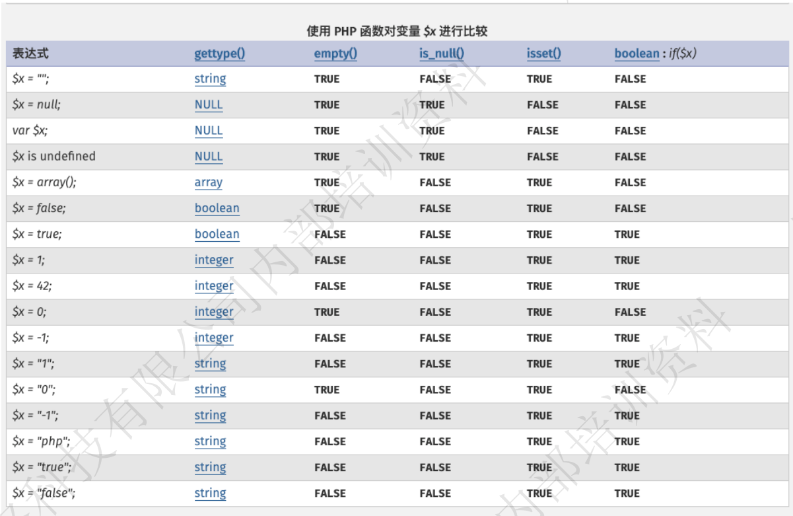
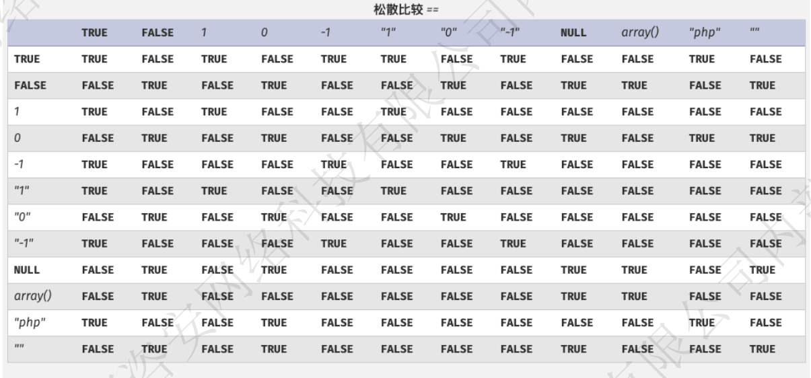
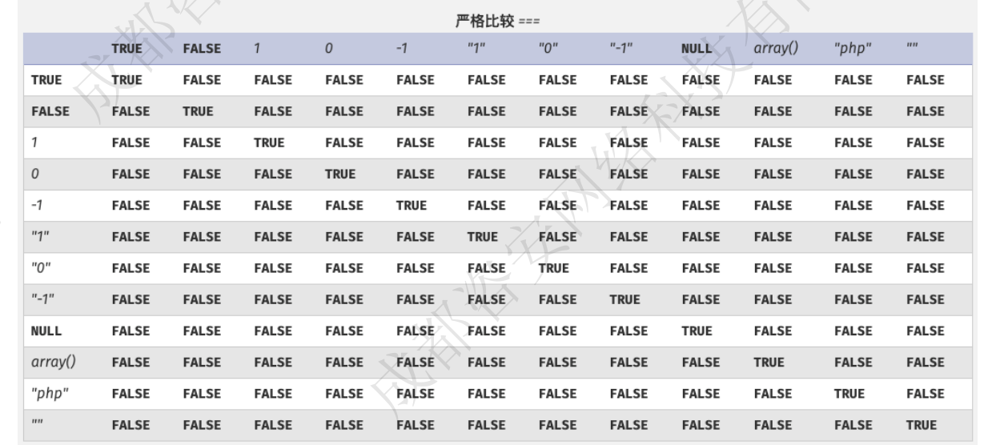

php脚本

PHP脚本可以放在文本的任意位置
PHP脚本以<?php 开始，以？>结束
PHP文件的默认文件扩展名是".php'

标签替换
```php
<? echo '123';?> //short_open_tags=on 默认开启

<?=(表达式)?> //等价于 <?php echo (表达式)?> //无限制

<% echo '123';%> //asp_tags=on php_version < 7

<script language=”php”>echo '123'; </script> //php_vsesion < 7
```

# 输入函数

## 超级全局变量：

```php
$GLOBALS
$_SERVER
$_REQUEST
$_POST
$_GET
$_FILES
$_ENV
$_COOKIE
$_SESSION
```

### $GLOBALS：

$GLOBALS 是PHP的一个超级全局变量组，在一个PHP脚本的全部作用域中都可以访问。
$GLOBALS 是一个包含了全部变量的全局组合数组。变量的名字就是数组的键。


### $_SERVER：
$_SERVER 是一个包含了诸如头信息(header)、路径(path)、以及脚本位置(script locations)等等信息的数组。这个数组中的项目由 Web 服务器创建

$_SERVER['PHP_SELF']
：当前执行脚本的文件名。在处理表单提交时，可以用它来指向当前脚本。

$_SERVER['SERVER_NAME']
：当前运行脚本所在的服务器主机的名称。

$_SERVER['REQUEST_METHOD']
：当前请求的方法，通常是 "GET" 或 "POST"。

$_SERVER['REQUEST_URL']
：当前请求的 URL（不含主机部分），例如 "/page.php"。

$_SERVER['QUERY_STRING']
：当前请求的查询字符串部分，即 URL 中 "?" 后面的部分。

$_SERVER['HTTP_HOST']
：当前请求的主机名，通常是指完整的域名，例如 "example.com"。

$_SERVER['HTTP_REFERER']
：引导用户代理到当前页的前一页 URL 地址，如果有的话。但请注意，有些浏览器不提供这个信息，而且这个值容易被伪造，因此不是非常可靠。

$_SERVER['HTTP_USER_AGENT']
：当前用户代理（浏览器或其他客户端应用）的信息。

$_SERVER['REMOTE_ADDR']
：当前请求的客户端 IP 地址。

$_SERVER['SERVER_PORT']
：Web 服务器使用的端口（默认为 80）。

$_SERVER['HTTPS']
：如果当前请求通过 HTTPS 协议访问，则为 "on"；否则为空。

### $_REQUEST
$_REQUEST 默认情况下包含了 $_GET，$_POST 和 $_COOKIE

## 动态参数：

数组的键也可以是动态变量。这样你可以在运行时根据某个变量的值来访问数组中的元素
extract：
extract 函数可以将数组中的元素导入到当前作用域中作为变量。如果数组中的键与当前作用域中已有的变量名相同，可能会导致变量覆盖。

### 可变的数组键：

```php
$index = 2;
$array = array(0 => 'apple', 1 => 'banana', 2 => 'orange');
echo $array[$index]; // 输出 "orange"
```

### 可变变量：

```php
$a = "hello";
$$a = "123";  //此处创建了一个hello变量，$($a="hello")->$hello

echo $hello; //输出123

```

### 利用示例

```php

$a = "ping 127.0.0.1";
$b = $_GET[1];    //$b=a
$$b = $_GET[2];   //$a=whoami

system($a);

```
?1=a&2=whoami

## 变量覆盖

### extract()
extract 函数可以将数组中的元素导入到当前作用域中作为变量。如果数组中的键与当前作用域中已有的变量名相同，可能会导致变量覆盖。

```php
$array = ["name"=>"lili","age"=>13];
extract($array); //将数组中的两个键分开赋值，产生两个变量，name和age

echo $name;
echo $age;
```
输出：lili13

#### 利用示例

```php
$a = 'ping 127.0.0.1';
$b = [$_GET[1]=>$_GET[2],"q"=>'2'];
extract($b);    //此时 $_GET[1] 可以覆盖掉$a的值，将命令赋给$_GET[2]即可成功执行

system($a);
```

### list()
list 函数可以将数组中的值赋值给一组变量

```php
$info = ['John', 'Doe', 30];
list($firstName, $lastName, $age) = $info;
echo $firstName; // 输出 "John"
echo $lastName; // 输出 "Doe"
echo $age; // 输出 30
```

#### 利用示例

```php
$a = 'ping 127.0.0.1';
$array = [$_GET[1],"q"];

list($a,$b)=$array;
system($a);
```
将$_GET[1]赋值给$a


### parse_str()
parse_str() 函数用于解析 URL 查询字符串，并将其中的参数赋值给相应的变量

```php
$queryString = "name=lili&age=12";
parse_str($queryString,$params);

echo $params["name"];
echo $params["age"];
```

#### 利用示例

```php
$queryString = $_SERVER['QUERY_STRING'];        //接收url传来的字符
$com = array('cmd'=>'ping 127.0.0.1');          
parse_str($queryString,$$_GET[1]);              //$$存在变量覆盖，可以先将$$_GET[1]变成$(com),此时就变成了parse_str($queryString,$com);，由于parse_str() 函数用于解析 所有URL查询字符串，可以在url后再拼接一个cmd参数用来覆盖com数组中cmd的值。最终payload：?1=com&cmd=whoami

//com['cmd']
echo $com['cmd'];
system($com['cmd']);
```

### compact：
compact() 函数用于将多个变量转换为关联数组，其中变量名将成为数组的键，变量的值将成为数组的值

```php
$firstName = 'John';
$lastName = 'Doe';
$age = 30;

$info = compact('firstName', 'lastName', 'age');
print_r($info);
```

输出结果
Array
(
    [firstName] => John
    [lastName] => Doe
    [age] => 30
)

#### 利用示例

```php
<?php
$com1 = 'ping 127.0.0.1';
$cmd2 = 'ping 127.0.0.1';
$cmd3 = 'whoami';
$info = compact($_GET['1'], 'cmd2');
foreach ($info as $a){
    echo system($a);
}
```

输入?1=cmd3
执行cmd3的命令

# 输出函数

在PHP中，echo、print、printf和 var_dump都是用于输出内容的函数，但它们有一些区别和不同的
用途：
## echo:
echo是一个语言结构而不是函数，因此不需要使用括号。
echo可以同时输出一个或多个字符串，并且没有返回值。
由于echo没有返回值，因此它在执行效率上稍微优于其他输出函数。

```php
$variable = "Hello";
echo $variable; // 输出：Hello
echo "World"; // 输出：World
```

## print:
print是一个函数，需要使用括号。
print和echo类似，用于输出一个字符串，但它只能输出一个字符串，不能同时输出多个，并且总是返回1。
由于print有返回值，因此它可以在表达式中使用。

```php
$variable = "Hello";
print $variable;
```

## printf
printf是一个格式化输出函数，可以根据指定的格式输出字符串。
printf的第一个参数是格式字符串，后面可以跟随多个参数，用于替换格式字符串中的占位符

```php
$variable = "World";
printf("Hello %s", $variable); // 输出：Hello World
```

## var_dump
var_dump是一个调试函数，用于输出变量的详细信息，包括类型和值。
它可以用于调试目的，帮助开发者了解变量的结构和内容。

```php
$variable = array(1, 2, 3);
var_dump($variable);
```

array(3) {
  [0]=>
  int(1)
  [1]=>
  int(2)
  [2]=>
  int(3)
}

## print_r
print_r 用于以更可读的方式输出数组或对象的内容，通常用于调试目的
它仅用于输出数组或对象的内容，因此不能用于输出其他数据类型的内容

```php
$variable = array(1, 2, 3);
print_r($variable);
```

Array
(
    [0] => 1
    [1] => 2
    [2] => 3
)

# 数据类型

String（字符串）
Integer（整型）
Float（浮点型）
Boolean（布尔型）
Array（数组）
Object（对象）
NULL（空值）
Resource（资源类型）

# 类型比较

松散比较：使用两个等号 == 比较，只比较值，不比较类型。
严格比较：用三个等号 === 比较，除了比较值，也比较类型。





# 数组
数组能够在单个变量中存储多个值

```php
<?php
$cars=array("Volvo","BMW","Toyota");
echo "I like " . $cars[0] . ", " . $cars[1] . " and " . $cars[2] . ".";
?>
```

PHP中有许多常用的数组函数，用于操作、处理和转换数组。以下是一些常见的数组函数：
```php
count()
: 返回数组中元素的个数。
array_push()
: 将一个或多个元素添加到数组末尾。
array_pop()
: 移除并返回数组末尾的元素。
array_shift()
: 移除并返回数组开头的元素。
array_unshift()
: 将一个或多个元素添加到数组开头。
array_slice()
: 从数组中取出一段元素。
array_splice()
: 在数组中插入或删除元素。
array_merge()
: 合并一个或多个数组。
array_search()
: 在数组中搜索给定值，并返回第一个匹配的键名。
in_array()
: 检查数组中是否存在某个值。
array_key_exists()
: 检查数组中是否存在某个键名。
array_keys()
: 返回数组中所有的键名。
array_values()
: 返回数组中所有的值。
array_flip()
交换数组中的键和值。
array_reverse()
: 反转数组中的元素顺序。
array_unique()
: 移除数组中重复的值。
array_sum()
: 计算数组中所有元素的和。
array_filter()
: 根据回调函数的规则，过滤数组中的元素。
array_map()
: 将回调函数作用于数组中的每个元素，并返回处理后的结果数组。
array_reduce()
: 使用回调函数迭代数组并返回一个单一的值。
```

# 字符串

## 字符串拼接
```php
$txt1="Hello world!";
$txt2="What a nice day!";
echo $txt1 . "  " . $txt2;
```
用.拼接
在 PHP 中，有许多常用的字符串处理函数，用于执行字符串的各种操作和转换。以下是一些常见的字符串处理函数
```php
strlen()
: 返回字符串的长度（字符数）。
strpos()
: 查找子字符串在字符串中第一次出现的位置。
str_replace()
: 将指定子字符串替换为另一个字符串。
substr()
: 返回字符串的子字符串。
strtolower()
: 将字符串转换为小写。
strtoupper()
: 将字符串转换为大写。
trim()
: 去除字符串两端的空白字符（或其他指定字符）。
ltrim()
: 去除字符串左侧的空白字符（或其他指定字符）。
rtrim()
: 去除字符串右侧的空白字符（或其他指定字符）。
explode()
: 将字符串拆分成数组，根据指定的分隔符进行拆分。
implode()
: 将数组的元素连接成一个字符串，使用指定的分隔符。
strip_tags()
: 去除字符串中的HTML和PHP标签。
ucfirst()
: 将字符串的首字母转换为大写。
ucwords()
: 将字符串中每个单词的首字母转换为大写。
str_pad()
: 用指定字符将字符串填充为指定长度。
strlen()
: 返回字符串的长度（字符数）。
sprintf()
: 格式化字符串
```

## 文件名常用函数：
在 PHP 中，可以使用以下常见的函数来限制文件名:
### 1.basename() 
basename() 函数用于返回路径中的文件名部分。它可以用于确保文件名只包含合法的字符，并且不包
含路径信息。
```php
$filename = "/path/to/my_file.txt";
$basename = basename($filename); // $basename 现在是 "my_file.txt"
```

### 2.preg_replace()

preg_replace() 函数可以使用正则表达式替换文件名中的不合法字符。通过使用适当的正则表达式，可以从文件名中去除非法字符或将它们替换为其他字符。

```php
$filename = "file?name.txt";
$cleanedFilename = preg_replace('/[^\w\d\.\-_]/', '_', $filename); // $cleanedFilename现在是 "file_name.txt"
```
在上面的例子中，preg_replace() 函数使用正则表达式将非单词字符（\w）、非数字字符（\d）、点（.）、连字符（-）和下划线（_）之外的所有字符替换为下划线。

### 3.str_replace()

str_replace() 函数可以用于简单的字符串替换。虽然不如正则表达式强大，但在某些情况下也可以用来去除特定字符。
```php
$filename = "file?name.txt";
$cleanedFilename = str_replace('?', '_', $filename); // $cleanedFilename 现在是"file_name.txt"
```

### 4.filter_var():

filter_var() 函数可以用于过滤文件名中的非法字符。使用FILTER_SANITIZE_STRING 过滤器可以删除文件名中的非法字符。
```php
$filename = "file?name.txt";
$cleanedFilename = filter_var($filename, FILTER_SANITIZE_STRING); // $cleanedFilename现在是 "filename.txt"
```

### pathinfo()

pathinfo() 函数可以用于获取文件路径的信息，包括文件名、目录名和文件扩展名（后缀）等。通过pathinfo() 获取文件后缀，并与允许的后缀列表进行比较。

```php
$allowedExtensions = array('jpg', 'png', 'gif');
$filename = 'example.jpg';
$extension = pathinfo($filename, PATHINFO_EXTENSION);
if (in_array($extension, $allowedExtensions)) {
// 合法的文件后缀
} else {
// 非法的文件后缀
}
```
### strtolower() 

在检查文件后缀时，为了避免大小写问题，通常会将后缀转换为小写（或大写）后再进行比较。
```php
$allowedExtensions = array('jpg', 'png', 'gif');
$filename = 'example.JPG';
$extension = strtolower(pathinfo($filename, PATHINFO_EXTENSION));
if (in_array($extension, $allowedExtensions)) {
// 合法的文件后缀
} else {
// 非法的文件后缀
}
```