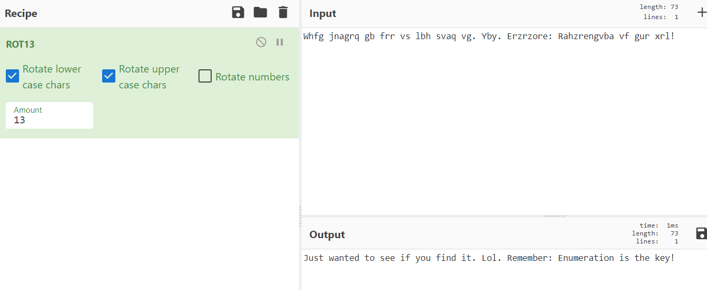

## 端口扫描

```bash
┌──(kali㉿kali)-[~/workspace/ftp]
└─$ sudo nmap -Pn --min-rate 500 -p- 10.10.89.78 
[sudo] kali 的密码：
Starting Nmap 7.94SVN ( https://nmap.org ) at 2024-03-14 23:07 EDT
Warning: 10.10.89.78 giving up on port because retransmission cap hit (10).
Stats: 0:20:31 elapsed; 0 hosts completed (1 up), 1 undergoing SYN Stealth Scan
SYN Stealth Scan Timing: About 99.99% done; ETC: 23:28 (0:00:00 remaining)
Nmap scan report for 10.10.89.78
Host is up (0.51s latency).
Not shown: 60899 closed tcp ports (reset), 4632 filtered tcp ports (no-response)
PORT      STATE SERVICE
21/tcp    open  ftp
80/tcp    open  http
10000/tcp open  snet-sensor-mgmt
55007/tcp open  unknown

Nmap done: 1 IP address (1 host up) scanned in 1432.75 seconds
                                                                                                                                                                                           
┌──(kali㉿kali)-[~/workspace/ftp]
└─$ sudo nmap -Pn -sCV -O -p 21,80,10000,55007 10.10.89.78
[sudo] kali 的密码：
Starting Nmap 7.94SVN ( https://nmap.org ) at 2024-03-14 23:40 EDT
Nmap scan report for 10.10.89.78
Host is up (0.34s latency).

PORT      STATE SERVICE VERSION
21/tcp    open  ftp     vsftpd 3.0.3
| ftp-syst: 
|   STAT: 
| FTP server status:
|      Connected to ::ffff:10.17.9.68
|      Logged in as ftp
|      TYPE: ASCII
|      No session bandwidth limit
|      Session timeout in seconds is 300
|      Control connection is plain text
|      Data connections will be plain text
|      At session startup, client count was 3
|      vsFTPd 3.0.3 - secure, fast, stable
|_End of status
|_ftp-anon: Anonymous FTP login allowed (FTP code 230)
|_ftp-bounce: bounce working!
80/tcp    open  http    Apache httpd 2.4.18 ((Ubuntu))
|_http-title: Apache2 Ubuntu Default Page: It works
|_http-server-header: Apache/2.4.18 (Ubuntu)
| http-robots.txt: 1 disallowed entry 
|_/
10000/tcp open  http    MiniServ 1.930 (Webmin httpd)
|_http-title: Site doesn't have a title (text/html; Charset=iso-8859-1).
55007/tcp open  ssh     OpenSSH 7.2p2 Ubuntu 4ubuntu2.8 (Ubuntu Linux; protocol 2.0)
| ssh-hostkey: 
|   2048 e3:ab:e1:39:2d:95:eb:13:55:16:d6:ce:8d:f9:11:e5 (RSA)
|   256 ae:de:f2:bb:b7:8a:00:70:20:74:56:76:25:c0:df:38 (ECDSA)
|_  256 25:25:83:f2:a7:75:8a:a0:46:b2:12:70:04:68:5c:cb (ED25519)
Warning: OSScan results may be unreliable because we could not find at least 1 open and 1 closed port
Aggressive OS guesses: Actiontec MI424WR-GEN3I WAP (96%), DD-WRT v24-sp2 (Linux 2.4.37) (96%), Linux 3.2 (94%), Linux 4.4 (92%), Microsoft Windows XP SP3 or Windows 7 or Windows Server 2012 (90%), Microsoft Windows XP SP3 (89%), BlueArc Titan 2100 NAS device (89%), VMware Player virtual NAT device (89%)
No exact OS matches for host (test conditions non-ideal).
Service Info: OSs: Unix, Linux; CPE: cpe:/o:linux:linux_kernel

OS and Service detection performed. Please report any incorrect results at https://nmap.org/submit/ .
Nmap done: 1 IP address (1 host up) scanned in 54.83 seconds

┌──(kali㉿kali)-[~/workspace/ftp]
└─$ sudo nmap -Pn --script vuln -p 21,80,10000,55007 10.10.89.78 
Starting Nmap 7.94SVN ( https://nmap.org ) at 2024-03-14 23:48 EDT
Pre-scan script results:
| broadcast-avahi-dos: 
|   Discovered hosts:
|     224.0.0.251
|   After NULL UDP avahi packet DoS (CVE-2011-1002).
|_  Hosts are all up (not vulnerable).
Nmap scan report for 10.10.89.78
Host is up (0.41s latency).

PORT      STATE SERVICE
21/tcp    open  ftp
80/tcp    open  http
|_http-dombased-xss: Couldn't find any DOM based XSS.
| http-slowloris-check: 
|   VULNERABLE:
|   Slowloris DOS attack
|     State: LIKELY VULNERABLE
|     IDs:  CVE:CVE-2007-6750
|       Slowloris tries to keep many connections to the target web server open and hold
|       them open as long as possible.  It accomplishes this by opening connections to
|       the target web server and sending a partial request. By doing so, it starves
|       the http server's resources causing Denial Of Service.
|       
|     Disclosure date: 2009-09-17
|     References:
|       http://ha.ckers.org/slowloris/
|_      https://cve.mitre.org/cgi-bin/cvename.cgi?name=CVE-2007-6750
| http-csrf: 
| Spidering limited to: maxdepth=3; maxpagecount=20; withinhost=10.10.89.78
|   Found the following possible CSRF vulnerabilities: 
|     
|     Path: http://10.10.89.78:80/manual/pt-br/index.html
|     Form id: 
|     Form action: http://www.google.com/search
|     
|     Path: http://10.10.89.78:80/manual/tr/index.html
|     Form id: 
|     Form action: http://www.google.com/search
|     
|     Path: http://10.10.89.78:80/manual/es/index.html
|     Form id: 
|     Form action: http://www.google.com/search
|     
|     Path: http://10.10.89.78:80/manual/fr/index.html
|     Form id: 
|     Form action: http://www.google.com/search
|     
|     Path: http://10.10.89.78:80/manual/en/index.html
|     Form id: 
|     Form action: http://www.google.com/search
|     
|     Path: http://10.10.89.78:80/manual/da/index.html
|     Form id: 
|     Form action: http://www.google.com/search
|     
|     Path: http://10.10.89.78:80/manual/zh-cn/index.html
|     Form id: 
|     Form action: http://www.google.com/search
|     
|     Path: http://10.10.89.78:80/manual/de/index.html
|     Form id: 
|     Form action: http://www.google.com/search
|     
|     Path: http://10.10.89.78:80/manual/ko/index.html
|     Form id: 
|     Form action: http://www.google.com/search
|     
|     Path: http://10.10.89.78:80/manual/ja/index.html
|     Form id: 
|_    Form action: http://www.google.com/search
|_http-stored-xss: Couldn't find any stored XSS vulnerabilities.
| http-enum: 
|_  /robots.txt: Robots file
10000/tcp open  snet-sensor-mgmt
| http-vuln-cve2006-3392: 
|   VULNERABLE:
|   Webmin File Disclosure
|     State: VULNERABLE (Exploitable)
|     IDs:  CVE:CVE-2006-3392
|       Webmin before 1.290 and Usermin before 1.220 calls the simplify_path function before decoding HTML.
|       This allows arbitrary files to be read, without requiring authentication, using "..%01" sequences
|       to bypass the removal of "../" directory traversal sequences.
|       
|     Disclosure date: 2006-06-29
|     References:
|       https://cve.mitre.org/cgi-bin/cvename.cgi?name=CVE-2006-3392
|       http://www.rapid7.com/db/modules/auxiliary/admin/webmin/file_disclosure
|_      http://www.exploit-db.com/exploits/1997/
55007/tcp open  unknown

Nmap done: 1 IP address (1 host up) scanned in 349.44 seconds
```

## ftp渗透

```bash
┌──(kali㉿kali)-[~/workspace/ftp]
└─$ sudo ftp 10.10.89.78                  
[sudo] kali 的密码：
Connected to 10.10.89.78.
220 (vsFTPd 3.0.3)
Name (10.10.89.78:kali): anonymous
230 Login successful.
Remote system type is UNIX.
Using binary mode to transfer files.
ftp> binary 
200 Switching to Binary mode.
ftp> get .info.txt
local: .info.txt remote: .info.txt
229 Entering Extended Passive Mode (|||49072|)
150 Opening BINARY mode data connection for .info.txt (74 bytes).
100% |**********************************************************************************************************************************************|    74      651.04 KiB/s    00:00 ETA
226 Transfer complete.
74 bytes received in 00:00 (0.16 KiB/s)
ftp> exit
421 Timeout.
                                                                                                                                                                                           
┌──(kali㉿kali)-[~/workspace/ftp]
└─$ ls -la
总计 12
drwxr-xr-x 2 kali kali 4096  3月14日 22:47 .
drwxrwxrwx 3 root root 4096  3月14日 22:46 ..
-rw-r--r-- 1 kali kali   74 2019年 8月21日 .info.txt
                                                                                                                                                                                           
┌──(kali㉿kali)-[~/workspace/ftp]
└─$ cat .info.txt              
Whfg jnagrq gb frr vs lbh svaq vg. Yby. Erzrzore: Rahzrengvba vf gur xrl!
```

枚举是关键。。


## 先看看robots.txt吧


```bash
┌──(kali㉿kali)-[~/workspace]
└─$ john --format=raw-md5 hash.txt 
Using default input encoding: UTF-8
Loaded 1 password hash (Raw-MD5 [MD5 128/128 AVX 4x3])
Warning: no OpenMP support for this hash type, consider --fork=4
Proceeding with single, rules:Single
Press 'q' or Ctrl-C to abort, almost any other key for status
Almost done: Processing the remaining buffered candidate passwords, if any.
Proceeding with wordlist:/usr/share/john/password.lst
Proceeding with incremental:ASCII
kidding          (?)     
1g 0:00:00:07 DONE 3/3 (2024-03-14 23:52) 0.1282g/s 15756Kp/s 15756Kc/s 15756KC/s kiddy10..kiddica
Use the "--show --format=Raw-MD5" options to display all of the cracked passwords reliably
Session completed. 
                       
```
kidding
得到一个用户名或密码？