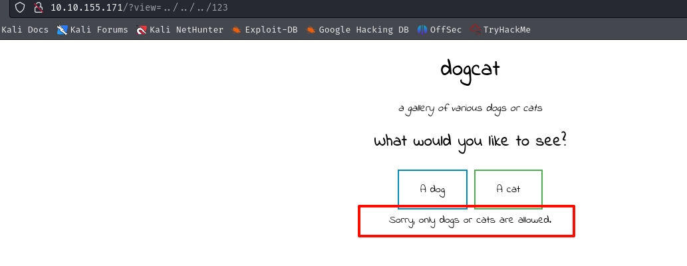

## 端口扫描
```bash
 ──(kali㉿kali)-[~/workspace]
└─$ sudo nmap -sT -sCV -O -p22,80 10.10.155.171
Starting Nmap 7.94SVN ( https://nmap.org ) at 2024-04-25 02:20 EDT
Nmap scan report for 10.10.155.171
Host is up (0.31s latency).

PORT   STATE SERVICE VERSION
22/tcp open  ssh     OpenSSH 7.6p1 Ubuntu 4ubuntu0.3 (Ubuntu Linux; protocol 2.0)
| ssh-hostkey: 
|   2048 24:31:19:2a:b1:97:1a:04:4e:2c:36:ac:84:0a:75:87 (RSA)
|   256 21:3d:46:18:93:aa:f9:e7:c9:b5:4c:0f:16:0b:71:e1 (ECDSA)
|_  256 c1:fb:7d:73:2b:57:4a:8b:dc:d7:6f:49:bb:3b:d0:20 (ED25519)
80/tcp open  http    Apache httpd 2.4.38 ((Debian))
|_http-title: dogcat
|_http-server-header: Apache/2.4.38 (Debian)
Warning: OSScan results may be unreliable because we could not find at least 1 open and 1 closed port
Aggressive OS guesses: Linux 3.1 (95%), Linux 3.2 (95%), AXIS 210A or 211 Network Camera (Linux 2.6.17) (95%), ASUS RT-N56U WAP (Linux 3.4) (93%), Linux 3.16 (93%), Linux 2.6.32 (93%), Linux 2.6.39 - 3.2 (93%), Linux 3.1 - 3.2 (93%), Linux 3.2 - 4.9 (93%), Linux 3.7 - 3.10 (93%)
No exact OS matches for host (test conditions non-ideal).
Network Distance: 4 hops
Service Info: OS: Linux; CPE: cpe:/o:linux:linux_kernel

```

## web渗透



只能输入cat或者dog的文件名
并且在文件后会加上.php的后缀
直接读取读不出来，要用上伪协议


看了下index的源码，检测是否存在ext参数，不存在就用.php结尾


这看起来每一个shell啊

爆破一下lfi的字典
得到apache的access日志
尝试日志写马