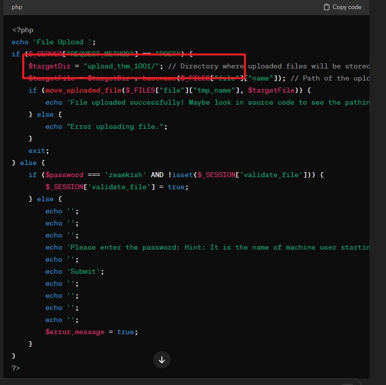

## 端口扫描

```bash
┌──(kali㉿kali)-[~/workspace/expose]
└─$ sudo nmap -sT -sCV -O -p 21,22,53,1337 10.10.208.144
Starting Nmap 7.94SVN ( https://nmap.org ) at 2024-03-22 00:44 EDT
Nmap scan report for 10.10.208.144
Host is up (0.27s latency).

PORT     STATE SERVICE VERSION
21/tcp   open  ftp     vsftpd 2.0.8 or later
| ftp-syst: 
|   STAT: 
| FTP server status:
|      Connected to ::ffff:10.17.9.68
|      Logged in as ftp
|      TYPE: ASCII
|      No session bandwidth limit
|      Session timeout in seconds is 300
|      Control connection is plain text
|      Data connections will be plain text
|      At session startup, client count was 3
|      vsFTPd 3.0.3 - secure, fast, stable
|_End of status
|_ftp-anon: Anonymous FTP login allowed (FTP code 230)
22/tcp   open  ssh     OpenSSH 8.2p1 Ubuntu 4ubuntu0.7 (Ubuntu Linux; protocol 2.0)
| ssh-hostkey: 
|   3072 d8:8c:3a:60:c9:1b:d5:f8:38:a5:ef:34:ed:8b:c4:84 (RSA)
|   256 46:f2:1f:9e:29:50:d8:35:ab:d0:e0:44:38:cb:ed:11 (ECDSA)
|_  256 df:98:ec:22:4b:10:a0:0c:6c:5c:1e:67:bb:ae:ce:ab (ED25519)
53/tcp   open  domain  ISC BIND 9.16.1 (Ubuntu Linux)
| dns-nsid: 
|_  bind.version: 9.16.1-Ubuntu
1337/tcp open  http    Apache httpd 2.4.41 ((Ubuntu))
|_http-title: EXPOSED
|_http-server-header: Apache/2.4.41 (Ubuntu)
Warning: OSScan results may be unreliable because we could not find at least 1 open and 1 closed port
Aggressive OS guesses: Linux 3.1 (95%), Linux 3.2 (95%), AXIS 210A or 211 Network Camera (Linux 2.6.17) (95%), ASUS RT-N56U WAP (Linux 3.4) (93%), Linux 3.16 (93%), Linux 2.6.32 (93%), Linux 2.6.39 - 3.2 (93%), Linux 3.1 - 3.2 (93%), Linux 3.2 - 4.9 (93%), Linux 3.7 - 3.10 (93%)
No exact OS matches for host (test conditions non-ideal).
Network Distance: 5 hops
Service Info: OS: Linux; CPE: cpe:/o:linux:linux_kernel

OS and Service detection performed. Please report any incorrect results at https://nmap.org/submit/ .
Nmap done: 1 IP address (1 host up) scanned in 37.30 seconds

```

vuln脚本没扫描到扫描信息
检查下ftp没有信息

看下1337的web页面了

## web渗透

先用的medium字典扫

首先到admin目录下
这明显是一个静态网站，没有利用价值
换了一个字典
```bash
┌──(kali㉿kali)-[~/workspace/expose]
└─$ gobuster dir -w /usr/share/wordlists/dirb/big.txt -u http://10.10.208.144:1337/ -t 10 
===============================================================
Gobuster v3.6
by OJ Reeves (@TheColonial) & Christian Mehlmauer (@firefart)
===============================================================
[+] Url:                     http://10.10.208.144:1337/
[+] Method:                  GET
[+] Threads:                 10
[+] Wordlist:                /usr/share/wordlists/dirb/big.txt
[+] Negative Status codes:   404
[+] User Agent:              gobuster/3.6
[+] Timeout:                 10s
===============================================================
Starting gobuster in directory enumeration mode
===============================================================
/.htaccess            (Status: 403) [Size: 280]
/.htpasswd            (Status: 403) [Size: 280]
/admin                (Status: 301) [Size: 321] [--> http://10.10.208.144:1337/admin/]
/admin_101            (Status: 301) [Size: 325] [--> http://10.10.208.144:1337/admin_101/]
/javascript           (Status: 301) [Size: 326] [--> http://10.10.208.144:1337/javascript/]
/phpmyadmin           (Status: 301) [Size: 326] [--> http://10.10.208.144:1337/phpmyadmin/]
/server-status        (Status: 403) [Size: 280]
Progress: 20469 / 20470 (100.00%)
===============================================================
Finished
===============================================================
```
找到admin_101页面


这里邮箱已经有了啊，那就直接hydra开始爆破吧

看了下回显，发现这里是有sql语句的
那可以试下SQL注入了

跑一下sqlmap
顺便手工小测一下
发现有万能密码直接登录可以进
SQLmap也跑出数据了
那hydra就没必要了

```bash
Database: expose
Table: user
[1 entry]
+----+-----------------+---------------------+--------------------------------------+
| id | email           | created             | password                             |
+----+-----------------+---------------------+--------------------------------------+
| 1  | hacker@root.thm | 2023-02-21 09:05:46 | VeryDifficultPassword!!#@#@!#!@#1231 |
+----+-----------------+---------------------+--------------------------------------+

```
得到一个密码
hacker@root.thm/VeryDifficultPassword!!#@#@!#!@#1231
先不急着连吧

```bash
Database: expose                                                                            
Table: config
[2 entries]
+----+------------------------------+-----------------------------------------------------+
| id | url                          | password                                            |
+----+------------------------------+-----------------------------------------------------+
| 1  | /file1010111/index.php       | 69c66901194a6486176e81f5945b8929 (easytohack)       |
| 3  | /upload-cv00101011/index.php | // ONLY ACCESSIBLE THROUGH USERNAME STARTING WITH Z |
+----+------------------------------+-----------------------------------------------------+

```
看下另一个表吧


得到参数是file和view

根据上面的提示，用一个z开头的用户名登录`/upload-cv00101011/index.php`
看到一个用户`zeamkish`直接登录

那么来到了一个文件上传的功能点

10.10.186.243
文件上传加文件包含
熟悉的配方

看到源码的文件上传地址
上传revshell改成png
包含一下就拿到shell了


进来先找sql配置文件
找到了但是没什么用
那先去用户家目录看看信息

得到ssh连接密码
成功登录用户

## 提权
提权就很容易了
里面有个suid的find
直接提权了
