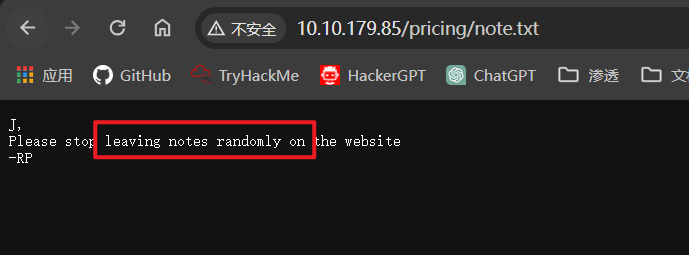
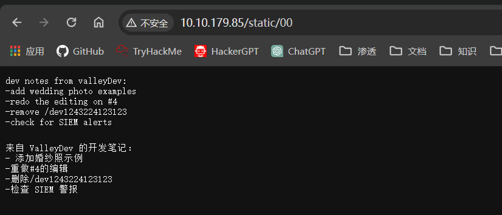
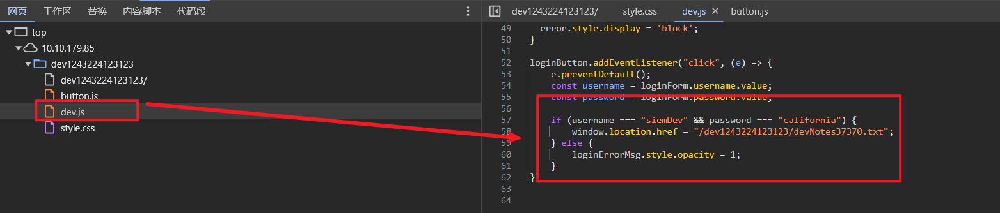
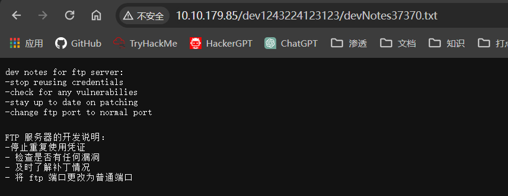
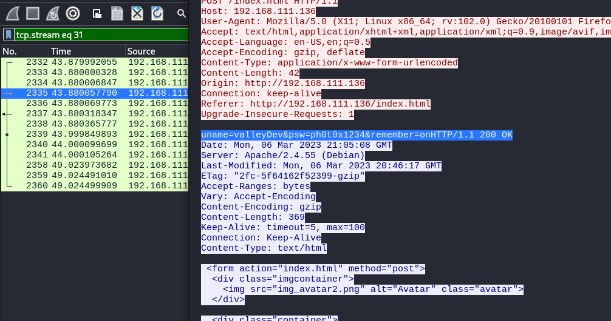

## 端口扫描
```bash
┌──(kali㉿kali)-[~/workspace]
└─$ sudo nmap -sT -A -p 22,80,37370 10.10.13.31 
Starting Nmap 7.94SVN ( https://nmap.org ) at 2024-03-04 03:40 EST
Nmap scan report for 10.10.13.31
Host is up (0.36s latency).

PORT      STATE SERVICE VERSION
22/tcp    open  ssh     OpenSSH 8.2p1 Ubuntu 4ubuntu0.5 (Ubuntu Linux; protocol 2.0)
| ssh-hostkey: 
|   3072 c2:84:2a:c1:22:5a:10:f1:66:16:dd:a0:f6:04:62:95 (RSA)
|   256 42:9e:2f:f6:3e:5a:db:51:99:62:71:c4:8c:22:3e:bb (ECDSA)
|_  256 2e:a0:a5:6c:d9:83:e0:01:6c:b9:8a:60:9b:63:86:72 (ED25519)
80/tcp    open  http    Apache httpd 2.4.41 ((Ubuntu))
|_http-server-header: Apache/2.4.41 (Ubuntu)
|_http-title: Site doesn't have a title (text/html).
37370/tcp open  ftp     vsftpd 3.0.3
Warning: OSScan results may be unreliable because we could not find at least 1 open and 1 closed port
Aggressive OS guesses: AXIS 210A or 211 Network Camera (Linux 2.6.17) (95%), Linux 3.1 (92%), Linux 3.2 (92%), Linux 2.6.32 (91%), Sony X75CH-series Android TV (Android 5.0) (90%), Linux 3.11 (90%), Linux 3.2 - 4.9 (90%), QNAP QTS 4.0 - 4.2 (90%), ASUS RT-N56U WAP (Linux 3.4) (90%), Linux 3.16 (90%)
No exact OS matches for host (test conditions non-ideal).
Network Distance: 4 hops
Service Info: OSs: Linux, Unix; CPE: cpe:/o:linux:linux_kernel

TRACEROUTE (using proto 1/icmp)
HOP RTT       ADDRESS
1   357.85 ms 10.13.0.1
2   ... 3
4   367.45 ms 10.10.13.31

OS and Service detection performed. Please report any incorrect results at https://nmap.org/submit/ .
Nmap done: 1 IP address (1 host up) scanned in 39.79 seconds\
```

## 目录扫描

## web信息收集

找到信息，在目录下有随机上传的笔记

管理者：ValleyDev
根据提示找到登录界面

这个登录界面太搞了，打开burp抓包发现没有数据包
看源码发现是前端的判断
细看源码找到一个目录及用户名和密码
f12找到了信息泄露



既然看到这里了，肯定是要ftp了

## ftp渗透

```bash
ftp> ls
229 Entering Extended Passive Mode (|||48239|)
150 Here comes the directory listing.
-rw-rw-r--    1 1000     1000         7272 Mar 06  2023 siemFTP.pcapng
-rw-rw-r--    1 1000     1000      1978716 Mar 06  2023 siemHTTP1.pcapng
-rw-rw-r--    1 1000     1000      1972448 Mar 06  2023 siemHTTP2.pcapng
226 Directory send OK.
ftp> mget *
local: siemFTP.pcapng remote: siemFTP.pcapng
229 Entering Extended Passive Mode (|||39941|)
150 Opening BINARY mode data connection for siemFTP.pcapng (7272 bytes).
100% |**********************************************************************************************************************************************|  7272        2.58 KiB/s    00:00 ETA
226 Transfer complete.
7272 bytes received in 00:03 (2.27 KiB/s)
local: siemHTTP1.pcapng remote: siemHTTP1.pcapng
229 Entering Extended Passive Mode (|||18147|)
150 Opening BINARY mode data connection for siemHTTP1.pcapng (1978716 bytes).
100% |**********************************************************************************************************************************************|  1932 KiB   76.25 KiB/s    00:00 ETA
226 Transfer complete.
1978716 bytes received in 00:25 (75.08 KiB/s)
local: siemHTTP2.pcapng remote: siemHTTP2.pcapng
229 Entering Extended Passive Mode (|||14677|)
150 Opening BINARY mode data connection for siemHTTP2.pcapng (1972448 bytes).
100% |**********************************************************************************************************************************************|  1926 KiB   71.34 KiB/s    00:00 ETA
226 Transfer complete.
1972448 bytes received in 00:28 (67.60 KiB/s)
```
登录下载到三个流量包

valleyDev/ph0t0s1234
都看了一下
最终在第三个流量包中，看到有内网ip
查看后发现有登录密码及账号

## 第一个立足点，shell
```bash
┌──(kali㉿kali)-[~/workspace]
└─$ sudo ssh valleyDev@10.10.179.85
The authenticity of host '10.10.179.85 (10.10.179.85)' can't be established.
ED25519 key fingerprint is SHA256:cssZyBk7QBpWU8cMEAJTKWPfN5T2yIZbqgKbnrNEols.
This key is not known by any other names.
Are you sure you want to continue connecting (yes/no/[fingerprint])? yes
Warning: Permanently added '10.10.179.85' (ED25519) to the list of known hosts.
valleyDev@10.10.179.85's password: 
Welcome to Ubuntu 20.04.6 LTS (GNU/Linux 5.4.0-139-generic x86_64)

 * Documentation:  https://help.ubuntu.com
 * Management:     https://landscape.canonical.com
 * Support:        https://ubuntu.com/advantage

 * Introducing Expanded Security Maintenance for Applications.
   Receive updates to over 25,000 software packages with your
   Ubuntu Pro subscription. Free for personal use.

     https://ubuntu.com/pro
valleyDev@valley:~$
```