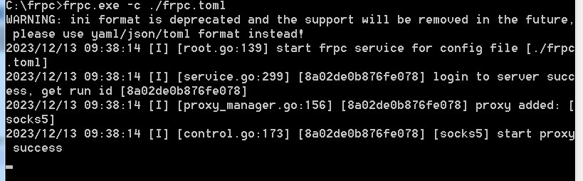
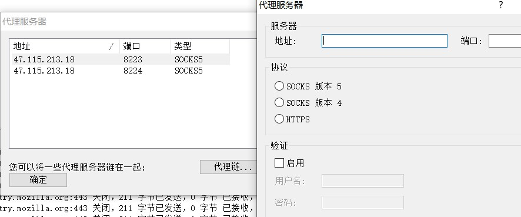
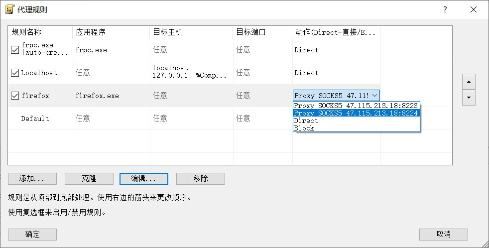

## 安装frp

github上下载frp

将文件放在vps中


## 服务端

### frps.toml配置

```toml
[common]
# listen 端口
bind_port = 7000

# 这两个端口可以和bind_port相同
vhost_http_port = 7000
vhost_https_port = 7000

dashboard_addr = 0.0.0.0
dashboard_port = 7500
dashboard_user = fforufrp
dashboard_pwd = fforufrp

# 设置token校验，客户端的token和它一致
authentication_method = token
token = fforufrp

```


### 设置为bin命令

```bash
将文件夹中的文件移动到 /usr/local/bin/：

sudo mv ./frps /usr/local/bin/
sudo mv ./frps.toml /usr/local/bin/


frps -c frps.toml
```


### 设置开机自启

frp.service

```bash
[Unit]
Description=Frp Server Daemon
After=syslog.target network.target
Wants=network.target

[Service]
Type=simple
ExecStart=/usr/local/bin/frps -c /usr/local/bin/frps.toml   
ExecStop=/usr/bin/killall frps
RestartSec=1min
KillMode=control-group
Restart=always

[Install]
WantedBy=multi-user.target

```

启动服务

```bash
sudo systemctl daemon-reload
sudo systemctl enable frps
sudo systemctl start frps

sudo systemctl status frps
```


## 客户端

### frpc.toml配置

```toml
[common]
tls_enable = false
server_addr = "47.115.213.18"
server_port = 7000
authentication_method = token
authenticate_new_work_conns = true
token = fforufrp

[socks5]
type = "tcp"
local_ip = "127.0.0.1"
local_port = 1234
remote_port = 8223
plugin = "socks5"

```

### 启动frpc



看到成功配置后，打开proxifier

添加代理服务器



添加代理服务器后添加规则


这里可以更改规则，即想用什么软件使用代理服务器去访问什么ip
