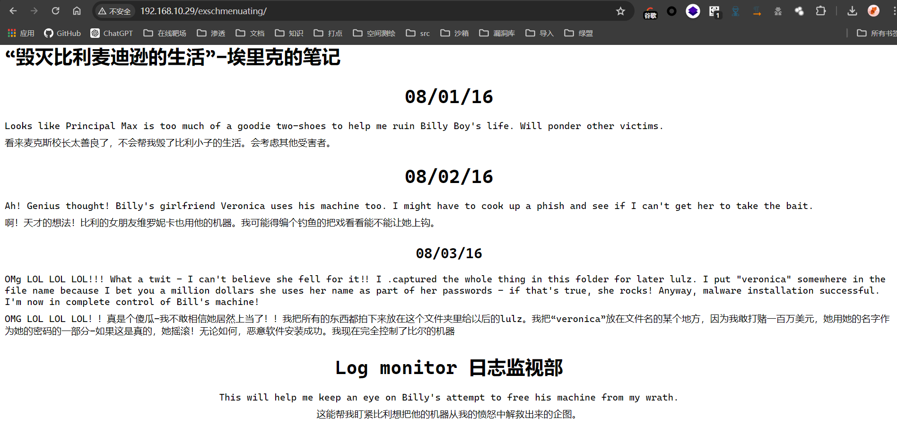

## 描述


剧情：帮助比利·麦迪逊阻止埃里克接管麦迪逊酒店！

就在比利准备参加一场学术十项全能比赛之前，狡猾的 Eric Gordon在比利的计算机上安装了恶意软件。除非比利能够重新控制他的机器并解密他 12 年级的期末项目，否则他将无法高中毕业。另外，这意味着埃里克获胜，他将接任麦迪逊酒店的负责人！

目标：VM 的主要目标是弄清楚 Eric 如何接管机器，然后撤消他的更改，以便您可以恢复 Billy 的 12 年级期末项目。您可能需要root该盒子才能完成此目标。

## 端口扫描

```bash
┌──(kali㉿kali)-[~/workspace/BillyMadison1dot1]
└─$ sudo nmap -sT -sCV -O -p22,23,69,80,137,138,139,445,2525 192.168.10.29
Starting Nmap 7.94SVN ( https://nmap.org ) at 2024-05-29 09:43 EDT
Nmap scan report for 192.168.10.29
Host is up (0.00045s latency).

PORT     STATE  SERVICE     VERSION
22/tcp   open   ssh         OpenSSH 9.4p1 Debian 1 (protocol 2.0)
| ssh-hostkey:
|   256 fa:13:24:cf:e0:ce:82:0e:2f:e9:84:2d:97:10:73:52 (ECDSA)
|_  256 9f:ba:54:91:ec:b1:d2:ba:a5:ab:d6:41:5f:0f:3f:b3 (ED25519)
23/tcp   open   tcpwrapped
69/tcp   open   caldav      Radicale calendar and contacts server (Python BaseHTTPServer)
|_http-server-header: MadisonHotelsWordpress
|_http-generator: WordPress 1.0
|_http-title: Welcome | Just another WordPress site
80/tcp   open   http        Apache httpd 2.4.18 ((Ubuntu))
|_http-server-header: Apache/2.4.18 (Ubuntu)
|_http-title: Oh nooooooo!
137/tcp  closed netbios-ns
138/tcp  closed netbios-dgm
139/tcp  open   netbios-ssn Samba smbd 3.X - 4.X (workgroup: WORKGROUP)
445/tcp  open   netbios-ssn Samba smbd 4.3.9-Ubuntu (workgroup: WORKGROUP)
2525/tcp open   smtp
| fingerprint-strings:
|   GetRequest:
|     220 BM ESMTP SubEthaSMTP null
|     Error: command not implemented
|_    Error: bad syntax
| smtp-commands: BM, 8BITMIME, AUTH LOGIN, Ok
|_ SubEthaSMTP null on BM Topics: HELP HELO RCPT MAIL DATA AUTH EHLO NOOP RSET VRFY QUIT STARTTLS For more info use "HELP <topic>". End of HELP info
1 service unrecognized despite returning data. If you know the service/version, please submit the following fingerprint at https://nmap.org/cgi-bin/submit.cgi?new-service :
SF-Port2525-TCP:V=7.94SVN%I=7%D=5/29%Time=66573111%P=x86_64-pc-linux-gnu%r
SF:(GetRequest,5A,"220\x20BM\x20ESMTP\x20SubEthaSMTP\x20null\r\n500\x20Err
SF:or:\x20command\x20not\x20implemented\r\n500\x20Error:\x20bad\x20syntax\
SF:r\n");
MAC Address: 00:0C:29:92:15:9C (VMware)
Aggressive OS guesses: Linux 3.10 - 4.11 (95%), Linux 3.16 - 4.6 (93%), Linux 3.2 - 4.9 (92%), Linux 3.16 (91%), Linux 4.10 (91%), Linux 3.2 - 3.8 (91%), Linux 3.18 (90%), Linux 4.4 (90%), Linux 3.13 (89%), Linux 3.13 or 4.2 (89%)
No exact OS matches for host (test conditions non-ideal).
Network Distance: 1 hop
Service Info: Host: BM; OS: Linux; CPE: cpe:/o:linux:linux_kernel

Host script results:
| smb2-security-mode:
|   3:1:1:
|_    Message signing enabled but not required
|_clock-skew: mean: 1h40m02s, deviation: 2h53m14s, median: 0s
| smb-security-mode:
|   account_used: guest
|   authentication_level: user
|   challenge_response: supported
|_  message_signing: disabled (dangerous, but default)
| smb-os-discovery:
|   OS: Windows 6.1 (Samba 4.3.9-Ubuntu)
|   Computer name: bm
|   NetBIOS computer name: BM\x00
|   Domain name: \x00
|   FQDN: bm
|_  System time: 2024-05-29T08:44:14-05:00
| smb2-time:
|   date: 2024-05-29T13:44:12
|_  start_date: N/A

OS and Service detection performed. Please report any incorrect results at https://nmap.org/submit/ .
Nmap done: 1 IP address (1 host up) scanned in 116.27 seconds
```

```bash
┌──(kali㉿kali)-[~/workspace/BillyMadison1dot1]
└─$ sudo nmap -sT --script vuln -O -p22,23,69,80,137,138,139,445,2525 192.168.10.29
Starting Nmap 7.94SVN ( https://nmap.org ) at 2024-05-29 10:17 EDT
Pre-scan script results:
| broadcast-avahi-dos:
|   Discovered hosts:
|     224.0.0.251
|   After NULL UDP avahi packet DoS (CVE-2011-1002).
|_  Hosts are all up (not vulnerable).
Nmap scan report for 192.168.10.29
Host is up (0.0014s latency).

PORT     STATE  SERVICE
22/tcp   open   ssh
23/tcp   open   telnet
69/tcp   open   tftp
80/tcp   open   http
|_http-dombased-xss: Couldn't find any DOM based XSS.
| http-enum:
|_  /manual/: Potentially interesting folder
|_http-csrf: Couldn't find any CSRF vulnerabilities.
|_http-stored-xss: Couldn't find any stored XSS vulnerabilities.
|_http-vuln-cve2017-1001000: ERROR: Script execution failed (use -d to debug)
| http-slowloris-check:
|   VULNERABLE:
|   Slowloris DOS attack
|     State: LIKELY VULNERABLE
|     IDs:  CVE:CVE-2007-6750
|       Slowloris tries to keep many connections to the target web server open and hold
|       them open as long as possible.  It accomplishes this by opening connections to
|       the target web server and sending a partial request. By doing so, it starves
|       the http server's resources causing Denial Of Service.
|
|     Disclosure date: 2009-09-17
|     References:
|       https://cve.mitre.org/cgi-bin/cvename.cgi?name=CVE-2007-6750
|_      http://ha.ckers.org/slowloris/
137/tcp  closed netbios-ns
138/tcp  closed netbios-dgm
139/tcp  open   netbios-ssn
445/tcp  open   microsoft-ds
2525/tcp open   ms-v-worlds
MAC Address: 00:0C:29:92:15:9C (VMware)
Aggressive OS guesses: Linux 3.10 - 4.11 (95%), Linux 3.16 - 4.6 (92%), Linux 3.2 - 4.9 (92%), Linux 4.4 (91%), Linux 3.2 - 3.8 (91%), Linux 3.16 (90%), Linux 4.10 (90%), Linux 3.18 (89%), Linux 4.2 (88%), Linux 2.6.26 - 2.6.35 (88%)
No exact OS matches for host (test conditions non-ideal).
Network Distance: 1 hop

Host script results:
| smb-vuln-regsvc-dos:
|   VULNERABLE:
|   Service regsvc in Microsoft Windows systems vulnerable to denial of service
|     State: VULNERABLE
|       The service regsvc in Microsoft Windows 2000 systems is vulnerable to denial of service caused by a null deference
|       pointer. This script will crash the service if it is vulnerable. This vulnerability was discovered by Ron Bowes
|       while working on smb-enum-sessions.
|_
|_smb-vuln-ms10-061: false
|_smb-vuln-ms10-054: false

OS detection performed. Please report any incorrect results at https://nmap.org/submit/ .
Nmap done: 1 IP address (1 host up) scanned in 364.64 seconds
```
## 外围打点信息搜集

### smb信息搜集

```bash
┌──(kali㉿kali)-[~/workspace/BillyMadison1dot1]
└─$ enum4linux -a  192.168.10.29

//192.168.10.29/EricsSecretStuff        Mapping: OK Listing: OK Writing: N/A

```

在这里看下

```bash
┌──(kali㉿kali)-[~/workspace/BillyMadison1dot1]
└─$ smbclient  //192.168.10.29/EricsSecretStuff
Password for [WORKGROUP\kali]:
Try "help" to get a list of possible commands.
smb: \> ls
  .                                   D        0  Wed May 29 17:39:32 2024
  ..                                  D        0  Sat Aug 20 14:56:45 2016
  ._.DS_Store                        AH     4096  Wed Aug 17 10:32:07 2016
  ebd.txt                             N       35  Wed May 29 17:39:32 2024
  .DS_Store                          AH     6148  Wed Aug 17 10:32:12 2016

                30291996 blocks of size 1024. 25777548 blocks available
smb: \>
```
三个文件、

ebd.txt如下
Erics backdoor is currently CLOSED

Erics也许是个用户

### 69端口tftp
```bash
┌──(kali㉿kali)-[~/workspace/BillyMadison1dot1]
└─$ tftp 192.168.10.29
tftp> ?
tftp-hpa 5.2
Commands may be abbreviated.  Commands are:

connect         connect to remote tftp
mode            set file transfer mode
put             send file
get             receive file
quit            exit tftp
verbose         toggle verbose mode
trace           toggle packet tracing
literal         toggle literal mode, ignore ':' in file name
status          show current status
binary          set mode to octet
ascii           set mode to netascii
rexmt           set per-packet transmission timeout
timeout         set total retransmission timeout
?               print help information
help            print help information
tftp>

```
这里能上传下载文件但是不能列出，往后再看看

### 23 telnet

```bash
┌──(kali㉿kali)-[~/workspace/BillyMadison1dot1]
└─$ telnet 192.168.10.29 23
Trying 192.168.10.29...
Connected to 192.168.10.29.
Escape character is '^]'.


***** HAHAH! You're banned for a while, Billy Boy!  By the way, I caught you trying to hack my wifi - but the joke's on you! I don't use ROTten passwords like rkfpuzrahngvat anymore! Madison Hotels is as good as MINE!!!! *****

Connection closed by foreign host.
```
这里有一串rot密文，可能是密码
exschmenuating

但是其实是80端口的目录

### 80web页面

这里提到的有个文件包含了veroncia

去rockyou中取出带有veroncia的字符串

```bash
┌─[✗]─[root@parrot]─[/home/fforu/workspace]
└──╼ #dirb http://192.168.10.29/exschmenuating/ ver.list -X .cap

-----------------
DIRB v2.22
By The Dark Raver
-----------------

START_TIME: Thu May 30 04:58:45 2024
URL_BASE: http://192.168.10.29/exschmenuating/
WORDLIST_FILES: ver.list
EXTENSIONS_LIST: (.cap) | (.cap) [NUM = 1]

-----------------

GENERATED WORDS: 883

---- Scanning URL: http://192.168.10.29/exschmenuating/ ----
+ http://192.168.10.29/exschmenuating/veronica$%.cap (CODE:400|SIZE:305)
+ http://192.168.10.29/exschmenuating/012987veronica.cap (CODE:200|SIZE:8700)

-----------------
END_TIME: Thu May 30 04:58:46 2024
DOWNLOADED: 883 - FOUND: 2
```

有个流量包文件
下载查看

### 文件泄露
```bash
tcp0
EHLO kali
MAIL FROM:<eric@madisonhotels.com>
RCPT TO:<vvaughn@polyfector.edu>
DATA
Date: Sat, 20 Aug 2016 21:56:50 -0500
To: vvaughn@polyfector.edu
From: eric@madisonhotels.com
Subject: VIRUS ALERT!
X-Mailer: swaks v20130209.0 jetmore.org/john/code/swaks/

Hey Veronica, 

Eric Gordon here.  

I know you use Billy's machine more than he does, so I wanted to let you know that the company is rolling out a new antivirus program for all work-from-home users.  Just <a href="http://areallyreallybad.malware.edu.org.ru/f3fs0azjf.php">click here</a> to install it, k?  

Thanks. -Eric

tcp1
EHLO kali
MAIL FROM:<vvaughn@polyfector.edu>
RCPT TO:<eric@madisonhotels.com>
DATA
Date: Sat, 20 Aug 2016 21:57:00 -0500
To: eric@madisonhotels.com
From: vvaughn@polyfector.edu
Subject: test Sat, 20 Aug 2016 21:57:00 -0500
X-Mailer: swaks v20130209.0 jetmore.org/john/code/swaks/
RE: VIRUS ALERT!

Eric,

Thanks for your message. I tried to download that file but my antivirus blocked it.

Could you just upload it directly to us via FTP?  We keep FTP turned off unless someone connects with the "Spanish Armada" combo.

https://www.youtube.com/watch?v=z5YU7JwVy7s

-VV

tcp2
EHLO kali
MAIL FROM:<eric@madisonhotels.com>
RCPT TO:<vvaughn@polyfector.edu>
DATA
Date: Sat, 20 Aug 2016 21:57:11 -0500
To: vvaughn@polyfector.edu
From: eric@madisonhotels.com
Subject: test Sat, 20 Aug 2016 21:57:11 -0500
X-Mailer: swaks v20130209.0 jetmore.org/john/code/swaks/
RE[2]: VIRUS ALERT!

Veronica,

Thanks that will be perfect.  Please set me up an account with username of "eric" and password "ericdoesntdrinkhisownpee."

-Eric


.
QUIT

tcp3
EHLO kali
MAIL FROM:<vvaughn@polyfector.edu>
RCPT TO:<eric@madisonhotels.com>
DATA
Date: Sat, 20 Aug 2016 21:57:21 -0500
To: eric@madisonhotels.com
From: vvaughn@polyfector.edu
Subject: test Sat, 20 Aug 2016 21:57:21 -0500
X-Mailer: swaks v20130209.0 jetmore.org/john/code/swaks/
RE[3]: VIRUS ALERT!

Eric,

Done.

-V


.
QUIT

tcp4
EHLO kali
MAIL FROM:<eric@madisonhotels.com>
RCPT TO:<vvaughn@polyfector.edu>
DATA
Date: Sat, 20 Aug 2016 21:57:31 -0500
To: vvaughn@polyfector.edu
From: eric@madisonhotels.com
Subject: test Sat, 20 Aug 2016 21:57:31 -0500
X-Mailer: swaks v20130209.0 jetmore.org/john/code/swaks/
RE[4]: VIRUS ALERT!

Veronica,

Great, the file is uploaded to the FTP server, please go to a terminal and run the file with your account - the install will be automatic and you won't get any pop-ups or anything like that.  Thanks!

-Eric


.
QUIT

tcp5
EHLO kali
MAIL FROM:<vvaughn@polyfector.edu>
RCPT TO:<eric@madisonhotels.com>
DATA
Date: Sat, 20 Aug 2016 21:57:41 -0500
To: eric@madisonhotels.com
From: vvaughn@polyfector.edu
Subject: test Sat, 20 Aug 2016 21:57:41 -0500
X-Mailer: swaks v20130209.0 jetmore.org/john/code/swaks/
RE[5]: VIRUS ALERT!

Eric,

I clicked the link and now this computer is acting really weird.  The antivirus program is popping up alerts, my mouse started to move on its own, my background changed color and other weird stuff.  I'm going to send this email to you and then shut the computer down.  I have some important files I'm worried about, and Billy's working on his big 12th grade final.  I don't want anything to happen to that!

-V


.
QUIT
```

有如下几个信息：

vvaughn

Spanish Armada

eric/ericdoesntdrinkhisownpee

Spanish Armada代表这几个数字（看题解的，视频里有按顺序提到
1466, 1467, 1469, 1514, 1981, 1986

那么肯定就是端口敲门啦
