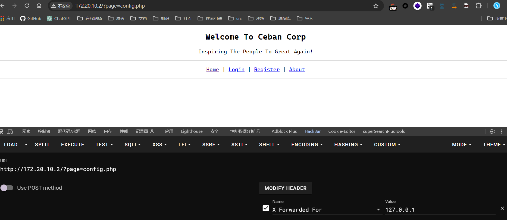

## 端口扫描

```bash
┌──(fforu㉿fforu)-[~/workspace]
└─$ sudo nmap -sT -sCV -O -p22,80 172.20.10.2
Starting Nmap 7.94SVN ( https://nmap.org ) at 2024-04-22 14:10 CST
Nmap scan report for 172.20.10.2
Host is up (0.00068s latency).

PORT   STATE SERVICE VERSION
22/tcp open  ssh     OpenSSH 6.6.1p1 Ubuntu 2ubuntu2.13 (Ubuntu Linux; protocol 2.0)
| ssh-hostkey:
|   1024 57:e1:56:58:46:04:33:56:3d:c3:4b:a7:93:ee:23:16 (DSA)
|   2048 3b:26:4d:e4:a0:3b:f8:75:d9:6e:15:55:82:8c:71:97 (RSA)
|   256 8f:48:97:9b:55:11:5b:f1:6c:1d:b3:4a:bc:36:bd:b0 (ECDSA)
|_  256 d0:c3:02:a1:c4:c2:a8:ac:3b:84:ae:8f:e5:79:66:76 (ED25519)
80/tcp open  http    Apache httpd 2.4.7 ((Ubuntu))
|_http-server-header: Apache/2.4.7 (Ubuntu)
|_http-title: Site doesn't have a title (text/html).
MAC Address: 08:00:27:EC:3E:A3 (Oracle VirtualBox virtual NIC)
Warning: OSScan results may be unreliable because we could not find at least 1 open and 1 closed port
Device type: WAP
Running: Linux 2.4.X|2.6.X
OS CPE: cpe:/o:linux:linux_kernel:2.4.20 cpe:/o:linux:linux_kernel:2.6.22
OS details: Tomato 1.28 (Linux 2.4.20), Tomato firmware (Linux 2.6.22)
Network Distance: 1 hop
Service Info: OS: Linux; CPE: cpe:/o:linux:linux_kernel

OS and Service detection performed. Please report any incorrect results at https://nmap.org/submit/ .
Nmap done: 1 IP address (1 host up) scanned in 21.27 seconds
```
得到两个端口，没什么好看的，直接看web

## web渗透
### localip绕过

只允许本地访问
hackbar加上x-forward-for

得到一个参数，这里虽然显示还是和之前一样，但是多了个参数page应该是绕过了

### 目录扫描

```bash
┌──(fforu㉿fforu)-[~/workspace]
└─$ sudo gobuster dir -w /usr/share/wordlists/dirbuster/directory-list-2.3-medium.txt -u 172.20.10.2 -q
/misc                 (Status: 301) [Size: 308] [--> http://172.20.10.2/misc/]
/config               (Status: 301) [Size: 310] [--> http://172.20.10.2/config/]
```
得到两个目录
先看看misc

一个php文件

可以访问，好像这个才是首页
看看config目录


好像是一样的诶
login看一下
都跳转到登录

### 后台越权
注册了一个账号后登录
在账户信息处发现一个id值，改为其它值即可看到其它账户信息


跑到6个用户信息
user:
eweuhtandingan
aingmaung
sundatea
sedihaingmah
alice
abdikasepak

pass:
skuyatuh
qwerty!!!
indONEsia
cedihhihihi
4lic3
dorrrrr

做成密码本跑一下hydra ssh

得到ssh登录信息

## 提权

sudo php直接能提权

